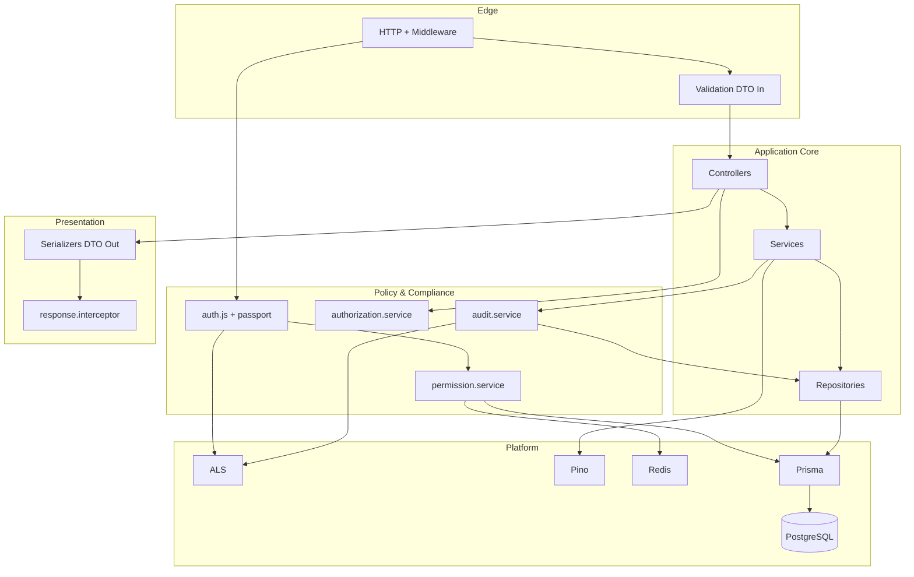

# Architecture Philosophy

**Phase:** 1 — Core Architecture Mapping  
**Purpose:** Explain **why** the `notes-backend` ERP API is structured as it is — and how subsystems connect — so senior engineers can extend it without drift.

---

## 1. North Star Principles

| Principle                   | Meaning in this codebase                                                                       |
| --------------------------- | ---------------------------------------------------------------------------------------------- |
| **Defense in depth**        | JWT + RBAC middleware + scoped service checks + serializers + Prisma omit + audit sanitization |
| **Fail closed on authz**    | Missing permission → 403; permission service error → 500 (not anonymous)                       |
| **Deterministic mutations** | `runInTransaction` + audit in same TX for domain writes                                        |
| **Operational honesty**     | Health reports DEGRADED; process starts without Redis; shutdown is ordered                     |
| **ERP longevity**           | Layers and permission vocabulary survive new modules                                           |

---

## 2. Why Each Subsystem Exists

### 2.1 Services

**Exist because:** HTTP is volatile; business rules are stable.

Services (`src/services/`) orchestrate:

- Multi-step workflows (refresh rotation, user delete + notes purge)
- Transaction boundaries
- Audit emission
- Cross-repository coordination

**Without services:** Controllers accumulate IF statements; repositories gain business logic; tests require HTTP.

**Connects to:** Repositories (data), audit (compliance), permission/authorization (policy), logger (ops).

---

### 2.2 Repositories

**Exist because:** Prisma query shapes are verbose and easy to get wrong.

Repositories isolate:

- `where` clauses, `include` whitelists, pagination cursors
- Optional `tx` parameter for atomic operations

**Without repositories:** Services duplicate Prisma calls; password/select leaks proliferate.

**Connects to:** `config/prisma.js` only.

**Exception (document, do not hide):** `permission.service` and parts of `authorization.service` call Prisma directly (**D05**) for RBAC graph performance and role-level reads.

---

### 2.3 Serializers

**Exist because:** API contract ≠ database schema.

ERP clients need stable JSON fields across Prisma migrations. Serializers (`src/serializers/`) whitelist output.

**Without serializers:** `prisma.note.findMany` returns fields clients should not see; refactors break mobile apps silently.

**Connects to:** `response.interceptor.js` — envelope wraps serialized `data`.

---

### 2.4 Validation (Zod)

**Exist because:** Invalid input must never reach services.

`validate.js` parses and **coerces** query params (`z.coerce.number`) then `Object.assign(req, validated)`.

**Without validation:** Services defend against malformed data ad hoc; security bugs (type confusion) increase.

**Connects to:** Routes (per-endpoint schema), controllers (assume clean input).

---

### 2.5 AsyncLocalStorage (ALS)

**Exist because:** Passing `reqId` and `userId` through every function signature does not scale.

ALS (`config/als.js`) carries:

- `reqId` — correlate logs and audit rows
- `logger` — child loggers with context
- `userId` — set after `auth.js`

**Without ALS:** Audit loses actor on deep service calls; logs cannot be traced.

**Forbidden:** Business payloads in ALS — keeps context object small and safe.

**Connects to:** `audit.service`, `pinoHttp`, workers (synthetic context).

---

### 2.6 Redis

**Exist because:** RBAC graph loading per request is too expensive at scale.

Redis (`config/redis.js`) provides:

- Permission set cache (`permission.service`)
- Optional worker distributed lock
- Circuit breaker + **LRU fallback** when Redis unavailable

**Without Redis:** System still runs — degraded per-node memory cache.

**Connects to:** `auth.js` (every permissioned request), `tokenCleanup.worker`, `/health` status.

**Philosophy:** Cache is an **optimization**, not the source of truth — PostgreSQL RBAC is SSOT.

---

### 2.7 Audit

**Exist because:** ERP and compliance require **immutable narrative** of who did what, even after entities are deleted.

`audit.service`:

- Taxonomy events (`notes.created`, `authz.escalation.attempted`)
- Sanitized metadata
- **Throws on failure** inside transactions

**Without audit:** Forensics rely on unstructured logs only — insufficient for regulated workflows.

**Connects to:** ALS (`actorId`, `reqId`), repositories (`audit_logs` no FK).

---

### 2.8 DTO Boundaries (Input + Output)

| Boundary        | Mechanism                                  |
| --------------- | ------------------------------------------ |
| Input DTO       | Zod validations                            |
| Output DTO      | Serializers + `{ success, data }` envelope |
| Persistence DTO | Prisma models (never exposed raw)          |

**Why:** ERP integrates with many clients; contracts version independently of schema.

---

### 2.9 Degraded Mode

**Exist because:** Redis outage must not take down note-taking API.

Behaviors:

- LRU cache per process (`redis.js` `memoryCache`)
- Health `DEGRADED` but HTTP 200 if DB up
- Worker lock skipped — duplicate cleanup acceptable

**Trade-off accepted:** Cache inconsistency across nodes until TTL/invalidation.

---

## 3. How Systems Connect (Unified View)



**Request thread:** Edge → Policy (auth) → App → Platform → Presentation.  
**Mutation thread:** Service opens TX → Repository → Audit (same TX) → Commit → Serializer → Envelope.

---

## 4. Architectural Laws

Laws are **non-negotiable** unless explicitly revised in ADR + code.

| #   | Law                                                                       | Violation symptom                               |
| --- | ------------------------------------------------------------------------- | ----------------------------------------------- |
| L1  | Controllers do not import repositories                                    | Untestable HTTP layer                           |
| L2  | Mutations that emit audit for domain events use `runInTransaction` + `tx` | Audit without data or data without audit        |
| L3  | Secrets never in serializers or audit metadata                            | Compliance breach                               |
| L4  | `auth()` checks permissions, not resource ownership                       | False confidence on `:own` routes               |
| L5  | Permission format is `action:resource:scope`                              | Middleware silent failures                      |
| L6  | API success responses use `res.locals` + `serializeResponse`              | Client contract break                           |
| L7  | Operational probes may bypass envelope                                    | Do not route product API through probe handlers |
| L8  | PostgreSQL availability required for serve                                | By design (`index.js` exit)                     |
| L9  | Refresh tokens stored hashed                                              | Plaintext in DB                                 |
| L10 | Audit failure inside TX rolls back                                        | Partial commits                                 |

---

## 5. Separation of Concerns

| Concern                                        | Owner layer                                  |
| ---------------------------------------------- | -------------------------------------------- |
| Transport security (headers, CORS, rate limit) | Global middleware                            |
| Authentication (who)                           | Passport + `auth.js`                         |
| Coarse authorization (which permissions)       | `auth.js` + `permission.service`             |
| Fine authorization (which row)                 | `authorization.service` or controller policy |
| Business rules                                 | Services                                     |
| Persistence                                    | Repositories                                 |
| Contract validation                            | Validations                                  |
| Contract output                                | Serializers + interceptor                    |
| Correlation                                    | ALS + pino                                   |

---

## 6. Rollback Safety Philosophy

| Pattern               | Implementation                                 |
| --------------------- | ---------------------------------------------- |
| Atomic write + audit  | `runInTransaction` + `audit.logEvent(..., tx)` |
| Auth refresh rotation | Single TX blacklist + new token                |
| User delete           | Notes deleted then user in one TX              |
| Audit throw           | `audit.service.js` L82 — intentional           |

**Why not async audit queue:** Simpler consistency model for current scale; queue would be Phase 2 infra if throughput demands.

---

## 7. Deterministic Behavior

| Area       | Determinism mechanism                 |
| ---------- | ------------------------------------- |
| Validation | Zod schemas — same input → same shape |
| RBAC       | DB seed + permission strings          |
| Errors     | `ApiError` + Prisma code mapping      |
| Pagination | Cursor encoding in `paginateCursor`   |
| IDs        | CUID2 in validations                  |

**Non-deterministic by design:** `reqId` UUID, token family UUID, cron job timing.

---

## 8. Infrastructure Resilience Philosophy

| Failure            | Response                                       |
| ------------------ | ---------------------------------------------- |
| DB down at boot    | `process.exit(1)`                              |
| DB down at runtime | 500/503 on queries; `/ready` fails             |
| Redis down         | Degraded cache; warn logs                      |
| Worker timeout     | Log error; release lock                        |
| Shutdown           | Stop accept → drain → workers → Redis → Prisma |

**Why ordered shutdown:** Prevent new work while finishing in-flight TX and worker purge.

---

## 9. ERP Scalability Philosophy

This codebase is a **modular monolith** — appropriate when:

- Team size is small/medium
- Domains share RBAC and audit
- Strong consistency needed for mutations

**Scale path:**

1. More resources under same permission vocabulary (`FUTURE_MODULE_ARCHITECTURE.md` — Phase 10).
2. Read replicas — repository layer can gain read clients later.
3. Outbox/event bus — not present today; audit table is synchronous record.

**Extension rules:**

- New resource → new permission rows + route matrix row + service + repository.
- Reuse two-gate authz — do not copy note owner shortcut (D01).
- Register business rules in `BUSINESS_RULES.md` (Phase 8).

---

## 10. Safe Extension Patterns

### 10.1 New authenticated endpoint

```
route → auth('action:resource:scope') → validate(schema) → controller
  → authorization.assert* (if resource-specific)
  → service → repository
  → res.locals + serializer → next()
```

### 10.2 New mutation with audit

```javascript
return runInTransaction(async (tx) => {
  const entity = await repository.create(data, tx);
  await auditService.logEvent({ event: 'x.created', ... }, tx);
  return entity;
});
```

### 10.3 New permission

1. Insert `Permission` row.
2. Link to `Role` via `RolePermission`.
3. `invalidateRolePermissionCache` or user cache.
4. Add to `ROUTE_PERMISSION_MATRIX` (Phase 4 doc).

---

## 11. Anti-Patterns to Avoid

| Anti-pattern                       | Why harmful        | Example in codebase                     |
| ---------------------------------- | ------------------ | --------------------------------------- |
| God controller                     | Untestable         | —                                       |
| Repository calling service         | Circular deps      | —                                       |
| Skipping serializer                | Field leak         | —                                       |
| `auth()` only for ownership        | Wrong user access  | Notes (partially)                       |
| Audit after commit without TX      | Inconsistent state | —                                       |
| Direct `res.json` in controller    | Breaks envelope    | —                                       |
| Caching business entities in Redis | Stale domain       | Only permissions cached                 |
| Trusting Swagger alone             | Drift              | User `role` enum (D06)                  |
| Prisma in every service            | Bypass repository  | permission.service (accepted exception) |

---

## 12. Connection to Phase 1 Sibling Docs

| Question                                       | Read                        |
| ---------------------------------------------- | --------------------------- |
| What are all layers?                           | `SYSTEM_MAP.md`             |
| What happens per HTTP request?                 | `REQUEST_LIFECYCLE.md`      |
| How does login/refresh/RBAC work step-by-step? | `CANONICAL_SYSTEM_FLOWS.md` |
| Why was it built this way?                     | This document               |

---

## 13. Drift as Managed Philosophy

Not all code matches philosophy yet — track openly:

| ID  | Philosophical tension                               |
| --- | --------------------------------------------------- |
| D01 | Centralized authz helper exists but notes bypass it |
| D03 | Role assignment service without public API          |
| D04 | Legacy enum vs dynamic RBAC dual model              |
| D05 | Prisma in permission service for speed              |

**Philosophy:** Document drift; fix in Phase 11 (code) after KB sign-off.

---

## 14. Review Checklist (Staff Engineer)

Before approving Phase 1 KB for team use:

- [ ] Can trace login → refresh → create note using only Phase 1 docs?
- [ ] Understand two-gate authz and note exception?
- [ ] Know where TX + audit are required?
- [ ] Know Redis degraded implications?
- [ ] Know controller `res.locals` contract?

---

_Next documentation phase: Phase 2 — `01-api/API_BOUNDARIES.md`, `VALIDATION_SYSTEM.md`, `SERIALIZATION_SYSTEM.md`_
