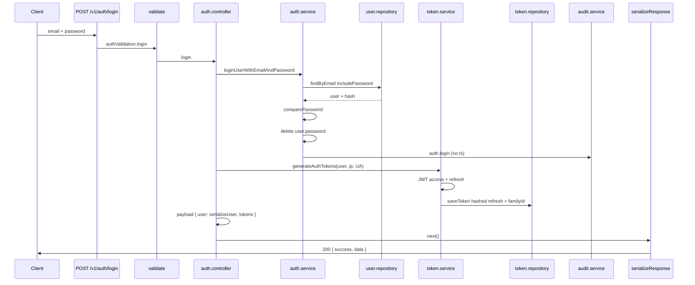
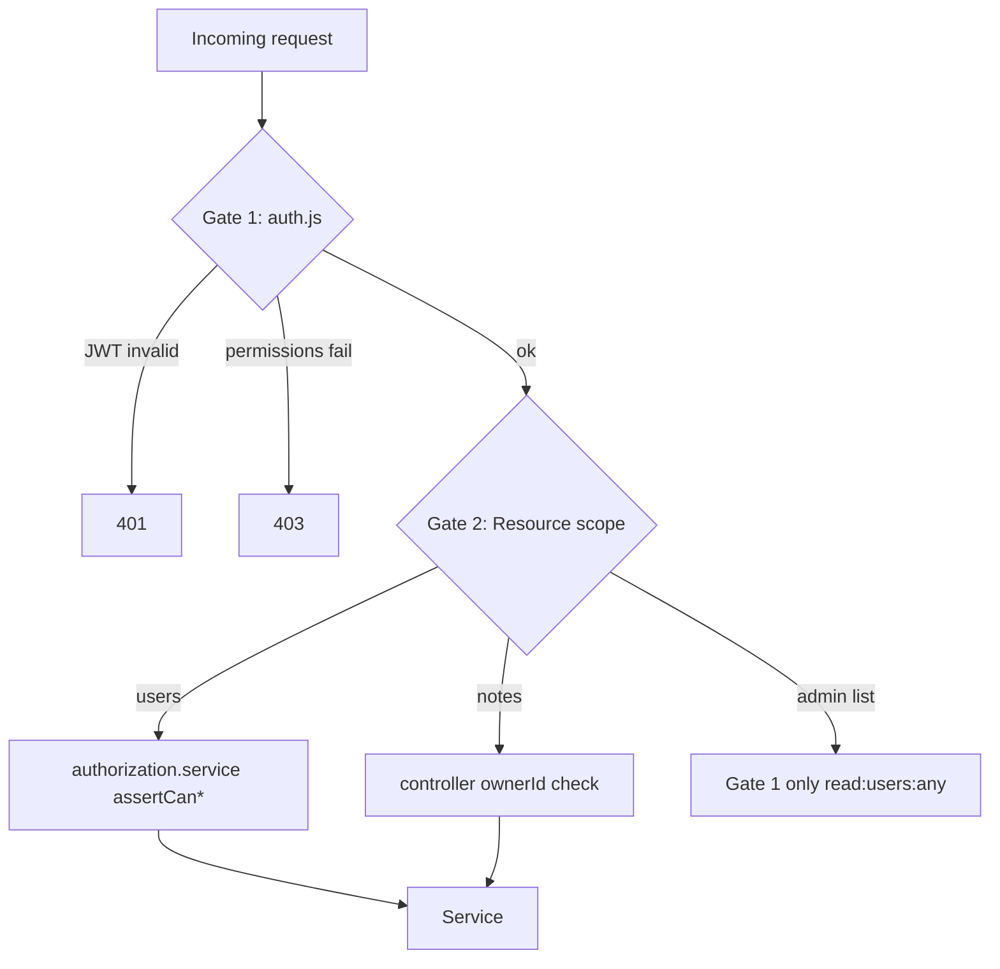
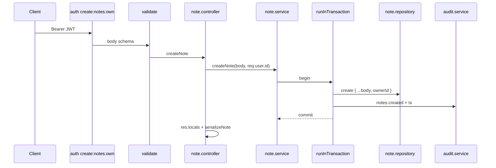
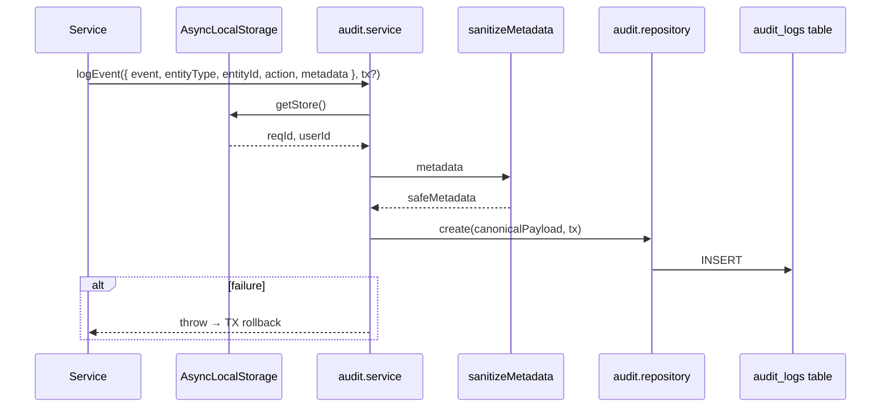
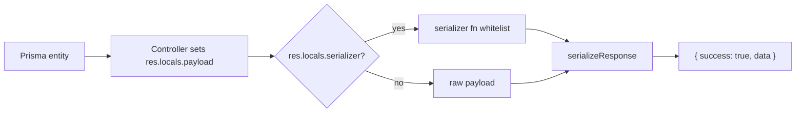
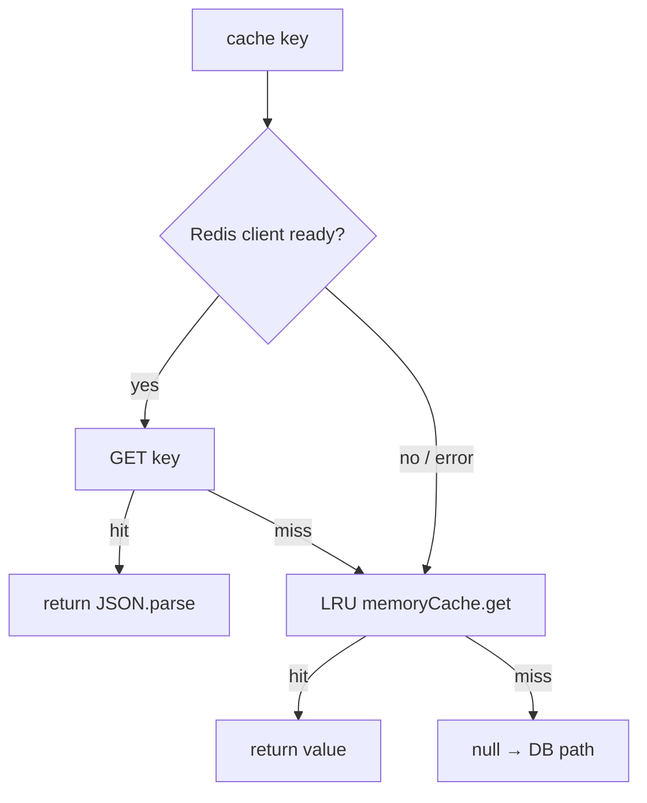
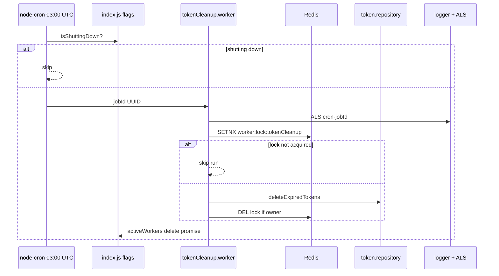

# Canonical System Flows

**Phase:** 1 — Core Architecture Mapping  
**Source of truth:** Implementation in `notes-backend/src/` — not aspirational docs.

Each flow documents **order**, **transaction boundaries**, **security boundaries**, **audit**, **logging**, **ALS**, **Redis**, and **Prisma** interactions, plus **why** the design exists.

---

## Flow Index

| #   | Flow                                                     | Primary files                                            |
| --- | -------------------------------------------------------- | -------------------------------------------------------- |
| 1   | [Auth — Login](#1-auth-flow-login)                       | `auth.controller`, `auth.service`, `token.service`       |
| 2   | [Authorization — Protected route](#2-authorization-flow) | `auth.js`, `permission.service`, `authorization.service` |
| 3   | [CRUD — Note create](#3-crud-flow-note-create)           | `note.route`, `note.controller`, `note.service`          |
| 4   | [Audit — Transactional](#4-audit-flow)                   | `audit.service`, `audit.repository`                      |
| 5   | [Serialization — API response](#5-serialization-flow)    | `serializers/*`, `response.interceptor`                  |
| 6   | [Cache — RBAC resolution](#6-cache-flow)                 | `permission.service`, `config/redis.js`                  |
| 7   | [Worker — Token cleanup](#7-worker-flow)                 | `tokenCleanup.worker`, `index.js`                        |

---

## 1. Auth Flow — Login

### 1.1 Sequence



### 1.2 Stage table

| Step          | Component                                                    | TX boundary                                   | Security                                                     |
| ------------- | ------------------------------------------------------------ | --------------------------------------------- | ------------------------------------------------------------ |
| Validate body | Zod                                                          | —                                             | Rejects malformed credentials early                          |
| Load user     | `userRepository.findByEmail(..., { includePassword: true })` | —                                             | Password only on this path                                   |
| Verify        | `comparePassword`                                            | —                                             | Generic 401 message (no user enumeration)                    |
| Strip hash    | `delete user.password`                                       | —                                             | Never passed to serializer                                   |
| Audit         | `auditService.logEvent`                                      | **Outside TX**                                | `actorId` from ALS if present (login is public — often null) |
| Tokens        | `generateAuthTokens`                                         | Optional `tx` param; login passes `undefined` | Refresh stored SHA-256 hashed                                |

### 1.3 Why designed this way

- **Separate access vs refresh:** Access JWT is stateless for fast API auth; refresh is persisted for rotation/revocation.
- **Failed login audit** via `logger.warn` (`auth.service` L21) — not always persisted to `AuditLog` for failed attempt (log-only); successful login persisted.
- **IP / User-Agent** on token row supports future device session UI.

### 1.4 Refresh sub-flow (critical)

See `auth.service.refreshAuth` (`auth.service.js` L69–125):

| Condition                      | Action                                                                     |
| ------------------------------ | -------------------------------------------------------------------------- |
| Valid refresh, not blacklisted | Blacklist old, audit `auth.refresh.rotated`, mint new pair same `familyId` |
| Blacklisted &lt; 2s old        | 401 concurrent refresh                                                     |
| Blacklisted reuse              | Delete all tokens in `familyId`, audit `auth.refresh.reuse_detected`, 401  |

**TX:** Entire refresh in `runInTransaction` — atomic rotation.

---

## 2. Authorization Flow

### 2.1 Two-gate model



**Gate 1** (`middlewares/auth.js`):

1. Passport JWT → `userRepository.findById` (`passport.js` L16–23) — access token only.
2. `permissionService.getUserPermissions(user.id)` — Redis → else Prisma graph.
3. `requiredPermissions.every(matchesPermission)` — AND logic.

**Gate 2** (resource-aware):

- **Users:** `assertCanReadUser` / `assertCanManageUser` resolves `:own` vs `:any` (`authorization.service.js` L30–63).
- **Notes:** Controller compares `note.ownerId === req.user.id` — **does not** call `assertCanManageNote` (**drift D01**).

### 2.2 RBAC cache interaction

On each permission-gated request:

```
getCacheVersion() → rbac:permissions:v{version}:user:{userId}
  → cacheGet (Redis or LRU)
  → on miss: prisma.userRole.findMany (nested includes)
  → cacheSet TTL 300s
```

**Scope escalation rule** (`permission.service.js` L127–131): `update:notes:any` satisfies check for `update:notes:own`.

### 2.3 Why two gates

Middleware cannot know resource `ownerId` until DB fetch. Requiring `:own` on route plus service assertion allows **one route** to serve self-service and admin paths (users). Notes currently shortcut Gate 2 with hardcoded owner check — simpler but breaks admin moderation story.

### 2.4 Escalation attempt flow

`assertScopedPermission` when cross-owner without `:any` (`authorization.service.js` L48–57):

- `logger.error` `authz.escalation.attempted`
- `auditService.logEvent` same taxonomy
- `403 Forbidden`

---

## 3. CRUD Flow — Note Create

### 3.1 Sequence



### 3.2 Boundaries

| Layer                      | Responsibility                                                                      |
| -------------------------- | ----------------------------------------------------------------------------------- |
| `auth('create:notes:own')` | User has create permission (any user with role granting it)                         |
| Controller                 | Sets `ownerId` from `req.user.id` — **cannot** create note for another user via API |
| Service                    | Atomic note + audit                                                                 |
| Repository                 | Prisma `note.create` with `owner.connect`                                           |

### 3.3 Read/update/delete differences

| Operation | TX  | Gate 2                         | Audit event     |
| --------- | --- | ------------------------------ | --------------- |
| List      | No  | Filter `ownerId` in controller | No              |
| Get one   | No  | 404 if wrong owner             | No              |
| Update    | Yes | 404 if wrong owner             | `notes.updated` |
| Delete    | Yes | 404 if wrong owner             | `notes.deleted` |

### 3.4 Why TX on mutations only

Reads do not need audit atomicity with row change; writes require **proof** of change alongside row (`audit.service` throw → rollback).

---

## 4. Audit Flow



### 4.1 Sanitization rules (`audit.service.js`)

| Rule              | Value                                                |
| ----------------- | ---------------------------------------------------- |
| Max depth         | 3                                                    |
| Max array items   | 50                                                   |
| Max string length | 2000                                                 |
| Forbidden keys    | password, token, refreshtoken, cookie, authorization |

### 4.2 Why no FK on AuditLog

`schema.prisma` — audit survives user/note deletion for compliance timeline.

### 4.3 ALS without HTTP

Worker jobs set synthetic `reqId`; `actorId` null unless explicitly passed in payload (role assign passes `actorId`).

---

## 5. Serialization Flow



**Note serializer** (`note.serializer.js`): explicit fields only.

**User serializer:** Used in auth responses and via `serializeUser` on `res.locals`.

**Prisma omit** (`config/prisma.js`): `user.password` omitted globally — serializers still must not add secrets.

**Why interceptor last:** Controllers stay ignorant of HTTP JSON shape; ERP clients get consistent envelope for versioning.

---

## 6. Cache Flow

### 6.1 Read path (`cacheGet`)



### 6.2 Write path (`cacheSet`)

Redis `SETEX` → on failure → `memoryCache.set` with TTL ms.

### 6.3 Circuit breaker (`redis.js`)

| State                 | Behavior                               |
| --------------------- | -------------------------------------- |
| Closed                | Normal Redis                           |
| Open after 5 failures | `getClient` returns null → memory only |
| Half-open after 60s   | One reconnect attempt                  |

**ERP implication:** Multi-instance deployments without Redis have **per-process** RBAC caches — permission changes may take up to TTL (300s) per node unless `invalidateUserPermissionCache` or global version bump.

### 6.4 Invalidation

| Trigger                  | Method                                                    |
| ------------------------ | --------------------------------------------------------- |
| Role assigned            | `invalidateUserPermissionCache(targetUserId)`             |
| Role permissions changed | `invalidateRolePermissionCache(roleId)`                   |
| Emergency                | `bumpGlobalPermissionCacheVersion()` — all keys versioned |

---

## 7. Worker Flow



### 7.1 Shutdown coupling

- `global.activeWorkers.add(workerPromise)` during run (`tokenCleanup.worker.js` L95–97).
- `performShutdown` waits max 5s for all promises (`index.js` L90–104).

### 7.2 Why distributed lock

Prevent duplicate purge on multiple nodes; acceptable to run without lock when Redis degraded (duplicate work, not data corruption).

### 7.3 Timeout

`Promise.race` 5 minutes — does not cancel Prisma query but stops worker hang (`tokenCleanup.worker.js` L35–46).

---

## 8. User Delete Flow (Cross-Aggregate)

Documented as canonical ERP cascade (`user.service.js` L122–144):

1. `runInTransaction`
2. `noteRepository.deleteManyByOwnerId(userId, tx)`
3. `userRepository.deleteById(userId, tx)`
4. `audit.users.deleted`

**Why notes first:** Prisma `onDelete: Restrict` on `Note.owner` — DB blocks user delete if notes remain.

---

## 9. Flow Comparison Table

| Flow               | Uses TX | Uses Redis    | Uses ALS       | Audit |
| ------------------ | ------- | ------------- | -------------- | ----- |
| Login              | No\*    | No            | Optional       | Yes   |
| Refresh            | Yes     | No            | Optional       | Yes   |
| RBAC check         | No      | Usually       | Yes after auth | No    |
| Note create        | Yes     | No            | Yes            | Yes   |
| Note list          | No      | No            | Yes            | No    |
| Permission resolve | No      | Yes           | Yes            | No    |
| Worker cleanup     | No      | Lock optional | Yes            | No    |

\*Login audit not in TX with token write; token save is separate call.

---

## 10. Design Rationale Summary

| Decision                       | Why                                            |
| ------------------------------ | ---------------------------------------------- |
| Hashed refresh tokens          | DB leak must not expose active sessions        |
| Blacklist vs delete on refresh | Enables reuse detection                        |
| Permission cache               | RBAC graph query on every request is expensive |
| Audit throw in TX              | Compliance matches business truth              |
| 404 on foreign note            | Reduce enumeration (trade-off vs 403)          |
| Degraded Redis                 | Availability over perfect cache coherence      |

---

## 11. Warnings

1. **Do not document notes as using `authorization.service`** — they do not (D01).
2. **Auth login audit** without TX — different failure mode than note create.
3. **Cache degraded** — document multi-node staleness for ops.
4. **Register** creates user + tokens without `auth()` middleware — public endpoint with rate limits in prod on `/v1/auth` only.

---

## 12. Related Documents

- `REQUEST_LIFECYCLE.md`
- `SYSTEM_MAP.md`
- `ARCHITECTURE_PHILOSOPHY.md`
