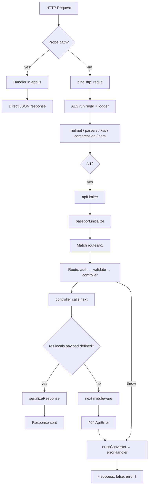
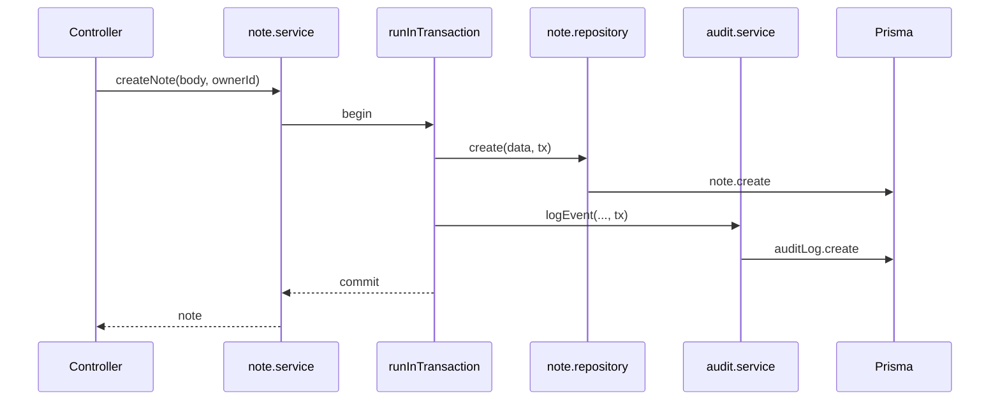
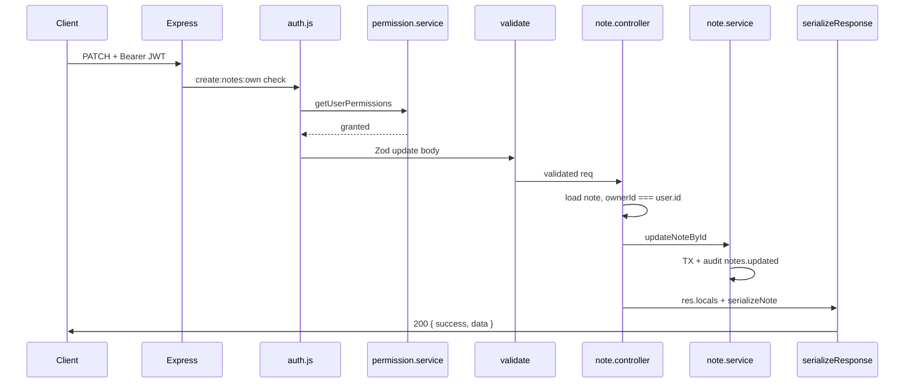

# Request Lifecycle

**Phase:** 1 — Core Architecture Mapping  
**Scope:** Every HTTP request from socket accept to response bytes — based on `src/app.js`, `src/index.js`, and route handlers.

---

## 1. Lifecycle Overview

Two **families** of requests exist:

| Family                 | Paths                        | ALS | Canonical `{ success, data }` envelope     |
| ---------------------- | ---------------------------- | --- | ------------------------------------------ |
| **Operational probes** | `/live`, `/ready`, `/health` | No  | No — direct `res.send()`                   |
| **API v1**             | `/v1/*`                      | Yes | Yes (success path via `serializeResponse`) |



---

## 2. Global Middleware Order (API Requests)

Registered in `src/app.js` (after probes):

| Order | Middleware                           | File                         | Responsibility                                               |
| ----- | ------------------------------------ | ---------------------------- | ------------------------------------------------------------ |
| 1     | `pinoHttp`                           | `config/pinoHttp.js`         | Correlation ID (`genReqId`), access log, redact auth headers |
| 2     | ALS injector                         | `app.js` L100–106            | `asyncLocalStorage.run({ reqId, logger })`                   |
| 3     | `helmet`                             | —                            | Security headers                                             |
| 4     | `express.json` / `urlencoded`        | —                            | Body parsing                                                 |
| 5     | `xss()`                              | —                            | Sanitize input                                               |
| 6     | `compression`                        | —                            | gzip                                                         |
| 7     | `cors`                               | `config.cors.origins`        | Origin whitelist                                             |
| 8     | `apiLimiter`                         | `middlewares/rateLimiter.js` | `/v1` throttle                                               |
| 9     | `passport.initialize` + JWT strategy | `config/passport.js`         | Prepare JWT auth                                             |
| 10    | `authLimiter` (production only)      | —                            | `/v1/auth` stricter limit                                    |
| 11    | `routes` (`/v1`)                     | `routes/v1/index.js`         | Per-route middleware                                         |
| 12    | `serializeResponse`                  | `response.interceptor.js`    | Success envelope                                             |
| 13    | 404 handler                          | `app.js` L146–148            | `ApiError(NOT_FOUND)`                                        |
| 14    | `errorConverter`                     | `error.js`                   | Normalize errors                                             |
| 15    | `errorHandler`                       | `error.js`                   | Send error JSON                                              |

**Why `serializeResponse` is global after routes:** Controllers deliberately call `next()` without `res.send()` so one place enforces the API contract (`response.interceptor.js` L37–45).

---

## 3. Per-Route Middleware Chain

Example: `POST /v1/notes` (`routes/v1/note.route.js` L11):

```
auth('create:notes:own')
  → validate(noteValidation.createNote)
  → noteController.createNote
```

Example: `GET /v1/users/:userId` (`user.route.js` L16):

```
auth('read:users:own')
  → validate(userValidation.getUser)
  → userController.getUser  // then authorizationService.assertCanReadUser inside
```

| Stage        | Security guarantee                                | On failure                       |
| ------------ | ------------------------------------------------- | -------------------------------- |
| `auth()`     | Valid access JWT; optional RBAC permissions (AND) | 401 / 403 / 500 permission check |
| `validate()` | Schema-valid input                                | 400 with Zod messages            |
| Controller   | Resource-specific rules                           | 404 / 403 via `ApiError`         |

---

## 4. ALS Propagation

**Store creation** (`app.js` L100–106):

```javascript
const store = { reqId: req.id, logger: req.log };
asyncLocalStorage.run(store, () => next());
```

**Enrichment after auth** (`middlewares/auth.js` L32–37):

```javascript
store.userId = user.id;
store.logger = store.logger.child({ userId: user.id });
```

**Consumers:**

- `audit.service.js` L57–59 — `actorId`, `reqId` on audit rows
- Downstream logs via child logger

**Workers** (`tokenCleanup.worker.js` L79–82): synthetic store `{ reqId: 'cron-{jobId}', logger: child }` — no `userId`.

**Forbidden in ALS** (documented in `config/als.js`): business entities, repositories.

---

## 5. Controller → Response Pipeline

**Pattern** (`note.controller.js` create):

1. `noteService.createNote(req.body, req.user.id)`
2. `res.locals.statusCode = 201`
3. `res.locals.payload = note` (raw entity)
4. `res.locals.serializer = serializeNote`
5. `next()` → `serializeResponse`

**`serializeResponse` behavior** (`response.interceptor.js`):

| Condition                        | Behavior                             |
| -------------------------------- | ------------------------------------ |
| No `payload` and no `statusCode` | `next()` — pass through              |
| `statusCode === 204`             | Empty body, no JSON                  |
| Paginated `payload.results`      | Map serializer over results          |
| Else                             | `serializer(payload)` or raw payload |
| Output                           | `{ success: true, data, meta? }`     |

**Auth exception:** `auth.controller.js` login/register pre-serialize user in payload `{ user: serializeUser(user), tokens }` — still wrapped by global envelope.

---

## 6. Service → Repository → Prisma

Typical mutation (`note.service.js` create):



**Read path** (get note): Controller → service `getNoteById` → repository → Prisma — **no transaction** unless specified.

---

## 7. Example Lifecycles

### 7.1 Authenticated Success — `PATCH /v1/notes/:noteId`



### 7.2 Unauthorized — Missing/invalid JWT

1. `passport.authenticate('jwt')` fails (`auth.js` L25–26).
2. `reject(ApiError 401 'Please authenticate')`.
3. `catch` → `next(err)` → `errorConverter` → `errorHandler`.
4. Response: `{ success: false, error: { code, message } }` — **never reaches** `serializeResponse`.

### 7.3 Forbidden — RBAC failure

1. JWT valid, user attached.
2. `permissionService.getUserPermissions` — missing `read:users:any` for admin list.
3. `ApiError 403 Forbidden` (`auth.js` L54).
4. Error handler path (same as 7.2).

### 7.4 Validation failure

1. `schema.parse` throws `ZodError` (`validate.js` L18–21).
2. `ApiError 400` with joined issue messages.
3. Error handler — no service/repository invoked.

### 7.5 Transaction rollback — audit failure

1. Service runs `runInTransaction`.
2. Repository mutates row.
3. `auditService.logEvent` throws (`audit.service.js` L82).
4. Prisma transaction rolls back — **mutation undone**.
5. Error propagates to `catchAsync` → error handler.

**Design intent:** Compliance records cannot be "best effort" for in-TX domain mutations.

### 7.6 Login audit without wrapping TX

`auth.service.loginUserWithEmailAndPassword` calls `auditService.logEvent` **after** password check without `tx` (`auth.service.js` L28–33). If audit fails, login still succeeded — user is authenticated but audit error bubbles as 500. **Operational note:** rare; monitor `system.audit.failure` logs.

---

## 8. Failure Handling Matrix

| Error source                | Converter behavior          | Client sees                   |
| --------------------------- | --------------------------- | ----------------------------- |
| `ApiError` operational      | Pass-through                | `success: false`, status code |
| Prisma `P2002`              | 400 Resource already exists | Sanitized message             |
| Prisma `P2025`              | 404 Resource not found      | Sanitized message             |
| Prisma `P2003`              | 400 Constraint violation    | Sanitized message             |
| Unknown Error (production)  | 500 generic message         | No stack                      |
| Unknown Error (development) | 500 + stack in JSON         | Debuggable                    |

`errorHandler` sets `res.err = err` for pino-http auto logging (`error.js` L62).

---

## 9. Infrastructure Touchpoints per Request

| Concern        | When invoked                                                      |
| -------------- | ----------------------------------------------------------------- |
| Redis          | Every `auth()` with permissions; optional on permission cache hit |
| PostgreSQL     | JWT user load; RBAC miss; all service/repository calls            |
| Metrics        | `authorizationDenied` increment on 403 (`auth.js` L53)            |
| Slow query log | Prisma extension if duration ≥ threshold (`config/prisma.js`)     |

---

## 10. Probes Lifecycle (Out of Band)

| Route     | Checks                                  | Status codes                                       |
| --------- | --------------------------------------- | -------------------------------------------------- |
| `/live`   | `global.isShuttingDown`                 | 200 UP                                             |
| `/ready`  | DB `SELECT 1` 5s timeout; shutdown flag | 200 / 503                                          |
| `/health` | DB + `redis.isDegraded()`               | 200 if DB up (even DEGRADED cache); 503 if DB down |

**Why DEGRADED returns 200:** Comment `app.js` L91 — prevent orchestrator killing pods when only Redis is down.

---

## 11. Process Bootstrap (Before Any Request)

`index.js` `bootstrap()` order:

1. `startMetricsFlusher()`
2. Event loop lag monitor (5s `unref` interval)
3. `prisma.$queryRaw\`SELECT 1\`` — **exit process on failure**
4. `redisConfig.getClient()` — warn if degraded
5. `app.listen(port)`
6. Optional `startTokenCleanupJob()`

Requests are not accepted until step 5 completes successfully (step 3 must pass).

---

## 12. Shutdown Interaction

On `SIGTERM`/`SIGINT`:

1. `global.isShuttingDown = true` — probes return not ready; cron skips new runs.
2. HTTP server closes — in-flight requests drain.
3. Cron stopped.
4. `activeWorkers` awaited (max 5s).
5. Redis disconnect.
6. Prisma disconnect (3s race).

In-flight API requests mid-transaction may fail or complete depending on timing — clients should retry idempotently where possible.

---

## 13. Warnings & Anti-Patterns

| Warning                                                  | Detail                                                   |
| -------------------------------------------------------- | -------------------------------------------------------- |
| Do not use `res.send` in API controllers                 | Skips envelope                                           |
| Do not assume `auth('read:x:own')` checks resource owner | Middleware only checks permission strings                |
| Note 404 hides cross-tenant existence                    | By design (`note.controller.js`)                         |
| Error responses skip `serializeResponse`                 | Different JSON shape — document in client SDKs           |
| Probes omit ALS                                          | Cannot correlate probe logs with `reqId` unless extended |

---

## 14. Related Documents

- `SYSTEM_MAP.md` — layer boundaries
- `CANONICAL_SYSTEM_FLOWS.md` — auth, CRUD, audit, cache, worker flows
- `ARCHITECTURE_PHILOSOPHY.md` — why lifecycle is structured this way
