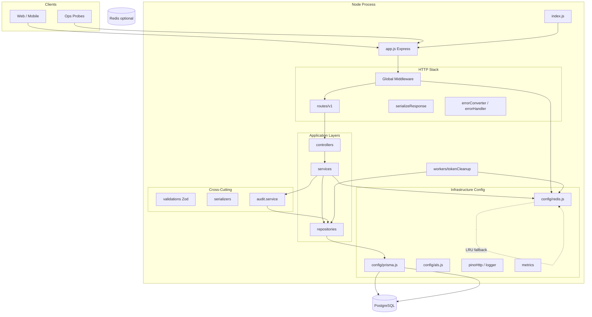
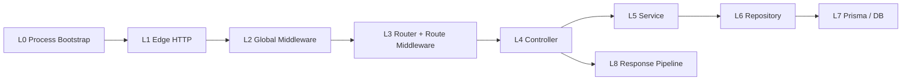
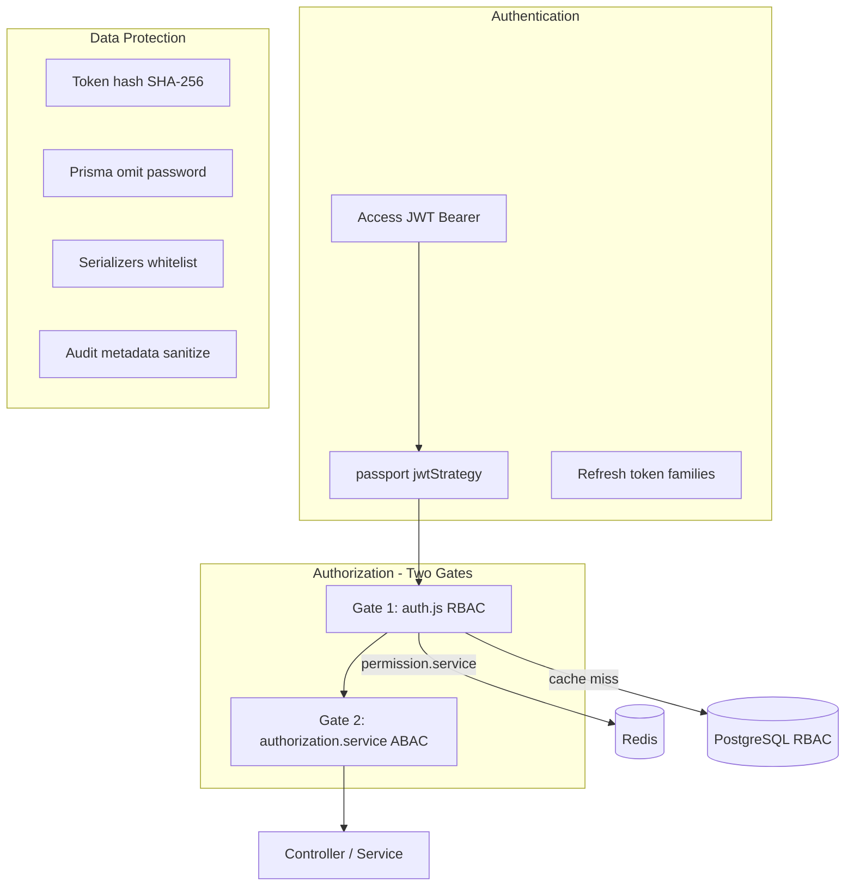

# System Map

**Backend:** `notes-backend`  
**Phase:** 1 — Core Architecture Mapping  
**Audience:** Senior engineers onboarding to the ERP-style API

This document maps the **real** backend structure: layers, dependencies, boundaries, and infrastructure. All paths are relative to `notes-backend/`.

---

## 1. Executive Overview

The system is a **single deployable Node.js HTTP service** exposing a versioned REST API (`/v1`). It follows a **strict layered architecture**:

```
HTTP → Middleware → Routes → Controllers → Services → Repositories → Prisma → PostgreSQL
                              ↓              ↓
                         Validations    Audit / Redis / Email
                         Serializers    (at response boundary)
```

**Why this shape:** ERP backends accumulate domain rules, compliance (audit), and security (RBAC) over years. Layers isolate **transport concerns** (HTTP, DTOs) from **domain orchestration** (services) and **persistence** (repositories), so each layer can be tested and extended without leaking SQL, JWT details, or permission graphs into controllers.

---

## 2. High-Level System Diagram



---

## 3. Dependency Hierarchy (Allowed Directions)

| From                    | To                                                      | Allowed?                          |
| ----------------------- | ------------------------------------------------------- | --------------------------------- |
| Routes                  | Middleware factories, Controllers, Validations          | ✅                                |
| Controllers             | Services, Serializers, Utils (`ApiError`, `catchAsync`) | ✅                                |
| Controllers             | Repositories, Prisma                                    | ❌                                |
| Services                | Repositories, other Services, Config (logger)           | ✅                                |
| Services                | Express `req`/`res`                                     | ❌                                |
| Repositories            | Prisma client (`tx` or default)                         | ✅                                |
| Repositories            | Services                                                | ❌                                |
| Serializers             | Plain objects only                                      | ✅                                |
| `auth.js` middleware    | `permission.service`, ALS                               | ✅                                |
| `permission.service`    | Prisma, Redis directly                                  | ⚠️ **Documented exception** (D05) |
| `authorization.service` | Prisma, `permission.service`, `audit.service`           | ⚠️ Exception for role assign TX   |

**Rule of thumb:** Dependencies flow **downward** toward persistence. Nothing below the service layer should know about HTTP.

---

## 4. Request Execution Layers



| Layer | Primary files                                                 | Role in one sentence                               |
| ----- | ------------------------------------------------------------- | -------------------------------------------------- |
| L0    | `src/index.js`                                                | Start DB, Redis, HTTP, workers; graceful shutdown  |
| L1    | `src/app.js`                                                  | Express app, probes, middleware registration       |
| L2    | `pinoHttp`, ALS, helmet, body parsers, CORS, `/v1` rate limit | Security, parsing, correlation ID                  |
| L3    | `routes/v1/*.route.js`, `auth.js`, `validate.js`              | AuthZ gate + Zod validation                        |
| L4    | `controllers/*.controller.js`                                 | Map HTTP → service calls; set `res.locals`         |
| L5    | `services/*.service.js`                                       | Business rules, transactions, audit                |
| L6    | `repositories/*.repository.js`                                | Prisma queries only                                |
| L7    | `config/prisma.js`                                            | DB connection, omit password, slow-query telemetry |
| L8    | `response.interceptor.js`, `error.js`                         | Canonical JSON envelope or error shape             |

---

## 5. Layer Reference (Responsibilities & Boundaries)

### 5.1 Middleware Layer

**Location:** `src/middlewares/`, plus inline middleware in `src/app.js`

| Middleware                             | Responsibility                                    | Forbidden                      |
| -------------------------------------- | ------------------------------------------------- | ------------------------------ |
| `pinoHttp` (`config/pinoHttp.js`)      | Request logging, `req.id`, redact `Authorization` | Business logic                 |
| ALS wrapper (`app.js` L100–106)        | `reqId`, `logger` store; later `userId`           | Storing DTOs or entities       |
| `helmet`, `xss`, `compression`, `cors` | Transport hardening                               | Authorization decisions        |
| `rateLimiter`                          | Throttle `/v1` and `/v1/auth`                     | Per-resource ABAC              |
| `auth.js`                              | JWT via Passport; RBAC AND-check                  | Ownership / resource ID checks |
| `validate.js`                          | Zod parse/coerce `body`/`query`/`params`          | DB access                      |
| `response.interceptor.js`              | Build `{ success, data }` from `res.locals`       | Domain validation              |
| `error.js`                             | Normalize errors; Prisma code mapping             | Silent swallow                 |

**Interactions:** Runs **before** controllers (route-level) or **after** routes (`serializeResponse`, errors). `auth.js` calls `permission.service` → Redis/Prisma.

**Anti-patterns:**

- Putting ownership checks only in middleware when routes use `:own` but resource owner is unknown until DB fetch.
- Calling `res.send()` in controllers for API routes (bypasses canonical envelope).

---

### 5.2 Controller Layer

**Location:** `src/controllers/`

**Responsibilities:**

- Receive validated `req` (body/query/params).
- Invoke **one service** (or orchestrate a minimal sequence).
- Apply **HTTP-specific** policies (e.g. note 404 obfuscation — see `note.controller.js` L44–47).
- Call `authorization.service` for **scoped** user access (`user.controller.js` L34, L46, L55).
- Set `res.locals.statusCode`, `res.locals.payload`, `res.locals.serializer`.
- Call `next()` — never `res.send()` for standard API responses.

**Forbidden:**

- Prisma or repository imports.
- Long transactional logic.
- Permission graph traversal.

**Why controllers stay thin:** ERP endpoints multiply; fat controllers duplicate authorization and become untestable without HTTP. The established pattern is `catchAsync` + `res.locals` + global serializer (`src/utils/catchAsync.js`, `response.interceptor.js`).

**Anti-patterns:**

- **D01:** Notes use `ownerId === req.user.id` instead of `authorizationService.assertCanManageNote` — admins with `read:notes:any` still cannot access others' notes.
- Serializing in controller for some routes (`auth.controller.js` uses `serializeUser` inline) while others use `res.locals.serializer` — inconsistent but intentional for auth payloads.

---

### 5.3 Service Layer

**Location:** `src/services/`

| Service                 | Domain                                                        |
| ----------------------- | ------------------------------------------------------------- |
| `auth.service`          | Login, logout, refresh rotation, password reset, verify email |
| `user.service`          | User CRUD, password hashing, cascade delete notes             |
| `note.service`          | Note CRUD + audit in transactions                             |
| `token.service`         | JWT mint/verify, hashed refresh persistence                   |
| `permission.service`    | RBAC resolution + Redis cache                                 |
| `authorization.service` | Scoped `:own`/`:any` checks, role assignment                  |
| `audit.service`         | Sanitized audit persistence                                   |
| `email.service`         | SMTP (external boundary)                                      |

**Responsibilities:**

- Enforce **business invariants** (email unique, note exists, token reuse).
- Own **`runInTransaction`** boundaries when mutation + audit must be atomic.
- Emit audit events with correct taxonomy.
- Remain **framework-agnostic** (no `req`/`res`).

**Forbidden:**

- Formatting API JSON envelopes.
- Zod validation (belongs in validations + `validate` middleware).

**Interactions:** Repositories for persistence; `audit.service` inside transactions; `permission.service` / Redis for authz helpers.

**Anti-patterns:**

- Skipping audit inside a transaction then mutating data (audit failure must rollback — `audit.service.js` L82).
- Login audit **outside** transaction (`auth.service` L28) — acceptable: login is not wrapped in TX with DB mutation besides audit.

---

### 5.4 Repository Layer

**Location:** `src/repositories/`

**Responsibilities:**

- Encapsulate Prisma queries per aggregate (`user`, `note`, `token`, `audit`).
- Accept optional `tx` client for transactional calls.
- Apply query whitelists (e.g. `note.repository.js` `cleanNoteIncludes`).

**Forbidden:**

- Business rules (e.g. “cannot delete user with notes” belongs in `user.service`).
- HTTP or permission checks.

**Factory:** `repositories/index.js` exports `runInTransaction = (cb) => prisma.$transaction(cb)`.

**Why repositories exist:** Prisma query shapes spread quickly; centralizing them prevents N+1 includes and password leaks. Services read like workflows, not SQL.

---

### 5.5 Serializer Layer

**Location:** `src/serializers/`

**Responsibilities:**

- Map Prisma entities → **public DTO** (explicit field whitelist).
- Used via `res.locals.serializer` or directly in `auth.controller` for login/register.

**Forbidden:**

- DB access; permission logic.

**Example:** `note.serializer.js` exposes `id`, `title`, `content`, `archived`, `tags`, `ownerId`, timestamps — never internal relations unless explicitly added.

**Why separate from Prisma omit:** Global `omit: { password }` on User (`config/prisma.js`) is defense-in-depth; serializers define **API contract** per resource for ERP clients.

---

### 5.6 Validation Layer (DTO Input)

**Location:** `src/validations/`

**Responsibilities:**

- Zod schemas for `body`, `query`, `params` (`validate.js` merges parsed output onto `req`).
- Shared rules in `custom.validation.js` (password strength, CUID params).

**Forbidden:**

- Authorization (only shape/coercion).

**Why Zod at the edge:** Invalid input never reaches services — reduces attack surface and keeps services free of repetitive `if (!email)` checks.

---

### 5.7 Infrastructure Layer

| Component     | File                              | Purpose                                                     |
| ------------- | --------------------------------- | ----------------------------------------------------------- |
| Prisma client | `config/prisma.js`                | Proxy singleton, `$reconnect` for tests, slow-query metrics |
| Redis         | `config/redis.js`                 | RBAC cache, circuit breaker, LRU fallback                   |
| ALS           | `config/als.js`                   | `reqId`, `userId`, child logger                             |
| Passport      | `config/passport.js`              | JWT access token → user row                                 |
| Logger        | `config/logger.js`, `pinoHttp.js` | Structured logs                                             |
| Metrics       | `config/metrics.js`               | Counters flushed periodically                               |
| Workers       | `workers/tokenCleanup.worker.js`  | Cron + distributed lock                                     |
| Config        | `config/config.js`                | Env-driven ports, JWT TTL, feature flags                    |

**Operational boundary:** `index.js` refuses to listen if PostgreSQL is down; Redis failure → **degraded** but process continues.

---

## 6. Security Systems Map



| Boundary                   | Enforcement                                                   |
| -------------------------- | ------------------------------------------------------------- |
| Anonymous vs authenticated | `auth()` middleware                                           |
| Permission vs ownership    | Middleware vs `authorization.service` / controller            |
| Secrets in logs            | `pinoHttp` redacts Authorization; audit redacts tokens        |
| Session theft              | Refresh reuse → revoke `familyId` (`auth.service.js` L78–102) |

---

## 7. Operational Systems Map

| System                 | Entry                                               | Shutdown interaction                        |
| ---------------------- | --------------------------------------------------- | ------------------------------------------- |
| HTTP server            | `index.js` bootstrap L51                            | `server.close()` first in `performShutdown` |
| Cron worker            | `startTokenCleanupJob` if `enableBackgroundWorkers` | `tokenCleanupTask.stop()`                   |
| Active worker promises | `global.activeWorkers` Set                          | Await up to 5s                              |
| Redis                  | `disconnectClient`                                  | After workers                               |
| Prisma                 | `$disconnect` 3s timeout                            | Last                                        |

**Probes** (`app.js` L31–94): `/live`, `/ready`, `/health` registered **before** `pinoHttp` — they bypass ALS and canonical API envelope.

---

## 8. Codebase Module Index

```
src/
├── index.js              # Bootstrap & shutdown
├── app.js                # Express composition
├── config/               # Infrastructure
├── middlewares/          # HTTP pipeline
├── routes/v1/            # Route → middleware → controller binding
├── controllers/          # HTTP adapters
├── services/             # Domain orchestration
├── repositories/         # Prisma access
├── serializers/          # Output DTOs
├── validations/          # Input DTOs (Zod)
├── utils/                # ApiError, catchAsync, paginate
└── workers/              # Background jobs

prisma/schema.prisma      # Schema SSOT
tests/                    # Vitest + Testcontainers
```

---

## 9. ERP Extension Implications

When adding a new ERP module (e.g. `invoices`):

1. Add route → `auth('action:invoices:scope')` → `validate` → controller → service → repository.
2. Register permissions in DB seed; document in future `ROUTE_PERMISSION_MATRIX.md`.
3. Use **Gate 2** (`authorization.service` or new assert helpers) for owner vs admin — **do not copy note.controller hardcoded pattern (D01)**.
4. Mutations: `runInTransaction` + `auditService.logEvent(..., tx)`.

---

## 10. Related Documents (Phase 1)

| Document                     | Focus                                  |
| ---------------------------- | -------------------------------------- |
| `REQUEST_LIFECYCLE.md`       | Step-by-step HTTP path                 |
| `CANONICAL_SYSTEM_FLOWS.md`  | Auth, CRUD, audit, cache, worker flows |
| `ARCHITECTURE_PHILOSOPHY.md` | Principles, laws, anti-patterns        |

---

## 11. Known Architectural Drift (Reference)

| ID  | Summary                                   |
| --- | ----------------------------------------- |
| D01 | Notes skip `authorization.service`        |
| D05 | `permission.service` uses Prisma directly |
| D03 | No HTTP route for role assignment         |

Full register: project `ARCHITECTURE_DISCOVERY_REPORT.md`.
