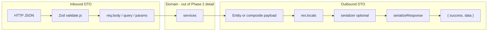

# API Boundaries

**Phase:** 2 — API Contracts (Validation & DTOs)  
**Prerequisites:** [`00-core/REQUEST_LIFECYCLE.md`](../00-core/REQUEST_LIFECYCLE.md), [`00-core/ARCHITECTURE_PHILOSOPHY.md`](../00-core/ARCHITECTURE_PHILOSOPHY.md)  
**Out of scope for this article:** JWT/RBAC internals (Phase 3–4: `AUTH_SYSTEM.md`, `RBAC_SYSTEM.md`)

This document defines the **HTTP API contract** between clients and `notes-backend`: envelopes, status codes, `res.locals` pipeline, error shapes, pagination DTOs, and documented Swagger drift.

---

## 1. API Surface

| Property                       | Value                                                          |
| ------------------------------ | -------------------------------------------------------------- |
| Base path                      | `/v1` (`src/routes/v1/index.js`)                               |
| Versioning                     | Path prefix only — no `Accept-Version` header                  |
| Content-Type                   | `application/json` (body parsers in `app.js` L112–115)         |
| Auth header (protected routes) | `Authorization: Bearer <access JWT>` (`config/passport.js` L8) |

**Not part of the product API contract:**

| Path                         | Response style                      | File              |
| ---------------------------- | ----------------------------------- | ----------------- |
| `/live`, `/ready`, `/health` | Ad-hoc JSON, no `success` wrapper   | `app.js` L31–94   |
| Unknown routes under app     | Error envelope after 404 `ApiError` | `app.js` L146–148 |

---

## 2. Architectural Boundary Model



| Boundary       | Owner                                       | Guarantees                                                                      |
| -------------- | ------------------------------------------- | ------------------------------------------------------------------------------- |
| **Transport**  | Express + global middleware                 | TLS termination at proxy; rate limits on `/v1`                                  |
| **Input DTO**  | `validations/*` + `validate.js`             | Shape, coercion, basic constraints                                              |
| **Output DTO** | `serializers/*` + `response.interceptor.js` | Field whitelist; canonical envelope                                             |
| **Errors**     | `ApiError` + `error.js`                     | Stable `{ success: false, error }` — **not** passed through success interceptor |

**Why separate inbound/outbound DTOs:** ERP clients version independently of Prisma schema. Validation rejects garbage before services; serializers prevent ORM field leaks (password, relations, internal columns).

---

## 3. Controller → Response Contract (`res.locals`)

Controllers **must not** call `res.json()` / `res.send()` for standard `/v1` success responses. They delegate to `serializeResponse` via `res.locals`.

| `res.locals` key | Type       | Required                | Purpose                                                       |
| ---------------- | ---------- | ----------------------- | ------------------------------------------------------------- |
| `payload`        | any        | For JSON body responses | Data before envelope (entity, paginated object, or composite) |
| `serializer`     | `function` | Optional                | Maps each entity (or each item in `results`) to public DTO    |
| `statusCode`     | number     | Optional                | HTTP status; default **200** in interceptor                   |
| `meta`           | object     | Optional                | Merged into top-level response as `meta` if non-empty         |

**Source:** `src/middlewares/response.interceptor.js` L1–46, controllers under `src/controllers/`.

### 3.1 Standard pattern (users, notes)

```javascript
// note.controller.js — createNote
res.locals.statusCode = httpStatus.CREATED;
res.locals.payload = note;
res.locals.serializer = serializeNote;
next();
```

### 3.2 No-content pattern

```javascript
// note.controller.js — deleteNote
res.locals.statusCode = httpStatus.NO_CONTENT;
res.locals.payload = null;
next();
```

`serializeResponse` sends **empty body** at 204 (`response.interceptor.js` L8–10) — no `{ success: true }` wrapper.

### 3.3 Auth composite payload (exceptional but intentional)

```javascript
// auth.controller.js — login / register
res.locals.payload = { user: serializeUser(user), tokens };
next();
```

- **Serializer is not set** on `res.locals` — user is pre-serialized; `tokens` object passed through unchanged.
- Envelope becomes `{ success: true, data: { user: {...}, tokens: { access, refresh } } }`.
- **Why:** Auth responses are a stable, documented composite; token shape is defined in `token.service.js` `generateAuthTokens` (L120–129), not entity serializers.

### 3.4 Refresh tokens response

```javascript
// auth.controller.js — refreshTokens
res.locals.payload = { ...tokens };
```

`data` is `{ access: { token, expires }, refresh: { token, expires } }` without `user` wrapper.

---

## 4. Success Response Envelope

**Produced by:** `serializeResponse` (`response.interceptor.js` L37–45)

```json
{
  "success": true,
  "data": {}
}
```

Optional:

```json
{
  "success": true,
  "data": {},
  "meta": {}
}
```

| Rule            | Implementation                                                                             |
| --------------- | ------------------------------------------------------------------------------------------ |
| Default status  | `res.locals.statusCode \|\| 200` (L45)                                                     |
| Skip envelope   | If both `payload` and `statusCode` undefined → `next()` (L4–6)                             |
| Paginated lists | `data` retains `results`, `page`/`totalResults` **or** `nextCursor`/`hasNextPage` — see §6 |

**Anti-pattern:** Setting only `payload` without calling `next()` — hangs or falls through incorrectly.

---

## 5. Error Response Envelope

Errors **bypass** `serializeResponse`. Flow: thrown `ApiError` or converted error → `errorConverter` → `errorHandler` → direct `res.send`.

**Shape** (`middlewares/error.js` L52–64):

```json
{
  "success": false,
  "error": {
    "code": "API_ERROR",
    "message": "Human-readable message"
  }
}
```

| Environment   | Extra fields                                                              |
| ------------- | ------------------------------------------------------------------------- |
| `development` | `error.stack` on 500 and operational errors when converter attaches stack |
| `production`  | Non-operational errors → generic 500 message (L45–47)                     |

### 5.1 `ApiError` class

**File:** `src/utils/ApiError.js`

| Property        | Meaning                                                                                |
| --------------- | -------------------------------------------------------------------------------------- |
| `statusCode`    | HTTP status                                                                            |
| `message`       | Client message                                                                         |
| `isOperational` | Default `true` — expected failures                                                     |
| `name`          | Becomes `error.code` when not 500 (e.g. Prisma mapping sets `RESOURCE_ALREADY_EXISTS`) |

Controllers and services throw `ApiError` for predictable failures (`note.controller.js` L47, `user.controller.js` L38).

### 5.2 Prisma → HTTP mapping (`errorConverter`)

| Prisma code                   | HTTP | `error.name`              | Message                         |
| ----------------------------- | ---- | ------------------------- | ------------------------------- |
| `P2002`                       | 400  | `RESOURCE_ALREADY_EXISTS` | Resource already exists         |
| `P2025`                       | 404  | `RESOURCE_NOT_FOUND`      | Resource not found              |
| `P2003`                       | 400  | `CONSTRAINT_VIOLATION`    | Dependency constraint violation |
| Other known                   | 400  | `BAD_REQUEST`             | Invalid request payload         |
| `PrismaClientValidationError` | 400  | `VALIDATION_FAILED`       | Validation failed               |

**ERP implication:** Unique email on register surfaces as 400, not 500.

### 5.3 Validation errors

Zod failures become `ApiError(400, joined Zod messages)` (`validate.js` L18–21). Same error envelope as other 400s.

### 5.4 Error logging hook

`errorHandler` sets `res.err = err` (L62) for pino-http to log with request context.

---

## 6. Pagination Response Shapes (in `data`)

The interceptor detects paginated `payload` when `payload.results` is an array **and** (`page` or `nextCursor` is defined) (`response.interceptor.js` L19–28).

### 6.1 Cursor pagination (notes list)

**Repository:** `note.repository.paginateNotes` → `paginateCursor.js`

**Query params (validated):** `cursor`, `limit`, `search`, `archived`, `sortBy` — see `note.validation.js` `getNotes`.

**`data` shape after envelope:**

```json
{
  "success": true,
  "data": {
    "results": [
      /* serialized notes */
    ],
    "nextCursor": "clxyz...",
    "hasNextPage": true
  }
}
```

| Field         | Type           | Notes                                       |
| ------------- | -------------- | ------------------------------------------- |
| `results`     | array          | Each element passed through `serializeNote` |
| `nextCursor`  | string \| null | Last item id on page if more exist          |
| `hasNextPage` | boolean        | `true` if `limit+1` rows fetched            |

**Ordering:** `id: 'desc'` only (`paginateCursor.js` L22) — `sortBy` query is accepted by validation but **cursor path ignores custom sort** in repository (document as client contract caveat).

### 6.2 Offset pagination (users list)

**Repository:** `user.repository.paginateUsers` → `utils/paginate.js`

**Query params:** `page`, `limit`, `name`, `role`, `sortBy` — `user.validation.js` `getUsers`.

**`data` shape:**

```json
{
  "success": true,
  "data": {
    "results": [
      /* serialized users */
    ],
    "page": 1,
    "limit": 10,
    "totalPages": 3,
    "totalResults": 25
  }
}
```

---

## 7. Status Code Conventions

| Code    | Usage in codebase                                         |
| ------- | --------------------------------------------------------- |
| **200** | Default success                                           |
| **201** | Create user/note (`res.locals.statusCode = CREATED`)      |
| **204** | Logout, delete, password reset, email verify — empty body |
| **400** | Validation, Prisma constraint, duplicate resource         |
| **401** | JWT invalid, login failed, refresh failed                 |
| **403** | RBAC middleware denial                                    |
| **404** | Not found, logout token not found, some auth email flows  |
| **500** | Unhandled / non-operational (production sanitized)        |

**Note:** `403` vs `404` — notes use **404** for cross-owner access to avoid enumeration (`note.controller.js` L44–47). Documented in Phase 1; repeated here because it affects client error handling.

---

## 8. Request Pipeline Order (Contract-Relevant)

Per-route middleware order matters for what validation sees:

| Route type         | Order                                         | Example               |
| ------------------ | --------------------------------------------- | --------------------- |
| Public auth        | `validate` → controller                       | `POST /v1/auth/login` |
| Protected resource | `auth(permissions)` → `validate` → controller | `POST /v1/notes`      |

**Implication:** Protected routes have `req.user` available only **after** `auth()` — validation schemas do not reference `req.user`; ownership is applied in controller/service.

See [`VALIDATION_SYSTEM.md`](VALIDATION_SYSTEM.md) for schema catalog.

---

## 9. `catchAsync` Boundary

**File:** `src/utils/catchAsync.js`

Wraps async controllers so rejected promises become `next(err)` → error pipeline.

**Without it:** Unhandled rejection may not reach `errorHandler` consistently.

All controllers in `auth.controller.js`, `user.controller.js`, `note.controller.js` use `catchAsync`.

---

## 10. Swagger / OpenAPI Drift Register

Swagger JSDoc lives **inline in route files** (`*.route.js`). It is **not** generated from Zod — drift is possible.

| ID      | Route / area     | Swagger claims                          | Runtime truth                                                                    | Risk                            |
| ------- | ---------------- | --------------------------------------- | -------------------------------------------------------------------------------- | ------------------------------- |
| **D06** | `POST /v1/users` | `role: [user, admin]` enum in body      | `role` stripped in controller (`user.controller.js` L10–16); RBAC via `UserRole` | Clients send useless field      |
| **D07** | `GET /v1/notes`  | Offset `page`, `totalPages` in examples | Cursor `cursor`, `nextCursor`, `hasNextPage`                                     | Wrong client pagination         |
| —       | `GET /v1/users`  | Offset pagination                       | Matches `paginateUsers`                                                          | OK                              |
| —       | User path param  | Swagger `:id`                           | Route param `userId` (`user.route.js`)                                           | Path name mismatch in docs only |

**Phase 11 backlog:** Regenerate Swagger from Zod or shared OpenAPI spec.

---

## 11. Security Boundaries at the API Layer

| Concern               | Where enforced                                                  | Not in API boundary doc  |
| --------------------- | --------------------------------------------------------------- | ------------------------ |
| Input max sizes       | Zod max lengths (`note.validation.js` title 200, content 10000) | —                        |
| Password in responses | `serializeUser` omits; Prisma global omit                       | `config/prisma.js`       |
| Tokens in responses   | Only auth endpoints return plaintext JWT in JSON                | Never log in serializers |
| XSS on input          | `xss()` middleware before routes                                | `app.js` L118            |
| Rate limit            | `apiLimiter`, `authLimiter`, `refreshLimiter`                   | Phase 4 security model   |

---

## 12. Client Integration Checklist

- [ ] Parse `success` boolean on all `/v1` JSON responses except 204.
- [ ] On `success: false`, read `error.code` and `error.message`.
- [ ] Use cursor pagination for notes; offset for users.
- [ ] Do not rely on Swagger for notes list without checking this doc.
- [ ] Expect `data.user` + `data.tokens` on login/register only.
- [ ] Handle 204 with empty body (no JSON parse).

---

## 13. Related Documents

| Document                                                                       | Topic                      |
| ------------------------------------------------------------------------------ | -------------------------- |
| [`VALIDATION_SYSTEM.md`](VALIDATION_SYSTEM.md)                                 | Zod schemas, coercion      |
| [`SERIALIZATION_SYSTEM.md`](SERIALIZATION_SYSTEM.md)                           | Output DTO whitelists      |
| [`../00-core/REQUEST_LIFECYCLE.md`](../00-core/REQUEST_LIFECYCLE.md)           | Full middleware order      |
| [`../00-core/CANONICAL_SYSTEM_FLOWS.md`](../00-core/CANONICAL_SYSTEM_FLOWS.md) | Serialization flow diagram |

---

## 14. Phase 2 Acceptance Checklist

- [x] `res.locals` contract documented
- [x] Success/error JSON shapes with examples
- [x] Validation middleware position relative to auth
- [x] Password never in default user API output (cross-ref serializers)
- [x] Swagger errata D06, D07
