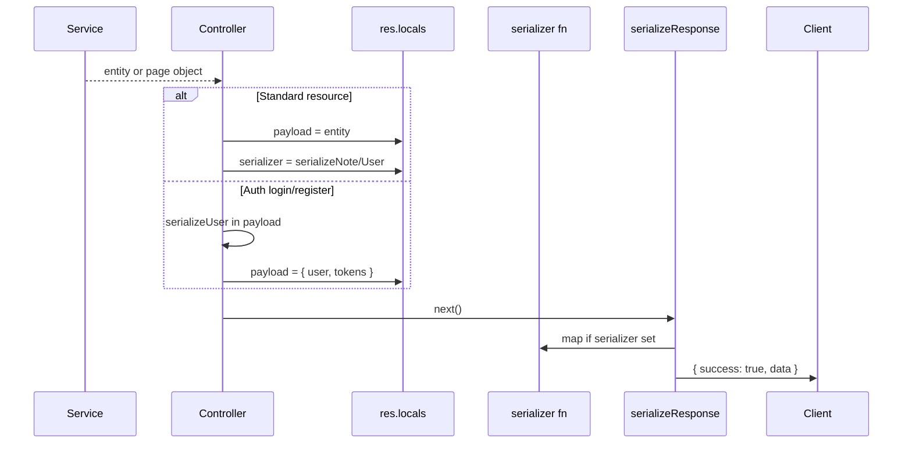
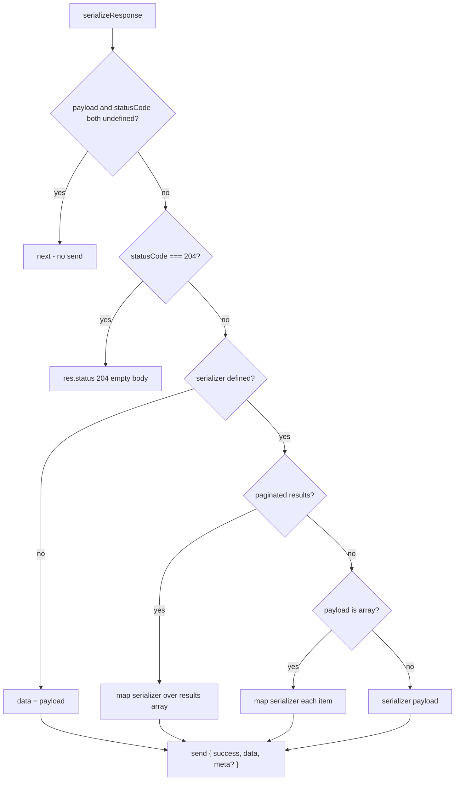

# Serialization System

**Phase:** 2 — API Contracts  
**Implementation:** `src/serializers/*` + `src/middlewares/response.interceptor.js`  
**Prerequisites:** [`API_BOUNDARIES.md`](API_BOUNDARIES.md), [`VALIDATION_SYSTEM.md`](VALIDATION_SYSTEM.md)

---

## 1. Purpose

Serialization is the **outbound DTO boundary**. It converts internal representations (Prisma entities, service return values) into **stable JSON-safe objects** for ERP clients.

| Layer                   | Role                                                                  |
| ----------------------- | --------------------------------------------------------------------- |
| **Prisma `omit`**       | Global defense — never return `password` from User queries by default |
| **Serializers**         | Explicit per-resource API field whitelist                             |
| **`serializeResponse`** | Wraps output in `{ success: true, data }`                             |

**Why not return Prisma objects directly:** Migrations add columns; relations (`owner`, `userRoles`) leak; compliance requires excluding internal fields. Serializers decouple **storage model** from **integration contract**.

---

## 2. End-to-End Serialization Flow



**Reference:** [`../00-core/CANONICAL_SYSTEM_FLOWS.md`](../00-core/CANONICAL_SYSTEM_FLOWS.md) §5.

---

## 3. Response Interceptor (`response.interceptor.js`)

### 3.1 Decision tree



### 3.2 Paginated detection

Predicate (`response.interceptor.js` L19–24):

```javascript
payload &&
  payload.results &&
  Array.isArray(payload.results) &&
  (typeof payload.page !== 'undefined' || typeof payload.nextCursor !== 'undefined');
```

| Pagination type | Detected by                        | Serialized fields                                        |
| --------------- | ---------------------------------- | -------------------------------------------------------- |
| Offset          | `page` defined                     | `results`, `page`, `limit`, `totalPages`, `totalResults` |
| Cursor          | `nextCursor` defined (may be null) | `results`, `nextCursor`, `hasNextPage`                   |

**Non-paginated object** with a `results` array but without `page`/`nextCursor` would **not** trigger list mapping — no current endpoint does this.

### 3.3 Meta channel

```javascript
const response = {
  success: true,
  data,
  ...(Object.keys(meta).length > 0 && { meta }),
};
```

`res.locals.meta` is optional — unused in current controllers but available for rate-limit hints, deprecation warnings, etc.

---

## 4. Entity Serializers

### 4.1 User (`user.serializer.js`)

**Whitelist:**

| Field                    | Included                                           |
| ------------------------ | -------------------------------------------------- |
| `id`                     | ✅                                                 |
| `email`                  | ✅                                                 |
| `name`                   | ✅                                                 |
| `isEmailVerified`        | ✅                                                 |
| `createdAt`, `updatedAt` | ✅                                                 |
| `password`               | ❌ explicitly excluded                             |
| `role` (LegacyRole)      | ❌ excluded — clients must not rely on legacy enum |

```javascript
const serializeUser = (user) => {
  if (!user) return null;
  return {
    id: user.id,
    email: user.email,
    name: user.name,
    isEmailVerified: user.isEmailVerified,
    createdAt: user.createdAt,
    updatedAt: user.updatedAt,
  };
};
```

**`serializeUsers`:** Maps array; returns `[]` if input not array.

**Tests:** `tests/unit/serializers/user.serializer.test.js` — password and role stripped.

### 4.2 Note (`note.serializer.js`)

**Whitelist:**

| Field                                        | Included                            |
| -------------------------------------------- | ----------------------------------- |
| `id`, `title`, `content`, `archived`, `tags` | ✅                                  |
| `ownerId`                                    | ✅                                  |
| `createdAt`, `updatedAt`                     | ✅                                  |
| `owner` relation                             | ❌ stripped even if Prisma included |
| Arbitrary extra keys                         | ❌                                  |

```javascript
return {
  id: note.id,
  title: note.title,
  content: note.content,
  archived: note.archived,
  tags: note.tags,
  ownerId: note.ownerId,
  createdAt: note.createdAt,
  updatedAt: note.updatedAt,
};
```

**Tests:** `tests/unit/serializers/note.serializer.test.js` — `owner` relation and `secretMeta` removed.

---

## 5. Prisma Global Omit (Defense in Depth)

**File:** `src/config/prisma.js`

```javascript
const omitConfig = {
  user: {
    password: true,
  },
};
```

Applied to Prisma Client construction — default queries omit `password`.

**Exception path:** `userRepository.findByEmail(..., { includePassword: true })` uses `omit: { password: !includePassword }` for login only.

**Serializer still required:** Omit does not remove `role`, relations, or future columns — whitelist serializers remain authoritative for API contract.

---

## 6. Controller Patterns

### 6.1 Deferred serialization (preferred for CRUD)

```javascript
// user.controller.js
res.locals.payload = user;
res.locals.serializer = serializeUser;
next();
```

Interceptor applies `serializeUser` once at the edge.

### 6.2 Eager serialization (auth only)

```javascript
// auth.controller.js — login
res.locals.payload = { user: serializeUser(user), tokens };
next();
```

| Aspect                     | Reason                                                                            |
| -------------------------- | --------------------------------------------------------------------------------- |
| No `res.locals.serializer` | Composite payload — not a single entity                                           |
| `tokens` not serialized    | Shape defined by `token.service.generateAuthTokens` — JWT strings + Date expires  |
| Tokens are credentials     | Never pass through entity serializer; never persist in audit metadata unsanitized |

**Token DTO shape** (in `data` after envelope):

```json
{
  "access": { "token": "<jwt>", "expires": "2026-05-24T12:00:00.000Z" },
  "refresh": { "token": "<jwt>", "expires": "2026-06-23T12:00:00.000Z" }
}
```

### 6.3 Refresh response

```javascript
res.locals.payload = { ...tokens };
```

`data` contains only `access` and `refresh` objects — no `user`.

### 6.4 No serialization (204)

```javascript
res.locals.statusCode = httpStatus.NO_CONTENT;
res.locals.payload = null;
next();
```

Empty response — serializer not invoked.

---

## 7. Composite `data` Examples

### 7.1 Single note (200/201)

```json
{
  "success": true,
  "data": {
    "id": "clx...",
    "title": "Q2 planning",
    "content": "...",
    "archived": false,
    "tags": ["work"],
    "ownerId": "clu...",
    "createdAt": "...",
    "updatedAt": "..."
  }
}
```

### 7.2 Note list (cursor)

```json
{
  "success": true,
  "data": {
    "results": [{ "id": "...", "title": "..." }],
    "nextCursor": "clx...",
    "hasNextPage": false
  }
}
```

### 7.3 Login

```json
{
  "success": true,
  "data": {
    "user": {
      "id": "...",
      "email": "...",
      "name": "...",
      "isEmailVerified": false,
      "createdAt": "...",
      "updatedAt": "..."
    },
    "tokens": {
      "access": { "token": "...", "expires": "..." },
      "refresh": { "token": "...", "expires": "..." }
    }
  }
}
```

---

## 8. What Serialization Does Not Cover

| Output               | Handling                                      |
| -------------------- | --------------------------------------------- |
| Error responses      | `errorHandler` — no serializer                |
| Health probes        | Direct `res.send` in `app.js`                 |
| Audit log `metadata` | `audit.service` sanitization — separate rules |
| Email templates      | `email.service` — out of band                 |

---

## 9. Security & Compliance

| Risk                | Mitigation                                                                                                   |
| ------------------- | ------------------------------------------------------------------------------------------------------------ |
| Password leak       | Prisma omit + `serializeUser`                                                                                |
| JWT in logs         | pino redacts Authorization; serializers don't log                                                            |
| Mass assignment     | Validation inbound whitelist; serializer outbound whitelist                                                  |
| Relation over-fetch | `note.repository` `cleanNoteIncludes` limits owner fields if ever included — serializer still strips `owner` |

**Warning:** Adding a field to Prisma **does not** expose it to clients until serializer is updated — intentional gate for ERP API reviews.

---

## 10. Anti-Patterns

| Anti-pattern                            | Consequence                                             |
| --------------------------------------- | ------------------------------------------------------- |
| `res.send(user)` in controller          | Breaks envelope; bypasses whitelist                     |
| Return Prisma object without serializer | Field leak on schema change                             |
| Add sensitive field to serializer       | Expands attack surface — requires security review       |
| Use serializer for `tokens`             | Wrong abstraction — keep auth DTO in controller/service |
| Rely only on Prisma omit                | Insufficient for relations and legacy columns           |

---

## 11. ERP Extension Guide

When adding resource `{Resource}`:

1. Create `src/serializers/{resource}.serializer.js` with explicit field list.
2. Add unit test mirroring `note.serializer.test.js` (whitelist + strip relations).
3. In controller: `res.locals.serializer = serialize{Resource}`.
4. Document fields in OpenAPI **after** serializer is final.
5. Never include: internal flags, foreign keys not needed by clients, hashed secrets.

---

## 12. Relationship to Other Phases

| Phase | Topic                                                  |
| ----- | ------------------------------------------------------ |
| 3     | Auth tokens minting — complements §6.2 token shape     |
| 4     | RBAC — does not change serializer                      |
| 5     | Prisma schema — drives what serializers must strip     |
| 6     | Audit metadata sanitization — parallel outbound policy |

---

## 13. Related Documents

- [`API_BOUNDARIES.md`](API_BOUNDARIES.md) — `res.locals`, envelopes, pagination
- [`VALIDATION_SYSTEM.md`](VALIDATION_SYSTEM.md) — inbound mirror
- [`../00-core/ARCHITECTURE_PHILOSOPHY.md`](../00-core/ARCHITECTURE_PHILOSOPHY.md) — why serializers exist

---

## 14. Phase 2 Acceptance

- [x] Interceptor logic including pagination branch
- [x] User and note whitelists with code references
- [x] Auth composite pattern documented
- [x] Password never in default API user output
- [x] Prisma omit vs serializer roles distinguished
- [x] Unit test references included
