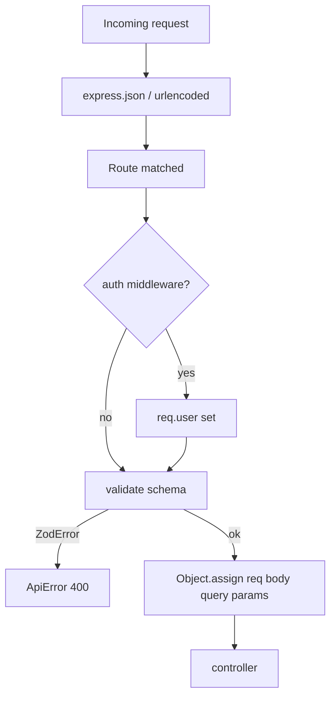

# Validation System

**Phase:** 2 — API Contracts  
**Implementation:** Zod schemas in `src/validations/`, applied by `src/middlewares/validate.js`  
**Prerequisites:** [`API_BOUNDARIES.md`](API_BOUNDARIES.md), [`../00-core/REQUEST_LIFECYCLE.md`](../00-core/REQUEST_LIFECYCLE.md)

---

## 1. Purpose

The validation system is the **inbound DTO boundary**. It guarantees that controllers and services receive:

- Correct types (numbers coerced from query strings)
- Trimmed strings where defined
- Rejected unknown shapes before business logic
- Consistent error messages for malformed input

**Why Zod at the HTTP edge:** Services stay free of repetitive `if (!email)` checks; invalid data never triggers Prisma queries or audit writes.

**What validation does NOT do:**

| Not validated here      | Handled by                           |
| ----------------------- | ------------------------------------ |
| JWT authenticity        | `auth.js` + Passport                 |
| RBAC permissions        | `auth.js`                            |
| Resource ownership      | Controller / `authorization.service` |
| Email uniqueness        | `user.service` → 400 `ApiError`      |
| Business state machines | Services                             |

---

## 2. Middleware Architecture



**File:** `src/middlewares/validate.js`

```javascript
const validate = (schema) => (req, res, next) => {
  try {
    const validated = schema.parse({
      body: req.body,
      query: req.query,
      params: req.params,
    });
    Object.assign(req, validated);
    next();
  } catch (error) {
    if (error instanceof ZodError || error.name === 'ZodError') {
      const issues = error.issues || error.errors || [];
      const errorMessage = issues.map((details) => details.message).join(', ');
      return next(new ApiError(httpStatus.BAD_REQUEST, errorMessage));
    }
    next(error);
  }
};
```

### 2.1 Critical behaviors

| Behavior                                | Effect                                                                            |
| --------------------------------------- | --------------------------------------------------------------------------------- |
| `schema.parse({ body, query, params })` | Each top-level key validated independently                                        |
| `Object.assign(req, validated)`         | **Replaces** `req.body`, `req.query`, `req.params` with parsed output             |
| Coercion                                | `z.coerce.number()` on query strings (`user.validation.js`, `note.validation.js`) |
| Error format                            | Comma-joined Zod `.message` strings — single 400 response                         |

**Warning:** `Object.assign(req, validated)` does not deep-merge; entire `req.body` is the validated body object only.

---

## 3. Shared Primitives (`custom.validation.js`)

| Export                   | Purpose               | Rule                            |
| ------------------------ | --------------------- | ------------------------------- |
| `cuid2(value)`           | Regex test            | `/^[a-z][a-z0-9]{24}$/`         |
| `cuid2Schema(fieldName)` | Reusable param schema | Refine with named error message |
| `password(value)`        | Password strength     | ≥8 chars, ≥1 letter, ≥1 digit   |

**Used by:** All `:id` path params (`noteId`, `userId`, `cursor`, `roleId`, etc.).

**ERP implication:** New resources should use CUID2 path params for consistency with Prisma `@default(cuid())`.

---

## 4. Schema Modules

### 4.1 Export barrel

**File:** `src/validations/index.js`

```javascript
module.exports.authValidation = require('./auth.validation');
module.exports.userValidation = require('./user.validation');
module.exports.noteValidation = require('./note.validation');
```

**Note:** `role.validation.js` exists but is **not exported** and has **no routes** — prepared for future role HTTP API (drift **D03**).

---

### 4.2 Auth (`auth.validation.js`)

| Schema           | Route binding                | body                                   | query | params |
| ---------------- | ---------------------------- | -------------------------------------- | ----- | ------ |
| `register`       | `POST /auth/register`        | email, name, password (strength)       | —     | —      |
| `login`          | `POST /auth/login`           | email, password (no strength on login) | —     | —      |
| `logout`         | `POST /auth/logout`          | refreshToken                           | —     | —      |
| `refreshTokens`  | `POST /auth/refresh-tokens`  | refreshToken                           | —     | —      |
| `forgotPassword` | `POST /auth/forgot-password` | email                                  | —     | —      |
| `resetPassword`  | `POST /auth/reset-password`  | password (strength)                    | token | —      |
| `verifyEmail`    | `POST /auth/verify-email`    | —                                      | token | —      |

**Public routes:** No `auth()` before validate (`auth.route.js` L10–17).

**Login password:** Only `z.string()` — failed login returns 401 from service, not 400 from Zod.

---

### 4.3 Users (`user.validation.js`)

| Schema       | Permissions (route) | Highlights                                         |
| ------------ | ------------------- | -------------------------------------------------- |
| `createUser` | `create:users:any`  | `role` optional string — **ignored at controller** |
| `getUsers`   | `read:users:any`    | `page`, `limit` coerced; `role` filter string      |
| `getUser`    | `read:users:own`    | `userId` CUID2                                     |
| `updateUser` | `update:users:own`  | ≥1 body field required (refine)                    |
| `deleteUser` | `delete:users:own`  | `userId` CUID2                                     |

**Drift D06 / D08:**

- `role` in `createUser` body — validated as optional string but stripped in `user.controller.js` before service.
- `getUsers` `role` query filters deprecated `User.role` column — validation allows any string.

---

### 4.4 Notes (`note.validation.js`)

| Schema       | Permissions        | Highlights                                                              |
| ------------ | ------------------ | ----------------------------------------------------------------------- |
| `createNote` | `create:notes:own` | title 3–200 trim; content 1–10000; optional tags lowercased             |
| `getNotes`   | `read:notes:own`   | `archived` enum `'true'\|'false'`; `cursor` CUID2; `limit` positive int |
| `getNote`    | `read:notes:own`   | `noteId`                                                                |
| `updateNote` | `update:notes:own` | ≥1 field; same max lengths as create                                    |
| `deleteNote` | `delete:notes:own` | `noteId`                                                                |

**Tags:** `z.array(z.string().trim().toLowerCase())` — normalizes client input before persistence.

**Archived filter:** Query string enum, not boolean — controller compares `req.query.archived === 'true'` (`note.controller.js` L20–21).

---

### 4.5 Roles (`role.validation.js`) — No HTTP wiring

Schemas exist for future admin API:

| Schema       | Intended use                               |
| ------------ | ------------------------------------------ |
| `createRole` | name, level 0–100, optional permission IDs |
| `assignRole` | `userId`, `roleId`                         |
| `removeRole` | `userId`, `roleId`                         |

**Do not assume these endpoints exist** until `role.route.js` is added (Phase 11).

---

## 5. Route → Validation Matrix

| Method           | Path                               | `auth()`           | `validate(...)`                 |
| ---------------- | ---------------------------------- | ------------------ | ------------------------------- |
| POST             | `/v1/auth/register`                | —                  | `authValidation.register`       |
| POST             | `/v1/auth/login`                   | —                  | `authValidation.login`          |
| POST             | `/v1/auth/logout`                  | —                  | `authValidation.logout`         |
| POST             | `/v1/auth/refresh-tokens`          | —                  | `authValidation.refreshTokens`  |
| POST             | `/v1/auth/forgot-password`         | —                  | `authValidation.forgotPassword` |
| POST             | `/v1/auth/reset-password`          | —                  | `authValidation.resetPassword`  |
| POST             | `/v1/auth/send-verification-email` | `auth()`           | —                               |
| POST             | `/v1/auth/verify-email`            | —                  | `authValidation.verifyEmail`    |
| POST             | `/v1/users`                        | `create:users:any` | `userValidation.createUser`     |
| GET              | `/v1/users`                        | `read:users:any`   | `userValidation.getUsers`       |
| GET/PATCH/DELETE | `/v1/users/:userId`                | `*:users:own`      | matching user validation        |
| POST/GET         | `/v1/notes`                        | `*:notes:own`      | note validation                 |
| GET/PATCH/DELETE | `/v1/notes/:noteId`                | `*:notes:own`      | note validation                 |

---

## 6. Validation vs Database Constraints

| Check             | Validation     | Database                                |
| ----------------- | -------------- | --------------------------------------- |
| Email format      | Zod `.email()` | Unique index                            |
| Email duplicate   | —              | Prisma P2002 → 400 via `errorConverter` |
| Title length      | Zod max 200    | `@db.VarChar(200)`                      |
| CUID format       | Zod refine     | Prisma accepts or query misses          |
| Password strength | Zod refine     | bcrypt hash in service                  |

**Defense in depth:** Zod fails fast; DB is last resort for races on unique email.

---

## 7. Failure Examples

### 7.1 Invalid note title

Request: `POST /v1/notes` with `{ "title": "ab", "content": "x" }`

1. `auth()` passes.
2. Zod: title min 3 → 400.
3. Response (`API_BOUNDARIES.md` error shape):

```json
{
  "success": false,
  "error": {
    "code": "API_ERROR",
    "message": "Title must be at least 3 characters"
  }
}
```

### 7.2 Invalid cursor

Request: `GET /v1/notes?cursor=not-a-cuid`

400: `"cursor" must be a valid CUID2 identifier`

### 7.3 Empty PATCH body

Request: `PATCH /v1/users/:userId` with `{}`

400: `Must have at least one field to update`

---

## 8. Anti-Patterns

| Anti-pattern                                   | Why wrong                                   |
| ---------------------------------------------- | ------------------------------------------- |
| Validate inside service                        | Duplicates rules; bypasses 400 contract     |
| Skip validate on “internal” routes             | Every `/v1` route should use Zod            |
| Put RBAC in Zod `.refine`                      | Belongs in `auth()` / authorization service |
| Trust `req.body` before validate on new routes | Always mount `validate`                     |
| Export role schemas without routes             | Confuses API consumers — document as future |

---

## 9. Adding Validation for a New ERP Endpoint

1. Create `src/validations/{resource}.validation.js` with `body` / `query` / `params` objects.
2. Export from `validations/index.js`.
3. Bind: `router.post('/x', auth('...'), validate(xValidation.create), controller.create)`.
4. Add row to future `ROUTE_PERMISSION_MATRIX.md` (Phase 4).
5. Add Swagger only after Zod parity (avoid D06-style drift).

---

## 10. Testing

| Test area                              | Location                                                     |
| -------------------------------------- | ------------------------------------------------------------ |
| Error converter incl. validation paths | `tests/unit/middlewares/error.test.js`                       |
| Integration auth/user/note             | `tests/integration/*.test.js` — implicit validation via HTTP |

**Gap:** No dedicated unit tests per Zod schema file — schemas validated indirectly through integration tests.

---

## 11. Related Documents

| Doc                       | Link                                                                 |
| ------------------------- | -------------------------------------------------------------------- |
| API envelopes & 400 shape | [`API_BOUNDARIES.md`](API_BOUNDARIES.md)                             |
| Output DTOs               | [`SERIALIZATION_SYSTEM.md`](SERIALIZATION_SYSTEM.md)                 |
| Request order             | [`../00-core/REQUEST_LIFECYCLE.md`](../00-core/REQUEST_LIFECYCLE.md) |

---

## 12. Phase 2 Acceptance

- [x] Validation middleware chain documented
- [x] All exported schemas cataloged
- [x] `role.validation` noted as unwired
- [x] Coercion and `Object.assign` behavior explained
- [x] Drift D06/D08 referenced
