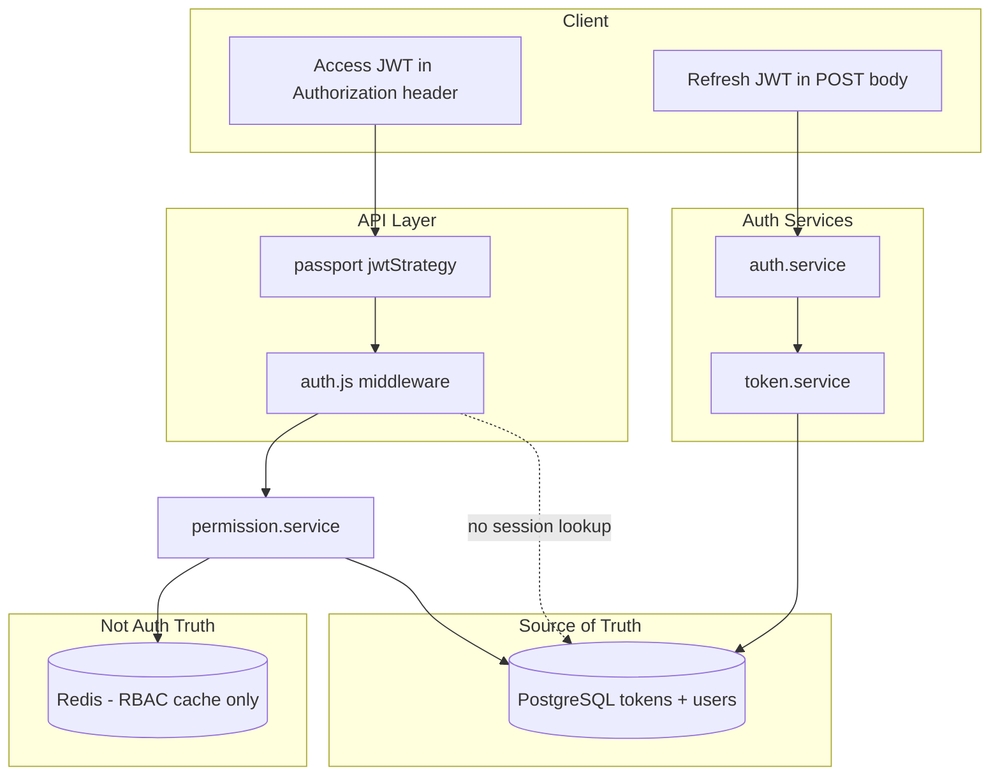
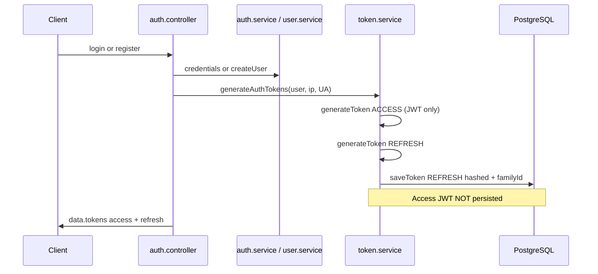
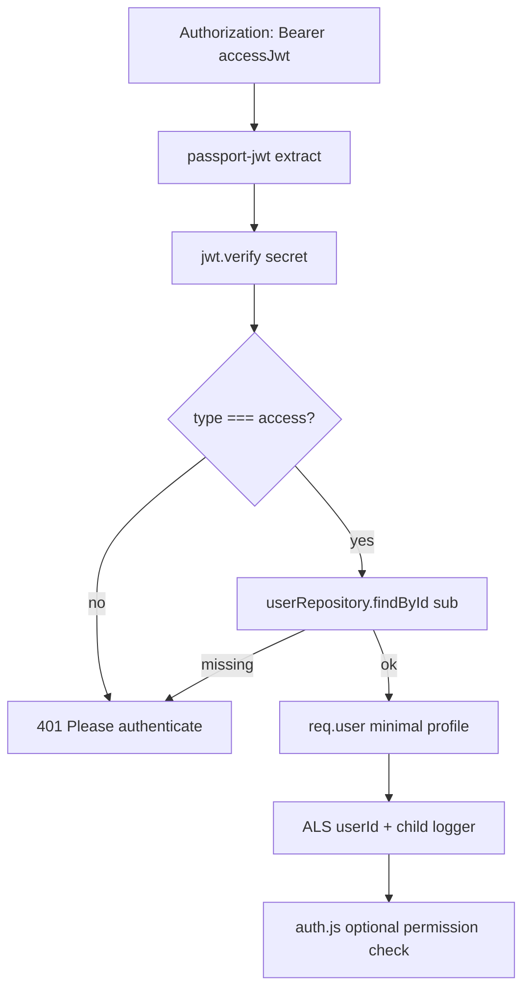
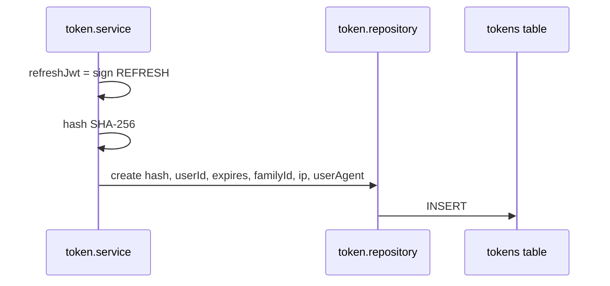
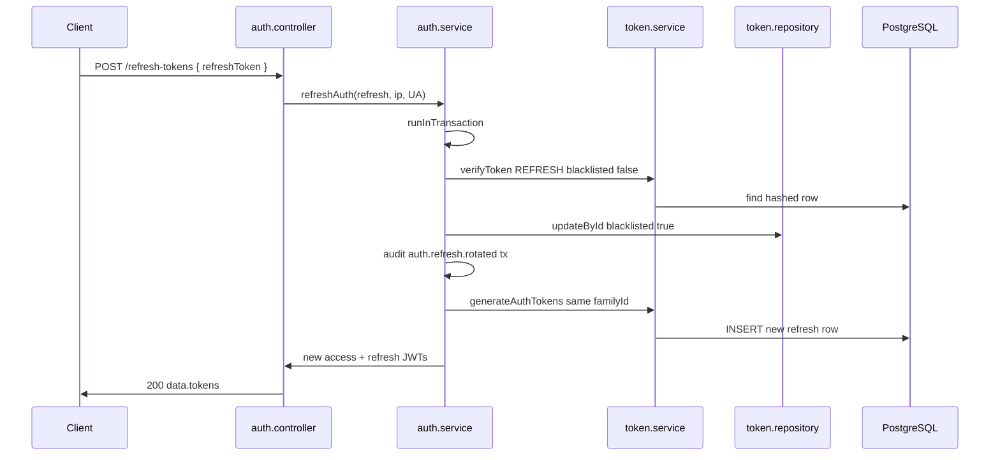
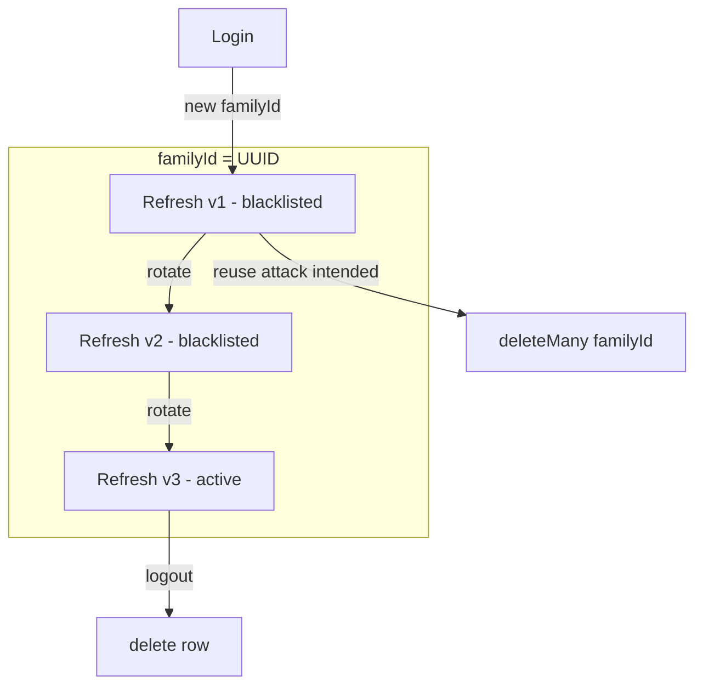
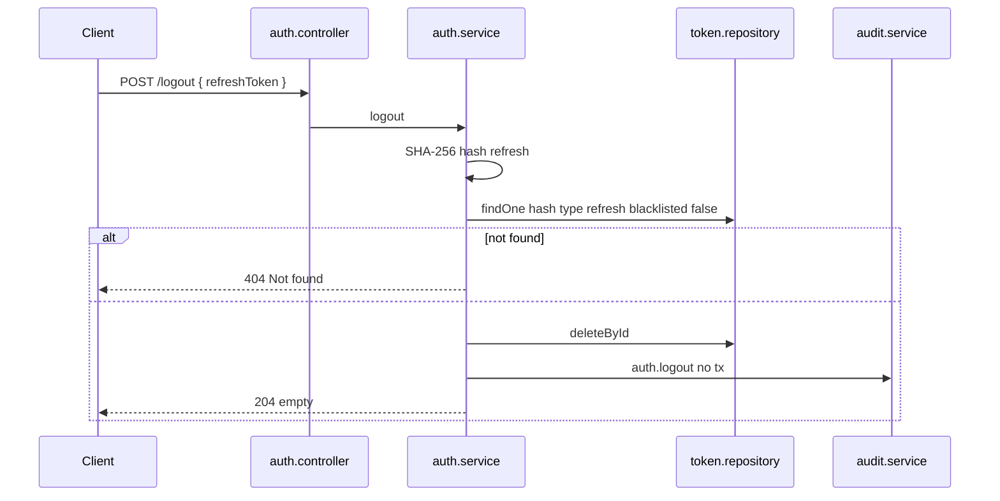
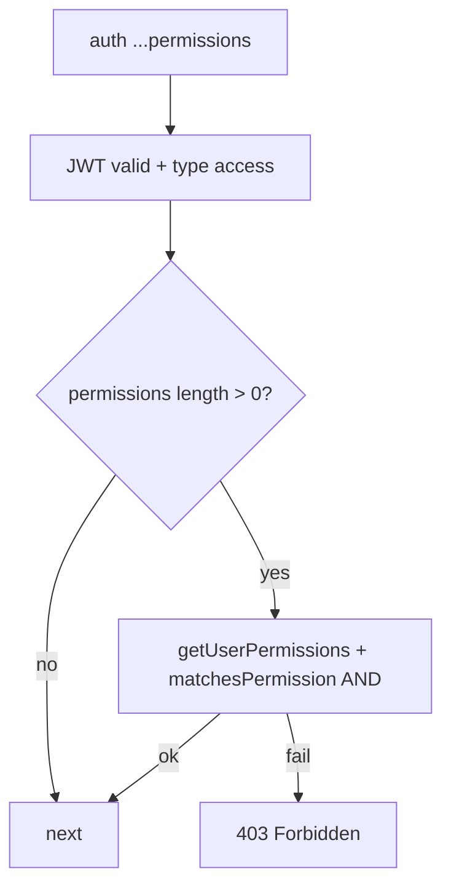

# Authentication System

**Phase:** 3 — Session 3  
**Scope:** Identity proof, session tokens, refresh rotation, and API authentication — **not** RBAC (see Phase 4: `RBAC_SYSTEM.md`)  
**Prerequisites:** [`../00-core/CANONICAL_SYSTEM_FLOWS.md`](../00-core/CANONICAL_SYSTEM_FLOWS.md) §1, [`../01-api/API_BOUNDARIES.md`](../01-api/API_BOUNDARIES.md), [`../01-api/VALIDATION_SYSTEM.md`](../01-api/VALIDATION_SYSTEM.md)

**Primary implementation files:**

| Area                 | Path                                                |
| -------------------- | --------------------------------------------------- |
| HTTP routes          | `src/routes/v1/auth.route.js`                       |
| Controllers          | `src/controllers/auth.controller.js`                |
| Auth orchestration   | `src/services/auth.service.js`                      |
| JWT + persistence    | `src/services/token.service.js`                     |
| Token DB access      | `src/repositories/token.repository.js`              |
| Bearer verification  | `src/config/passport.js`, `src/middlewares/auth.js` |
| Token type constants | `src/config/tokens.js`                              |
| Schema               | `prisma/schema.prisma` (`Token`, `TokenType`)       |
| Rate limits          | `src/middlewares/rateLimiter.js`                    |
| Worker cleanup       | `src/workers/tokenCleanup.worker.js`                |

**Cross-reference:** [`../../architecture/security.md`](../../architecture/security.md) (taxonomy; this KB article is implementation-grounded).

---

## 1. Authentication Philosophy

### 1.1 Hybrid stateful + stateless model

| Token                    | Storage                                   | Validation                                    | Purpose                               |
| ------------------------ | ----------------------------------------- | --------------------------------------------- | ------------------------------------- |
| **Access**               | Not in DB                                 | JWT signature + `type: access` + user exists  | Short-lived API authorization carrier |
| **Refresh**              | PostgreSQL (`tokens` table), SHA-256 hash | JWT signature + DB row (`blacklisted: false`) | Long-lived session renewal            |
| **Reset / verify email** | PostgreSQL, hashed                        | Same as refresh pattern                       | One-time flows                        |

**Why hybrid:** Access tokens stay **stateless** so every API request does not hit the `tokens` table. Refresh tokens stay **stateful** so sessions can be revoked, rotated, and audited. This is the standard pattern for ERP/mobile clients that hold a refresh token offline and frequently renew access tokens.

### 1.2 Why PostgreSQL owns refresh truth

- Revocation, blacklist, and `familyId` are relational facts — not cacheable session blobs.
- Refresh validation **always** queries `tokenRepository.findOne` after `jwt.verify` (`token.service.js` L84–98).
- Logout **deletes** the row (`auth.service.js` L54); rotation **updates** `blacklisted` (`auth.service.js` L106).

**Redis is not the source of auth truth.** Redis caches **RBAC permissions** (`permission.service.js`), not refresh sessions. Auth continues when Redis is degraded.

### 1.3 Why rotation + blacklist (not delete-on-use)

After a successful refresh, the old refresh row is **blacklisted**, not deleted (`auth.service.js` L105–106). Comments and tests (`auth.test.js` L168–172) state the goal: detect **reuse** of a consumed refresh token (possible theft).

**Design intent:** If an attacker replays an old refresh after the legitimate client rotated, the server escalates: revoke entire `familyId`, audit `auth.refresh.reuse_detected`, return 401.

### 1.4 Implementation caveat (document honestly)

`token.service.verifyToken` only loads rows with `blacklisted: false` (`token.service.js` L86–92). The reuse branch in `auth.service.refreshAuth` (`auth.service.js` L78–103) runs only when `refreshTokenDoc.blacklisted === true` **after** `verifyToken` — which cannot return a blacklisted row.

**Observed behavior today:** Submitting an already-rotated (blacklisted) refresh token typically fails at `verifyToken` → caught → generic `401 Please authenticate` (`auth.service.js` L121–123). The family-wide `deleteMany({ familyId })` path may **not** run on that replay.

| Item                                               | Status                                                                                         |
| -------------------------------------------------- | ---------------------------------------------------------------------------------------------- |
| Rotation + blacklist on success                    | ✅ Verified in `auth.test.js`                                                                  |
| Integration test for `auth.refresh.reuse_detected` | ❌ Not present                                                                                 |
| Family revoke on blacklisted replay                | ⚠️ **SEC-AUTH-01** — branch likely unreachable; align `verifyToken` lookup or add second query |

Document as **deferred security debt**, not as generic JWT theory.

---

## 2. System Ownership Diagram



---

## 3. Access Token Lifecycle

### 3.1 Issuance (login / register / refresh)



**JWT payload** (`token.service.js` L19–26):

```javascript
{
  sub: (userId, iat, exp, type);
} // type = 'access' | 'refresh' | ...
```

**Config** (`config/config.js` L64–69): `JWT_SECRET`, `JWT_ACCESS_EXPIRATION_MINUTES`, `JWT_REFRESH_EXPIRATION_DAYS`, plus reset/verify TTLs.

### 3.2 Verification (every protected request)



**Passport** (`config/passport.js` L11–30):

- Rejects non-access JWTs (test: refresh token as Bearer → 401, `auth.test.js` L457–469).
- Loads `id`, `name`, `email`, `isEmailVerified` only — no password.

**No DB token table lookup for access tokens.** Revoking access early requires short TTL or changing `JWT_SECRET` (operational nuclear option).

### 3.3 Expiration

- Enforced by `jsonwebtoken` `exp` claim (`auth.test.js` expired token case L487–499).
- Client must call `POST /v1/auth/refresh-tokens` with refresh JWT.

---

## 4. Refresh Token Lifecycle

### 4.1 Persistence on login



**Fields** (`schema.prisma` `Token` model):

| Field             | Role                                                         |
| ----------------- | ------------------------------------------------------------ |
| `token`           | Hashed refresh (never plaintext at rest)                     |
| `type`            | `TokenType.refresh`                                          |
| `familyId`        | UUID per device/session chain                                |
| `blacklisted`     | Rotation / reuse detection flag                              |
| `ip`, `userAgent` | Captured on login/refresh (`auth.controller.js` L17–18, L30) |
| `lastUsedAt`      | **Schema only** — not updated in `src/` (**SEC-AUTH-02**)    |

### 4.2 Rotation flow (happy path)



**Transactional boundary:** Entire rotation in `runInTransaction` (`auth.service.js` L71–120). Audit failure rolls back rotation (`audit.service.js` throws).

### 4.3 Blacklist vs delete semantics

| Event                     | Refresh row fate               |
| ------------------------- | ------------------------------ |
| Successful refresh        | `blacklisted: true` (kept)     |
| Logout                    | Row **deleted** (`deleteById`) |
| Reuse protocol (intended) | `deleteMany({ familyId })`     |
| Expired                   | Batch deleted by worker        |

**Logout vs rotation:** Logout removes the row entirely; rotation preserves blacklisted history for detection (in theory).

### 4.4 Replay / reuse (intended threat model)

See §1.4. Intended flow in `auth.service.js` L78–103:

1. If `blacklisted` and `updatedAt` within **2 seconds** → `401 Concurrent refresh request detected`.
2. If `blacklisted` and older → delete family, audit `auth.refresh.reuse_detected`, `401 Token reuse detected. Session terminated.`

**Frontend responsibility** ([`security.md`](../../architecture/security.md)): Serialize refresh calls (shared promise, mutex, axios queue). The 2s window is a **fail-safe**, not a substitute for client deduplication.

---

## 5. Token Family Architecture



| Concept                | Implementation                                             |
| ---------------------- | ---------------------------------------------------------- |
| New session            | `familyId = crypto.randomUUID()` (`token.service.js` L117) |
| Rotation               | Reuse same `familyId` (`auth.service.js` L119)             |
| Compromise containment | Intended: wipe all rows sharing `familyId`                 |
| Multiple devices       | Each login/refresh chain can get its own `familyId`        |

**ERP implication:** Future “sessions list” UI can group by `familyId`, `ip`, `userAgent` — schema ready, UI not implemented.

---

## 6. Logout Flow



**Notes:**

- Does **not** invalidate access JWT until natural `exp` — client must discard access token.
- Audit is **outside** a transaction with delete (`auth.service.js` L56–60).
- Validation: `auth.validation.logout` requires `refreshToken` string.

---

## 7. Auth HTTP Surface

| Method | Path                               | Auth          | Rate limit           | Service path                                    |
| ------ | ---------------------------------- | ------------- | -------------------- | ----------------------------------------------- |
| POST   | `/v1/auth/register`                | Public        | `authLimiter` (prod) | `userService.createUser` → `generateAuthTokens` |
| POST   | `/v1/auth/login`                   | Public        | `authLimiter`        | `loginUserWithEmailAndPassword` → tokens        |
| POST   | `/v1/auth/logout`                  | Public        | —                    | `logout`                                        |
| POST   | `/v1/auth/refresh-tokens`          | Public        | `refreshLimiter`     | `refreshAuth`                                   |
| POST   | `/v1/auth/forgot-password`         | Public        | `authLimiter`        | `generateResetPasswordToken` + email            |
| POST   | `/v1/auth/reset-password`          | Public        | —                    | `resetPassword` (query `token`)                 |
| POST   | `/v1/auth/send-verification-email` | `auth()` only | —                    | `generateVerifyEmailToken`                      |
| POST   | `/v1/auth/verify-email`            | Public        | —                    | `verifyEmail` (query `token`)                   |

**Rate limits** (`rateLimiter.js`):

| Limiter          | Window | Max | Notes                                                |
| ---------------- | ------ | --- | ---------------------------------------------------- |
| `authLimiter`    | 15 min | 10  | `skipSuccessfulRequests: true` — failed logins count |
| `refreshLimiter` | 15 min | 20  | All refresh attempts count                           |
| `apiLimiter`     | 15 min | 300 | Global `/v1`                                         |

Mounted: `authLimiter` on `/v1/auth` in production only (`app.js` L135–137); `refreshLimiter` on refresh route (`auth.route.js` L13).

---

## 8. Auth Middleware (`auth.js`) — Authentication vs Authorization

**Authentication** (always when middleware used):

1. `passport.authenticate('jwt', { session: false })`
2. Attach `req.user`
3. Enrich ALS `userId` + child logger (`auth.js` L32–37)

**Authorization** (optional): If `auth('read:notes:own', ...)` called with permissions, delegates to `permission.service` (Phase 4). **Not part of AUTH_SYSTEM identity proof** but runs in same middleware.



**Metrics:** `metrics.auth.authorizationDenied` on 403 (`auth.js` L53) — permission denial, not failed JWT.

---

## 9. Redis Role in Authentication

| Question                       | Answer                                                        |
| ------------------------------ | ------------------------------------------------------------- |
| Does Redis store sessions?     | **No**                                                        |
| Does Redis validate JWT?       | **No**                                                        |
| What happens if Redis is down? | Auth unchanged; RBAC uses per-process LRU (`config/redis.js`) |
| Does auth use cache?           | **No** — every refresh hits PostgreSQL                        |

Redis enters the request **after** authentication when routes specify permissions — documented here only as a boundary: **do not conflate RBAC cache with session store.**

---

## 10. Auxiliary Token Flows

### 10.1 Password reset

1. `generateResetPasswordToken(email)` — 404 if email unknown (`token.service.js` L139–141) — **email enumeration on forgot-password** vs generic login message.
2. JWT + hashed row `type: resetPassword`.
3. `resetPassword` in TX: verify token, hash new password, `deleteMany` reset tokens for user.

### 10.2 Email verification

1. `generateVerifyEmailToken(user)` — stores `verifyEmail` token.
2. `verifyEmail` in TX: verify, delete all verify tokens, set `isEmailVerified: true`.

Both use `verifyToken` with `blacklisted: false` — blacklisted reset/verify tokens return 401 (`auth.test.js` L249+, L379+).

---

## 11. Security Guarantees

| Guarantee                         | Mechanism                                                   | Limit                                                |
| --------------------------------- | ----------------------------------------------------------- | ---------------------------------------------------- |
| **Refresh replay after rotation** | Blacklist + intended family revoke                          | SEC-AUTH-01: family revoke may not trigger on replay |
| **DB leak of refresh**            | SHA-256 before INSERT                                       | JWT still valid until `exp` if hash cracked          |
| **Access replay**                 | Short TTL + HTTPS assumed                                   | No server-side access revocation list                |
| **Refresh as Bearer**             | Passport rejects `type !== access`                          | Client mistake → 401                                 |
| **Credential stuffing**           | `authLimiter` + generic login errors                        | Not MFA                                              |
| **Audit trail**                   | `auth.login`, `logout`, `refresh.rotated`, `reuse_detected` | Login failure = log only, not always AuditLog        |
| **TX atomicity**                  | Refresh rotation + audit in one TX                          | Login audit not in TX with token insert              |

### 11.1 Rollback guarantees

| Operation     | On audit failure                                                      |
| ------------- | --------------------------------------------------------------------- |
| `refreshAuth` | Full TX rollback — no partial rotation                                |
| `login` audit | User already authenticated; audit failure surfaces as 500 after login |

---

## 12. Operational Behavior

### 12.1 Expired token cleanup worker

**File:** `workers/tokenCleanup.worker.js`

| Property       | Value                                                          |
| -------------- | -------------------------------------------------------------- |
| Schedule       | `0 3 * * *` UTC                                                |
| Action         | `tokenRepository.deleteExpiredTokens()` batched 1000           |
| Lock           | Redis `SETNX worker:lock:tokenCleanup` if Redis up             |
| Degraded Redis | Runs without lock — duplicate deletes possible, idempotent     |
| Shutdown       | Skipped if `global.isShuttingDown`; tracked in `activeWorkers` |

**Retention policy** ([`security.md`](../../architecture/security.md)): Expired rows purged; reuse incidents rely on audit `familyId` metadata after family `deleteMany`.

### 12.2 `lastUsedAt` (deferred)

Column exists in Prisma; **no service updates it** — future dormant-session detection (**SEC-AUTH-02**).

---

## 13. ALS & Audit Integration

### 13.1 ALS propagation

| Stage                             | `reqId`        | `userId`       |
| --------------------------------- | -------------- | -------------- |
| After `pinoHttp` + ALS middleware | ✅             | —              |
| After `auth()` success            | ✅             | ✅ (`auth.js`) |
| Public auth routes (login)        | ✅             | — until N/A    |
| Worker                            | `cron-{jobId}` | —              |

### 13.2 Audit events (auth)

| Event                         | When                      | TX  | `actorId` typical              |
| ----------------------------- | ------------------------- | --- | ------------------------------ |
| `auth.login`                  | Successful password check | No  | Often null (pre-auth)          |
| `auth.logout`                 | After delete refresh      | No  | From ALS if concurrent request |
| `auth.refresh.rotated`        | Successful rotation       | Yes | From ALS                       |
| `auth.refresh.reuse_detected` | Intended reuse            | Yes | From ALS                       |

**Login failure:** `logger.warn` `auth.login.failed` only (`auth.service.js` L21) — not persisted to `audit_logs` by default.

### 13.3 Telemetry correlation

- HTTP: `pinoHttp` redacts `Authorization` header (`pinoHttp.js` L31–36).
- Errors: `res.err` for pino (`error.js` L62).
- Reuse (when triggered): `logger.error` `auth.refresh.reuse_detected`.

---

## 14. Validation & Serialization Boundaries

Detailed in Phase 2 — auth-specific summary:

| Layer             | Auth behavior                                                                                          |
| ----------------- | ------------------------------------------------------------------------------------------------------ |
| **Validation**    | `auth.validation.*` — email/password/refreshToken shapes; login does not re-validate password strength |
| **Serialization** | `serializeUser` in login/register payload; tokens returned as structured JWT strings + `expires` Dates |
| **Prisma omit**   | User password omitted except `findByEmail({ includePassword: true })` for login                        |
| **Never in API**  | Refresh/access secrets only in `data.tokens` on auth endpoints — not in entity serializers             |

**Register** (`auth.controller.js` L6–11): Creates user via `userService.createUser` (hashed password + `users.created` audit in user service TX), then tokens — **no** `auth.login` audit event on register unless added separately.

---

## 15. Security Regression Tests

| Test file                                 | Coverage                                                                                  |
| ----------------------------------------- | ----------------------------------------------------------------------------------------- |
| `tests/integration/auth.test.js`          | Register, login, logout, refresh rotation + blacklist, reset/verify, middleware JWT cases |
| `tests/integration/auth.test.js` L457–469 | Refresh token rejected as access Bearer                                                   |
| `tests/unit/middlewares/error.test.js`    | Error pipeline (not auth-specific)                                                        |

**Gaps:**

- No test asserting `auth.refresh.reuse_detected` audit on replay.
- Logout test counts `token: refreshToken` plaintext — DB stores hash; assertion may not validate deletion as intended (`auth.test.js` L141–142).

---

## 16. Deferred Security Debt Register

| ID              | Topic                       | Notes                                                                         |
| --------------- | --------------------------- | ----------------------------------------------------------------------------- |
| **SEC-AUTH-01** | Reuse detection branch      | `verifyToken` requires `blacklisted: false`; reuse handler may be unreachable |
| **SEC-AUTH-02** | `lastUsedAt`                | Schema field unused                                                           |
| **SEC-AUTH-03** | Access revocation           | No access-token denylist; TTL-bound only                                      |
| **SEC-AUTH-04** | Forgot-password enumeration | 404 when email unknown vs generic login 401                                   |
| **SEC-AUTH-05** | MFA / 2FA                   | Not implemented                                                               |
| **SEC-AUTH-06** | Device session admin API    | `ip`/`userAgent` stored, no list/revoke HTTP API                              |

---

## 17. ERP Implications

| Requirement                   | How this auth design supports it                                                                             |
| ----------------------------- | ------------------------------------------------------------------------------------------------------------ |
| **Long-lived ERP sessions**   | Refresh tokens (multi-day) + rotating access                                                                 |
| **Auditability**              | Taxonomy events on login, logout, refresh; reuse event for SOC                                               |
| **Compromise containment**    | Family concept + rotation (verify SEC-AUTH-01 in hardening)                                                  |
| **Multi-device**              | New `familyId` per chain; metadata for future session UI                                                     |
| **Compliance**                | Hashed refresh at rest; audit survives user deletion (no FK on audit)                                        |
| **Future MFA**                | Login service is centralized (`loginUserWithEmailAndPassword`) — extension point before `generateAuthTokens` |
| **Future session management** | Query `tokens` by `userId`, revoke by `familyId` or `deleteMany`                                             |

RBAC (who can do what) is **orthogonal** — applied after `req.user` exists (Phase 4).

---

## 18. Anti-Patterns

| Anti-pattern                                | Risk                                                   |
| ------------------------------------------- | ------------------------------------------------------ |
| Store refresh token in logs                 | Credential leak — pino redacts Authorization, not body |
| Use refresh JWT as API Bearer               | Rejected by Passport type check                        |
| Skip `refreshLimiter` on custom routes      | Rotation abuse                                         |
| Assume Redis outage logs users out          | False — only permission cache degrades                 |
| Rely on 2s grace for concurrent refresh     | Session revoke under load                              |
| Trust access JWT after server-side “logout” | Access valid until `exp`                               |

---

## 19. Related Documents

| Document                                                                       | Relationship                         |
| ------------------------------------------------------------------------------ | ------------------------------------ |
| [`../00-core/CANONICAL_SYSTEM_FLOWS.md`](../00-core/CANONICAL_SYSTEM_FLOWS.md) | Auth flow diagrams (Phase 1)         |
| [`../01-api/API_BOUNDARIES.md`](../01-api/API_BOUNDARIES.md)                   | Token response envelope              |
| `RBAC_SYSTEM.md`                                                               | Phase 4 — after identity established |
| `SECURITY_MODEL.md`                                                            | Phase 4 — composite threat model     |
| [`../../architecture/security.md`](../../architecture/security.md)             | Official taxonomy & rate limits      |

---

## 20. Phase 3 Session 3 Acceptance Checklist

- [x] Hybrid stateful/stateless philosophy with PostgreSQL as refresh truth
- [x] Access + refresh lifecycles traced to source files
- [x] `familyId`, rotation, blacklist, logout documented
- [x] Race / reuse / 2s grace documented with SEC-AUTH-01 caveat
- [x] Redis explicitly excluded from session store
- [x] Worker cleanup + degraded Redis documented
- [x] ALS + audit + validation/serialization boundaries
- [x] Diagrams: login, refresh, logout, family, ownership, middleware
- [x] ERP + deferred debt + test gaps
