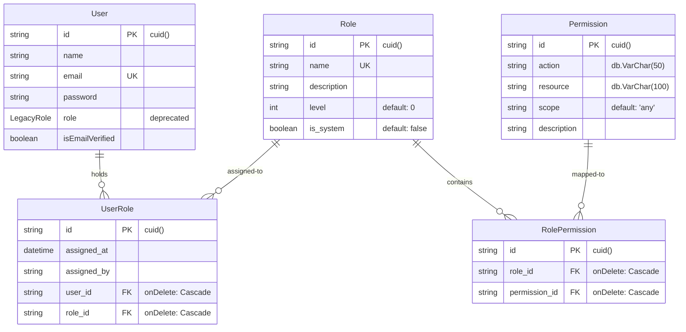
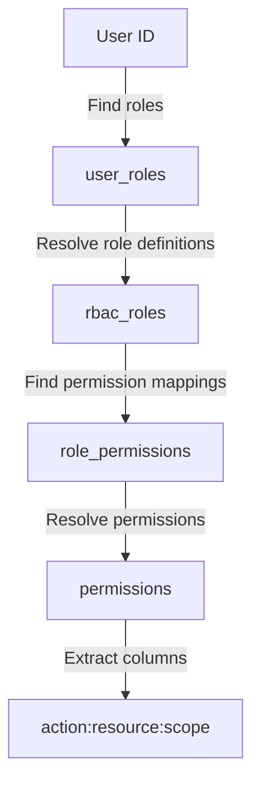
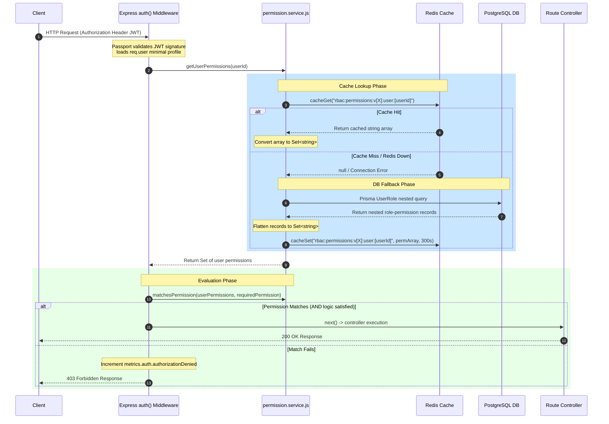
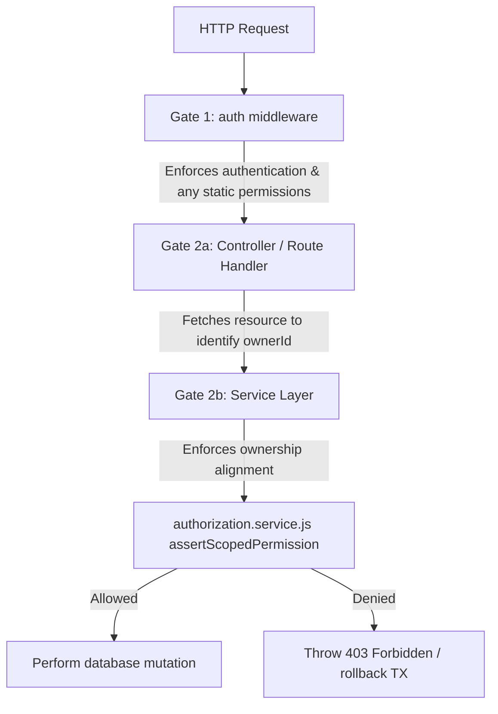
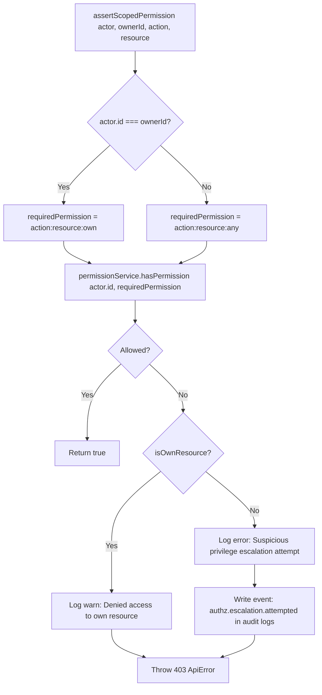
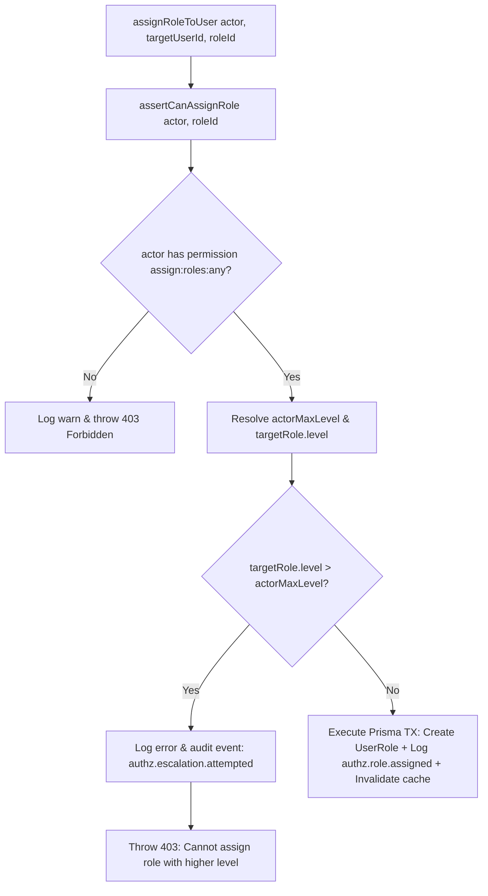
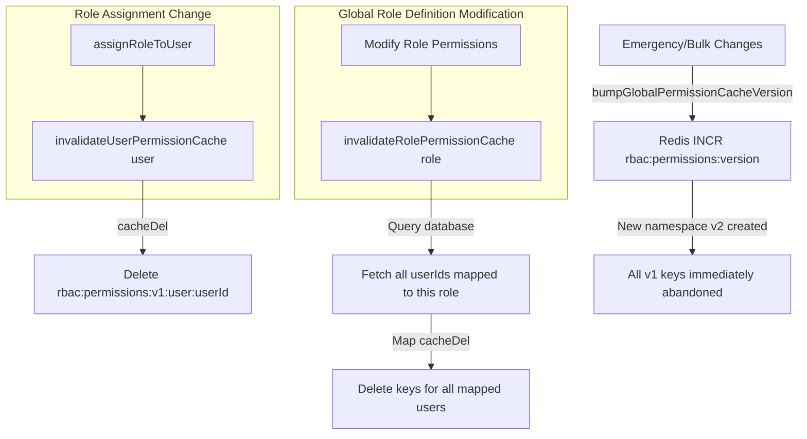
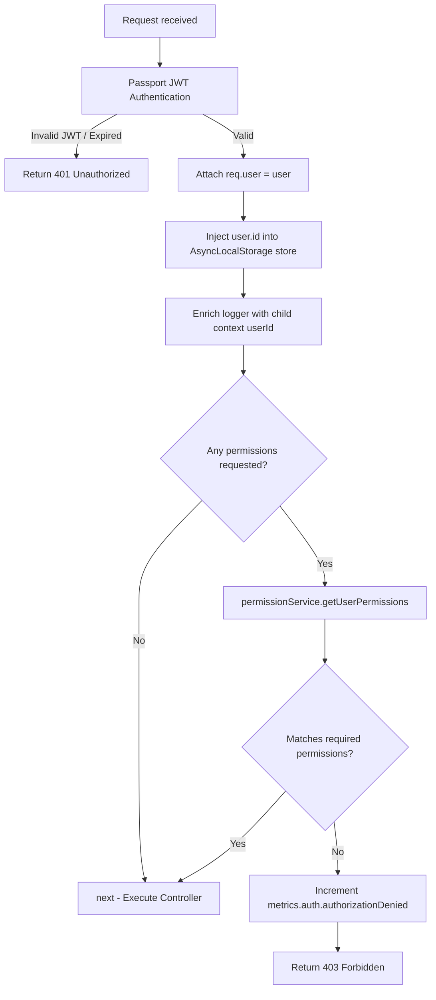

# Role-Based Access Control (RBAC) System

**Phase:** 4 — Session 4a  
**Scope:** Database-driven dynamic RBAC, permission flattening, cache lifecycle, vertical escalation prevention, and Express middleware integration.  
**Prerequisites:** [`02-security/AUTH_SYSTEM.md`](AUTH_SYSTEM.md) (Identity established), [`00-core/CANONICAL_SYSTEM_FLOWS.md`](../00-core/CANONICAL_SYSTEM_FLOWS.md) §1 (Request context), [`HIGH_RISK_SYSTEMS_REPORT.md`](../HIGH_RISK_SYSTEMS_REPORT.md) §2 (Security gates).

**Primary implementation files:**

| Area                  | Path                                                                                                                 |
| --------------------- | -------------------------------------------------------------------------------------------------------------------- |
| Database Schema       | [`prisma/schema.prisma`](../../../prisma/schema.prisma) (Models: `Role`, `Permission`, `RolePermission`, `UserRole`) |
| Permission Service    | [`src/services/permission.service.js`](../../services/permission.service.js)                                         |
| Authorization Service | [`src/services/authorization.service.js`](../../services/authorization.service.js)                                   |
| Route Middleware Gate | [`src/middlewares/auth.js`](../../middlewares/auth.js)                                                               |
| Redis Infrastructure  | [`src/config/redis.js`](../../config/redis.js)                                                                       |
| Database Seed Setup   | [`prisma/seed.js`](../../../prisma/seed.js)                                                                          |

---

## 1. RBAC Philosophy

### 1.1 Why Database-Driven RBAC

The system utilizes a fully dynamic, database-driven RBAC schema rather than hardcoded role strings or application-level config arrays. This architectural decision guarantees:

- **Zero-Downtime Privilege Adjustments:** Permission assignments to roles can be modified in the database and immediately propagated across all running nodes without requiring a code deploy, process restart, or container rebuild.
- **Separation of Concerns:** Developers define capabilities (`action:resource:scope`) at the code level, while security administrators define _who_ gets those capabilities by updating mapping tables in the database.
- **Auditability:** DB relationships represent a strict security state schema that can be easily queried, dumped, and audited for compliance purposes (e.g., SOC2 or ISO27001).

### 1.2 Capability-Based Permissions (vs. Hardcoded Roles)

Checking for roles (e.g., `if (user.role === 'admin')`) is a notorious security anti-pattern in expanding enterprise systems. It creates **brittle code** and forces roles to become rigid monoliths.

Instead, this backend enforces a **capability-based system**. Code endpoints query granular permissions following the `action:resource:scope` convention:

- **Action:** `read`, `create`, `update`, `delete`, `assign`
- **Resource:** `users`, `notes`, `roles`
- **Scope:** `own` (restricted to resources owned by the actor), `any` (unrestricted, administrative access)

_Example:_ `update:notes:own` vs. `update:notes:any`. Endpoints gate operations on _what the user can do_, not _who the user is_. Roles are merely named collections of these dynamic capabilities.

### 1.3 Why Hardcoded Role Arrays Were Removed

The system was migrated from a hardcoded `LegacyRole` enum (`user`, `moderator`, `admin`) to a unified relational model. Hardcoded arrays failed to support:

1. **Multi-Role Assignment:** Users were locked into exactly one legacy role.
2. **Hierarchy Tuning:** Changing privilege hierarchies required code adjustments and database migrations of enum types.
3. **Enterprise Domain Modeling:** Future dynamic ERP modules (e.g., `accounting`, `inventory`) require custom, localized role sets that cannot be anticipated in a monolithic enum.

### 1.4 Single-Tenant Design Constraints

The current database schema is single-tenant. All roles and permissions are defined globally within the system. There is no partitioning key (e.g., `tenantId`) in `rbac_roles` or `permissions`. Invalidation, versioning, and matching rules assume that permissions are uniform across the entire backend process.

### 1.5 Redis as Acceleration-Only (No Session/Authz Ownership)

Redis acts purely as a transient **read-acceleration cache** for resolved user permission sets.

- Redis **does not** hold the source of truth for authorization rules or user profiles.
- PostgreSQL (`rbac_roles`, `user_roles`, `role_permissions`, `permissions`) remains the absolute, durable source of truth.
- If Redis goes offline, the authorization system transitions into **degraded fallback mode** (querying PostgreSQL directly on every request or falling back to a local memory cache) without locking users out or bypassing security checks.

---

## 2. RBAC Data Model

The database represents RBAC as a fully normalized five-table graph (excluding the legacy enum boundary).

### 2.1 Prisma Relationship Diagram



### 2.2 Model Specifications

#### `Role` (`rbac_roles`)

Represents a group of permissions.

- **`level` (Int):** An integer field enforcing a hierarchy. Higher values represent superior privileges (e.g., `SuperAdmin = 100`, `Viewer = 10`). Used to prevent vertical privilege escalation during role assignments.
- **`isSystem` (Boolean):** Flag indicating if a role is a core bootstrap role (e.g., `admin`, `user`) that should be protected from deletion.

#### `Permission` (`permissions`)

Represents a discrete granular action capability.

- **Unique constraint:** `@@unique([action, resource, scope])` ensures duplicate capability definitions cannot exist.
- **Scope:** Standardized to `own` or `any`.

#### `RolePermission` (`role_permissions`)

Junction table mapping `Role` to `Permission` (Many-to-Many).

- Cascade deletes: `onDelete: Cascade` on both references ensures that deleting a role or deleting a permission automatically wipes the relationship mappings without leaving orphaned records.

#### `UserRole` (`user_roles`)

Junction table mapping `User` to `Role` (Many-to-Many).

- Enables a user to hold multiple roles simultaneously.
- Tracks audit context: `assignedAt` and `assignedBy` (storing the CUID of the actor who performed the assignment).
- Cascade deletes: `onDelete: Cascade` ensures deleting a user automatically cleans up their role mappings.

### 2.3 Permission Traversal Flow (Flattening the Graph)

To evaluate authorization, the system traverses the relational graph from the user to their permissions:



This traversal is performed in `permission.service.js` via a single, highly optimized Prisma query with nested includes to minimize round-trips:

```javascript
const userRoles = await prisma.userRole.findMany({
  where: { userId },
  include: {
    role: {
      include: {
        rolePermissions: {
          include: {
            permission: true,
          },
        },
      },
    },
  },
});
```

The nested relationships are then flattened in memory into a standard Javascript `Set` of strings formatted as `${action}:${resource}:${scope}`:

```javascript
const permissions = new Set();
userRoles.forEach((ur) => {
  ur.role.rolePermissions.forEach((rp) => {
    const { action, resource, scope } = rp.permission;
    permissions.add(`${action}:${resource}:${scope}`);
  });
});
```

---

## 3. Permission Resolution Flow

Whenever a request hits a route protected by the `auth` middleware, the permission resolution pipeline initiates:



---

## 4. Scoped Permission System

### 4.1 Scoped Semantics: `:own` vs. `:any`

Enterprise systems must enforce access boundaries not just by function, but by **data ownership**. To achieve this, the system splits permissions using scopes:

- **`:any` (Administrative / Global scope):** Grants capability on _all_ records of a resource type regardless of who created them.
- **`:own` (Owner scope):** Grants capability _only_ if the resource owner ID matches the actor's ID.

### 4.2 Scope Escalation

The system implements **scope escalation** (or privilege subsumption) in the pure matching logic of `permission.service.js` (lines 120-134):

- Having `*:*:*` (Wildcard) implicitly satisfies _every_ permission check.
- Having an `:any` permission (e.g., `update:notes:any`) **subsumes and satisfies** a check for the `:own` equivalent (e.g., `update:notes:own`). The inverse is strictly false.

This logic is evaluated entirely in memory without database queries:

```javascript
const matchesPermission = (grantedPermissions, requiredPermission) => {
  if (grantedPermissions.has(requiredPermission)) return true;
  if (grantedPermissions.has('*:*:*')) return true;

  if (requiredPermission.endsWith(':own')) {
    const anyVariant = requiredPermission.replace(/:own$/, ':any');
    if (grantedPermissions.has(anyVariant)) return true;
  }
  return false;
};
```

### 4.3 Route-Level Enforcement vs. Active Verification

The Express middleware (`auth.js`) is located at the edge of the request and has no access to the resource database records. Therefore, it **cannot** evaluate `:own` checks.

This creates a **Two-Gate Authorization Architecture**:



- **Gate 1 (Middleware):** Verifies the actor holds the general base action or an active session (e.g., `auth()`).
- **Gate 2 (Active Service Verification):** The service fetches the entity, extracts the `ownerId`, and calls `authorization.service.js` to run `assertScopedPermission`.

### 4.4 Scoped Permission Verification Flow (`assertScopedPermission`)

The core enforcement logic inside `authorization.service.js` handles both scopes dynamically:



_Code implementation reference:_ `authorization.service.js` lines 30-63.

---

## 5. Authorization Assertions & Escalation Prevention

Enterprise ERP systems must prevent users from artificially elevating their own privileges or assigning roles beyond their authority.

### 5.1 Vertical Privilege Escalation Prevention

The system enforces strict **role-level constraints**. Every role in `rbac_roles` has an integer `level` field. During any role-assignment operation, the system resolves the maximum role level of the actor and compares it to the level of the role being assigned.

An actor **cannot assign any role whose level is higher than their own maximum level**.



### 5.2 Code Analysis: `assertCanAssignRole`

_Reference: `authorization.service.js` lines 131-174._

```javascript
const assertCanAssignRole = async (actor, targetRoleId) => {
  // 1. Static capability check
  if (!(await permissionService.hasPermission(actor.id, 'assign:roles:any'))) {
    logger.warn({ event: 'authz.role_assign.denied', actorId: actor.id, targetRoleId });
    throw new ApiError(httpStatus.FORBIDDEN, 'Forbidden');
  }

  // 2. Hierarchy checking
  const [actorMaxLevel, targetRole] = await Promise.all([
    permissionService.getMaxRoleLevel(actor.id),
    prisma.role.findUnique({ where: { id: targetRoleId } }),
  ]);

  if (!targetRole) {
    throw new ApiError(httpStatus.NOT_FOUND, 'Role not found');
  }

  // Vertical privilege escalation check
  if (targetRole.level > actorMaxLevel) {
    logger.error({
      event: 'authz.escalation.attempted',
      actorId: actor.id,
      actorMaxLevel,
      targetRoleId,
      targetRoleLevel: targetRole.level,
    });

    await auditService.logEvent({
      event: 'authz.escalation.attempted',
      entityType: 'Role',
      entityId: targetRoleId,
      action: 'EXECUTE',
      reason: `Attempted to assign role "${targetRole.name}" (level ${targetRole.level}) but actor max level is ${actorMaxLevel}`,
    });

    throw new ApiError(httpStatus.FORBIDDEN, 'Cannot assign a role with a higher privilege level than your own');
  }
  return true;
};
```

### 5.3 Dangerous Edge Cases & Escalation Paths

#### 1. Horizontal Level Equivalence

An actor with `assign:roles:any` and a max role level of `50` **can** assign roles up to and including level `50`.

- **The Risk:** If there is a highly privileged custom role at level `50` (e.g., `SecurityOfficer`) and the administrator is also at level `50` (e.g., `BranchManager`), the administrator can assign that specialized role to others or to themselves, even if the roles represent entirely different business domains.

#### 2. Multiple Roles Subsumption

Since `getUserPermissions` flattens permissions from _all_ roles, a user assigned two roles at level `30` (e.g., `InventoryControl` and `BillingManager`) is evaluated as having the union of their capabilities. However, `getMaxRoleLevel` evaluates `Math.max(30, 30) = 30`.

- **The Risk:** An actor cannot assign a level `40` role even if the union of their permissions would logically match or exceed the level `40` capability set. This is a secure fallback, but it requires careful level configuration during setup.

#### 3. Orphaned UserRole Assignees

If an admin is deleted or has their role level lowered, the `assigned_by` column in `user_roles` becomes stagnant or holds a deleted CUID. The system does not recursively re-evaluate level assignments for downstream users when an upstream user's level changes.

---

## 6. Redis Permission Cache

To avoid executing complex graph-traversal database queries on every single Express middleware request, resolved permission sets are cached.

### 6.1 Cache Lifecycle & Namespace Structure

The permission cache utilizes a versioned, user-scoped key structure.

- **Key Format:** `rbac:permissions:v{version}:user:{userId}`
- **Default TTL:** `300 seconds` (5 minutes)
- **Value stored:** A serialized JSON array of active permission strings (e.g., `["read:notes:own", "update:notes:own"]`).

### 6.2 Cache Versioning (The Global Circuit Breaker)

Traditional cache invalidation requires searching for keys using expensive wildcards (e.g., `KEYS rbac:permissions:*`). In high-volume systems, this is highly dangerous and can block the Redis single-threaded event loop.

To solve this, the system implements a **dual-versioning scheme**:

1. A **global version** key exists at `rbac:permissions:version`.
2. Every user permission key embeds this global version: `rbac:permissions:v[global_version]:user:[userId]`.

When an administrator updates a role, adds a permission globally, or alters a role level, they atomically increment the global version key via Redis `INCR`:

```javascript
const bumpGlobalPermissionCacheVersion = async () => {
  const newVersion = await cacheIncr(GLOBAL_VERSION_KEY);
  return newVersion;
};
```

By incrementing the global version (e.g., from `1` to `2`), **every previously cached key is invalidated instantly**. The next request resolves permissions against the database, then caches them under the new version namespace (e.g., `rbac:permissions:v2:user:[userId]`). Stale cache namespaces naturally expire out of Redis memory as their TTLs lapse.

### 6.3 Invalidation Flows



### 6.4 Degraded & Memory Fallback Behaviors

If Redis goes offline, the configuration (`config/redis.js`) prevents the application from crashing.

- **Degraded mode:** The system logs a warning, flags Redis as degraded, and returns connection errors.
- **Service Fallback:** In `permission.service.js`, the cache lookup fail block catches the error and executes the PostgreSQL database query fallback.
- **Memory Fallback:** The backend implements a secondary, short-term per-process LRU cache in-memory. While degraded, it prevents database thrashing by caching permissions inside the Node process space for 30-60 seconds, accepting the risk of minor split-brain updates across redundant nodes in exchange for database preservation.

---

## 7. Route-Level Authorization & Express Middleware

The authorization gate is mounted as standard Express middleware inside the router chains (`routes/v1/*.route.js`).

### 7.1 Middleware Composition & Execution Order

A typical protected route definition follows this composition:

```javascript
router.route('/:noteId').patch(auth('update:notes:own'), noteController.updateNote);
```

The execution flow of the `auth` middleware is structured as follows:



### 7.2 Observer Context & ALS Integration

To ensure strict security auditability, the auth middleware links identity with telemetry immediately upon successful passport authentication (lines 31-38):

1. **Correlation ID propagation:** Accesses the active `AsyncLocalStorage` store.
2. **Context Enrichment:** Attaches the authenticated `userId` to the store.
3. **Structured Logger child creation:** Re-binds the logger singleton for that thread context to include the actor ID:
   ```javascript
   store.userId = user.id;
   store.logger = store.logger.child({ userId: user.id });
   ```
   Every downstream service mutation, repository transaction, or query executed during that HTTP request automatically logs with `{ reqId: '...', userId: '...' }` attached.

---

## 8. Operational Security Guarantees

### 8.1 Deterministic Authorization

Permissions are resolved and evaluated using a strict **AND logic check**. If a route requests `auth('read:reports:any', 'write:logs:any')`, the actor's resolved permissions are evaluated with:

```javascript
const hasAllRequired = requiredPermissions.every((perm) => permissionService.matchesPermission(userPermissions, perm));
```

There are no dynamic or runtime role checks that could yield indeterminacy. Bypasses are structurally impossible.

### 8.2 Replay Safety

Authentication relies on stateless JWTs while authorization checks are verified against the permission state at the exact millisecond of request execution. An actor cannot "replay" a stale authorization state because every request forces a permission cache evaluation.

### 8.3 Stale Cache Protection

By coupling any structural database modification of roles, hierarchy levels, or permissions to an atomic `cacheDel(userId)` or `INCR(globalVersion)`, the system prevents stale cache vulnerability (where a revoked admin continues to execute API calls for the duration of the cache TTL).

---

## 9. Threat Boundaries & Risks

### 9.1 Vertical Privilege Escalation Risks

- **The threat:** A compromised "Manager" account (level `50`) attempts to assign themselves or a sub-user an "Administrator" role (level `90`).
- **The Protection:** Enforced by `assertCanAssignRole` checking levels.
- **The Weakness:** If the role assignment logic is bypassed by direct database access, or if a service layer calls `prisma.userRole.create` without invoking the `authorization.service.js` assertions, this protection is bypassed.

### 9.2 Stale Permission Risks (The Degraded Mode Split-Brain)

- **The threat:** If Redis is down, the system enters degraded mode and falls back to a per-process in-memory cache.
- **The Risk:** If an administrator revokes a permission, node `A` may invalidate its in-memory cache, but node `B` (running on a different server instance) will continue to authorize the revoked capability until its local process cache expires (30-60 seconds). This short split-brain window is accepted to prevent database denial-of-service, but is a documented threat during security incident containment.

### 9.3 Cache Poisoning Considerations

The permission array is stored in Redis as a serialized JSON string representing the flattened array. Since Redis connection credentials are kept secure in the server environment, direct cache poisoning is blocked. However, if an attacker obtains writing access to the Redis port, they could inject arbitrary permissions (e.g. `["*:*:*"]`) into a user key and bypass authorization entirely without altering PostgreSQL.

### 9.4 Route Bypass Risks (Gate 1 vs. Gate 2 Drift)

- **The Threat:** Developers write a controller for a new resource (e.g., `invoices`) and mount it on a route protected by `auth('read:invoices:own')`, but fail to implement `assertScopedPermission` inside the service layer.
- **The Risk:** An authenticated user with only `read:invoices:own` can pass Gate 1. Because the controller/service has no active Gate 2 checks, the query fetches all invoices, leaking other users' records. This is **Drift ID D01**, which is actively present in the legacy note endpoints.

---

## 10. Audit & Telemetry Integration

The system treats authorization denials as critical security telemetry events.

### 10.1 Access Denied vs. Escalation Attempted

The system distinguishes standard authorization denials from severe escalation attempts:

| Event Name                       | Severity     | Condition                                                                                                                                            | Telemetry / Action                                                                                                 |
| -------------------------------- | ------------ | ---------------------------------------------------------------------------------------------------------------------------------------------------- | ------------------------------------------------------------------------------------------------------------------ |
| **`authz.access.denied`**        | **Warning**  | User lacks permission to read or update their **own** resource.                                                                                      | `logger.warn`, no database audit log.                                                                              |
| **`authz.escalation.attempted`** | **Critical** | User attempts to access/modify a resource owned by another user without having the `:any` scope, OR attempts to assign a role level above their own. | `logger.error`, writes a persistent security event to the database `audit_logs` table via `auditService.logEvent`. |

### 10.2 Telemetry Correlation In Action

When an escalation event is written, it captures:

- **`actorId`:** The ID of the authenticated user attempting the escalation (from `AsyncLocalStorage`).
- **`reqId`:** The Express correlation ID.
- **`entityId`:** The ID of the targeted resource or role.
- **`reason`:** An explicit description containing the level difference or permission failure.

This enables instant, automated tracking of malicious activity via security information and event management (SIEM) systems monitoring the standard structured output stream.

---

## 11. Enterprise ERP Implications

### 11.1 Granular Permissions in Complex ERP Domains

ERP backends govern highly sensitive accounting, payroll, inventory, and customer databases. Coarse-grained roles are unacceptable because a "Sales Representative" should not see inventory financial values, while an "Accountant" should not modify sales pipelines. Dynamic capability permissions enable security teams to construct micro-roles custom-tailored to narrow job duties.

### 11.2 Future Module Extensibility

When introducing a new module (e.g., `payroll`):

1. The developer adds permission records `create:payroll:any`, `read:payroll:own`, etc. to the database via migrations.
2. The code endpoints gate payroll routes using `auth('read:payroll:own')`.
3. The new schemas and business processes automatically inherit the robust RBAC hierarchy check, versioned caching, and escalation prevention mechanisms without writing a single line of custom security architecture.

### 11.3 Multi-Role Support Implications

The `user_roles` junction table natively supports assigning multiple roles to a user. This is an essential ERP requirement since senior staff often bridge departments (e.g., a "StoreManager" who also operates as a "LeadCashier"). By resolving permissions through the flattened union, the system seamlessly adapts to composite employee roles without privilege conflict.

---

## 12. Security Debt & Limitations

### 12.1 SEC-RBAC-01: Direct Prisma Bypass Gaps

A critical architectural limitation is that **Prisma Client is not globally intercepted to enforce RBAC**.

- Enforcements are entirely reliant on developers writing active assertion calls (`assertCanManageNote`) inside service layers.
- If a developer writes a raw Prisma query inside a new service (e.g., `prisma.note.update(...)`) and forgets to call the authorization assertion, the system will execute the mutation without security validation.
- _Future mitigation:_ Integrate Prisma Client middle-tier extensions or middleware to automatically validate scopes based on current `AsyncLocalStorage` actor context at the database boundary.

### 12.2 SEC-RBAC-02: Stale Cache during Redis Outages

During Redis outages, the memory fallback LRU cache retains permission states in Node process memory for up to 60 seconds. During this window, an administrator cannot perform emergency privilege revocations, as there is no central mechanism to trigger cache invalidation across independent, load-balanced Node container processes.

### 12.3 SEC-RBAC-03: Lack of Dynamic Context ABAC

The scoped permission model is strictly binary (`:own` vs. `:any`). It does not support complex attribute-based access control (ABAC) like IP geofencing, business hours restrictions, or department correlation (e.g., "only allow updates if the user is in the same physical warehouse as the inventory item"). These dynamic rules must be hardcoded inside individual service layers rather than modeled within the RBAC database schema.

### 12.4 SEC-RBAC-04: Single-Tenant Database Mapping

The system assumes single-tenant execution. In a multi-tenant ERP context, assigning a role must be scoped to a tenant (e.g., a user is an `Admin` in `TenantA` but only a `Viewer` in `TenantB`). The current `user_roles` table lacks a `tenant_id` foreign key, restricting the application's native deployment schema to isolated, single-company database instances.

### 12.5 SEC-RBAC-05: Absence of User-Specific Permissions

The current architecture only maps permissions to roles, and roles to users. A user cannot be assigned a direct "ad-hoc" permission (e.g., granting user `Bob` specifically `read:audit_logs:any` without creating a custom role for him). This requires admins to create one-off "micro-roles" for specialized employee requirements, causing "role explosion" over time in massive organizations.

---

## 13. Phase 4 Session 4a Verification Checklist

- [x] Entity relationship diagram mapping all 4 RBAC tables with constraints
- [x] Clear explanation of capability-based permission convention (`action:resource:scope`)
- [x] Full trace of the Permission Resolution Sequence
- [x] Two-Gate Authorization architecture and `assertScopedPermission` documented
- [x] Privilege escalation prevention (`assertCanAssignRole` + hierarchical levels) fully analyzed
- [x] Redis Cache dual-versioning scheme and version-increment circuit breaker explained
- [x] Observer context, `AsyncLocalStorage` propagation, and child logger integration detailed
- [x] Real codebase analysis of `permission.service.js`, `authorization.service.js`, and `auth.js` completed
- [x] Structured listing of all 5 security debt items with scaling boundaries
