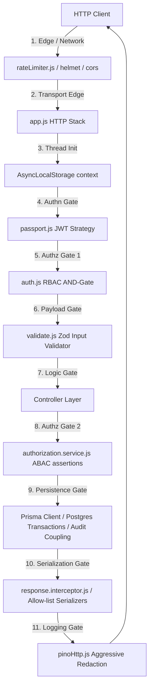
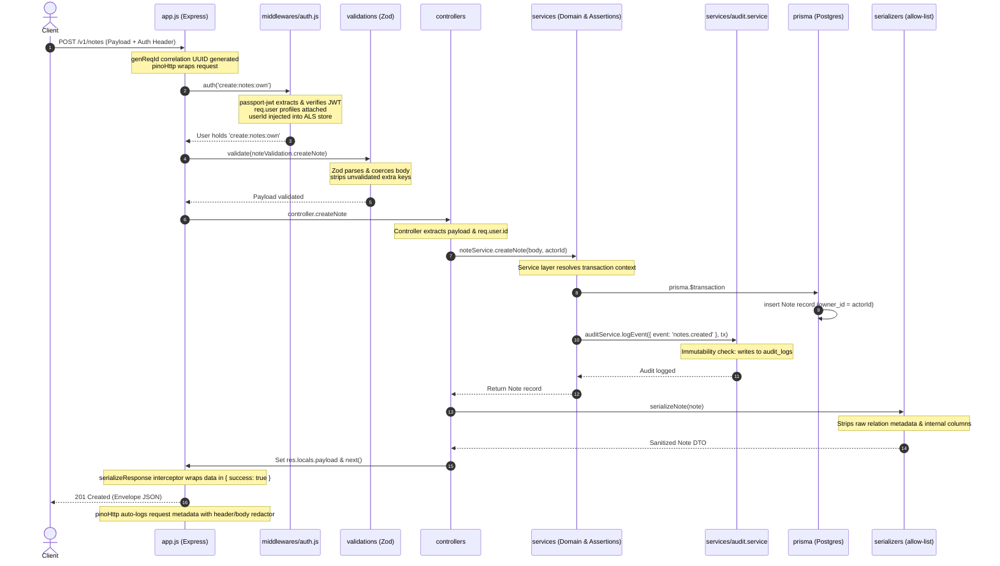
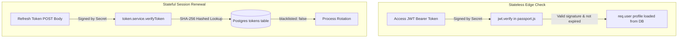
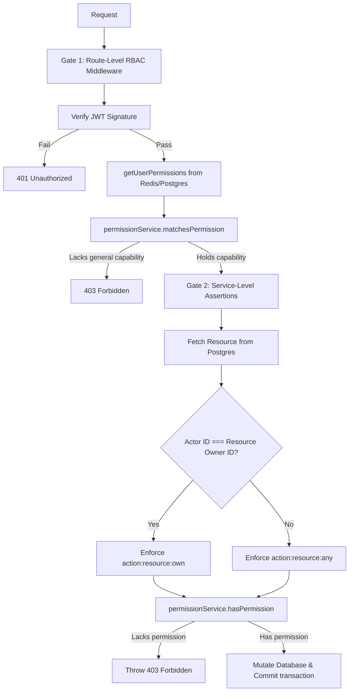
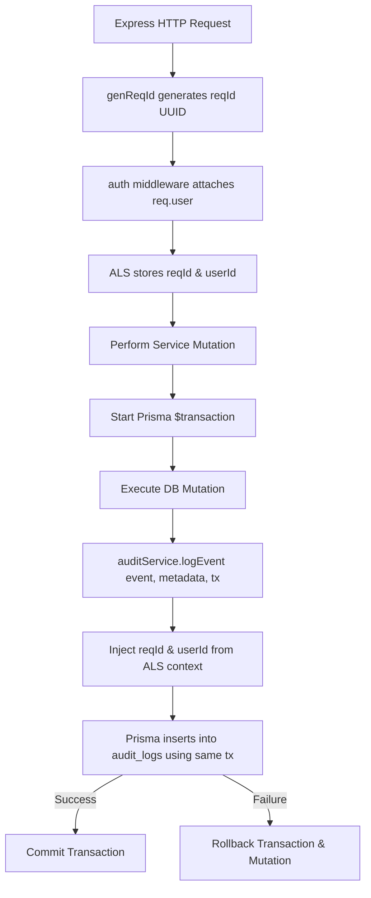
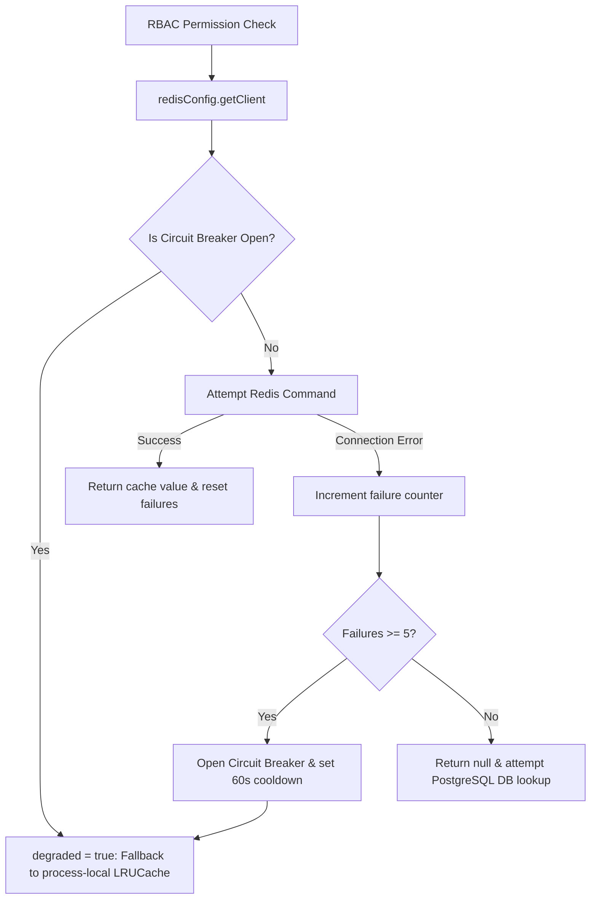

# Security Model & Threat Boundaries

**Phase:** 4 — Session 4b  
**Scope:** Layered security model, trust boundaries, data serialization policies, audit security, logging boundaries, Redis circuit-breakers, cron/worker security, and operational threat mitigation.  
**Prerequisites:** [`02-security/AUTH_SYSTEM.md`](AUTH_SYSTEM.md) (Authentication), [`02-security/RBAC_SYSTEM.md`](RBAC_SYSTEM.md) (Authorization Gates), [`00-core/CANONICAL_SYSTEM_FLOWS.md`](../00-core/CANONICAL_SYSTEM_FLOWS.md) §1 (Lifecycle).

---

## 1. Security Philosophy

The system's security architecture is built on six core design principles:

### 1. Layered Security Architecture

Security is enforced at every boundary rather than relying on a single, monolithic outer gate. If an attacker bypasses network rate limiters, they are blocked by JWT authentication. If they forge a signature, they are blocked by RBAC gates. If they obtain an administrative session, they are blocked by active service assertions and vertical hierarchy checks.

### 2. Fail-Closed Philosophy

Every control default is locked.

- A route with no explicit `auth()` middleware is **unreachable** or defaults to authenticated if registered globally.
- A user with no assigned roles has **zero permissions** (the flattened set is empty).
- Any exception thrown during validation, authentication, authorization, caching, or transaction logging forces an immediate request abort and transaction rollback, returning a `500 Internal Server Error` or `403 Forbidden` to the client.

### 3. Defense-in-Depth Approach

No single system is trusted blindly. The database filters sensitive fields (`omit: { password }`), response serializers enforce explicit whitelists (`serializeUser`), and logging libraries aggressively redact memory streams (`pinoHttp` redactions). If a developer introduces a bug in one layer (e.g., leaking a field in a query), the subsequent serialization and logging layers prevent exposure.

### 4. Deterministic Authorization

Authorization results are binary and absolute. Privilege logic operates on pure, in-memory `Set` matching and deterministic, stateless JWT claims. Dynamic environment variables or mutable parameters cannot bypass route guards.

### 5. Auditability-First Design

Every state mutation inside the application core must execute within a unified Prisma transaction coupled to an immutable audit record. Compliance and logging correlation are treated as functional dependencies of business execution; if the audit logging service fails, the parent mutation rolls back.

### 6. Operational Resilience (Graceful Degradation)

Security controls must withstand infrastructure outages. If Redis crashes, the backend transitions to degraded fallback mode (using process-local memory caches and PostgreSQL queries) to ensure continuity without bypassing authorization checks or degrading system security.

---

## 2. Layered Security Model & Request Pipeline

### 2.1 Layered Security Model Diagram



### 2.2 Request Security Pipeline



---

## 3. Authentication Security

Identity verification is implemented via a **Hybrid Stateful/Stateless Model**:



### 3.1 Token Lifecycle Rules

- **Access Tokens:** Generated with short time-to-live (`JWT_ACCESS_EXPIRATION_MINUTES = 30`). They are **stateless** and never queried against the database during standard requests, protecting database throughput.
- **Refresh Tokens:** Generated with long time-to-live (`JWT_REFRESH_EXPIRATION_DAYS = 30`). They are **stateful** and represented as relational entities in PostgreSQL.

### 3.2 Token Family Rotation & Compromise Containment

The system enforces **Token Family Rotation** to block token theft:

1. When a user authenticates (login), a new session family is initiated with a random UUID: `familyId = crypto.randomUUID()`.
2. Every refresh request rotates the token: the old token is marked `blacklisted: true`, and a new, active token is issued sharing the same `familyId`.
3. **Replay Threat Mitigation (Replay Attack):** If an attacker steals a refresh token and attempts to replay it, the token will be flagged as `blacklisted: true` in the DB. The service identifies the reuse violation, executes a mass-revocation of the entire `familyId` (wiping all active sessions for that device), logs `auth.refresh.reuse_detected`, and rejects the call with `401 Unauthorized`.
4. _Observed Code Limitation (SEC-AUTH-01):_ In `token.service.js`, `verifyToken` searches only for rows with `blacklisted: false`. As a result, a blacklisted refresh token causes a generic query failure in `verifyToken` rather than triggering the active reuse-revocation branch in `auth.service.js`. This is a critical security debt item.

### 3.3 Hashing-at-Rest

Refresh, email-verification, and password-reset tokens are **never stored in plaintext** in the database.

- Plains are signed JWTs returned to the client.
- Before database insertion, the string is hashed via **SHA-256**:
  ```javascript
  const hashedToken = crypto.createHash('sha256').update(plaintextToken).digest('hex');
  ```
  If the database `tokens` table is leaked, an attacker cannot construct valid signed JWTs.

### 3.4 Logout Guarantees

Logout deletes the active refresh token row immediately (`tokenRepository.deleteById`). This guarantees that a stolen refresh token is instantly invalidated. (Access tokens remain valid globally until their stateless expiration time).

---

## 4. Authorization Security & Scoped Assertions

Authorization leverages a strict dual-gate framework to prevent vertical and horizontal privilege escalations.

### 4.1 Auth + RBAC Interaction Flow



### 4.2 Why Service-Layer Assertions Are Mandatory

Because route middleware runs _before_ controllers, it has no access to the resource records (e.g., it doesn't know who owns the note with `id = 123` until a database query runs).

- **The Risk:** Gating solely at the route level with a generic check (e.g., "is authenticated") permits a user to submit a `PATCH` request targeting another user's note.
- **The Solution:** The service layer acts as **Gate 2**, retrieving the record, identifying the `ownerId`, and calling `assertScopedPermission(actor, ownerId, action, resource)`. This guarantees that standard users are strictly bound to `:own` scope privileges, while administrators with `:any` can mutate resources across the entire domain.

---

## 5. DTO, Input Validation & Serialization Security

Accidental information exposure (e.g., leaking user passwords in query results) and parameter injection are blocked at both ingress and egress boundaries.

### 5.1 DTO Ingress/Egress Boundaries

```
INCOMING PAYLOAD                                    OUTGOING RESPONSE
 [ Client HTTP Request ]                             [ Client JSON Response ]
           │                                                    ▲
           ▼                                                    │
┌──────────────────────┐                             ┌──────────────────────┐
│  validate.js (Zod)   │                             │ response.interceptor │
├──────────────────────┤                             ├──────────────────────┤
│ Strict body parsing  │                             │ Success envelope wrapper
│ Strips unregistered  │                             │ { success: true }    │
│ fields dynamically   │                             └──────────────────────┘
└──────────────────────┘                                        ▲
           │                                                    │
           ▼                                         ┌──────────────────────┐
┌──────────────────────┐                             │ Allow-list Serializer│
│  Controller / Service│                             ├──────────────────────┤
├──────────────────────┤                             │ serializeUser/Note   │
│ Core domain logic    │                             │ Explicit whitelists  │
│ Mutates database     │                             │ Strips passwords     │
└──────────────────────┘                             └──────────────────────┘
           │                                                    ▲
           ▼                                                    │
┌──────────────────────┐                             ┌──────────────────────┐
│  PostgreSQL (DB)     │ ── prisma.js omit layer ──> │ prisma.$executeRaw   │
└──────────────────────┘                             └──────────────────────┘
```

### 5.2 Egress: Allow-List Serializers & Prisma Omissions

The backend uses **allow-list serializers** (`src/serializers/`) to sanitize data at the edge of response generation:

- User objects (`user.serializer.js`) explicitly whitelist only `id`, `email`, `name`, `isEmailVerified`, `createdAt`, and `updatedAt`.
- Note objects (`note.serializer.js`) explicitly whitelist only `id`, `title`, `content`, `archived`, `tags`, `ownerId`, `createdAt`, and `updatedAt`.
- `password` and relation records (which might contain sensitive metadata) are **never mapped** to the outgoing DTO.
- As a defense-in-depth measure, Prisma client is globally configured (`config/prisma.js`) to omit the `password` field on all standard query returns:
  ```javascript
  prisma = new PrismaClient({ omit: { user: { password: true } } });
  ```

### 5.3 Ingress: Zod Validation Separation

Input validation uses **Zod schemas** (`src/validations/`) mounted on the `validate` middleware:

- Validation enforces data types, lengths, email formatting, and payload structures.
- Zod validation operates **strictly on payload shapes** and does not make database calls or perform authentication. This separation ensures validation remains extremely fast and is executed before any business logic is loaded.

---

## 6. Audit & Telemetry Security

Every transaction altering business state is securely tied to an immutable audit record to meet strict compliance metrics (SOC2, ISO27001).

### 6.1 Audit-Security Correlation Flow



### 6.2 Audit Immutability & Coupling

- **Transaction Coupling:** The database write for the business event (e.g., `updateNoteById`) and the audit log insertion (`auditService.logEvent`) are executed within the **same database transaction** (`prisma.$transaction`). If either operation fails (e.g., DB constraint violation or audit persistence failure), the transaction rolls back. No mutation can occur without leaving a record.
- **Context Preservation:** The `reqId` (correlation UUID) and `userId` are retrieved dynamically from `AsyncLocalStorage` and stored as core columns in the `audit_logs` table, allowing administrators to correlate any database change back to a specific HTTP request and actor.

---

## 7. Logging & Observability Security

Logs are critical for debugging but present a massive risk for credential leaks (e.g., log injection or compliance violations).

### 7.1 structured Logging & Redaction

The system uses **Pino structured logging** (`config/logger.js` and `config/pinoHttp.js`).

- **Header Redaction:** `pinoHttp` serializers clone incoming request headers and explicitly redact `Authorization` and `Cookie` values:
  ```javascript
  if (serialized.headers.authorization) serialized.headers.authorization = '[REDACTED]';
  ```
- **Payload Redaction:** The global logger configuration defines strict paths to filter passwords, reset tokens, and refresh tokens from body logs:
  ```javascript
  redact: {
    paths: ['req.headers.authorization', 'body.password', 'body.refreshToken', '*.password'],
    censor: '[REDACTED]'
  }
  ```

### 7.2 Observer Telemetry & Telemetry Boundaries

The system tracks security events via standard output metrics.

- When an authorization check fails, the middleware increments the `metrics.auth.authorizationDenied` counter.
- Suspicious horizontal escalations trigger structured logs labeled `authz.escalation.attempted` with the actor's context dynamically extracted from `AsyncLocalStorage`, feeding SIEM detection pools instantly.

---

## 8. Redis Trust Boundaries & Degraded-Mode Security

Redis is classified as **untrusted infrastructure** within the system security landscape.

### 8.1 Redis Trust Boundary & Degraded State Flow



### 8.2 Circuit Breaker and LRU Fallback

- **Isolation:** Redis connection failures are captured by a lightweight **circuit breaker** singleton in `src/config/redis.js` (lines 10-16).
- **Maximum Failures:** If Redis commands fail 5 times consecutively, the breaker opens, flagging the configuration as degraded (`isDegraded() === true`) and setting a 60-second cooldown timer.
- **Process-Local Memory Fallback:** While the breaker is open, all cache operations bypass Redis and use a local `LRUCache` instance (`memoryCache` with a maximum limit of 1000 items and a 5-minute default TTL). This prevents database thundering herds.
- **Dual-Write Safety:** Invalidation commands (`cacheDel`) are written to **both** the Redis client (if online) and the local memory cache dynamically, guaranteeing that invalidations are propagated instantly to the local runtime process even during partial connection drops.

---

## 9. Worker & Cron Security

Background worker operations are secured against concurrent execution hazards and termination corruption.

### 9.1 Singleton Locks via Redis `SETNX`

The expired token cleanup task (`workers/tokenCleanup.worker.js`) executes on a daily cron schedule (`0 3 * * *` UTC).

- To prevent duplicate cleanups in load-balanced container clusters, the worker attempts to acquire a distributed lock in Redis:
  ```
  worker:lock:tokenCleanup
  ```
- If Redis is offline, the worker enters fallback mode: it executes the cleanup without the lock. Because `deleteExpiredTokens()` is fully idempotent, concurrent runs represent a redundant resource utilization rather than a security bypass or data corruption risk.

### 9.2 Graceful Shutdown Bounds

During SIGTERM/SIGINT shutdown signals (`index.js`), the process initiates a strict teardown sequence:

1. Stop the HTTP server to refuse new connections.
2. Stop the active cron worker schedules (`tokenCleanupTask.stop()`).
3. Await all running worker executions tracked in the `global.activeWorkers` collection (up to a strict 5-second grace period) to prevent half-mutated transaction states.
4. Disconnect the Redis client.
5. Disconnect the Prisma database client.

---

## 10. Operational Threat Boundaries & Risks

The following boundaries represent active security tradeoffs and risks in the current system deployment:

### 10.1 Privilege Escalation

- **Mechanism:** Bypassed if roles are mapped directly in the database without going through `assignRoleToUser` level checking assertions.
- **Implication:** Developers must not write direct database updates bypassing the `authorizationService` constraints.

### 10.2 Stale Cache Risk during Outages (The Split-Brain Threat)

If Redis goes offline, different load-balanced Node nodes fall back to process-local LRU caches.

- **The Vulnerability:** If a permission is updated, node `A` will update its local cache immediately on write, but node `B` will continue to validate requests using its old, stale process-local memory cache for up to 5 minutes (the memory cache TTL). This window is accepted as operational debt.

### 10.3 Replay Attack Window

Access tokens are stateless and lack an invalidation list (blacklist).

- **The Vulnerability:** If an attacker steals an active access token, they can replay requests using it until the token natural expiration (up to 30 minutes). Revocation is only possible early by rotating the global `JWT_SECRET` key, which invalidates _all_ active user sessions.

### 10.4 Note Ownership Bypass (Drift D01)

- **The Vulnerability:** Legacy note controllers (`note.controller.js`) enforce ownership via hardcoded equality checks (`note.ownerId !== req.user.id`) rather than calling `authorizationService.assertCanManageNote`.
- **The Implication:** This creates a strict security bypass where administrators holding the `read:notes:any` or `update:notes:any` permissions **cannot access other users' notes** because the controller hardcode intercepts the call first and returns a `404 Not Found`.

---

## 11. Security Debt Register

The system operates with the following documented security debt:

| Debt ID         | Priority   | Vulnerability / Limitation                                                                                                                  | Operational Caveat                                                                                                                 |
| --------------- | ---------- | ------------------------------------------------------------------------------------------------------------------------------------------- | ---------------------------------------------------------------------------------------------------------------------------------- |
| **SEC-AUTH-01** | **High**   | Token replay branch unreachable in `auth.service.js` because `token.service.verifyToken` only retrieves records where `blacklisted: false`. | Attackers replaying rotated refresh tokens get a generic `401 Please authenticate` instead of triggering token family revocations. |
| **SEC-AUTH-02** | **Medium** | `lastUsedAt` column exists in the `Token` Prisma schema but is never updated by any service.                                                | Stagnant sessions cannot be analyzed for dormancy or session-hygiene auditing.                                                     |
| **SEC-RBAC-01** | **High**   | Prisma Client lacks global middleware or interceptors to enforce RBAC. Enforcements depend entirely on manual service-layer checks.         | If a developer misses calling `assertScopedPermission` in a new service, authorization is bypassed entirely.                       |
| **SEC-RBAC-02** | **Medium** | Process-local LRU caches have split-brain windows during Redis connection degradation.                                                      | Stale privileges remain active on fallback nodes for up to 5 minutes during outages.                                               |
| **SEC-RBAC-03** | **Low**    | Absence of dynamic contextual attribute-based access control (ABAC).                                                                        | Rules like business-hour locks or IP geofencing must be hardcoded in services.                                                     |
| **SEC-RBAC-04** | **High**   | Single-tenant database mapping constraints (`user_roles` lacks a `tenantId`).                                                               | The backend cannot support safe multi-company tenant isolation without structural table re-engineering.                            |
| **SEC-RBAC-05** | **Low**    | Ad-hoc user-specific permissions are not supported.                                                                                         | Grants require creating a unique dynamic micro-role for the user, risking "role explosion."                                        |

---

## 12. Enterprise ERP Implications

### 12.1 ERP Privilege Sensitivity

ERP systems represent the core financial, employee, and structural operations of a business. Coarse privileges (e.g., simple `is_admin` flags) are highly dangerous. The granular capability architecture ensures that financial managers, billing cashiers, and inventory clerks are rigidly bound to specific domains, ensuring safe separation of duty compliance.

### 12.2 Multi-Tenant Isolation

For a future multi-company SaaS deployment, the dynamic RBAC schema must be expanded. Assigning roles must be bound to a tenant entity, preventing a user who is an "Administrator" in `TenantA` from executing administrative operations if they switch context to `TenantB`.

### 12.3 Approval Workflows & Separation of Duty

High-value ERP transactions (e.g., executing a bank payment or deleting an employee profile) require multi-stage approval workflows (e.g., "Maker-Checker" controls). The dynamic capability-based RBAC model simplifies this: one role holds `create:payments:own` (Maker), while another holds `approve:payments:any` (Checker). The service assertions easily validate that the payor and the checker are distinct CUIDs, preventing internal collusion fraud.
