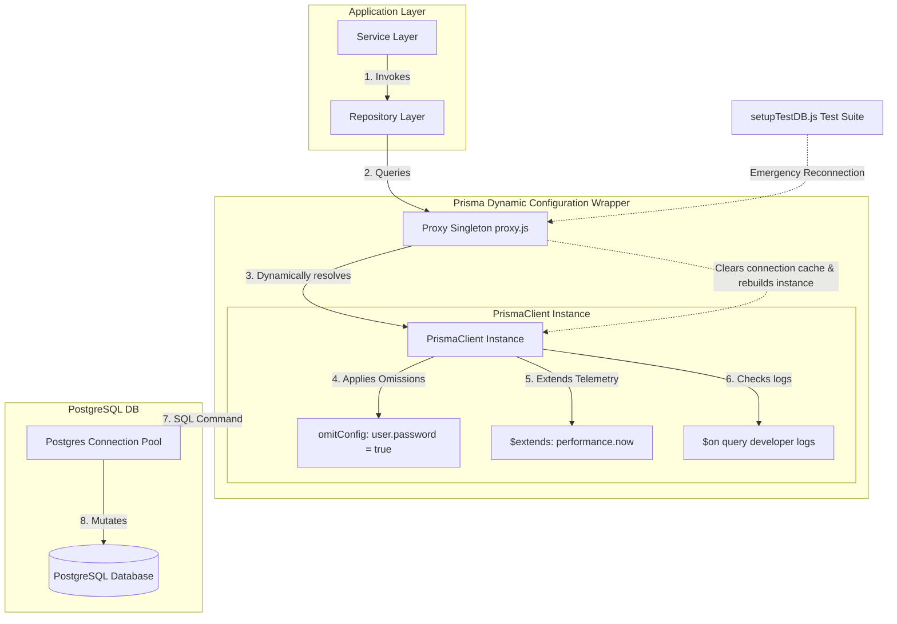
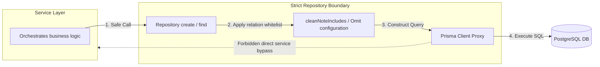
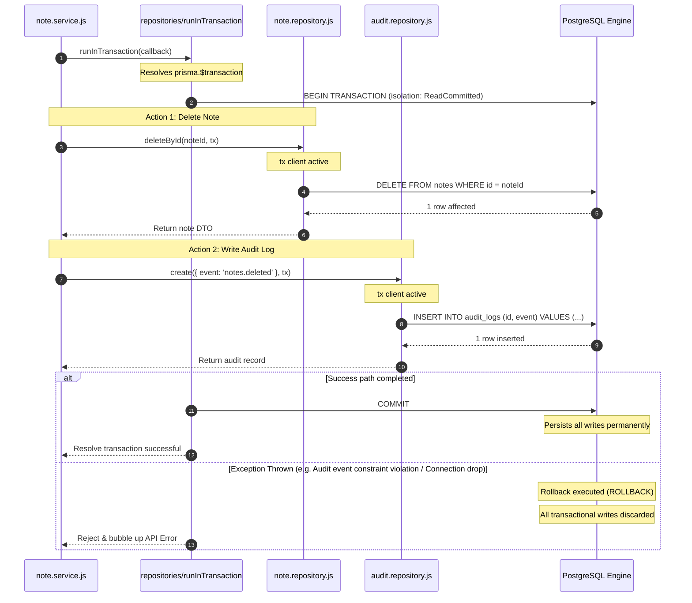
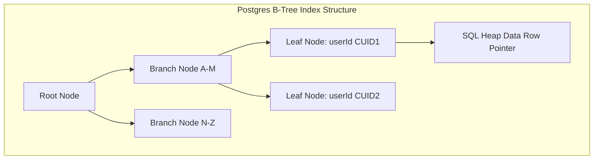
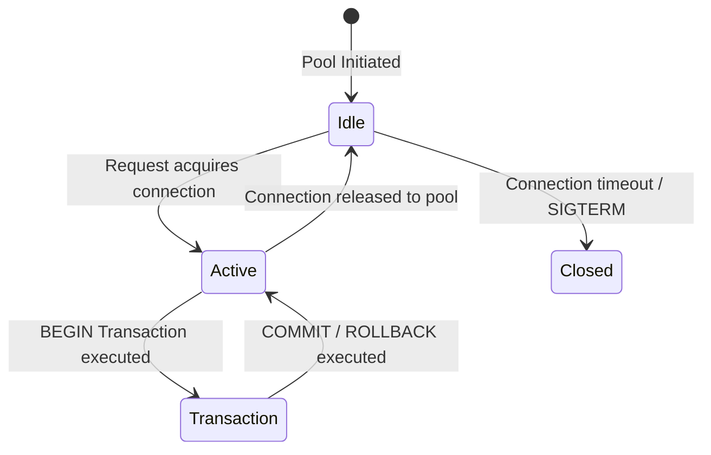
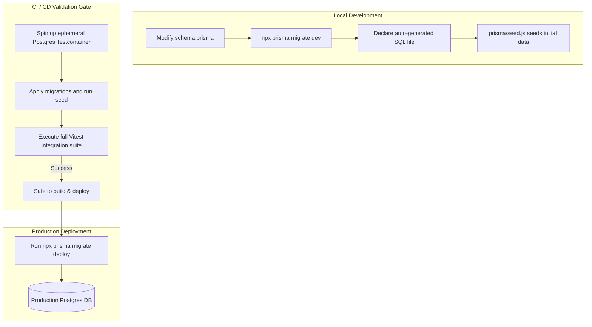

# Database Architecture & Configuration

**Phase:** 5 — Session 5b  
**Scope:** Prisma client wrappers, dynamic instantiation, connection pooling, transactional boundaries, query telemetry, schema index allocations, and long-term scaling considerations.  
**Prerequisites:** [`03-data/DOMAIN_MODELING.md`](DOMAIN_MODELING.md) (Aggregates map), [`00-core/CANONICAL_SYSTEM_FLOWS.md`](../00-core/CANONICAL_SYSTEM_FLOWS.md) §1 (Lifecycle).

---

## 1. Database Architecture Philosophy

The database tier is designed to act as a secure, high-performance, and consistent engine governed by five architectural rules:

### 1. PostgreSQL as the Enterprise Engine

PostgreSQL was chosen for its strict ACID compliance, robust indexing engine (B-Tree, GIN), advanced transaction isolation levels, and strong support for concurrent operations. It handles structured relations and transactional boundaries natively.

### 2. Repositories as Prisma Enforcers

Prisma Client is highly capable but suffers from a lack of query isolation. Direct Prisma calls in services can easily leak raw fields, over-fetch records, or bypass transaction contexts.

To solve this, the database architecture mandates **Repository Isolation**. Repositories:

- Intercept all queries and apply strict, non-bypassable whitelist shapes.
- Shield application layers from database engine specifics.
- Manage query parsing and standard pagination structures.

### 3. Service Ownership of Transactions

While database operations are isolated inside repositories, **business transactions belong to the service layer**. A repository manages individual entities, whereas services orchestrate business workflows (which frequently span multiple repositories). Services control transaction boundaries (`runInTransaction`) and pass the transactional client (`tx`) downstream to enforce atomicity.

### 4. Audit Consistency Prioritization

Database operations must never alter system state silently. Every record creation, updates, and deletion must execute within an active transaction block coupled to a compliance audit write. If the audit log fails, the business mutation rolls back.

### 5. Deterministic Engine Behavior

The system avoids runtime query parsing variations. Query columns, index traversal directions, and sorting paths are explicitly whitelisting at the repository edge to guarantee stable, predictable execution plan generation in PostgreSQL.

---

## 2. Prisma Architecture & Client Lifecycle

The client layer is managed by a customized singleton factory and dynamic HA proxy wrapper in `src/config/prisma.js`.

### 2.1 Prisma Architecture Diagram



### 2.2 Singleton Ownership & Testcontainers Dynamic Port Reconnection

In a standard production environment, the database connection URL is static. However, during integration testing (`setupTestDB.js`), a Testcontainers container spins up an ephemeral PostgreSQL instance with a dynamically assigned port on every suite run.

To handle this without process failures, `src/config/prisma.js` implements a **dynamic factory and Proxy object wrapper**:

- **Dynamic Connection URL:** The client factory (`createClientInstance`) dynamically checks `process.env.DATABASE_URL` before falling back to `config.prisma.url`.
- **Dynamic Reconnection Proxy:** The exported `prisma` instance is a Javascript `Proxy` wrapper:
  ```javascript
  const prisma = new Proxy(
    {},
    {
      get(target, prop) {
        if (prop === '$reconnect') {
          return () => {
            prismaClient = createClientInstance();
          };
        }
        const value = prismaClient[prop];
        return typeof value === 'function' ? value.bind(prismaClient) : value;
      },
    },
  );
  ```
  During integration tests, the test runner invokes `prisma.$reconnect()`, evicting the stagnant connection pool cache and instantly re-instantiating the Prisma Client with the Testcontainer's dynamically assigned DB port, ensuring zero cross-test contamination.

### 2.3 Global Omit Configurations (Defense-in-Depth)

To prevent accidental exposure of password hashes, Prisma Client natively isolates the `password` field at the database query boundary globally:

```javascript
const omitConfig = {
  user: {
    password: true,
  },
};
```

No query using standard prisma models (e.g., `prisma.user.findMany()`) will return the `password` string in its results. If a service explicitly requires the password hash (such as during login verification), it must query via a dedicated repository bypass: `userRepository.findByEmail(email, { includePassword: true })`.

---

## 3. Repository Boundaries & Query Safety

### 3.1 Repository Boundary Diagram



### 3.2 Repository Separation Rules

#### 1. Repository Responsibilities

- Encapsulate Prisma models queries inside standardized async routines (`create`, `findById`, `updateById`, `deleteById`).
- Enforce strict relational select whitelists (`cleanNoteIncludes`).
- Formulate filter parsing clauses (`buildWhereClause`).
- Coordinate query pagination utilities.
- Receive an optional transactional client `tx` parameter.

#### 2. Forbidden Repository Actions

- **Zero business logic:** Repositories must never make assertions (e.g. throwing `ApiError` 403 on ownership failure is forbidden). They retrieve or mutate data strictly as requested.
- **Zero HTTP awareness:** Repositories must not parse Express `req` objects or use session properties directly.
- **No audit log persistence decisions:** The decision to write an audit log belongs solely to the service orchestrator.

#### 3. Service Layer Transaction & Assertion Separation

By keeping repositories thin and isolated, services maintain absolute ownership of transactional workflows and privilege assertions.

```
┌────────────────────────────────────────────────────────┐
│                        SERVICE                         │
│ 1. assertScopedPermission() -> Gate 2 Authorization     │
│ 2. runInTransaction()      -> Starts Transaction Block  │
└──────────────────────────┬─────────────────────────────┘
                           │ (passes 'tx' client)
                           ▼
┌────────────────────────────────────────────────────────┐
│                      REPOSITORY                        │
│ 3. noteRepository.updateById(id, data, tx)              │
│    (Executes raw queries cleanly under active transaction)│
└────────────────────────────────────────────────────────┘
```

### 3.3 Query Whitelisting & Over-Fetch Protection

To prevent over-fetching and accidental database metadata leaks during relational joins, repositories enforce strict whitelisting.

For example, when joining the `owner` relation to a `Note` object, `note.repository.js` defines an immutable whitelisted selection criteria (`cleanNoteIncludes` lines 8-17):

```javascript
const cleanNoteIncludes = {
  owner: {
    select: {
      id: true,
      name: true,
      email: true,
      role: true,
    },
  },
};
```

Even if a developer passes a populate request `populate=owner.notes`, the repository boundary intercepts the option and replaces it strictly with `cleanNoteIncludes`. This guarantees that user passwords, hashed secrets, and other sensitive attributes are structurally blocked from entering the database query results.

---

## 4. Transaction Architecture

The system provides atomic consistency guarantees across multi-table operations through the `runInTransaction` abstraction.

### 4.1 Transaction Propagation Flow



### 4.2 Code Analysis: Dynamic Client Mapping

Every repository method accepts an optional Prisma client instance parameter: `tx = prisma`.

- **Default Case:** If no `tx` is provided, the repository queries the global `prisma` Proxy client instance directly.
- **Transactional Case:** When executing inside a service-managed transaction, the service passes the active transaction client block `tx` dynamically:
  ```javascript
  return runInTransaction(async (tx) => {
    const user = await userRepository.deleteById(id, tx);
    await noteRepository.deleteManyByOwnerId(id, tx);
    await auditService.logEvent({ event: 'users.deleted' }, tx);
  });
  ```
  This enables seamless transaction propagation down the call stack without tightly coupling the repository layers to specific transaction managers.

### 4.3 Nested Transactions Caveat

Prisma Client executes nested `$transaction` blocks inside a single transaction savepoint scheme in PostgreSQL.

- **The Risk:** If a service calls `runInTransaction` which inside calls another service executing `runInTransaction`, an inner failure will roll back the _entire_ transactional parent scope. Developers must be highly cautious when nesting transactional services to avoid silent rollback behaviors across separate domains.

---

## 5. Pagination Architecture

### 5.1 Pagination Consistency Flow

```mermaid
flowchart TD
    subgraph OffsetPagination [Offset Pagination Risks]
        DBState1[DB Page 1: [A, B, C, D]] --> ClientRead1[Client reads Page 1]
        DBState1 --> DBInsert[New record X inserted at start]
        DBInsert --> DBState2[DB Page 2: [D, E, F, G]]
        ClientRead1 --> ClientRead2[Client reads Page 2]
        ClientRead2 --> Duplicate[Record D read twice!]
    end

    subgraph CursorPagination [Cursor Pagination Solutions]
        DBCursor1[DB Page 1: limit 10, order desc] --> ClientCursor1[Client reads Page 1]
        ClientCursor1 --> SaveCursor[Save last record ID as cursor C]
        DBCursor1 --> DBCursorInsert[New record X inserted at start]
        SaveCursor --> DBCursor2[Fetch WHERE id < C limit 10]
        DBCursor2 --> CleanPage[Client reads Page 2: [D, E, F...] No duplicates!]
    end
```

### 5.2 Cursor-Based Pagination Mechanics (`paginateCursor.js`)

Offset pagination (`LIMIT 10 OFFSET 1000`) represents a database scaling vulnerability. PostgreSQL must scan and sort all offset rows to return only the requested limit subset. Furthermore, if a new record is inserted while a user is paginating, the entire list shifts, causing duplicate records or missed entries on subsequent page reads.

To solve this, note listings leverage **cursor-based pagination** in `src/utils/paginateCursor.js`:

- **The Take:** The repository queries `limit + 1` records.
- **The Evaluation:** If the result count exceeds the limit, `hasNextPage` is set to `true`, and the last record's `id` CUID is extracted as `nextCursor`.
- **Mathematical Sorting Security:** The query sorts strictly by `orderBy: { id: 'desc' }`. Because the `id` field uses time-sorted **CUID2** generation patterns, the ordering is chronologically stable and mathematically collision-free, completely avoiding database-level timestamp collisions under heavy concurrent database writes.

### 5.3 Offset Pagination Tie-Breaker Safeguards (`paginate.js`)

While offset pagination is retained for simple administrative listings (e.g. user directory views), it is protected from sorting instabilities via a **deterministic tie-breaker** (`parseSortBy` inside `src/utils/paginate.js` line 18):

```javascript
parsed.push({ id: 'asc' });
```

Without this tie-breaker, if multiple rows hold identical sorting parameters (such as `createdAt` timestamps generated within the same millisecond under bulk operations), PostgreSQL does not guarantee stable row positioning on separate pagination queries. The `id` CUID serves as a strict deterministic sort anchor, preventing jumping rows.

---

## 6. Schema Indexing Strategy

PostgreSQL uses B-Tree indexes to accelerate query traversal and prevent full table scans.



### 6.1 Critical Index Allocation Directory

The Prisma schema defines standard and compound indexes tailored to key query paths:

| Model                | Index Pattern                             | Type     | Primary Query Target                                                  |
| -------------------- | ----------------------------------------- | -------- | --------------------------------------------------------------------- |
| **`Role`**           | `@@index([level])`                        | B-Tree   | Horizontal hierarchy levels checking (`getMaxRoleLevel`).             |
| **`UserRole`**       | `@@unique([userId, roleId])`              | Unique   | Blocks redundant role-to-user assignments.                            |
| **`UserRole`**       | `@@index([userId])`                       | B-Tree   | Quick permission compilation in `getUserPermissions`.                 |
| **`UserRole`**       | `@@index([roleId])`                       | B-Tree   | Target invalidations sweeps during role permission updates.           |
| **`RolePermission`** | `@@unique([roleId, permissionId])`        | Unique   | Blocks redundant permission mapping.                                  |
| **`Permission`**     | `@@unique([action, resource, scope])`     | Unique   | Ensures capability uniqueness definitions.                            |
| **`Note`**           | `@@index([ownerId])`                      | B-Tree   | Retrieving standard note lists filtered by owner CUID.                |
| **`Note`**           | `@@index([ownerId, archived])`            | Compound | Fast retrieval of user active vs archived note feeds.                 |
| **`Note`**           | `@@index([ownerId, archived, createdAt])` | Compound | High-performance sorted cursors pagination queries.                   |
| **`Token`**          | `@@index([familyId])`                     | B-Tree   | Family-wide revocation sweeps on token replay detection.              |
| **`Token`**          | `@@index([expires])`                      | B-Tree   | Daily cron cleanup query sweeps (`deleteExpiredTokens`).              |
| **`AuditLog`**       | `@@index([actorId])`                      | B-Tree   | Actor history queries and compliance auditing timelines.              |
| **`AuditLog`**       | `@@index([entityType, entityId])`         | Compound | Entity-level change history queries.                                  |
| **`AuditLog`**       | `@@index([reqId])`                        | B-Tree   | Tracing database mutations back to a specific request ID correlation. |
| **`AuditLog`**       | `@@index([createdAt])`                    | B-Tree   | Global timeline audits feeds pagination.                              |

### 6.2 Scaling Implications & Future Partitioning Concerns

As the transaction volume grows in an enterprise ERP backend, index sizes can exceed memory limits, causing database page paging disk latency:

- **The Bottleneck:** The `audit_logs` and `tokens` tables grow monotonically.
- **The Strategy:** The B-Tree indexes on `audit_logs.createdAt` and `tokens.expires` will degrade if not vacuumed periodically.
- **ERP Mitigation:** Future versions must implement **table partitioning** on `audit_logs` by date ranges (e.g. monthly partitions), allowing old compliance blocks to be archived or deleted easily without locking the entire table or rebuilding massive global indexes.

---

## 7. Connection Lifecycle & Pooling

### 7.1 Connection Lifecycle Flow



### 7.2 Connection Pooling Configuration

Prisma Client natively manages connection pooling inside its Query Engine.

- **Connection String:** Configured with pool allocation parameters inside `.env` (`?connection_limit=10`).
- **Sizing Rules:** The pool size is set according to CPU cores and application concurrency. A connection pool limit that is too low causes requests to queue and timeout waiting for a DB connection; a limit that is too high exhausts the PostgreSQL connection limit.
- **Serverless Warning:** In serverless container environments (e.g. AWS Lambda), each execution instance initializes a separate Prisma Client. This can quickly exhaust PostgreSQL connections under auto-scaling loads. In such deployments, an external connection proxy (e.g. PgBouncer or Prisma Data Proxy) must be placed in front of the database.

### 7.3 Transaction-Length Hazards

Because transactions hold database connection slots open for their entire duration (from `BEGIN` to `COMMIT` or `ROLLBACK`), **long-running transactional processes are dangerous**. If a transaction coordinates a slow external call (e.g. waiting for SMTP SMTP send), the connection slot remains locked, thundering connection pool starvation across the entire application node. Services must keep transactions as short and fast as possible.

---

## 8. Migration Architecture & Schema Drift

Schema changes are managed strictly via declarative migration states to prevent deployment drift.

### 8.1 Migration Lifecycle Diagram



### 8.2 Migration Discipline: Dev vs Production

- **Development (`migrate dev`):** Compares the local `schema.prisma` definition against the development database state, automatically generates a structured SQL migration script under `prisma/migrations/`, and applies it. It may drop data if breaking changes are introduced.
- **Production (`migrate deploy`):** Executed in CI/CD pipeline deployments. It applies pending migration scripts _without_ schema drift scans or data-drop capabilities. If a database contains drift (e.g., dynamic updates made manually to tables outside Prisma), `migrate deploy` will abort, protecting production integrity.
- **Rollback Safety:** Complex schema changes (e.g. removing a column) must follow a multi-step **"Expand and Contract"** pattern:
  1. Add the new column as optional.
  2. Deploy and run a script to copy old values to the new column.
  3. Change the application code to read/write the new column.
  4. Deploy a final database migration to drop the old column.
     This prevents breaking application runtimes during deployment rollovers.

---

## 9. Prisma Logging & Observability

Observability is a functional requirement of security audits. Query behaviors are tracked using structured telemetry hooks inside `src/config/prisma.js`.

### 9.1 Structured Query Telemetry

In `development` environments, Prisma Client is configured to emit query events:

```javascript
baseClient.$on('query', (e) => {
  logger.debug({ event: 'database.query', query: e.query, durationMs: e.duration }, 'Prisma Query Executed');
});
```

- **Security Redaction:** The logging interceptor explicitly avoids outputting `e.params` (the raw query parameter parameters array). This prevents password hashes, session secrets, or sensitive PII from being written to standard output log streams.

### 9.2 Slow Query Telemetry Extension

To locate database degradation hotspots before they cause production downtime, the Prisma client dynamically extends model execution (`$extends` lines 58-84) to compute execution times:

```javascript
const client = baseClient.$extends({
  query: {
    $allModels: {
      async $allOperations({ model, operation, args, query }) {
        const start = performance.now();
        const result = await query(args);
        const duration = performance.now() - start;

        if (duration >= config.prisma.slowQueryThresholdMs) {
          metrics.db.slowQueries += 1;
          logger.warn({ event: 'db.query.slow', model, operation, durationMs: Math.round(duration) });
        }
        return result;
      },
    },
  },
});
```

Every query that exceeds the configured threshold (`config.prisma.slowQueryThresholdMs = 200ms` by default) atomically increments the Prometheus slow query metric counter and logs a structured warning containing the exact model and database operation.

---

## 10. Long-Term Scaling & ERP Implications

As the backend scales from simple notes into a highly integrated corporate ERP, the database tier will encounter distinct scaling hazards.

### 10.1 Anticipated Database Scaling Risks

#### 1. Audit Table Bloat

- **Hazard:** High-frequency ERP transactions (e.g. invoices billing, workflow modifications) write millions of rows to `audit_logs` every week. Large indexes will degrade write speeds.
- **Mitigation:** Table partitioning on the `createdAt` column by month, combined with index exclusion rules.

#### 2. Booking / Inventory Contention

- **Hazard:** Concurrent allocation transactions (e.g., booking the same inventory item) will cause database lock wait timeouts or deadlocks under `ReadCommitted` isolation levels.
- **Mitigation:** Implement pessimistic locks (`SELECT FOR UPDATE` via raw SQL blocks inside Prisma transaction scopes) or optimistic concurrency tokens in schemas.

#### 3. Reporting vs. Operational Query Starvation

- **Hazard:** Senior accountants running complex, multi-million row financial aggregations will starve connection pools and disk I/O, delaying standard user API checkouts.
- **Mitigation:** Implement read-replicas. Route standard read queries (L0-L4) to read-only replicas, keeping the primary write pool free of reporting bottlenecks.

---

## 11. Security & Operational Debt Register

| Debt ID         | Priority   | Risk Description                                                                                | Operational Mitigation                                                                                                                            |
| --------------- | ---------- | ----------------------------------------------------------------------------------------------- | ------------------------------------------------------------------------------------------------------------------------------------------------- |
| **SEC-RBAC-01** | **High**   | Prisma Client lacks global middleware or interceptors to enforce RBAC.                          | Developers must write active assertion checks (`assertScopedPermission`) in services manually.                                                    |
| **SEC-DB-01**   | **Medium** | Lack of automatic connection pool reclamation during database query starvation.                 | Enforce short connection limits (`?connection_limit=10`) and strictly prevent making external network requests inside active transaction blocks.  |
| **SEC-DB-02**   | **Low**    | Absence of logical soft-deletes (`deletedAt` columns) on standard business aggregates (`Note`). | Deleted records are purged permanently from database tables. Hard compliance audits must rely solely on the soft-referenced `audit_logs` history. |

---

## 12. Phase 5 Session 5b Verification Checklist

- [x] Prisma Client dynamic connection factory & Testcontainer reconnect proxy analyzed
- [x] Strict repository boundaries and overfetch Whitelists (`cleanNoteIncludes`) verified
- [x] Clear trace of Transaction Propagation sequence (`runInTransaction`)
- [x] Pagination ties-breakers and cursor sorting mechanics documented
- [x] Strict analysis of all database indexes allocations and query targets
- [x] Slow Query Telemetry Extension and redacting rules verified against `src/config/prisma.js`
- [x] Structured list of security and long-term scaling constraints compiled
