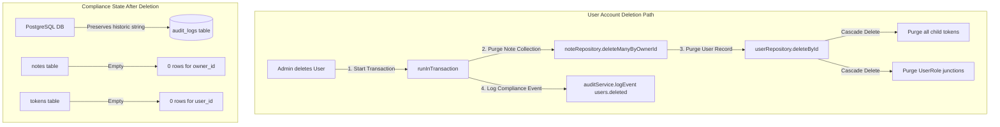
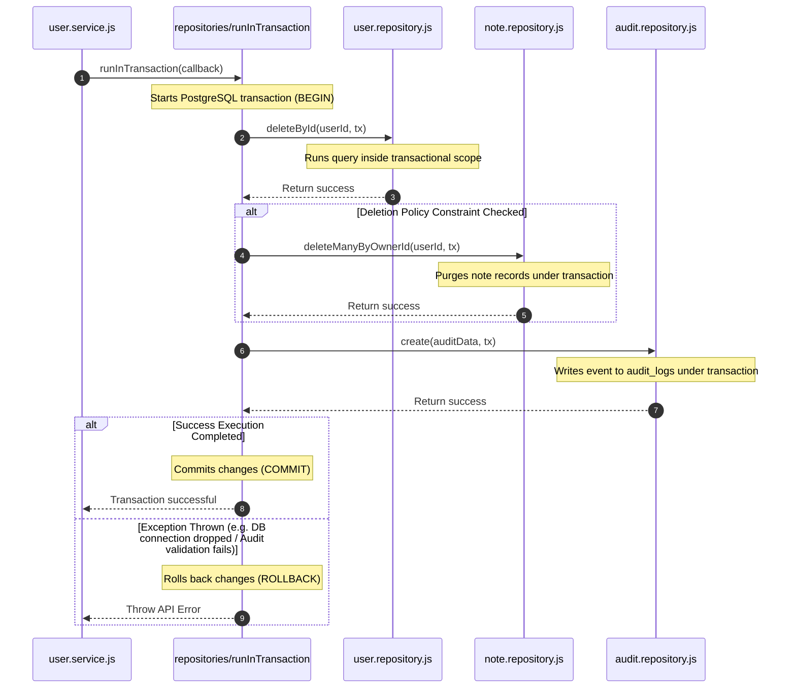
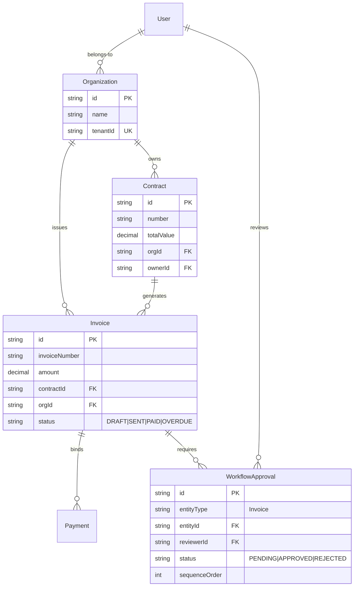

# Relational Domain Modeling Handbook

**Phase:** 5 — Session 5a  
**Scope:** Core relational schema modeling, Prisma entity configurations, cascade deletion impacts, transactional aggregate boundaries, and ERP modular extensibility.  
**Prerequisites:** [`00-core/CANONICAL_SYSTEM_FLOWS.md`](../00-core/CANONICAL_SYSTEM_FLOWS.md), [`02-security/AUTH_SYSTEM.md`](../02-security/AUTH_SYSTEM.md), [`02-security/RBAC_SYSTEM.md`](../02-security/RBAC_SYSTEM.md), [`ERP_DOMAIN_MODELING_PLAN.md`](../ERP_DOMAIN_MODELING_PLAN.md) (Inventory baseline).

---

## 1. Domain Modeling Philosophy

The data architecture of the backend is built upon five foundational relational modeling principles:

### 1. Relational Modeling over NoSQL

For enterprise backends, data consistency, integrity, and strict relation constraints are non-negotiable. Relational schemas map business aggregates directly into normalized tables, ensuring:

- **Strong Referential Integrity:** Every record is bound by foreign keys, blocking orphaned rows at the engine tier (PostgreSQL).
- **Declarative Constraints:** Email uniqueness and role levels are enforced natively by database indexes.
- **Join Capability:** Composing composite business states (e.g., matching a user to their active notes, permissions, and session tokens) is executed using highly optimized database joins rather than expensive, non-atomic application-level merges.

### 2. Explicit Ownership

Security is a first-class citizen of the database schema. The aggregate boundaries require every user-generated content resource (e.g., `Note`) to maintain an explicit foreign key column referencing the user CUID (`owner_id` mapped to `User.id`). This direct pointer makes ownership resolution deterministic, non-bypassable, and auditable, serving as the foundational anchor for **Gate 2 scoped authorization** (:own vs :any).

### 3. Single-Tenant Isolation

The schema is single-tenant by design. There is no `tenantId` partitioning key inside `rbac_roles`, `users`, or `notes`. The deployment model assumes isolated, company-specific database containers. While highly secure and simple to scale horizontally by replicating the database stack per customer, any future SaaS migration requires structural re-engineering of all unique indexes and queries to include tenant scopes.

### 4. Auditability-First Schema Architecture

Audit logs are designed as **first-class historical records**. They dictate that no state mutation can occur silently. Because compliance records (audit events) must survive even when their target actors or entity resources are permanently deleted, the `audit_logs` schema completely avoids standard foreign key constraints, relying instead on a highly resilient **soft-reference pattern**.

### 5. Atomic Transactional Consistency

No business mutation is allowed to enter a partial execution state. Actions involving multi-table updates (e.g., user deletion purging active note collections, refresh token family rotation, or privilege caching updates) are executed within unified database transactions. If any sub-query or downstream audit log write throws an exception, the database rolls back the entire execution, guaranteeing strict database consistency.

---

## 2. Dynamic Domain Aggregate Map

The system separates entities into four isolated, highly cohesive bounded contexts.

```mermaid
erDiagram
    subgraph Identity [Identity Bounded Context]
        User ||--o{ Token : "session tokens"
    end

    subgraph AccessControl [Access Control Bounded Context]
        User ||--o{ UserRole : "assigned"
        Role ||--o{ UserRole : "references"
        Role ||--o{ RolePermission : "contains"
        Permission ||--o{ RolePermission : "mapped"
    end

    subgraph Content [Content Bounded Context]
        User ||--o{ Note : "owns"
    end

    subgraph Compliance [Compliance Bounded Context]
        AuditLog {
            string actorId "Soft reference to User"
            string entityId "Soft reference to Target"
        }
    end

    User {
        string id PK
        string email UK
        string password
        LegacyRole role "deprecated"
    }

    Token {
        string id PK
        string token UK
        TokenType type
        string family_id
        boolean blacklisted
        string user_id FK
    }

    UserRole {
        string id PK
        string user_id FK "onDelete: Cascade"
        string role_id FK "onDelete: Cascade"
    }

    Role {
        string id PK
        string name UK
        int level
    }

    RolePermission {
        string id PK
        string role_id FK "onDelete: Cascade"
        string permission_id FK "onDelete: Cascade"
    }

    Permission {
        string id PK
        string action
        string resource
        string scope
    }

    Note {
        string id PK
        string title
        string content
        string owner_id FK "onDelete: Restrict"
    }
```

---

## 3. Entity Catalog

Each schema model governs specific business capabilities, lifecycles, and security boundaries.

### 3.1 User Entity (`users`)

- **Purpose:** Represents the core identity aggregate and the single source of truth for authentication.
- **Lifecycle:** Created during self-registration or admin injection; updated on profile changes; destroyed via administrative deletion.
- **Relationships:**
  - Has-many `UserRole` (Access context, Cascade delete).
  - Has-many `Token` (Authentication context, Cascade delete).
  - Has-many `Note` (Content context, Restrict delete).
- **Transactional Boundaries:** User creations execute within a transaction that seeds default attributes and logs a `users.created` audit event.
- **Serializer Exposure:** Explicit whitelist mapping (`user.serializer.js`). `password` and legacy `role` columns are structurally omitted.
- **Validation Boundaries:** Managed via `userValidation` Zod schemas. Enforces email validation, name length, and password complexity bounds.
- **Audit Implications:** Action actor references resolve to `User.id` via `actorId` column logs. Deletion purges active user records but preserves `actorId` strings in the audit logs table.
- **Security Implications:** Serves as the passport verification anchor (`req.user`). Any profile change (e.g. email change or password update) instantly invalidates the user's active token families.

---

### 3.2 Role Entity (`rbac_roles`)

- **Purpose:** Collects granular permission capabilities into named functional profiles.
- **Lifecycle:** Inserted during system database seeding; updated during dynamic administrative tuning; protected from execution deletions if marked `isSystem: true`.
- **Relationships:**
  - Mapped to users via `UserRole` (Cascade delete).
  - Mapped to permissions via `RolePermission` (Cascade delete).
- **Transactional Boundaries:** Created or modified within transaction blocks that automatically invalidate mapped users' permission caches.
- **Serializer Exposure:** Not exposed to standard endpoints.
- **Validation & Security Implications:** Enforces a rigid **level hierarchy (`level`)** preventing vertical privilege escalation. Administrators can only assign roles of equal or lower levels compared to their own maximum role level.

---

### 3.3 Permission Entity (`permissions`)

- **Purpose:** Represents a unique granular capability standard using `action:resource:scope` formatting.
- **Lifecycle:** Seeded via database migrations and startup scripts. Fully immutable at runtime.
- **Relationships:**
  - Joined to roles via `RolePermission` (Cascade delete).
- **Validation Boundaries:** Unique index constraint `@@unique([action, resource, scope])` blocks duplicate capability definitions.
- **Security Implications:** Evaluated at route-level middleware and active service assertion gates. Scope dictates binary authorization (`own` vs `any`).

---

### 3.4 UserRole Junction (`user_roles`)

- **Purpose:** Many-to-Many join table resolving composite role assignments to users.
- **Lifecycle:** Dynamic create/delete mutations managed via administrative assignment services.
- **Relationships:**
  - Cascade deletion on User delete (`onDelete: Cascade`).
  - Cascade deletion on Role delete (`onDelete: Cascade`).
- **Security Implications:** Union flattens composite user capabilities. Tracks assignment accountability via `assignedBy` and `assignedAt` auditing columns.

---

### 3.5 RolePermission Junction (`role_permissions`)

- **Purpose:** Many-to-Many join table mapping roles to their capabilities.
- **Lifecycle:** Seeded at startup; updated dynamically.
- **Relationships:**
  - Cascade deletion on Role or Permission deletions.
- **Security Implications:** Serves as the traversal link for dynamic permission graph resolution. Invalidation of mappings automatically triggers permission cache version updates.

---

### 3.6 Token Entity (`tokens`)

- **Purpose:** Relational backing for stateful refresh token families, reset-password tokens, and verify-email tokens.
- **Lifecycle:** Created at authentication login; updated on refresh token family rotation; deleted at logout or expired worker purges.
- **Relationships:**
  - Belongs to User (Cascade deletion).
- **Security Implications:** Placed inside the stateful authentication trust boundary.
  - Hashed via SHA-256 at rest to protect active sessions from database leakage.
  - Groups active sessions using `familyId` UUIDs to contain token replay theft (revoking entire families).

---

### 3.7 AuditLog Entity (`audit_logs`)

- **Purpose:** Immutable compliance record tracking all data-altering events and privilege violations.
- **Lifecycle:** Insert-only schema. Records are never updated or deleted by application endpoints.
- **Soft-Reference Philosophy:** Explicitly avoids database `@relation` foreign key constraints. If a user or note is deleted, its CUID remains written inside `actorId` or `entityId` as a static string. This guarantees that audit trails survive the deletion of parent records, fulfilling compliance requirements.
- **Telemetry Bounds:** Captures correlation values (`reqId`), actor context (`actorId`), entity identifiers, actions (`CREATE`, `DELETE`), and sanitized JSON `metadata` payloads.

---

### 3.8 Note Entity (`notes`)

- **Purpose:** Core business aggregate representing user-created notes.
- **Lifecycle:** Created, read, updated, and deleted by users.
- **Relationships:**
  - Mapped to User via `ownerId` (Restrict delete policy).
- **Deletion Policy:** Enforces `onDelete: Restrict` on `ownerId`. A user with active notes cannot be deleted by a raw Prisma command unless their notes are explicitly purged first. This prevents orphaned notes from polluting the schema.
- **Security Implications:** Enforces ownership checks at the controller boundary. Currently suffers from **Drift ID D01** (hardcoded owner validation in note controller instead of using `authorizationService`), preventing administrators from reading or updating other users' notes.

---

## 4. Deletion Impact & Lifecycle Analysis

The relational schema implements clean cascade paths to maintain referential integrity without leaving orphaned records.



### Deletion Policy Matrix

| Table              | Deleted Entity | Downstream Target | Delete Policy | Structural Behavior                                                                                                                                                                    |
| ------------------ | -------------- | ----------------- | ------------- | -------------------------------------------------------------------------------------------------------------------------------------------------------------------------------------- |
| `notes`            | `User`         | `Note`            | **Restrict**  | `onDelete: Restrict` prevents user deletions at the database layer if note records remain. Code coordinates manual note purges first inside a transaction (`user.service.js` line 57). |
| `tokens`           | `User`         | `Token`           | **Cascade**   | Database engine automatically deletes all session and flow token records matching the CUID.                                                                                            |
| `user_roles`       | `User`         | `UserRole`        | **Cascade**   | Automatically purges user assignment junctions, invalidating the actor's permission mappings.                                                                                          |
| `user_roles`       | `Role`         | `UserRole`        | **Cascade**   | Automatically purges role assignment junctions for all users currently holding the deleted role.                                                                                       |
| `role_permissions` | `Role`         | `RolePermission`  | **Cascade**   | Automatically purges mapping junctions, preventing orphaned privilege associations.                                                                                                    |
| `audit_logs`       | `User`         | `AuditLog`        | **Soft-Ref**  | No relation mapping. The static `actorId` and `entityId` CUID strings remain untouched in historical audit tables.                                                                     |

---

## 5. Transactional Consistency & Repository Abstraction

### 5.1 Repository Abstraction Layer

Prisma Client (`@prisma/client`) serves as the core Object-Relational Mapper (ORM), but it is never called directly from controllers or route handlers. Instead, the backend enforces a strict **Repository Boundary**:

```
[ Express Route / Middleware ]
       │ (auth middleware / validations)
       ▼
[ Controllers ]
       │ (extracts parameters, formats context)
       ▼
[ Service Layer ]
       │ (orchestrates business logic, manages transactions)
       ▼
[ Repository Abstraction ] (user.repository.js, note.repository.js)
       │ (capsulates Prisma query shapes & whitelists)
       ▼
[ Prisma Client ORM ]
       │
       ▼
[ PostgreSQL DB ]
```

- **ENFORCEMENT:** Services import repositories (e.g., `userRepository`) and pass an optional `tx` transaction client parameter. Repositories encapsulate all query details, nested population filters, and database writes.
- **BENEFIT:** Enforces strict query boundaries, isolates model details from business logic, and makes mocking or unit-testing services highly straightforward without requiring active database connections.

### 5.2 Transaction Coordination Flow



---

## 6. Prisma Architecture & Performance Analysis

### 6.1 Database Index Allocations

To maintain sub-millisecond query performance as the transaction volumes scale, database tables define strict indexes:

| Table              | Index Columns                    | Type     | Rationale / Query Pattern                                                                |
| ------------------ | -------------------------------- | -------- | ---------------------------------------------------------------------------------------- |
| `rbac_roles`       | `[level]`                        | Standard | Hierarchy checks during role assignments (`assertCanAssignRole`).                        |
| `user_roles`       | `[userId, roleId]`               | Unique   | Blocks assigning duplicate roles to a user.                                              |
| `user_roles`       | `[userId]`                       | Standard | Rapid flattening of user permissions inside `getUserPermissions`.                        |
| `user_roles`       | `[roleId]`                       | Standard | Used during role-level permission cache invalidations (`invalidateRolePermissionCache`). |
| `role_permissions` | `[roleId, permissionId]`         | Unique   | Blocks redundant permission mappings in roles.                                           |
| `permissions`      | `[action, resource, scope]`      | Unique   | Enforces capability uniqueness.                                                          |
| `notes`            | `[ownerId]`                      | Standard | Primary filter key for Note collections retrieval (`getNotes`).                          |
| `notes`            | `[ownerId, archived]`            | Compound | Optimizes retrieving active vs archived notes.                                           |
| `notes`            | `[ownerId, archived, createdAt]` | Compound | Optimizes paginated note feeds sorted by date.                                           |
| `tokens`           | `[expires]`                      | Standard | Clean cleanup sweeps by background workers.                                              |
| `tokens`           | `[familyId]`                     | Standard | Fast lookups for family session revocations.                                             |
| `audit_logs`       | `[actorId]`                      | Standard | Optimizes user activity history queries.                                                 |
| `audit_logs`       | `[entityType, entityId]`         | Compound | Optimizes asset-level mutation history feeds.                                            |

### 6.2 Pagination Mechanics: High-Performance Cursors

Offset pagination (`LIMIT 10 OFFSET 10000`) is a common database scaling bottleneck. As the offset increases, the database engine must scan thousands of index records to discard them, causing severe latency spikes.

To solve this, the Note repository implements **cursor-based pagination** (`note.repository.js` line 144) utilizing `paginateCursor.js`:

- The client passes a `cursor` (representing the CUID of the last resolved note).
- The query translates to:
  ```sql
  SELECT * FROM notes WHERE owner_id = $1 AND id > $cursor ORDER BY id ASC LIMIT $limit;
  ```
  This enables constant-time ($O(1)$) lookups, ensuring paginated note feeds remain fast regardless of total table size.

### 6.3 N+1 Query Risk Containment

Prisma relation queries can easily trigger N+1 query bottlenecks if handled incorrectly (e.g., executing a user query, then running a loop executing individual role queries for each user).

- **Prevention:** The system leverages **nested relation whitelists** (`cleanNoteIncludes` inside `note.repository.js`). By using Prisma's native `include` and `select` capabilities, relational lookups are resolved at the database engine tier via optimized SQL `JOIN` commands inside a single round-trip query.

---

## 7. Enterprise ERP Modular Extensibility

The domain modeling design is architected to scale into modular ERP aggregates (Contracts, Invoices, Workflows, CRM) without requiring structural rework of the security or core runtime layers.

### 7.1 Scaled ERP Aggregate Mapping



### 7.2 Scaled Bounded Context Expansion

1. **Organization Context:** Introduces tenancy and department aggregates (`Organization`, `Department`). Every core business entity is bound to an `orgId` pointer, laying the groundwork for clean multi-tenant SaaS scaling.
2. **Billing & Financial Context:** Governs `Invoice`, `Contract`, and `Payment` transactions. Financial transactions must remain strict; any invoice state change (e.g., changing status to `PAID`) executes within a transaction that creates a payment record and issues a `billing.invoice.paid` event.
3. **Workflow Bounded Context:** Enforces authorization workflows and separation of duty approvals. The `WorkflowApproval` entity is bound soft-referenced to targeted entities, keeping business states decoupled from approval flows.

### 7.3 ERP Extensibility Implication Matrix

| Future Aggregate     | Parent Aggregates          | Deletion Policy | Security Scope                                      | Audit Requirements          | Transactional Boundary                                    |
| -------------------- | -------------------------- | --------------- | --------------------------------------------------- | --------------------------- | --------------------------------------------------------- |
| **Contract**         | `Organization`, `User`     | **Restrict**    | `read:contracts:own`                                | `billing.contract.created`  | Contract creation locks budget allocations.               |
| **Invoice**          | `Contract`, `Organization` | **Restrict**    | `update:invoices:any` (restricted to billing roles) | `billing.invoice.issued`    | Issuing invoice updates contract utilization statistics.  |
| **WorkflowApproval** | `Invoice` (or any asset)   | **Restrict**    | `approve:invoices:any` (hierarchical check)         | `workflow.approval.granted` | Approval commitment updates parent asset status globally. |

---

## 8. Operational Security Boundaries

- **Serializer Isolation Safety:** Raw Prisma schemas allow queries to load relational metadata. The application isolates database properties using whitelisted serializers at the Express boundaries. Developers must never output database collections directly to `res.send`.
- **Deletion Hazards:** Database cascade paths delete session tokens cleanly, but `notes` use restrict policies. Purging a user record requires coordinating the child collection delete first. Bypassing service-layer transactions (e.g., executing a raw Prisma query `prisma.user.delete(...)`) will trigger database foreign-key errors if notes remain.
- **Audit log preservation:** Since audit logs use soft references, an administrator can analyze historic user actions even after that user account has been deleted.

---

## 9. Phase 5 Session 5a Verification Checklist

- [x] Entity relationship diagram mapping User, RBAC, Note, and Token context boundaries
- [x] Detailed audit analysis of the **Soft-Reference Philosophy** inside `AuditLog`
- [x] Clear verification matrix tracking Cascade and Restrict deletion paths
- [x] Performance review of Prisma index allocations and cursor pagination mechanics
- [x] Bounded-context map detailing the expansion path into modular financial ERP segments
- [x] Code traces showing repository transaction coordination (`runInTransaction`) and DTO boundaries
