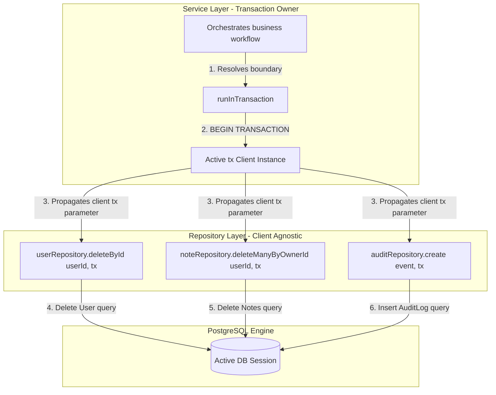
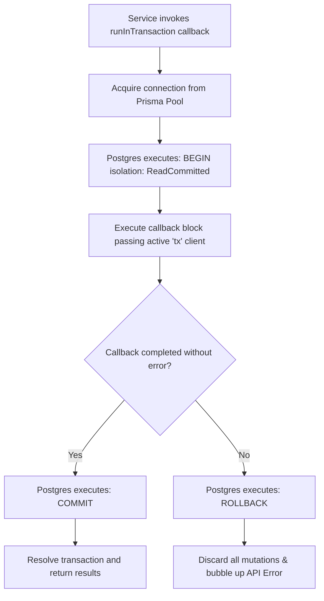
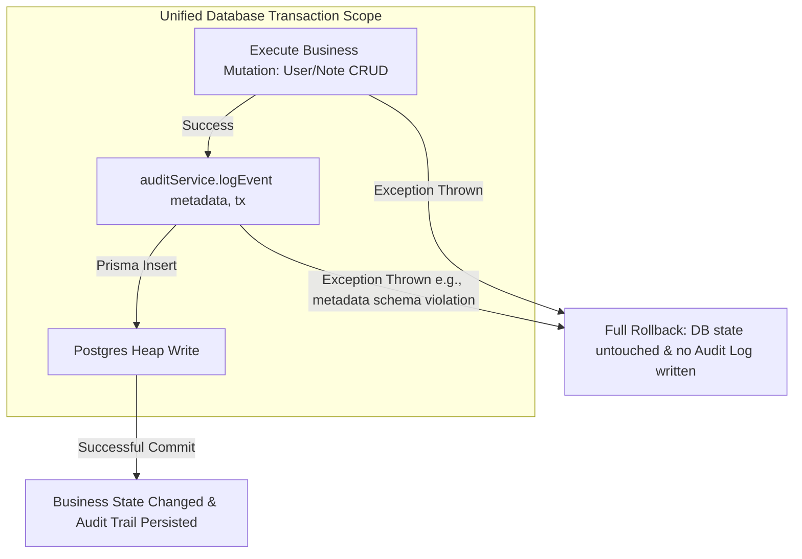
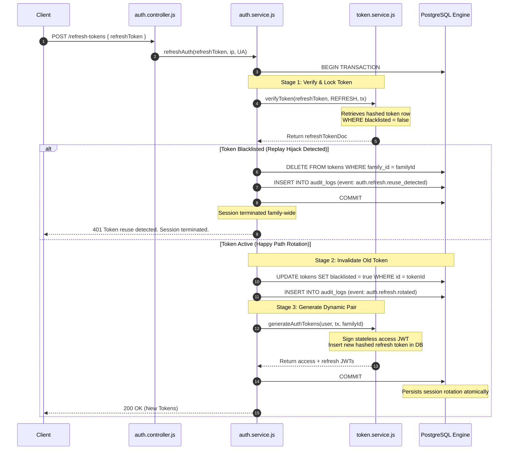
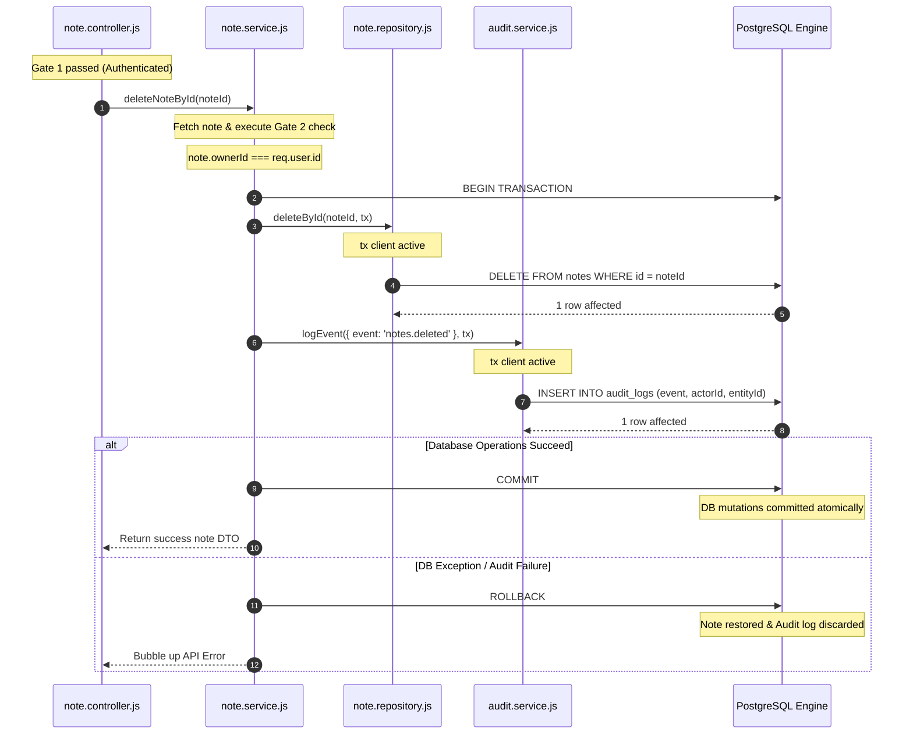
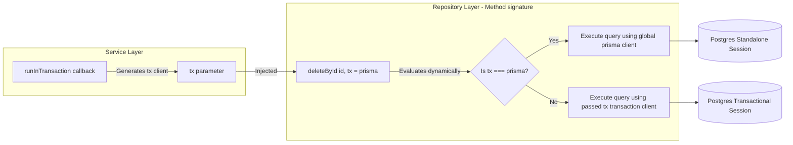

# Transactional Consistency & Rollback Guarantees

**Phase:** 5 — Session 5c  
**Scope:** Service transaction orchestration, repository dynamic client injection (`tx = prisma`), dynamic savepoint propagation, audit coupling constraints, concurrent refresh grace protocols, and dynamic nested isolation safeguards.  
**Prerequisites:** [`03-data/DOMAIN_MODELING.md`](DOMAIN_MODELING.md) (Cascade rules), [`03-data/DATABASE_ARCHITECTURE.md`](DATABASE_ARCHITECTURE.md) (Prisma engine).

---

## 1. Transactional Philosophy

Data integrity is the absolute foundation of our enterprise system. To prevent partial execution states and database corruption, the backend adheres to four core transactional principles:

### 1. Services Own Transactions

Transactions represent business workflows, and business workflows frequently cross domain boundaries. Repositories have a narrow, singular focus on a specific aggregate (e.g. `User` or `Note`). If a repository owned transaction controls, compiling multi-aggregate mutations (such as deleting a user account and purging their notes collection) would force services to coordinate raw, disconnected database connections.

By placing transaction boundaries exclusively at the **Service Layer**, the service orchestrates broad operations and propagates a single database client context (`tx`) downstream to guarantee atomicity.

### 2. Repositories Remain Transaction-Agnostic

Repositories execute SQL queries cleanly. They do not know and do not care if their queries run within an active transactional block or as standalone writes. They accept an optional dynamic client `tx` parameter: if provided, the query maps to the active transaction context; if omitted, it falls back to the global `prisma` singleton instance.

### 3. Audit Writes are Transactionally Coupled

Logging compliance events is not an optional afterthought. If a business mutation succeeds but the subsequent compliance audit log write fails, the entire business operation is aborted and **rolled back**. This prevents "phantom database mutations" that leave no audit trails.

### 4. Zero Partial Consistency (Anti-Saga Policy)

Within a single database instance, eventual consistency or partial successes are strictly forbidden. All relational state transitions are designed to be **fully ACID compliant**. Distributed transaction abstractions (such as the Saga Pattern) are avoided inside the monolith to eliminate the overhead of manual compensation logic and split-brain risks.

---

## 2. Transaction Ownership & Repository Injection Model

### 2.1 Transactional Ownership Diagram



### 2.2 Repository Dynamic client Injection

To keep repositories transaction-agnostic, every database query method follows a strict injection signature:

```javascript
const deleteById = async (id, tx = prisma) => {
  return tx.note.delete({
    where: { id },
  });
};
```

- If called as `noteRepository.deleteById(id)` → Uses the global high-availability `prisma` client wrapper (standalone query).
- If called as `noteRepository.deleteById(id, tx)` → Uses the active transactional client `tx` passed down from the service layer, keeping all queries bound to the same PostgreSQL transaction session.

---

## 3. `runInTransaction` Architecture

### 3.1 runInTransaction Workflow



### 3.2 Callback Execution Model

The transaction manager resides in `src/repositories/index.js` (line 7):

```javascript
const runInTransaction = (callback) => prisma.$transaction(callback);
```

- **Execution Block:** The `callback` is a structured, async function passed by the service:
  ```javascript
  runInTransaction(async (tx) => { ... })
  ```
- **Savepoints:** Prisma maps `$transaction` to PostgreSQL's native transaction block. If an error is thrown inside the callback, Prisma intercepts the rejection, issues a `ROLLBACK` command directly to PostgreSQL to restore the pre-transaction savepoint state, releases the connection back to the pool, and bubbles the error up the execution thread.

---

## 4. Audit Consistency Guarantees

Compliance and auditing are treated as core functional dependencies of database mutations.

### 4.1 Audit Synchronization Flow



### 4.2 Rollback Synchronization

- **Fail-Closed Audit:** The call `auditService.logEvent` is written inside the service transaction block, accepting the active `tx` client.
- **Failure Implication:** If the database write for the business entity succeeds, but the subsequent `auditService.logEvent` fails (e.g. database disk space exhaustion, constraint violation, or sanitization error), the transaction fails-closed, executing a full rollback. The database state remains untouched, preventing unauthorized or untracked changes.

---

## 5. Authentication Transactional Flows

Authentication routines coordinate high-risk session state transitions and credential mutations.

### 5.1 Token Rotation Transaction Flow



### 5.2 Refresh-Token Rotation & Replay Mitigation

To protect session continuity, `auth.service.js` (lines 69-125) coordinates token rotation strictly inside a transactional context:

1. **Verification:** Resolves the hashed refresh token against the database using `tokenService.verifyToken(..., tx)`.
2. **Replay Grace Period:** If the retrieved token has already been blacklisted (`blacklisted === true`), the service checks for a **2-second grace period** window:
   ```javascript
   if (Date.now() - refreshTokenDoc.updatedAt.getTime() < 2000) {
     throw new ApiError(httpStatus.UNAUTHORIZED, 'Concurrent refresh request detected');
   }
   ```
   This prevents race conditions under high network latency or double-clicking browsers.
3. **Escalation Protocol:** If reuse occurs _beyond_ the 2-second grace window, the thread initiates an active threat revoking action, deleting all tokens sharing the `familyId` CUID (`tokenRepository.deleteMany({ familyId }, tx)`), logs an `auth.refresh.reuse_detected` audit event, and rolls back the active rotation attempt, throwing a `401 Unauthorized`.
4. **Happy Path:** If valid, the old token is marked `blacklisted: true`, an `auth.refresh.rotated` audit event is logged, and a new token pair is inserted dynamically sharing the same `familyId` inside the transaction.

---

## 6. CRUD Transactional Flows

Note aggregates mutations enforce atomicity by coupling database operations with structured audit trails.

### 6.1 CRUD Transaction Flow



---

## 7. Nested Transaction Semantics

Prisma Client handles nested transactions through savepoints in PostgreSQL.

### 7.1 Nested Transaction Hazard Diagram

```mermaid
graph TD
    subgraph ParentScope [Parent runInTransaction Scope]
        Parent[BEGIN TRANSACTION] --> ChildSvc[Invoke Child Service]
    end

    subgraph ChildScope [Accidental Nested runInTransaction Scope]
        ChildSvc --> ChildBegin[Prisma starts Nested Transaction SAVEPOINT]
        ChildBegin --> MutateChild[Execute DB Mutation]
        MutateChild -->|Error Thrown| RollbackChild[SAVEPOINT ROLLBACK]
    end

    RollbackChild -->|Bubble up Error| ParentRollback[FULL TRANSACTION ROLLBACK]

    Note over ParentScope, ChildScope: Accidental nesting blocks target error isolation.<br/>The entire parent database state rolls back.
```

### 7.2 Accidental Nested Transaction Hazards

- **The Problem:** If `serviceA.operation` runs inside `runInTransaction` and calls `serviceB.operation` which _also_ wraps its queries in `runInTransaction`, Prisma starts an inner PostgreSQL **SAVEPOINT** instead of a separate database connection transaction.
- **The Hazard:** If the inner transaction fails, the entire parent scope is rolled back. Developers must be careful not to nest `runInTransaction` calls where they expect to isolate and catch child operation errors.
- **The Rule:** If a service expects to be called from both transactional and non-transactional contexts, it must inspect the incoming client parameters and **only** initiate `runInTransaction` if no active `tx` client has been passed down the thread.

---

## 8. Repository Transaction Injection

Repositories are completely isolated from transaction management decisions.



- **Dynamic Bindings:** The repository checks the incoming `tx` reference. Since standard Javascript binding rules apply, `tx.user.delete` automatically delegates execution to the transactional query engine rather than the default client thread pool.

---

## 9. Worker & Background Eventual Consistency

Background workers operate outside standard HTTP request threads.

### 9.1 Cleanup Workers & Lock Mechanics

The expired token cleanup worker (`workers/tokenCleanup.worker.js`) executes a daily delete query:

```javascript
tokenRepository.deleteExpiredTokens();
```

- **Transactional Isolation:** The worker sweep does not require global database transactions because the deletion of expired rows is fully idempotent.
- **Eventual Consistency:** If the cleanup worker fails or Redis is degraded, expired tokens remain in PostgreSQL temporarily. They are eventually deleted on the next successful worker run. This eventual consistency model presents no security risk, as expired tokens are structurally rejected during authentication checks anyway.

---

## 10. ALS & Transaction Correlation

To guarantee compliance and traceability, the correlation context is preserved across transactional borders.

### 10.1 Telemetry Correlation Propagation

```
  [ Express Middleware Gate ]
    - genReqId correlation UUID generated
    - Attach context to AsyncLocalStorage (ALS) store
               │
               ▼
  [ Service Layer Transaction Boundary ]
    - runInTransaction starts active Postgres BEGIN block
               │
               ▼
  [ auditService.logEvent inside Transaction ]
    - Retrieves reqId & userId from ALS context dynamically
    - Injects telemetry into AuditLog columns: req_id, actor_id
               │
               ▼
  [ Database Commit ]
    - SQL mutation committed with identical reqId correlation
```

Even when a transaction rolls back, ALS context is preserved in the process thread. This enables the error converter to log transaction failures with their original HTTP correlation `reqId`, ensuring seamless logging tracing.

---

## 11. Race Conditions & Failure Analysis

Enterprise high-volume systems are vulnerable to race conditions. The system mitigates these risks through target validations:

### 11.1 Concurrent Refresh Race Mitigation

- **The Hazard:** A client browser sends two identical `POST /v1/auth/refresh-tokens` requests at the same millisecond (e.g. double-click).
- **The Race:**
  - Request `A` begins rotation, marks the old refresh token `blacklisted: true`, and commits.
  - Request `B` executes verification at the same time, reads `blacklisted: false` before request `A` commits, and attempts to rotate the token, leading to an accidental reuse detection alarm and session termination.
- **The Mitigation:** Handled by the **2-second grace period** in `auth.service.js`. If a token is blacklisted but `updatedAt` is within 2 seconds, the system logs a `Concurrent refresh request detected` warning and returns a standard unauthorized error without executing family-wide revocation.

### 11.2 Stale Cache Invalidation Timing

- **The Hazard:** A role is updated, database changes commit, but the Redis cache invalidation fails due to network drop.
- **The Risk:** Mapped users continue to use stale, highly privileged permission sets.
- **The Protection:** Managed by the **dual-versioning namespace** (`rbac:permissions:v[X]:user:[userId]`). Any dynamic global database modification of role hierarchies or permissions atomically increments the global version namespace key, instantly invalidating all cached permission sets globally.

---

## 12. Enterprise ERP Implications

Strict transactional consistency is a legal and operational requirement for enterprise ERP systems.

### 12.1 Financial Rollback & Audit Immutability

In a financial module (e.g., billing, invoices, accounting ledger):

- A user pays an invoice: the billing system must mark `Invoice` as `PAID`, register a `Payment` row, and record a ledger entry dynamically.
- **Strict Constraint:** These three mutations must execute within a unified database transaction block. If any check fails (e.g. ledger balance mismatch or database locking), the entire transaction rolls back.
- **Audit Trail:** If the transaction fails, no payment is registered, and no audit trail is persisted, preserving absolute transactional consistency.

### 12.2 Contention Zones in High-Volume Operations

- **Accounting ledgers:** Concurrent transactions updating the same account ledger balance create a high database-locking contention zone.
- **Optimistic Concurrency:** Future modules must enforce optimistic concurrency checks (mapping version columns) or use row-level locks (`SELECT FOR UPDATE`) inside transactions to serialize execution and prevent dirty reads.

---

## 13. Security & Operational Guarantees

- **Rollback Guarantees:** Database modifications inside `runInTransaction` are guaranteed to revert completely to their original state upon callback failure.
- **Stale-Write Protection:** Handled via database transaction isolation defaults (`ReadCommitted`), blocking dirty reads.
- **Audit Durability:** Audit records are written inside the transaction block, ensuring audit logging is durable and synchronized.

---

## 14. Phase 5 Session 5c Verification Checklist

- [x] Service-layer dynamic transaction ownership model verified and documented
- [x] In-depth trace of **Token Rotation Transaction Flow** including replay grace periods
- [x] Diagram mapping **Nested Transaction Savepoint Hazard** and savepoints behavior
- [x] Code traces showing dynamic client propagation (`tx = prisma`) in repositories
- [x] Detailed analysis of the **2-second concurrent refresh grace window**
- [x] Extensibility roadmap detailing transactional ledger consistency constraints for future ERP modules
