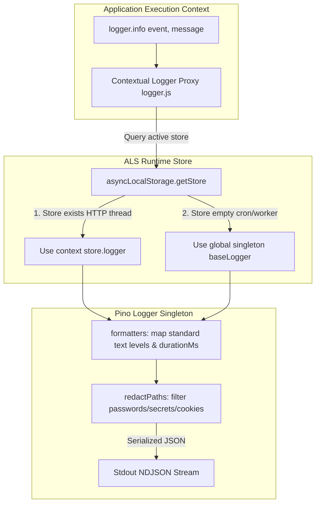
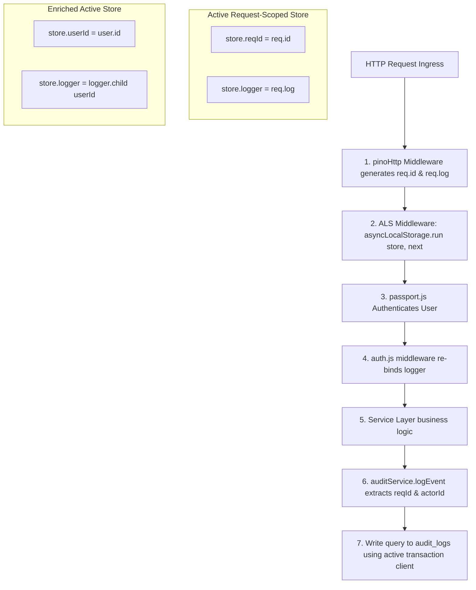
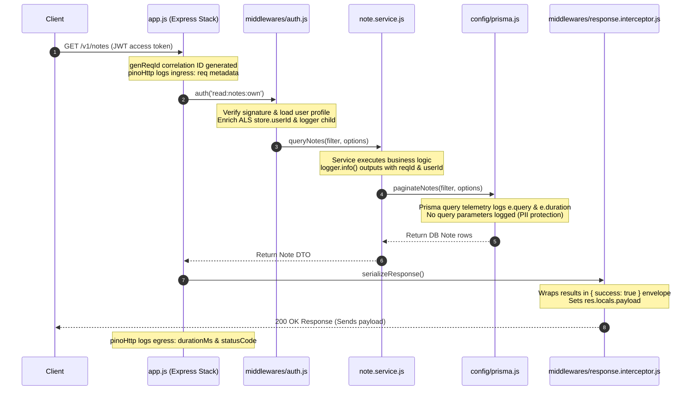
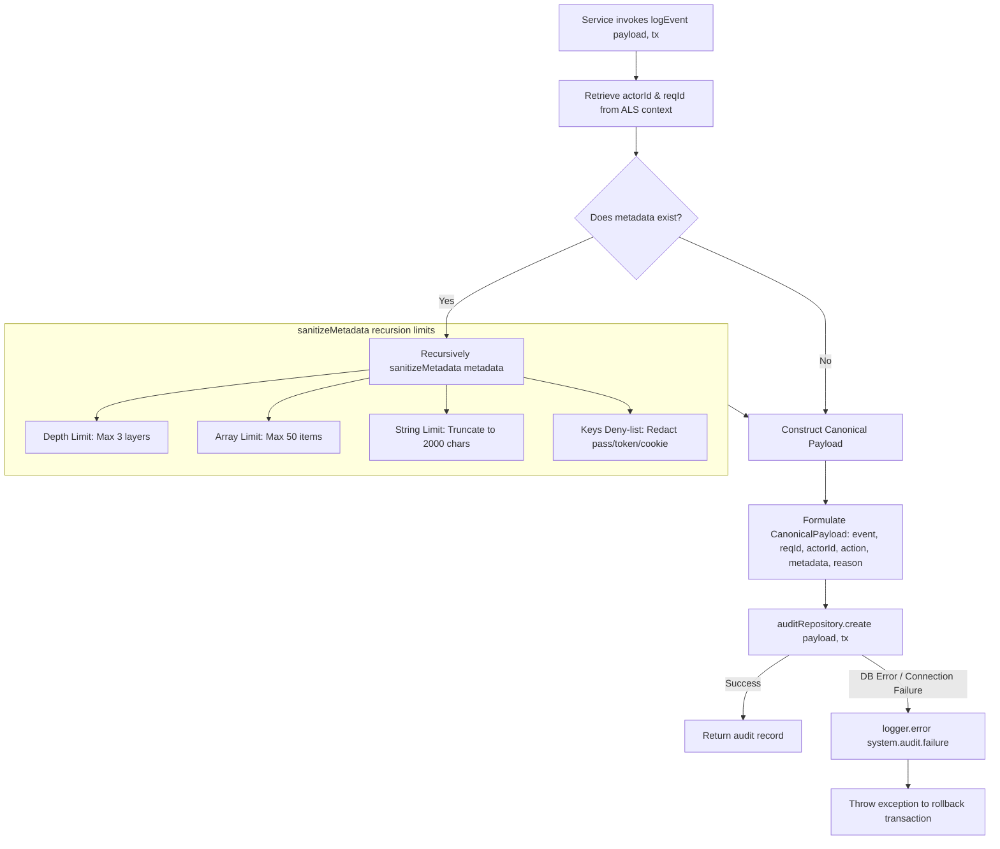
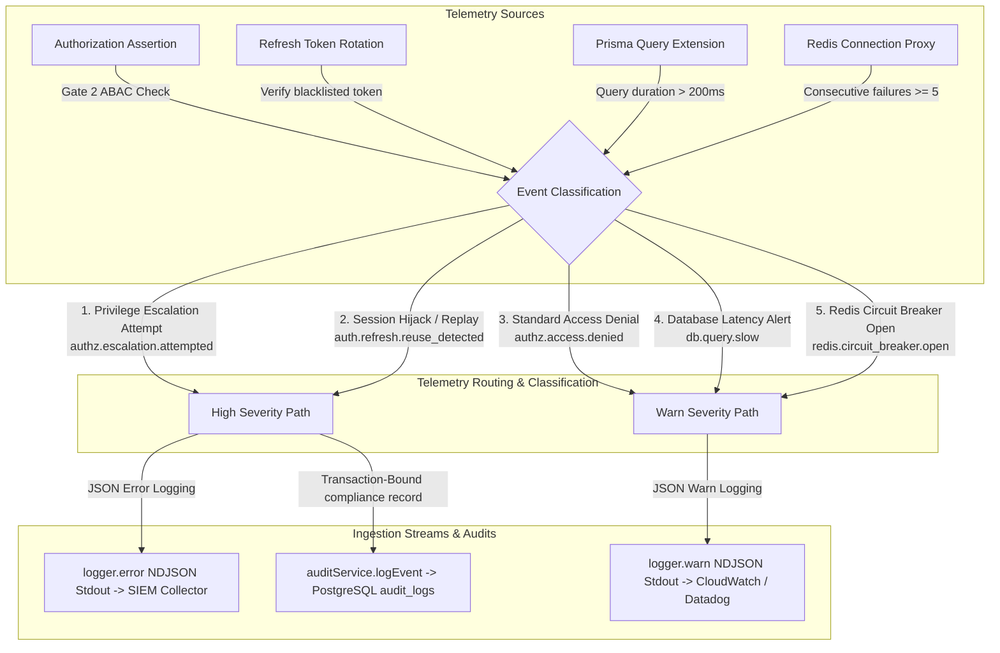
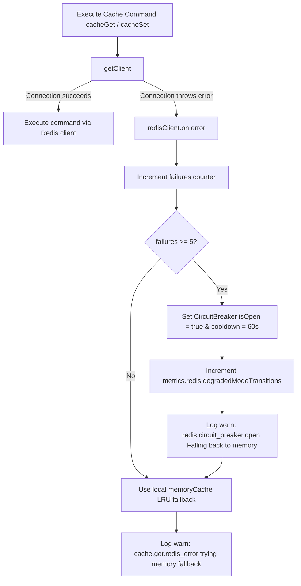
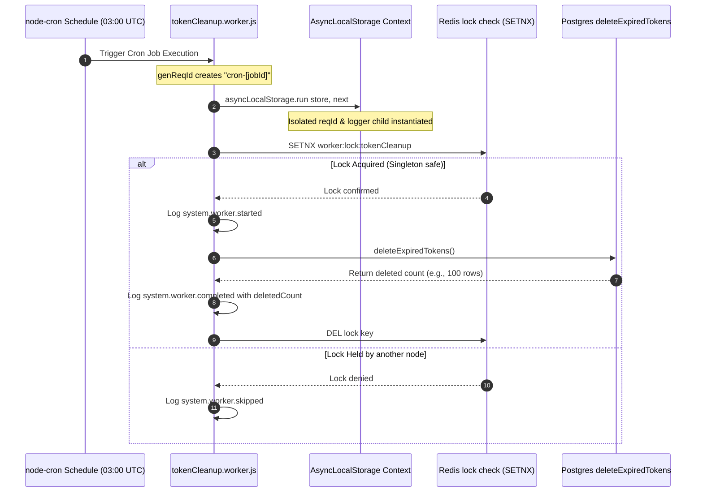
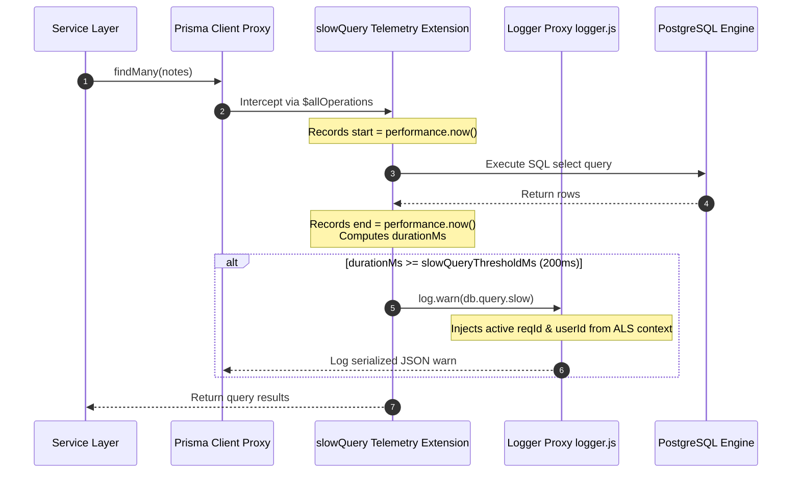

# Audit & Observability Handbook

**Phase:** 6 — Session 6  
**Scope:** Contextual Structured Logging, AsyncLocalStorage Propagation, Telemetry Redaction Boundaries, Audit Pipeline Sanitization, Database Telemetry Extensions, and Degraded Infrastructure Observability.  
**Prerequisites:** [`00-core/REQUEST_LIFECYCLE.md`](../00-core/REQUEST_LIFECYCLE.md) (Express pipeline), [`02-security/SECURITY_MODEL.md`](../02-security/SECURITY_MODEL.md) (Trust boundaries), [`03-data/TRANSACTIONAL_CONSISTENCY.md`](../03-data/TRANSACTIONAL_CONSISTENCY.md) (Transaction atomicity).

---

## 1. Observability Philosophy

Our enterprise backend treats observability not as a diagnostic add-on, but as a **core functional dependency and security control**. The architecture is guided by six engineering principles:

### 1. Structured JSON Logging over Plaintext

Plaintext log formats (e.g., standard `console.log`) are unstructured, unparseable, and difficult to query at scale. The system utilizes structured JSON logging globally. Every log line is outputted as a single, newline-delimited JSON (NDJSON) object containing key metadata. This format enables automated ingestion, instant indexing, and real-time structured searches in log collectors (such as Elasticsearch or Datadog).

### 2. Request Correlation (`reqId`)

Every request entering the Express stack is assigned a unique, immutable UUID `reqId`. This correlation ID is propagated across all downstream files, controller layers, service methods, SQL queries, and async threads. Correlation allows operators to reconstruct the exact path and timing of a single execution context from ingress to database commit.

### 3. AsyncLocalStorage (ALS) Thread Context

Node.js is single-threaded and relies on asynchronous events. Standard runtime parameters (like the current user CUID or request ID) cannot be passed down the call stack using generic global objects because concurrent operations would bleed data into one another.

The backend leverages `AsyncLocalStorage` to bind a **thread-local, request-scoped store**. Downstream services can query this store dynamically to retrieve audit and correlation details without tightly coupling service signatures to HTTP parameters.

### 4. First-Class Auditability

Operational debugging logs are transient and can be rotated, deleted, or scrubbed. Compliance **audit logs** represent a legal, immutable history. The `audit_logs` database table is separate, transaction-coupled, and structurally protected to survive deletions of parent entities.

### 5. Proactive Operational Visibility

Outages can remain hidden if metrics are flat. The observability tier tracks custom counters for database latency, worker operations, circuit-breaker triggers, and Redis connection metrics, alerting operators to degraded health states before clients detect latency spikes.

### 6. Security Event Telemetry

Privilege denials, authentication credential failures, and horizontal escalation attempts are logged with distinct structured classifications (`authz.escalation.attempted`, `auth.refresh.reuse_detected`), enabling real-time alerting systems to isolate malicious actor activities immediately.

---

## 2. Structured Logging Architecture

Operational logs are designed for high performance and rigorous formatting using a contextual logging proxy around a configured Pino instance.

### 2.1 Structured Logging Architecture Diagram



### 2.2 Structured Logging Implementation

#### 1. Pino Logger Design (`config/logger.js`)

Pino is chosen for its sub-millisecond serialization performance. The base logger configuration enforces standard formatting:

- **Level Mapping:** Maps numeric values back to readable text labels:
  ```javascript
  level: (label) => ({ level: label });
  ```
- **Timing Standard:** Intercepts Pino's default `responseTime` property and normalizes it to a unified `durationMs` key for consistency.
- **Redaction Paths:** Defines strict paths (`body.password`, `body.refreshToken`, `*.password`, `req.headers.authorization`) to automatically replace sensitive attributes with `[REDACTED]` prior to serialization.

#### 2. The Contextual Logger Proxy

To prevent developers from manually passing logger references down the call stack, `logger.js` exports a dynamic **Contextual Proxy Singleton** (lines 57-76):

```javascript
const logger = {
  info: (...args) => (asyncLocalStorage.getStore()?.logger || baseLogger).info(...args),
  error: (...args) => (asyncLocalStorage.getStore()?.logger || baseLogger).error(...args),
  warn: (...args) => (asyncLocalStorage.getStore()?.logger || baseLogger).warn(...args),
  debug: (...args) => (asyncLocalStorage.getStore()?.logger || baseLogger).debug(...args),
  fatal: (...args) => (asyncLocalStorage.getStore()?.logger || baseLogger).fatal(...args),
  trace: (...args) => (asyncLocalStorage.getStore()?.logger || baseLogger).trace(...args),
};
```

- **HTTP Context:** When executing within an active HTTP request thread, `getStore()` returns a request-scoped logger child instance with correlation metadata.
- **Background Context:** Outside HTTP execution threads (e.g. startup scripts), the proxy falls back to the global `baseLogger` instance.

---

## 3. AsyncLocalStorage (ALS) Architecture

`AsyncLocalStorage` (ALS) propagates runtime correlation contexts across asynchronous execution paths without parameter pollution.

### 3.1 ALS Context Propagation Flow



### 3.2 Context Lifecycle & Logger Re-binding

1. **Instantiation (`config/als.js`):** Initiates the storage singleton `asyncLocalStorage`.
2. **Mounting (`app.js` line 100):** Registered directly after the `pinoHttp` middleware. It captures the generated request ID (`req.id`) and structured request logger (`req.log`), wrapping downstream middleware chains:
   ```javascript
   app.use((req, res, next) => {
     const store = { reqId: req.id, logger: req.log };
     asyncLocalStorage.run(store, () => next());
   });
   ```
3. **Logger Re-binding (`middlewares/auth.js` line 32):** Once JWT validation succeeds in Passport, the `auth()` middleware retrieves the store, injects `store.userId = user.id`, and re-binds `store.logger` to a child logger instance that embeds the CUID:
   ```javascript
   const store = asyncLocalStorage.getStore();
   if (store) {
     store.userId = user.id;
     store.logger = store.logger.child({ userId: user.id });
   }
   ```
   Every logging call executed downstream in services, repositories, or Prisma client extensions automatically carries the request-scoped correlation properties `{ reqId: '...', userId: '...' }` inside the structured JSON logs.

---

## 4. Request Telemetry Flow

The life of a single request traces a continuous telemetry line from ingress to egress:



---

## 5. Audit Pipeline Architecture

The compliance auditing pipeline is designed to be immutable, transaction-coupled, and strictly sanitized.

### 5.1 Audit Pipeline Flow



### 5.2 Metadata Sanitization & Leak Prevention

Metadata payloads can easily leak sensitive user data (e.g., passwords in payload histories). To prevent compliance violations, `audit.service.js` enforces a strict **Deny-List and recursion restriction filter** (`sanitizeMetadata` lines 14-42):

- **Maximum Serialization Depth:** Restricts traversal to 3 levels deep (`MAX_SERIALIZATION_DEPTH = 3`). Exceeding structures are replaced with `[MAX_DEPTH_EXCEEDED]` to prevent infinite recursion or out-of-memory crashes.
- **Maximum Array Size:** Truncates arrays to `50` items, appending `[TRUNCATED_{count}_ITEMS]` to protect database sizing limits.
- **Maximum String Length:** Truncates long text properties to `2000` characters, appending `...[TRUNCATED]`.
- **Forbidden Key Redaction:** Lowercases metadata properties and explicitly replaces values with `[REDACTED]` if the key is in `FORBIDDEN_KEYS` (`password`, `token`, `refreshtoken`, `cookie`, `authorization`) or contains `"password"` or `"token"`.

---

## 6. Security Event Telemetry

The backend treats security events as critical SIEM inputs. They are classified dynamically based on their severity and intent, and routed to standard operational log streams and/or the transaction-bound audit trail.

### 6.1 Security-Event Telemetry Flow Diagram



### 6.2 Security Telemetry Classifications

### 1. Dynamic Authorization Denials (`authz.access.denied`)

Logged in `authorization.service.js` line 41 whenever Gate 2 assertions fail. Standard warnings capture `actorId` and `permission` for normal self-denials.

### 2. Privilege Escalation Attempts (`authz.escalation.attempted`)

Logged as a critical structured error whenever a standard user attempts to read or mutate another user's profile without `:any` permission, or attempts to assign a role level exceeding their own max role level. It generates a persistent audit log event dynamically:

```javascript
await auditService.logEvent({
  event: 'authz.escalation.attempted',
  entityType: 'Role',
  entityId: targetRoleId,
  action: 'EXECUTE',
  reason: `Attempted to assign role (level ${targetRole.level}) but actor max level is ${actorMaxLevel}`,
});
```

### 3. Session Replay Attacks (`auth.refresh.reuse_detected`)

Logged in `auth.service.js` line 87 as a critical error when a blacklisted refresh token is replayed beyond the 2-second grace period window. Telemetry outputs `{ familyId: '...' }` to trace the session hijack source.

### 4. Database Latency Alerting (`db.query.slow`)

Logged by the dynamic Prisma Client extension in `config/prisma.js` whenever a SQL query execution time exceeds `slowQueryThresholdMs` (200ms), capturing the `model`, `operation`, and exact `durationMs`.

### 5. Redis degradation visibility (`redis.circuit_breaker.open`)

Logged in `config/redis.js` line 89 when connection failures cross the maximum threshold (5), notifying operators of fallback mode activations.

---

## 7. Redis Degradation Observability

Redis connectivity states are audited by a lightweight circuit-breaker to provide full visibility during cache degradations.



- **Degraded mode state:** If Redis is down, `isDegraded()` resolves to `true` (lines 142-144).
- **Telemetry Correlation:** Cache misses during degradation log `cache.get.redis_error` structured warnings, ensuring that database read thundering herds are easily identifiable.

---

## 8. Worker & Cron Observability

Background tasks (`workers/tokenCleanup.worker.js`) run outside HTTP threads but maintain structured lifecycle logging.

### 8.1 Worker Lifecycle Telemetry Flow



### 8.2 Teardown & Graceful Shutdown Observability

During process termination signals (`SIGTERM`/`SIGINT`), `index.js` initiates graceful shutdown tracking:

- Logs `system.shutdown.started` to indicate the initiation.
- Awaits all pending background workers tracked in `global.activeWorkers` (such as active token cleanups) up to a strict 5-second timeout, logging `system.shutdown.workers_cleaned` or `system.shutdown.workers_force_killed` to confirm cleanup statuses.
- Finally, logs `system.shutdown.completed` before invoking `process.exit(0)`.

---

## 9. Prisma Query Telemetry

Prisma client events are instrumented to identify performance bottlenecks at the persistence layer.

### 9.1 Prisma Telemetry Flow



- **Observation constraints:** In `config/prisma.js`, `query` events are only bound in the `development` environment (lines 44-56). The logs output SQL query strings but **never parameter arrays (`e.params`)** to enforce database privacy boundaries in production.

---

## 10. Operational Debt & Limitations

The telemetry tier operates with three documented limitations:

### 10.1 SEC-OBS-01: Absence of Centralized Distributed Tracing

The backend does not include OpenTelemetry (`otel`) SDK integrations.

- **The Limitation:** Correlation `reqId` strings propagate perfectly across single-instance Node threads. However, if the monolith is split into distributed microservices in the future, the `reqId` will not propagate automatically across HTTP or queue boundaries without manual header injection.

### 10.2 SEC-OBS-02: Stale local cache during Redis degradation

If Redis goes offline, different load-balanced instances fall back to local LRU caches. Because local process memory caches cannot coordinate version invalidations, nodes experience a **telemetry blindspot** where one node authorizes an updated profile while another continues to evaluate using its old, cached process permissions array. This state is accepted as operational debt.

### 10.3 SEC-OBS-03: Lack of Dynamic Logging Level overrides

The log level (`info`, `debug`) is defined at startup via configuration parameters. If a security incident occurs in production, operators cannot dynamically elevate the logging level to `debug` for a specific user or endpoint without rebuilding configurations and restarting the backend processes.

---

## 11. Enterprise ERP Implications

### 11.1 ERP Auditability & Legal Compliance

For corporate compliance (e.g. Sarbanes-Oxley or GDPR), database transactions must match immutable compliance audit trails. The soft-reference `audit_logs` design ensures that even if an invoice or employee profile is deleted, the static `actorId` and action parameters remain written in the historical compliance table.

### 11.2 Forensic Debugging & Security Telemetry

When a security incident occurs (such as a compromised session or role escalation attempt), administrators can search for the correlation ID `reqId` or `userId` in SIEM collectors to view every database query, authentication check, and service call executed during that request sequence. This guarantees forensic auditability.

---

## 12. Phase 6 Verification Checklist

- [x] Request telemetry sequence tracing HTTP request down to Prisma query writes
- [x] Structured logger child re-binding (`store.logger.child`) verified in `auth.js`
- [x] Recursive sanitization limits (`MAX_SERIALIZATION_DEPTH = 3`, `FORBIDDEN_KEYS`) detailed
- [x] Mermaid sequence diagrams mapping **Worker lifecycle locks** and **Slow Query Telemetry Extensions**
- [x] Observability degraded mode mapping during Redis connection connection drops
- [x] Detailed compliance analysis of soft-references in `AuditLog` records
- [x] Structured list of 3 operational debt items with scaling boundaries
