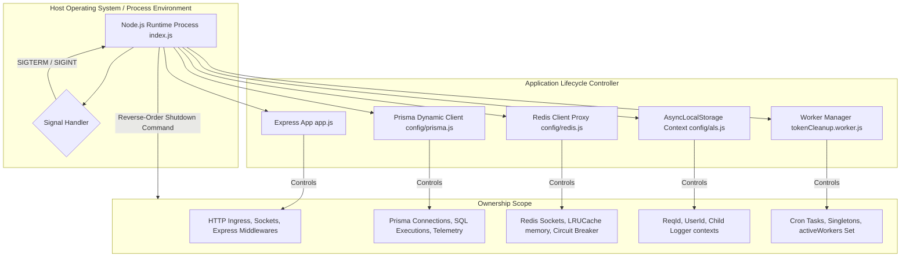
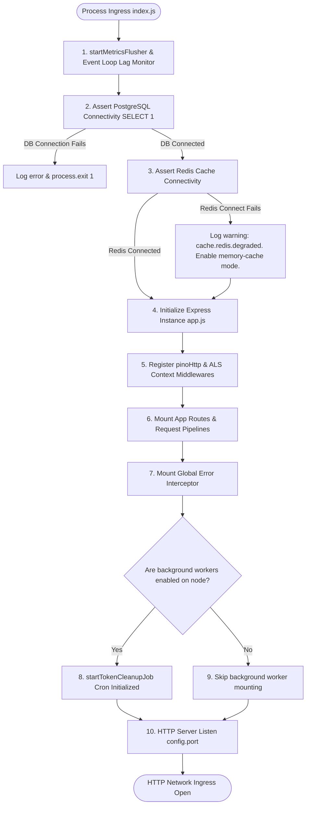
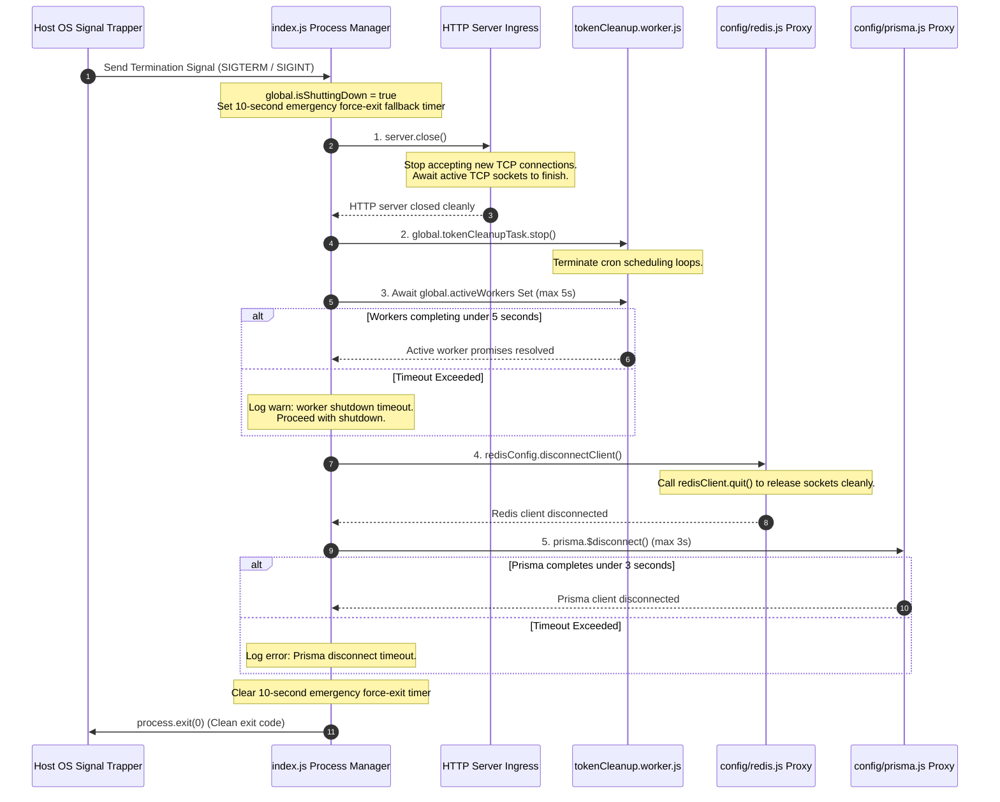
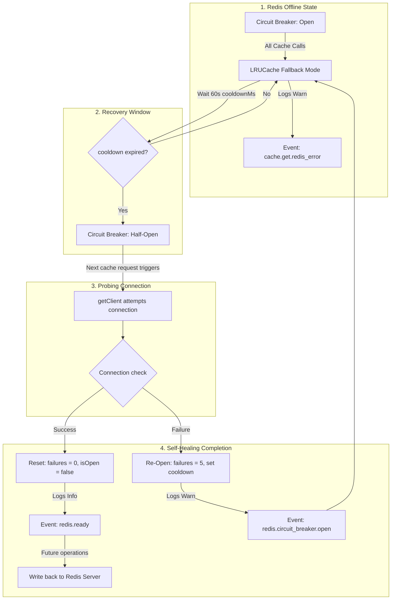

# Infrastructure & Operational Resilience Handbook

**Phase:** 7b — Session 7b  
**Scope:** Application Bootstrap Lifecycle, Infrastructure Ownership Boundaries, Reverse-Order Graceful Shutdown, Degraded Cache Operations, Circuit Breaker State Machine, Self-Healing Reconnect Recovery, and Process Lifecycle Observability.  
**Prerequisites:** [`04-operations/AUDIT_AND_OBSERVABILITY.md`](./AUDIT_AND_OBSERVABILITY.md) (Structured Logging Context), [`03-data/TRANSACTIONAL_CONSISTENCY.md`](../03-data/TRANSACTIONAL_CONSISTENCY.md) (Transaction Rollback Guarantees).

---

## 1. Infrastructure Philosophy

Our enterprise ERP backend handles sensitive corporate data and mission-critical workflows. System downtime or processing errors do not just degrade user experience; they directly threaten business operations, compliance standards, and operational audit trails. The architecture is engineered around three core operational resilience principles:

### 1. Graceful and Continuous Soft-Degradation (`degraded-mode`)

The absolute loss of secondary infrastructure (such as the Redis caching layer) must never result in a complete application outage. While database connectivity (PostgreSQL) is a mandatory hard dependency, caching is treated strictly as an **optional performance acceleration**. When Redis drops, the application automatically enters **Degraded Caching Mode**, transparently routing reads and writes to local process memory caches and direct database calls, preserving high availability at the cost of transient latency increases.

### 2. Strict Process State Boundaries & Clean Teardowns

Hanging database connections, orphaned Redis descriptors, and interrupted background job states are significant sources of resource leaks, data corruption, and database locking contentions. Operating system signals (`SIGTERM`, `SIGINT`) must trigger a **deterministic, reverse-order graceful shutdown**. The system gracefully terminates active network ingress, stops scheduling background jobs, awaits in-flight worker executions, flushes metrics, and systematically disconnects client pools within strict timeouts before exiting.

### 3. Fail-Secure Database Integrity

The primary relational database (PostgreSQL) is the canonical source of truth. The application asserts connection viability at bootstrap prior to opening network listener ports. Any persistency failure triggers structured error conversions and wraps mutations in transactional isolation shields to guarantee that the system fails safely, logging comprehensive telemetry without corrupting aggregate states.

---

## 2. Process Ownership Map

To manage processes and runtime engines reliably, the backend enforces strict boundaries between modules. Each module is solely responsible for its own resource lifecycle, configuration isolation, internal metrics tracking, and cleanup behaviors.



---

## 3. Application Bootstrap Lifecycle

The application bootstrap sequence is highly deterministic. Port bindings are intentionally delayed until database and caching backends are initialized and verified, protecting downstream load-balancers from routing traffic to unready nodes.

### 3.1 Infrastructure Bootstrap Flow



### 3.2 Bootstrap Stages & Execution Realities

1. **Event Loop Lag Monitoring (`index.js` lines 23-33):**  
   Initializes the Prometheus metrics flusher and enables `perf_hooks` loop delay tracking:
   ```javascript
   const eventLoopMonitor = monitorEventLoopDelay({ resolution: 10 });
   eventLoopMonitor.enable();
   ```
   A non-blocking interval evaluates CPU event loop lag every 5 seconds, triggering structured warnings (`system.event_loop.lagged`) if the delay exceeds `config.telemetry.eventLoopLagThresholdMs` (50ms).
2. **Canonical Persistence Assertion (`index.js` lines 35-38):**  
   Before binding the network listener, the boot sequence executes a raw SQL probe to guarantee database availability:
   ```javascript
   await prisma.$queryRaw`SELECT 1`;
   ```
   If this call throws an exception, the bootstrap process aborts immediately via `process.exit(1)`, preventing zombie microservice deployments.
3. **Caching Layer Evaluation (`index.js` lines 40-48):**  
   The bootstrap checks the availability of Redis via `redisConfig.getClient()`. If the Redis cluster is unreachable, the system catches the failure, increments the degraded transition counter, and logs a warning:
   ```txt
   Redis failed to initialize at startup. Running in DEGRADED memory-cache mode.
   ```
   Crucially, this failure **does not halt the boot**, allowing the monolith to proceed to the routing setup.
4. **Middlewares and Context Wrapping (`app.js`):**  
   Express mounts `pinoHttp` and `asyncLocalStorage` context injectors. This ensures that every HTTP request entering the pipeline is immediately bound to a unique `reqId` correlation thread.
5. **Background Task Schedules (`index.js` lines 55-61):**  
   The bootstrap inspects `config.enableBackgroundWorkers`. In containerized environments, workers are isolated onto dedicated nodes. If enabled, `startTokenCleanupJob()` runs, scheduling jobs to run locally under an isolated `AsyncLocalStorage` worker scope.
6. **HTTP Network Ingress (`index.js` lines 50-53):**  
   Finally, the server binds to the TCP port, exposing the Express application to the ingress controllers.

---

## 4. Graceful Shutdown Architecture

When a termination signal (`SIGTERM` or `SIGINT`) is trapped by the process environment, the monolith initiates a **reverse-order teardown**. This ensures that network traffic is cut off before internal connection pools and memory states are destroyed.

### 4.1 Graceful Shutdown Flow



### 4.2 Signal Handling & Shutdown Safeguards

- **Global Shutdown Flags:** Upon signal capture, `global.isShuttingDown` is immediately toggled to `true`. This flag acts as an internal circuit breaker: any incoming cron-job callbacks or downstream operations check this property and exit early if a shutdown is in progress.
- **Double-Tiered Force-Exit Timeouts:**  
   To prevent shutdown routines from locking up indefinitely (e.g. hanging sockets or unyielding database transactions), a 10-second emergency escape timer is set immediately upon signal ingress:
  ```javascript
  const forceExitTimeout = setTimeout(() => {
    logger.warn('Graceful shutdown timeout exceeded. Force exiting process...');
    process.exit(1);
  }, 10000);
  ```
  If all connection pools, background workers, and sockets fail to close within 10 seconds, the process terminates aggressively with a failure code (`1`).
- **Active Worker Tracking:**  
   The application maintains a thread-safe global `activeWorkers` Set. The worker scheduler registers its execution promise into this Set before processing background code. During shutdown, the system awaits these promises using a `Promise.race` capped at `5` seconds:
  ```javascript
  await Promise.race([
    Promise.all(Array.from(global.activeWorkers)),
    new Promise((_, reject) => setTimeout(() => reject(new Error('Worker shutdown timeout')), 5000)),
  ]);
  ```
  This prevents database transactions (like bulk cleanups) from being cut off mid-execution, protecting data consistency boundaries.

---

## 5. Degraded Infrastructure Semantics

A primary threat to high-performance ERP systems is cache unavailability. The caching client wrapper in `src/config/redis.js` is designed to absorb connection loss, self-heal, and isolate cache failures using a lightweight circuit-breaker state machine.

### 5.1 Degraded Caching Circuit Breaker State Machine

```mermaid
stateDiagram-v2
    [*] --> Closed : Redis Online

    Closed --> Closed : Success Cache Reads / Writes
    Closed --> Open : 5 Consecutive Connection Failures
    note right of Closed
        failures increments on error.
        If failures >= 5, transition to Open.
        Increment metrics.redis.degradedModeTransitions
    end

    Open --> Open : Read/Write Requests (cooldown = 60s)
    note right of Open
        Return null instantly on all cache calls.
        Redirect strictly to LRUCache (memory fallback).
        Prevents thundering herd sockets.
    end

    Open --> HalfOpen : cooldownMs (60s) Exceeded

    HalfOpen --> Closed : Next getClient() connection succeeds
    note left of HalfOpen
        Allow exactly ONE reconnect attempt.
        Reset failures = 0.
        isOpen = false.
    end

    HalfOpen --> Open : Next getClient() connection throws error
    note left of HalfOpen
        Set nextTry = Date.now() + 60s.
        isOpen = true.
    end
```

### 5.2 Degraded Cache Operations Implementation

When Redis connectivity drops, all standard cache utilities (`cacheGet`, `cacheSet`, `cacheDel`, `cacheIncr`) execute a safe, in-memory fallback strategy using an automated, memory-bounded cache instance:

```javascript
const memoryCache = new LRUCache({
  max: 1000, // Strict memory boundary limits
  ttl: 1000 * 60 * 5, // 5-minute default time-to-live eviction
});
```

- **Dynamic Cache Read (`cacheGet` lines 156-180):**  
   If the circuit breaker is **Open**, `getClient()` immediately returns `null` without attempting TCP socket calls. The wrapper catches the fallback and queries the local `LRUCache`. It logs a warning (`cache.get.redis_error`) to indicate degraded operation but successfully serves the request:
  ```javascript
  const val = memoryCache.get(key);
  if (val) {
    metrics.cache.hits += 1;
    return val;
  }
  ```
- **Dual-Write Safety and Cache Invalidation (`cacheDel` lines 211-223):**  
   Under load-balanced, multi-instance setups, cache deletion failures present a major threat: if a Redis delete fails on a connection drop, stale cache entries can authorize users whose roles were revoked. To guarantee consistency:
  ```javascript
  const cacheDel = async (key) => {
    try {
      const client = await getClient();
      if (client) await client.del(key);
    } catch (error) {
      logger.warn({ err: error, key, event: 'cache.del.redis_error' }, 'Redis DEL failed');
    }
    // ALWAYS clean memory fallback too to ensure local cache invalidation
    memoryCache.delete(key);
  };
  ```
  The system guarantees local memory eviction (`memoryCache.delete(key)`) regardless of the Redis client's state, preventing the current Node process from retaining stale permissions.

### 5.3 Stale Local Cache Limits during Redis Outages

If Redis goes offline, load-balanced monolith instances fall back to their local in-memory `LRUCache` segments. Since independent processes cannot communicate version changes without a centralized backplane, different server nodes experience a **temporary cache split-brain state**:

- If Node A updates a user's role and database state, it executes `cacheDel(rbac:permissions:user:[userId])` locally, evicting its memory cache.
- Node B continues to read permissions from its own local `LRUCache` for the remainder of the 5-minute TTL window.
- This represents **SEC-OBS-02: Stale local cache during Redis degradation** operational debt. It is accepted as a trade-off for high availability during outages.

---

## 6. Resilience & Self-Healing Patterns

Our infrastructure layers rely on specific, decoupled patterns to survive component drops without cascading failures:

### 1. Redis Exponential Socket Backoff (`redis.js` lines 68-76)

The Redis socket configuration implements a dynamic retry strategy. Rather than hammering the network adapter during an outage, it limits connections using an exponential delay scale, capping at a maximum of `10` attempts before transitioning to an offline state:

```javascript
reconnectStrategy: (retries) => {
  metrics.redis.reconnects += 1;
  if (retries > 10) {
    logger.error({ event: 'redis.reconnect.exhausted', retries }, 'Redis max reconnection attempts reached.');
    return new Error('Redis max retries exceeded');
  }
  return Math.min(retries * 200, 5000); // 200ms -> 400ms -> ... capped at 5s
};
```

On retry exhaustion, the client throws a terminal reconnect error. The connection handler catches this error, nullifies the `redisClient` singleton to save socket resources, and enters the Circuit Breaker **Open** mode.

### 2. Automatic Telemetry Recovery Loops

The Prometheus and telemetry flusher pipelines contain dedicated exception catch blocks. If the metrics endpoint or log shippers fail, the flusher sleeps and retries in the next interval without blocking the Node execution thread or locking HTTP response buffers.

---

## 7. Operational Recovery Flows

When a failed component comes back online, the system self-heals transparently without administrative intervention:



### 1. Self-Healing Redis Re-registration

During the **Half-Open** state, if the next cache read or write successfully establishes connection to Redis:

- The circuit breaker resets `failures = 0`.
- Sets `isOpen = false`.
- Dispatches `redis.ready` info events.
- Subsequent operations bypass the local `LRUCache` and write back to Redis, restoring high-speed cache acceleration across the monolith cluster.

### 2. Database Reconnection Safeguard

If PostgreSQL drops and recovers, the dynamic Prisma client singleton manages connection pooling internally. The Express error converter interceptor converts active queries into standardized HTTP 500 exceptions while PostgreSQL is down, preventing process crashes and ensuring that operations heal the moment the database is ready.

---

## 8. Process Lifecycle Observability & Metrics

Resilience is invisible without active observability. The system exposes real-time status telemetry to ensure degraded operations and recovery events are instantly flaggable in dashboard monitors.

### 8.1 Key Observability Telemetry Metrics

Operators track five critical Promethean metrics for infrastructure resilience (configured in `src/config/metrics.js`):

1. **`metrics.redis.degradedModeTransitions` (Counter):** Tracks the number of times the Redis circuit breaker transitioned from closed to open. High frequency indicates network instability.
2. **`metrics.redis.reconnects` (Counter):** Tracks the number of exponential socket reconnection attempts.
3. **`metrics.cache.hits` vs `metrics.cache.misses` (Counters):** Compares cache activity. A sudden shift in ratio combined with error logs indicates that nodes are running on the local `LRUCache` fallback.
4. **`metrics.workers.active` (Gauge):** Tracks running background cron processes. Monitored to prevent process termination signals from cutting off critical workers.
5. **`eventLoopLag` (Gauge):** Tracks event loop execution lag in milliseconds, indicating process starvation.

### 8.2 Standard Logging Taxonomy

Operational debug outputs enforce a strict event-naming taxonomy for lifecycle transitions:

- `system.shutdown.started`: Triggered instantly upon receiving termination signals.
- `system.shutdown.workers_cleaned`: Acknowledges clean background task teardowns.
- `system.event_loop.lagged`: Reports CPU event loop lag exceeding safety parameters.
- `redis.circuit_breaker.open`: Warns that caching has entered degraded memory fallback mode.
- `redis.ready`: Acknowledges successful Redis re-registrations and system healing.

---

## 9. Operational Debt & Limitations

While resilient, the architecture operates under three specific operational debts:

### 9.1 SEC-RES-01: Split-Brain In-Memory RBAC Drift

As analyzed in Section 5.3, Redis outages force independent nodes to fall back to process-isolated `LRUCache` environments. Because there is no mechanism to synchronize these local caches, role updates and privilege revocations can cause authorization variations between servers for up to **5 minutes** (TTL window). In high-security systems, this represents a transient security vulnerability that is accepted in exchange for system availability.

### 9.2 SEC-RES-02: Missing DB Connection Pool Circuit Breaker

The application lacks a circuit breaker on the Prisma PostgreSQL connection pool. If PostgreSQL experiences extreme latency or drops offline, Prisma will attempt to establish connections, consuming socket limits and blocking the Event Loop. In future iterations, a dedicated database proxy (e.g. pgBouncer or AWS RDS Proxy) must be positioned in front of Prisma to handle database scaling boundaries.

### 9.3 SEC-RES-03: Crash-Only Cleanup Recovery

If a node suffers a sudden, hard power failure (e.g. out-of-memory crash, container termination by host without SIGTERM), the graceful shutdown logic is bypassed. Active background cleanup workers will terminate mid-operation, and database locks held in Redis will persist until their 5-minute TTL expires, blocking subsequent cleanups until the lock releases.
