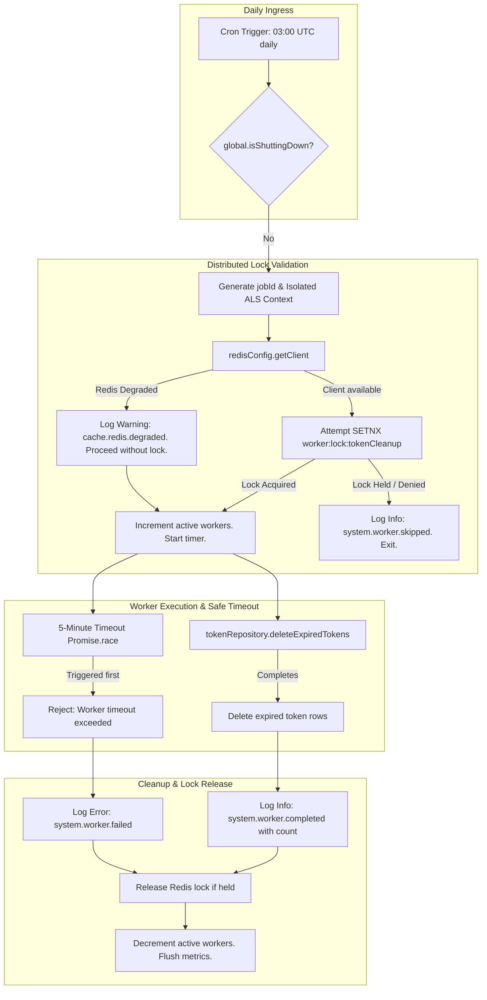
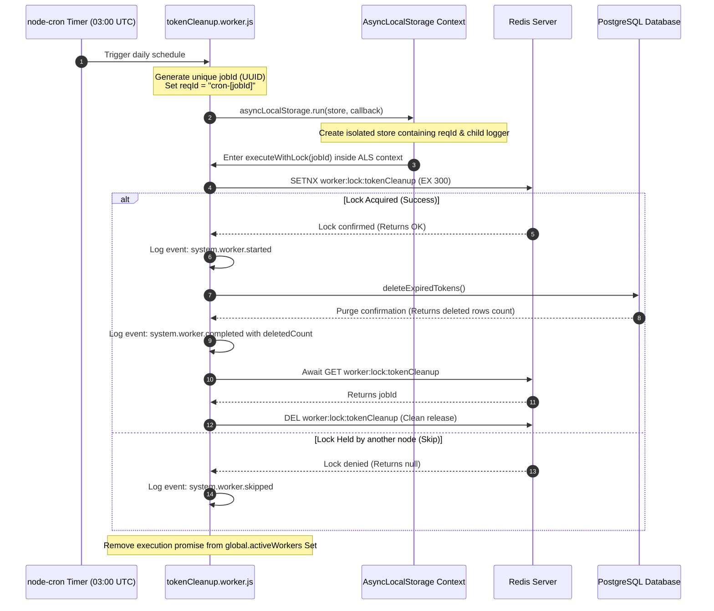
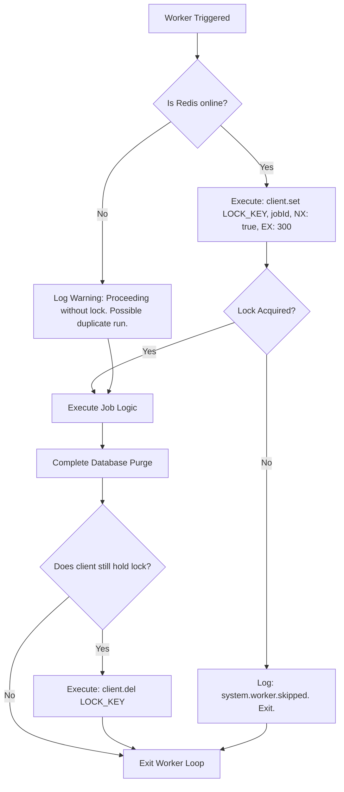

# Background Workers & Cron Architecture Handbook

**Phase:** 7b — Session 7b  
**Scope:** Background Job Schedulers, Distributed Singleton Locks, AsyncLocalStorage Context Isolation, Worker Observability pipelines, Transactional Cleanups, and Failure Modes.  
**Prerequisites:** [`04-operations/AUDIT_AND_OBSERVABILITY.md`](./AUDIT_AND_OBSERVABILITY.md) (AsyncLocalStorage Contexts), [`04-operations/INFRASTRUCTURE_AND_RESILIENCE.md`](./INFRASTRUCTURE_AND_RESILIENCE.md) (Graceful Shutdown & degraded mode).

---

## 1. Background Worker Philosophy

In a high-throughput ERP environment, real-time HTTP threads must be kept as fast and lightweight as possible. Offloading high-latency calculations, bulk updates, and database maintenance tasks to background schedules is essential for maintaining sub-millisecond response latency. The worker architecture is built upon four design principles:

### 1. Resource and Schedule Isolation

Background cron tasks can be CPU or database-heavy. Executing these tasks inside standard HTTP request threads threatens the performance of real-time routes by blocking the event loop or locking database rows. background workers execute asynchronously, driven by independent scheduling timers that can be isolated onto dedicated process threads or specialized worker containers.

### 2. Distributed Singleton Coordination

When scaling horizontally across multiple monolith instances, multiple processes run identical application code. If background jobs are allowed to execute concurrently on different nodes, it creates massive risks: race conditions, duplicated actions, and database transaction deadlocks. The background tier enforces **distributed singleton execution**: only a single monolith instance executes a given worker task at any time.

### 3. Thread-Local Context Preservation

Even though background tasks originate outside HTTP ingress, they must maintain the same strict observability rules. Every worker run generates a unique, request-like correlation ID (`reqId`), initializes an isolated `AsyncLocalStorage` store, and binds a child logger instance. This allows all downstream queries and database logs to be grouped under a single, traceable execution context in SIEM streams.

### 4. Crash-Safe and Atomically Bounded Execution

Workers deal with bulk mutations. Operations must be designed around strict transactional boundaries, timeout safety, and transactional rollbacks, ensuring that partial executions fail safely without corrupting global relational models.

---

## 2. Token Cleanup Worker

The primary operational task in the background tier is `src/workers/tokenCleanup.worker.js`. It is responsible for evicting expired tokens to prevent database bloat and mitigate token replay vulnerabilities.



### 1. Automated Schedule Lifecycle

- **Timing Pattern:** The task is registered to execute daily at **03:00 AM UTC** (`'0 3 * * *'`). This timing represents a off-peak operational window, minimizing SQL execution contention during standard business hours.
- **Database Cleanup Scope:** It calls `tokenRepository.deleteExpiredTokens()`, which identifies and removes expired refresh tokens and stateless session references:
  ```sql
  DELETE FROM tokens WHERE expiresAt < NOW() OR (type = 'REFRESH' AND blacklisted = true AND updatedAt < NOW() - INTERVAL '2 seconds');
  ```
  By purging expired token families, the worker protects the index size of the `tokens` table and ensures rapid B-Tree lookups during user authentications.

---

## 3. Worker Execution Lifecycle

Background jobs progress through a structured, multi-phase lifecycle to guarantee context isolation, failure safety, and clean resource releases.

### 3.1 Worker Execution Flow Diagram



### 3.2 Context Preservation & Thread Registration

To prevent worker execution from running naked without logs, `node-cron` wraps the worker callback inside an isolated `AsyncLocalStorage` run loop (lines 79-92):

```javascript
const jobId = crypto.randomUUID();
const store = {
  reqId: `cron-${jobId}`,
  logger: logger.child({ jobId }),
};

const workerPromise = new Promise((resolve) => {
  asyncLocalStorage.run(store, async () => {
    try {
      await executeWithLock(jobId);
    } finally {
      resolve();
    }
  });
});
```

- **Unified Telemetry:** Every query executed downstream (such as Prisma SQL delete calls) automatically appends `{ reqId: 'cron-[jobId]' }` to output logs.
- **Graceful Teardown Register:** The active execution promise is registered in `global.activeWorkers`. During shutdown, `index.js` awaits this Set, preventing container termination while a transaction is running.

---

## 4. Distributed Singleton Coordination

To scale safely across load-balanced nodes, the background worker uses Redis for distributed locking.

### 4.1 Singleton Coordination Flow



### 4.2 Locking Invariants & Scaling Risks

- **Lock TTL Safety (`LOCK_TTL_SECONDS = 300`):**  
   The lock key `worker:lock:tokenCleanup` is written with an explicit **5-minute expiration time** (`EX 300`). This represents a safety threshold: if the monolith instance executing the cleanup crashes, the lock will automatically release in 5 minutes, preventing subsequent daily runs from being blocked indefinitely.
- **Dual-Instance Race Prevention:**  
   The `NX: true` option forces Redis to write the key ONLY if it does not already exist. If a duplicate instance triggers at the exact same millisecond, the set command returns `null`, causing the secondary instance to skip processing cleanly.
- **Operational Debt (Lock Bypass in Caching Degradation):**  
   If Redis goes offline, `getClient()` resolves to `null`. The worker is faced with a choice: fail to execute (allowing expired tokens to accumulate) or proceed without coordination. The codebase implements a **bypass fallback**:
  ```javascript
  } else {
    logger.warn({ event: 'cache.redis.degraded', jobId }, 'Redis degraded. Proceeding without lock. Duplicate execution may occur.');
  }
  ```
  If Redis is down, the lock check is bypassed. If multiple instances are running, **both will execute the deletion queries concurrently**. This is accepted as operational debt. Because `deleteExpiredTokens()` relies on isolated transaction scopes and index-backed filters, concurrent execution is safe from data corruption, but may cause transient database locking delays.

---

## 5. Background Transaction Semantics

Background bulk deletions require strict persistency boundaries:

### 1. Transactional Atomicity

The deletion command executes inside a standard transaction block via the repository layer:

```javascript
const deleteExpiredTokens = async (tx = prisma) => {
  return await tx.token.deleteMany({
    where: {
      expiresAt: { lt: new Date() },
    },
  });
};
```

If the database connection drops mid-execution, the transaction rolls back cleanly, protecting table indexes from corrupt states.

### 2. Time-Bounded Execution Limits (`TIMEOUT_MS = 300000`)

Bulk database queries can hang if a table is locked by other migrations or operations. To prevent the worker thread from hanging indefinitely, `executeWithLock` runs the query inside a 5-minute timeout wrapper:

```javascript
const executionPromise = tokenRepository.deleteExpiredTokens();
const timeoutPromise = new Promise((_, reject) => {
  timeoutId = setTimeout(() => reject(new Error('Worker timeout exceeded')), TIMEOUT_MS);
});
await Promise.race([executionPromise, timeoutPromise]);
```

If the query does not finish within 5 minutes, the worker rejects the execution, increments the worker failure metric, and releases the Redis lock. This prevents thread resource leaks on the host OS.

---

## 6. Worker Failure Modes

Operators must be prepared to handle five specific worker failure modes:

| Failure Mode                      | Root Cause                                                  | System Behavior                                                                       | Mitigation / Resolution                                                                                 |
| :-------------------------------- | :---------------------------------------------------------- | :------------------------------------------------------------------------------------ | :------------------------------------------------------------------------------------------------------ |
| **Concurrent Execution**          | Redis outage during scheduled execution window.             | Circuit breaker bypasses lock check. Nodes execute deletions concurrently.            | Database transaction isolation prevents corruption. Recover Redis to restore singleton locking.         |
| **Silent Job Starvation**         | Chron task crashes on boot or is disabled in `config`.      | Expired tokens are never purged. Database index sizes bloat, slowing authentications. | Monitor health indicators and track `metrics.workers.active` gauges.                                    |
| **Stale Lock Block**              | Process crashes without releasing lock, and TTL is missing. | Redis key persists, blocking subsequent cleanups.                                     | Always enforce the 300-second expiration (`EX 300`) on lock writes.                                     |
| **Worker Shutdown Interruption**  | Host OS terminates process during active execution.         | Monolith signal trapper halts cron scheduling.                                        | The `global.activeWorkers` Set blocks shutdown for up to 5 seconds to allow transactions to finalize.   |
| **Database Transaction Deadlock** | Concurrent deletion and token rotation query clash.         | PostgreSQL aborts one of the transactions to protect the model.                       | Rely on standard transaction retries in repositories; the worker will retry on the next daily schedule. |

---

## 7. ERP & Scaling Implications

As enterprise workloads scale, the background worker architecture faces specific limitations and bottlenecks:

### 7.1 Database Locking Bottlenecks

Purging millions of expired rows in a single SQL operation (`deleteMany`) locks active index branches. As the database grows, this can cause transaction timeouts on the `/v1/auth/login` route.

- **The Solution:** In future scales, bulk deletes must be processed in **paginated chunks** (e.g. purging 1,000 rows per transaction with a 100ms pause between chunks) to keep lock times sub-millisecond.

### 7.2 Scalability Limits of Node-Cron Schedulers

Node-cron relies on in-memory timers within the single-threaded Node process.

- **The Limitation:** If a server experiences a CPU spike, background timers can slide, delaying scheduled executions.
- **The Solution:** For distributed enterprise scales, scheduling must be decoupled from the monolith process and moved to a dedicated distributed message broker queue (such as BullMQ or RabbitMQ) driven by separate worker containers.

### 7.3 Compliance Audit Logs Scaling

As the ERP volume expands, bulk data cleanups write significant events to the audit logging table. Purging historical entries requires separate, regulated data-retention schedules to guarantee compliance without causing database storage exhaustion.
