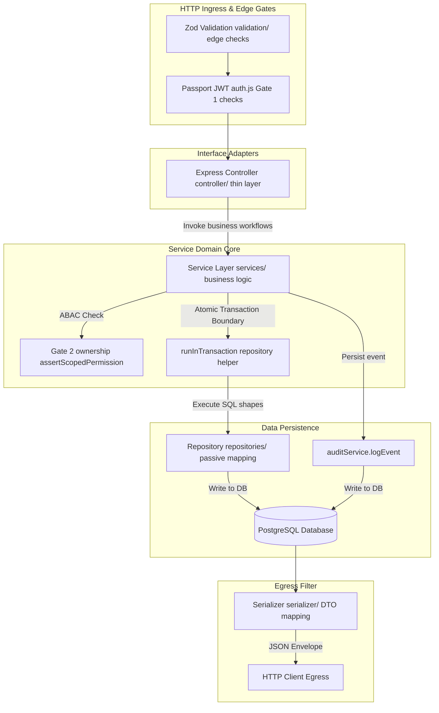
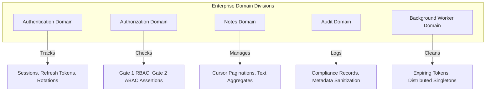
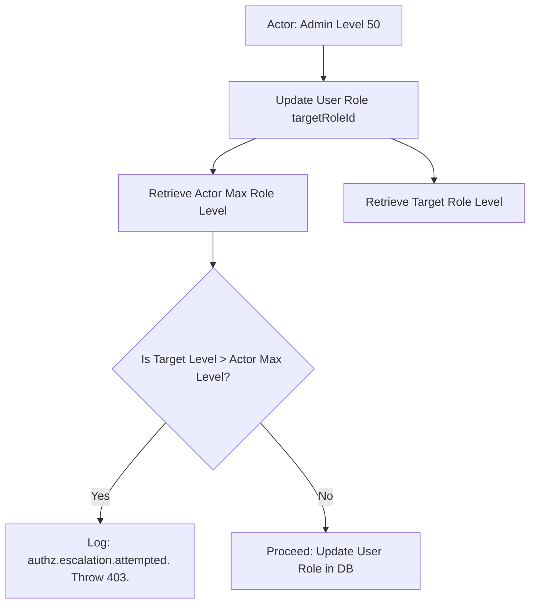

# Business Rules & Domain Architecture Handbook

**Phase:** 8a — Session 8a  
**Scope:** Service-Oriented Business Logic, Scoped Resource Ownership (ABAC), Dynamic Security Assertions, Refresh Token Graceful Rotation, Privilege Escalation Boundaries, and Transactional Auditing Policies.  
**Prerequisites:** [`03-data/DOMAIN_MODELING.md`](../03-data/DOMAIN_MODELING.md) (Aggregates), [`02-security/SECURITY_MODEL.md`](../02-security/SECURITY_MODEL.md) (Trust boundaries).

---

## 1. Business Logic Philosophy

Our backend enforces a strict separation of concerns to guarantee high maintainability, deterministic scalability, and robust security across enterprise ERP integrations. This division of labor is guided by four architectural principles:

### 1. Service Layer Centralization (The Domain Core)

All business logic, policy decisions, and aggregate invariants must reside strictly inside the **Service Layer** (`src/services/`). Services are the only modules that understand corporate workflows, transaction boundaries, dynamic roles, and compliance requirements. By keeping the domain core isolated, business rules remain independent of TCP protocols, database engines, or caching implementations.

### 2. Thin and Passive Controller Layer

Controllers (`src/controllers/`) are strictly responsible for request parsing, query parameter coercion, input sanitization boundaries, and response status mapping. **Controllers do not make business or security logic decisions.** They act as passive HTTP adapters, immediately forwarding inputs to the appropriate services and returning standardized serialization envelopes.

### 3. Isolated Validation and Serializer Gates

- **Validation (Zod at Ingress):** Enforces static type checking and shape boundaries at the request threshold (`src/validations/`), keeping the services free of boilerplate formatting checks.
- **Serialization (Whitelists at Egress):** Filters database models through dedicated DTO maps (`src/serializers/`), preventing internal attributes (such as password hashes, refresh token histories, or database IDs) from crossing network boundaries.

### 4. Deterministic Persistence Layer (Passive Repositories)

Repositories (`src/repositories/`) are passive data-mapping engines. They translate abstract operations into concrete database calls (SQL/Prisma configurations). **Repositories never own transactions or evaluate business conditions.** They execute exactly what is requested of them, accepting optional transaction client overrides (`tx`) to ensure that execution scopes are fully controlled by the service layer.

---

## 2. Business-Rule Ownership Map



---

## 3. Current Business Domains

The backend is composed of five distinct business domains, each with strict boundaries, rules, and invariants:



### 3.1 The Authentication Domain

- **Responsibilities:** Session initialization, credential validation, stateless JWT access generation, stateful refresh token tracking, and token rotation grace periods.
- **Business Rules:**
  - Credentials must match active database hashes.
  - Every refresh request invalidates the old refresh token and issues a new pair.
  - A **2-second grace period** protects client applications from connection drops during rotation.
- **Forbidden Actions:**
  - Replaying blacklisted tokens past the grace window.
  - Authenticating blocked or inactive user accounts.
- **Ownership Assumptions:** Users are the sole owners of their active token families.
- **Transactional Implications:** Refresh token rotations and family revocations must execute inside a single transactional rollback block to prevent atomic desynchronizations.

### 3.2 The Authorization Domain

- **Responsibilities:** Dynamic permission checks, role hierarchy enforcement, ownership verification (Gate 2 ABAC), and prevention of privilege escalations.
- **Business Rules:**
  - Dynamic permissions flat-resolve role levels in the database.
  - Standard users can mutate resources only if their user CUID matches the target `ownerId` (scope `:own`).
  - Cross-resource edits require explicit `:any` scope mappings.
- **Forbidden Actions:**
  - Assigning a role level that exceeds the actor's max role level.
  - Bypassing ownership checks during resource mutations.
- **Ownership Assumptions:** Administrative accounts own the structural RBAC definitions.
- **Transactional Implications:** Changing roles or permission sets must atomically increment cache keys to invalidate dynamic authorization entries globally.

### 3.3 The Notes Domain

- **Responsibilities:** Note lifecycle management, content indexing, and cursor-based paginated search arrays.
- **Business Rules:**
  - Every note must belong to a valid owner CUID.
  - Standard notes must remain strictly isolated: standard users cannot view notes owned by other users without administrative `:any` permissions.
- **Forbidden Actions:**
  - Creating a note without an owner.
  - Deleting a note owned by another user without administrative permission.
- **Ownership Assumptions:** Note aggregate boundary is governed by `Note.ownerId` matching `User.id`.
- **Transactional Implications:** Deleting a user must execute inside a transaction that recursively deletes all notes owned by that user first, preventing relational Restrict constraint violations.

### 3.4 The Audit Domain

- **Responsibilities:** Capturing compliance records, logging actions, and scrubbing sensitive parameters.
- **Business Rules:**
  - Every business mutation must log an audit entry.
  - Metadata payloads must go through recursive sanitization filters (`MAX_SERIALIZATION_DEPTH = 3`).
- **Forbidden Actions:**
  - Mutating or deleting written audit log entries.
  - Logging plaintext passwords, security cookies, or bearer tokens.
- **Ownership Assumptions:** Immutable compliance trail owned strictly by the security runtime.
- **Transactional Implications:** Audit entries must share the active transaction client of their parent business mutation, rolling back cleanly if the main write fails.

### 3.5 The Background Worker Domain

- **Responsibilities:** Automated maintenance cleanups and cron tracking.
- **Business Rules:**
  - Background tasks execute on off-peak, off-hours schedules (03:00 AM UTC).
  - Lock keys (`EX 300`) prevent duplicate cron processes across nodes.
- **Forbidden Actions:**
  - Running concurrent tasks on multiple monolith nodes.
- **Ownership Assumptions:** Monolith background execution runtime.
- **Transactional Implications:** Chunk-based deletions keep database tables responsive during active runs.

---

## 4. Scoped Resource Ownership (ABAC)

Access control operates using a **Two-Gate Verification Architecture**. While Gate 1 performs general authentication checks, Gate 2 handles scoped resource ownership (ABAC).

### 4.1 Route-Level vs Service-Level Authorization

- **Gate 1: Route-Level (Passport JWT):** Operates as a static check at request ingress. It parses the stateless JWT, asserts validity, and checks if the actor's flat role set matches standard permission requirements (e.g. `read:notes:own`).
- **Gate 2: Service-Level Assertion (`assertScopedPermission`):** Operates dynamically at the business domain threshold. It resolves whether the actor owns the target resource and escalates permissions accordingly.

```mermaid
flowchart TD
    Req[HTTP Request Ingress] --> Gate1[Gate 1 Passport JWT Check]
    Gate1 -->|Verify flat permission read:notes:own| Controller[Forward to noteController]
    Controller -->|Invoke| Service[noteService.getNoteById]

    subgraph Gate 2 Service Assertion [assertScopedPermission]
        Service --> FetchResource[Fetch Note aggregate from DB]
        FetchResource --> CheckOwner{Is actor.id === Note.ownerId?}

        CheckOwner -->|Yes own resource| AssertOwn[Assert: read:notes:own]
        CheckOwner -->|No foreign resource| AssertAny[Assert: read:notes:any]

        AssertOwn --> VerifyRBAC[Check flat permission set]
        AssertAny --> VerifyRBAC

        VerifyRBAC -->|Success| Grant[Return note rows to client]
        VerifyRBAC -->|Failure| Deny[Log authz.escalation.attempted & Throw 403]
    end
end
```

### 4.2 Core Ownership Rules & Helpers

To determine ownership, services delegate authorization logic to `assertScopedPermission(actor, resourceOwnerId, action, resource)` in `src/services/authorization.service.js` (lines 30-63):

1. **Dynamic Scope Resolution:**  
   If `actor.id === resourceOwnerId`, the system checks for `{action}:{resource}:own`. If the user has `{action}:{resource}:any`, they are automatically granted access via scope escalation.
2. **Suspicious Escalation Interception:**  
   If `actor.id !== resourceOwnerId`, the system demands `{action}:{resource}:any`. If this scope is missing, the system logs a high-severity error:
   ```txt
   Suspicious privilege escalation attempt (authz.escalation.attempted)
   ```
   Concurrently, a persistent audit event is written using the active database transaction client before returning a standardized HTTP 403 Forbidden code.

---

## 5. Token Graceful Rotation & Security

The authentication domain enforces strict refresh token grace periods to handle concurrent requests under poor network conditions without exposing the system to replay attacks.

```mermaid
stateDiagram-v2
    [*] --> Active : Token Issued

    Active --> Rotated : Client refreshes session
    note right of Active
        VerifyToken verifies client inputs.
        Rotate token pair inside transaction.
        Set active token state to blacklisted.
        Set updatedAt timestamp to current time.
    end

    state Rotated {
        [*] --> GracePeriod : Date.now - updatedAt < 2000ms

        GracePeriod --> Success : Duplicate request arrives (race condition)
        note right of GracePeriod
            Allow concurrent rotation attempt.
            Prevents client logout during dropouts.
        end

        GracePeriod --> Revoked : Date.now - updatedAt >= 2000ms
        note left of GracePeriod
            Grace period expired.
            Reuse detected (potential session hijack).
            Trigger Threat Protocol.
        end
    }

    Revoked --> [*] : Delete token family, terminate session, log SIEM alert
```

### 5.1 Rotation & Invalidation Safeguards

- **Grace Period Window:** When a refresh token is rotated, its status is changed to `blacklisted: true` rather than being deleted immediately. For **2 seconds**, duplicate requests matching this token are accepted to prevent network drops from logging out legitimate users.
- **Session Hijack Recovery (Threat Protocol):** If a blacklisted refresh token is replayed after the 2-second window, the system assumes a session hijacking attempt has occurred. It immediately triggers the security protocol:
  ```javascript
  await tokenRepository.deleteMany({ familyId: refreshTokenDoc.familyId }, tx);
  ```
  The entire token family is deleted, terminating all active sessions for that user. Concurrently, a SIEM error (`auth.refresh.reuse_detected`) is logged along with a persistent compliance audit event.

---

## 6. Privilege Escalation Prevention Rules

Administrative actions must adhere to strict boundary rules to prevent standard users from escalating privileges vertically:



### 1. Vertical Level Boundaries

Every dynamic role is bound to a specific hierarchy level (e.g., standard users = `10`, dynamic dynamic dynamic dynamically upgraded administrators = `50`, super-admins = `100`).
During role assignment workflows inside `user.service.js`, the service evaluates whether the target role level exceeds the max role level of the actor. If this level check fails, the transaction is rejected, preventing administrators from creating super-admins.

### 2. Service-Layer RBAC Protections

Route definitions mount basic permission lists (Gate 1), but services remain the final authority. Even if a route is misconfigured without Gate 1 checks, the service's `assertScopedPermission` assert gate protects resource boundaries.

---

## 7. Audit Compliance Invariants

Auditing is treated as a core security control. The audit pipeline enforces strict compliance rules:

- **Transactional Coupling:** Audit logs must share the active transaction client (`tx`) of the parent business mutation:
  ```javascript
  return await runInTransaction(async (tx) => {
    const note = await noteRepository.create({ ...noteBody, ownerId }, tx);
    await auditService.logEvent({ event: 'notes.created', ... }, tx);
    return note;
  });
  ```
  If the database write fails, the entire transaction (including the audit log entry) is rolled back, preventing orphaned audit records.
- **Metadata Sanitization:** Payload attributes are parsed by recursive deny-list filters, truncating arrays past `50` items, trimming long strings, and replacing credentials with `[REDACTED]` before saving.
- **Immutable Storage:** The `audit_logs` table does not define cascading relations or foreign keys. Static CUID strings represent the actor and target resources. If a parent user or note is deleted, its CUID remains written in the audit logs, preserving historical traceability.

---

## 8. Worker Reliability Invariants

Background tasks are isolated from HTTP request threads and enforce strict scheduling rules:

- **Singleton Coordination:** Schedulers use a distributed Redis lock (`worker:lock:tokenCleanup`) with a 5-minute safety expiration to prevent duplicate executions across load-balanced nodes.
- **Degraded-Mode Bypass:** If Redis is down, the lock is bypassed to guarantee that token cleanup continues, accepting the risk of concurrent execution across instances.
- **Shutdown Safety:** Active worker executions are registered in the global `activeWorkers` Set. Signal handlers await these promises up to `5` seconds to prevent transactions from being cut off mid-execution.

---

## 9. Future ERP & Scaling Implications

As enterprise workloads scale, the business-rule architecture will face specific consistency challenges:

### 9.1 Multi-Enterprise Aggregates (Accounting Invariants)

In future accounting and multi-tenant ERP modules, transactions (bookings, dynamic approvals) must remain isolated by organization:

- **The Invariant:** Every debit must have an equal and corresponding credit within the same ledger boundaries (`debitSum === creditSum`).
- **The Enforcement:** Workflows must process accounting changes using strict ledger-level locks, preventing partial writes during concurrent entries.

### 9.2 Complex Workflow Orchestration Risks

As asynchronous operations expand (such as inventory updates or invoice generations), simple transactions are insufficient:

- **Consistency Challenge:** Distributed writes across multiple nodes can create transactional blindspots.
- **The Solution:** Future developments must adopt the **Saga Pattern** or transaction-coordinator patterns to handle step-by-step state rollbacks during workflow failures.

### 9.3 Invariant Hotspots

Bulk operations represent significant bottlenecks:

- **Hotspots:** Re-calculating ledger balances or processing volume retention purging. Purging operations must be paginated in chunks (e.g., 1,000 items per batch) to keep tables responsive and prevent index locks.

---

## 10. Operational Bypass Risks & Mitigations

| Risk Vector                       | Attack Scenario                                                                         | Architectural Mitigation                                                                                                             |
| :-------------------------------- | :-------------------------------------------------------------------------------------- | :----------------------------------------------------------------------------------------------------------------------------------- |
| **Controller Route Bypass**       | Developer mounts a new endpoint without Gate 1 Passport auth.                           | Service-layer `assertScopedPermission` assert gates check active contexts and fail securely if `actor` is undefined.                 |
| **Stale Authorization Drift**     | Dynamic RBAC privileges are revoked, but Node instances read from stale local caches.   | Fallback caches utilize a strict 5-minute TTL window. High-security actions force database checks, bypassing caches.                 |
| **Audit desynchronization**       | An audit log database write fails, but the parent business mutation succeeds.           | Audit events share the active transaction client (`tx`) of their parent writes; any audit failure rolls back the entire transaction. |
| **Serializer Leak Vectors**       | Developers return raw database aggregates, leaking sensitive hashes to API egress.      | Serialization gates (`src/serializers/`) process all outputs through whitelisted DTO filters.                                        |
| **degraded-mode Race Conditions** | Redis drops, allowing duplicate cleanups to run concurrently without singleton locking. | DB repositories use index-backed isolation limits and transactional checks to prevent concurrency deadlocks.                         |
