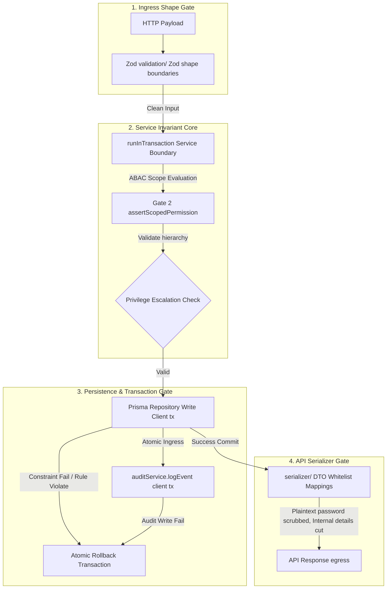
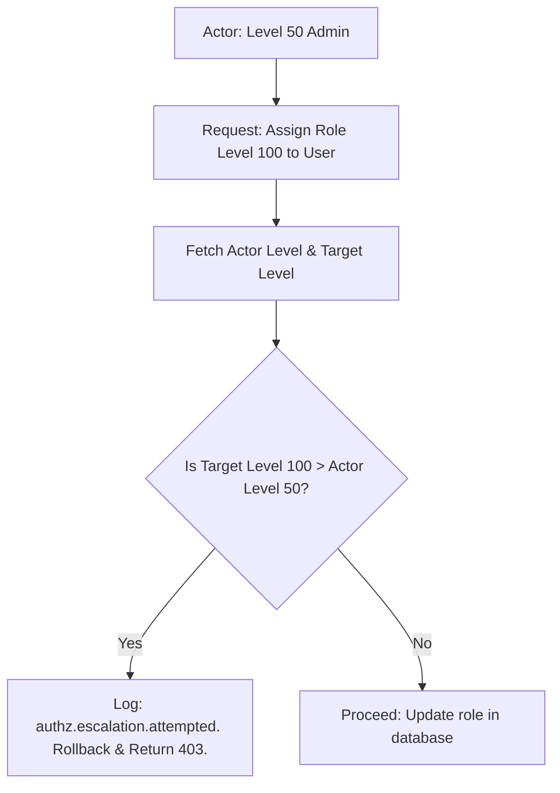
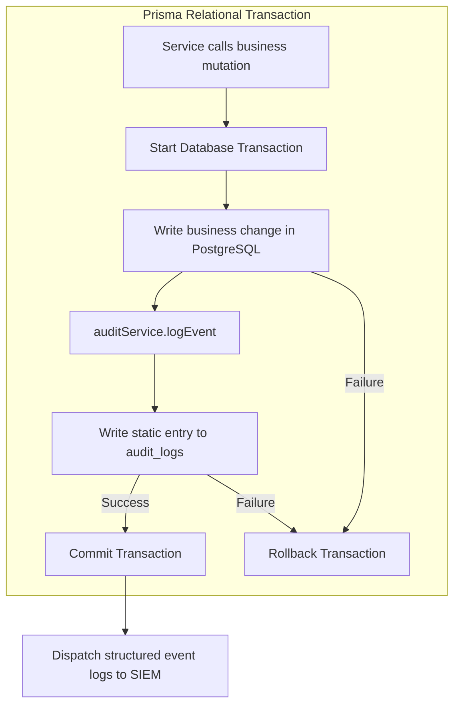

# Domain Invariants Enforcement Handbook

**Phase:** 8a — Session 8a  
**Scope:** Domain Invariant Categories, Invariant Enforcement Mapping, Transaction Isolation Boundaries, Security Implications, and SIEM Telemetry Mappings.  
**Prerequisites:** [`03-data/TRANSACTIONAL_CONSISTENCY.md`](../03-data/TRANSACTIONAL_CONSISTENCY.md) (Transaction Boundaries), [`05-engineering/BUSINESS_RULES.md`](./BUSINESS_RULES.md) (Service boundaries).

---

## 1. Introduction to Domain Invariants

In enterprise-tier ERP systems, **domain invariants** represent absolute, non-negotiable logical truths that must remain constant under every possible execution state. Unlike transient validation shapes (which check input parameters at ingress), domain invariants govern the structural relationships, safety states, and security bounds of the relational model.

### Why Invariants Matter

If an invariant is violated, the system is in an inconsistent, compromised, or corrupted state. Protecting these invariants requires strict enforcement across service transaction boundaries, persistence layers, and egress filters.

---

## 2. Invariant Enforcement Map



---

## 3. Authentication Domain Invariants

Authentication invariants protect dynamic sessions, prevent token hijacking, and guarantee session state isolation.

### 3.1 Invariant: Refresh Token Family Consistency

- **ID:** `INV-AUTH-01`
- **Definition:** A refresh token family must follow a strict linear progression. Every refresh request must invalidate the active token and issue a single new pair.
- **Why it exists:** Prevents token replay attacks where an attacker steals a refresh token and uses it to initiate dynamic sessions concurrently with a legitimate user.
- **Where it is enforced:** `src/services/auth.service.js` lines 78-103, checking `refreshTokenDoc.blacklisted`.
- **What breaks if violated:** Attackers can hijack dynamic sessions indefinitely without detection, expanding the attack surface.
- **Related Transaction Boundaries:** rotation logic and family revocations execute inside `runInTransaction`. If any step fails, the rotation rolls back.
- **Security & SIEM Implications:** Intercepting a blacklisted token past the 2-second grace period triggers a high-severity `auth.refresh.reuse_detected` SIEM alert, terminating all sessions for that user.

```mermaid
stateDiagram-v2
    [*] --> TokenActive : Issued

    TokenActive --> TokenBlacklisted : Dynamic rotation occurs
    note right of TokenActive
        Invalidate active token.
        Set blacklisted = true.
        Store familyId.
    end

    TokenBlacklisted --> GracePeriod : Time since rotation < 2s
    GracePeriod --> TokenActive : Duplicate request (network retry)
    note right of GracePeriod
        Allow retry to handle network lag.
    end

    TokenBlacklisted --> SessionHijack : Time since rotation >= 2s
    note left of TokenBlacklisted
        Token reuse detected!
        Trigger Threat Protocol.
    end

    SessionHijack --> [*] : Delete token family, log SIEM alert
```

### 3.2 Invariant: Token Rotation Atomicity

- **ID:** `INV-AUTH-02`
- **Definition:** Invalidating the old refresh token and issuing a new pair must be executed within an atomic database transaction.
- **Why it exists:** Prevents race conditions where a database disconnect occurs mid-rotation, leaving an active user without session tokens.
- **Where it is enforced:** `src/services/auth.service.js` lines 71-115, wrapped in `runInTransaction`.
- **What breaks if violated:** Incomplete writes can leave both old and new tokens active, or lock legitimate users out.
- **Related Transaction Boundaries:** Relies on the repository's database transaction client `tx` parameter.
- **Security & SIEM Implications:** Prevents desynchronization bugs that generate false-positive SIEM alerts.

---

## 4. Authorization Domain Invariants

Authorization invariants protect dynamic role hierarchies and prevent standard users from escalating privileges.

### 4.1 Invariant: Vertical Privilege Level Boundaries

- **ID:** `INV-AUTHZ-01`
- **Definition:** An actor cannot assign a role level exceeding their own max role level.
- **Why it exists:** Prevents privilege escalation where compromised admin accounts attempt to create super-admins.
- **Where it is enforced:** `src/services/user.service.js` and `src/services/authorization.service.js` dynamic assertion gates.
- **What breaks if violated:** A compromised lower-level admin can create a super-admin account, bypassing all role restrictions.
- **Related Transaction Boundaries:** Role assignment checks execute inside active user update transactions.
- **Security & SIEM Implications:** Privilege violations trigger `authz.escalation.attempted` logs and are reported to security systems.



### 4.2 Invariant: Scoped Permissions Determinism

- **ID:** `INV-AUTHZ-02`
- **Definition:** Scoped resource queries must flat-resolve permissions at runtime, checking user CUID mappings to determine ownership status.
- **Why it exists:** Guarantees that standard users can access only their own resources (`:own` scope) without administrative permissions (`:any`).
- **Where it is enforced:** `src/services/authorization.service.js` at line 30 inside `assertScopedPermission`.
- **What breaks if violated:** Users can mutate or view notes owned by other users, creating a high-severity security risk.
- **Related Transaction Boundaries:** Intercepts mutations inside services before database transactions are initiated.
- **Security & SIEM Implications:** Unsanitized requests trigger immediate `authz.access.denied` alerts.

---

## 5. Ownership Domain Invariants

Ownership invariants map structural relationships between parent and child aggregates.

### 5.1 Invariant: Note Owner Validity

- **ID:** `INV-OWN-01`
- **Definition:** Every note must belong to a valid user CUID.
- **Why it exists:** Prevents orphaned notes in the database, preserving data model integrity.
- **Where it is enforced:** `prisma/schema.prisma` at DB constraints and `src/services/note.service.js` line 13.
- **What breaks if violated:** Orphaned records in the database can cause query crashes during cursor pagination.
- **Related Transaction Boundaries:** Checked inside dynamic creation transactions.
- **Security & SIEM Implications:** Guarantees that resource access paths are always traceable to a valid user.

### 5.2 Invariant: Cascade User Deletion Constraints

- **ID:** `INV-OWN-02`
- **Definition:** A user deletion must recursively delete all notes owned by that user inside a single transaction.
- **Why it exists:** PostgreSQL database level constraints restrict deleting a user if they own notes.
- **Where it is enforced:** `src/services/user.service.js` at lines 128-144, invoking `noteRepository.deleteManyByOwnerId(userId, tx)`.
- **What breaks if violated:** Deleting a user throws a database constraint violation, failing the request.
- **Related Transaction Boundaries:** Relies on a single `runInTransaction` block containing both note and user deletion commands.
- **Security & SIEM Implications:** Preserves absolute system integrity.

---

## 6. Audit Compliance Invariants

Audit compliance invariants guarantee that changes are tracked in a secure, immutable history.



### 6.1 Invariant: Atomic Audit Desynchronization Prevention

- **ID:** `INV-AUD-01`
- **Definition:** Every business mutation and its corresponding audit log write must be executed within the same database transaction.
- **Why it exists:** Prevents situations where a database write succeeds but the audit log write fails, leaving changes untracked.
- **Where it is enforced:** Service methods (e.g. `src/services/note.service.js` lines 14-29, 63-78).
- **What breaks if violated:** Untracked database changes degrade system auditability.
- **Related Transaction Boundaries:** The service passes the transaction client `tx` parameter to `auditService.logEvent`.
- **Security & SIEM Implications:** Preserves a complete, tamper-proof audit trail for GDPR and forensic analyses.

### 6.2 Invariant: Audit Record Immutability

- **ID:** `INV-AUD-02`
- **Definition:** Audit records must use static CUID strings for actor and resource references, avoiding relational foreign key mappings.
- **Why it exists:** Relational cascades would delete audit records when a parent user or note is deleted, losing compliance histories.
- **Where it is enforced:** `prisma/schema.prisma` at the `AuditLog` table definition.
- **What breaks if violated:** Deleting a user wipes their compliance history.
- **Related Transaction Boundaries:** None (isolated persistence structure).
- **Security & SIEM Implications:** Preserves historical audit records for legal and forensic tracing.

---

## 7. Egress Serialization Invariants

Egress invariants protect client boundaries and prevent database models from leaking.

### 7.1 Invariant: Password Hash Isolation

- **ID:** `INV-SER-01`
- **Definition:** A user's password hash must never be returned in API response bodies.
- **Why it exists:** Prevents data leaks that expose sensitive credential hashes to client environments.
- **Where it is enforced:** Egress serialization gates (`src/serializers/user.serializer.js`).
- **What breaks if violated:** Password hashes leak, exposing the system to offline brute-force cracking attempts.
- **Related Transaction Boundaries:** Intercepted at response boundaries prior to network transmission.
- **Security & SIEM Implications:** Guarantees absolute compliance with security rules.

---

## 8. Relational Transaction Invariants

Relational transaction invariants guarantee data integrity during multi-row updates.

### 8.1 Invariant: Dynamic Repository Transaction Client Injection

- **ID:** `INV-TX-01`
- **Definition:** Repositories must use the transaction client parameter (`tx`) if provided, falling back to the base Prisma client only when executed outside active transactions.
- **Why it exists:** If a repository ignores the active transaction client parameter, queries run on the global client, bypassing isolation levels and savepoint rollbacks.
- **Where it is enforced:** All repositories (`src/repositories/`), accepting the `tx` parameter in methods.
- **What breaks if violated:** A failure mid-operation fails to roll back, corrupting the database model.
- **Related Transaction Boundaries:** Relies on active transaction clients passed from services.
- **Security & SIEM Implications:** Ensures data remains consistent.

---

## 9. Infrastructure Invariants

Infrastructure invariants protect core system states during caching or connection outages.

### 9.1 Invariant: Redis Optional Caching Fallback

- **ID:** `INV-INF-01`
- **Definition:** Redis cache unavailability must never block core business transactions.
- **Why it exists:** High-availability guarantee: cache drops must fallback transparently to the database or local memory caches.
- **Where it is enforced:** `src/config/redis.js` inside circuit-breaker handlers.
- **What breaks if violated:** A Redis outage causes the entire application to drop offline, violating service level agreements.
- **Related Transaction Boundaries:** Circuit breaker intercepts cache operations inside services.
- **Security & SIEM Implications:** Logs circuit-breaker warnings and transitions in monitoring dashboards.

---

## 10. Future ERP Invariants & Scaling Implications

As the backend scales to handle complex ERP tasks, new invariants must be enforced:

### 10.1 Multi-Tenant Ledger Balancing

- **Invariant:** Debits must match credits within ledger boundaries (`debitSum === creditSum`).
- **Enforcement:** Enforced inside dynamic ledger services using serializable transaction isolation levels.
- **Scaling Challenge:** High-concurrency lock contention can degrade performance during high volumes.

### 10.2 Workflow Approval Lifecycle

- **Invariant:** Procurement orders exceeding $10,000 must transition through dynamic approval sequences.
- **Enforcement:** Enforced in services using approval-chain assertions.
- **Scaling Challenge:** Processing approval trees can create transaction deadlocks.

---

## 11. Security Bypass Risks & Mitigations

- **Repository Bypass:** Direct repository imports bypass service validation. Resolved by restricting controllers to service-layer endpoints.
- **Stale RBAC Cache:** revoked admin privileges remain active in local memory caches. Mitigated by using a strict 5-minute TTL expiration limit on fallback cache values.
- **Dynamic Transaction Drifts:** queries executing outside transactional limits can lead to database locking delays. Resolved by enforcing runtime linting and automated unit tests.
