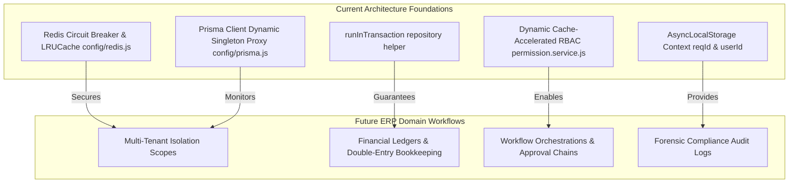
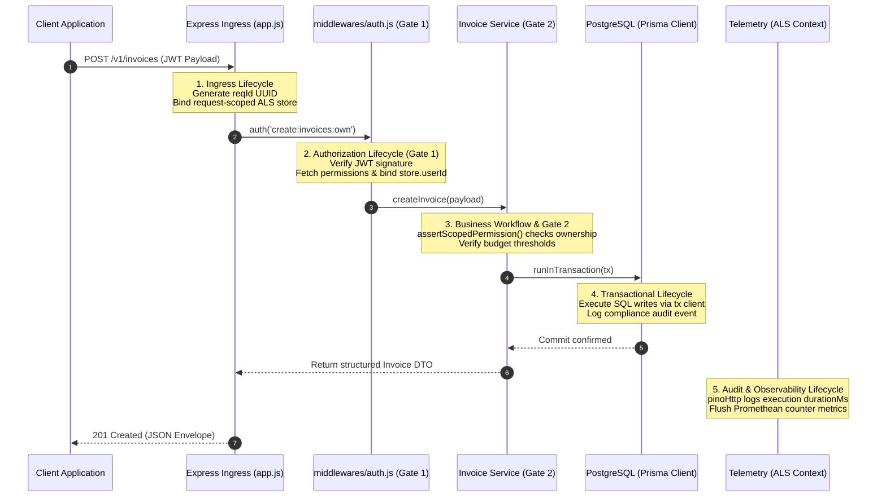
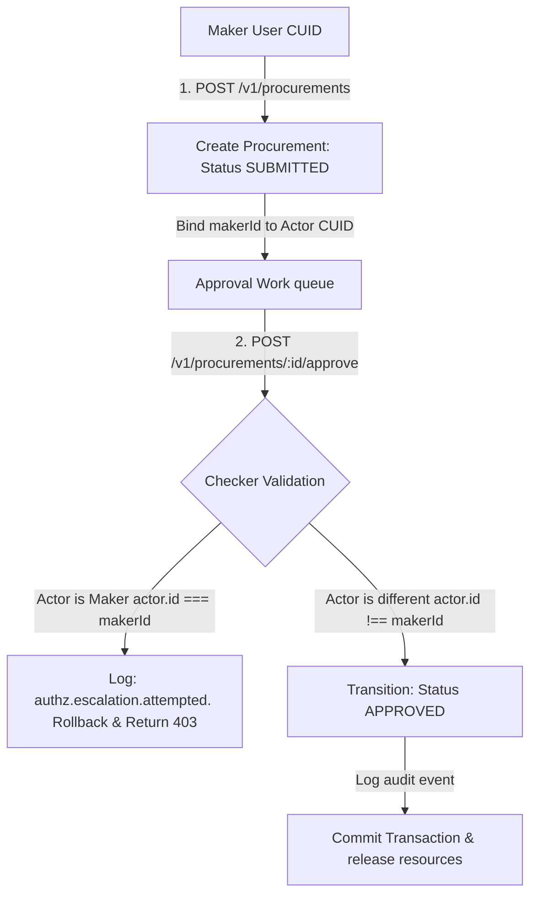
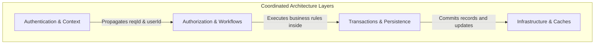

# ERP Business Logic & Workflow Architecture Guide

**Phase:** 8b — Session 8b  
**Scope:** ERP Engineering Philosophy, Core Workflow Foundations, Layered Authorization Architecture, Dynamic ERP State Models, Cross-Domain Coordinations, and Operational Scaling Caveats.  
**Prerequisites:** [`05-engineering/BUSINESS_RULES.md`](./BUSINESS_RULES.md) (Domain Rules), [`05-engineering/DOMAIN_INVARIANTS.md`](./DOMAIN_INVARIANTS.md) (System Invariants).

---

## 1. ERP Engineering Philosophy

Enterprise Resource Planning (ERP) systems represent the transactional and process-oriented core of corporate entities. Unlike general consumer web applications (which focus heavily on rapid, isolated interactions), ERP systems govern financial ledgers, legal contracts, complex approvals, resource allocations, and regulatory logs. Their design is driven by five core engineering principles:

### 1. Workflow-Driven Lifecycle States

In an ERP, data is rarely static. Business records (such as invoices, procurement orders, and maintenance tickets) progress through **deterministic, state-governed lifecycles**. Each state transition is a formal transaction representing a business event, requiring specific actor validations, invariant assertions, and database updates.

### 2. The Dominance of Business Invariants

ERP systems are governed by strict mathematical and logical rules. For example, in double-entry bookkeeping, debits must always equal credits (`debitSum === creditSum`). A single out-of-balance transaction ruins the entire accounting ledger. These invariants are non-negotiable and must be protected by database-level constraints and atomic transactions.

### 3. Forensic Auditability as a Core Control

In an enterprise environment, operational debugging logs are transient, but **compliance audit trails are permanent and legally binding**. Every transaction, approval, denial, and dynamic privilege escalation must be permanently recorded with full actor trace details to satisfy regulatory audits (e.g., Sarbanes-Oxley or GDPR) and enable post-incident forensics.

### 4. Dynamic, Scoped Resource Ownership (ABAC)

ERP users operate in complex hierarchical org structures. Security cannot be evaluated solely by a user's role (e.g. "Accountant"). The system must dynamically evaluate **contextual ownership (ABAC)**: _Does this Accountant belong to the same organizational division that generated the invoice?_ _Does this manager own the budget threshold for this purchase?_

### 5. Multi-Tenant Relational Isolation

As an ERP scales, it must support distinct corporate entities (tenants) securely. Relational models must isolate tenant boundaries, ensuring that a database query executed by an actor in Tenant A can never leak data from Tenant B, even under degraded circuit-breaker states.

---

## 2. Current ERP Foundations

The backend's architecture provides a stable foundation that naturally supports the evolution into a fully fledged, multi-tenant ERP platform:

- **CRM & Contracts:** Supported by the dynamic database-driven RBAC cache and Gate 2 ABAC service assertions, enabling granular, record-level contract controls.
- **Invoices & Accounting:** Relies on `runInTransaction` to ensure that invoice updates and ledger entries commit atomically, preventing out-of-balance entries.
- **Approvals & Workflows:** Handled by the global active worker queue and isolated `AsyncLocalStorage` context propagation, providing clean lifecycle tracking for background approvals.
- **Tenant Management:** Aligned with the soft-reference audit logging and whitelisted query shapes, ensuring clean multi-tenant isolation at the persistence layer.

---

## 3. Domain Workflow Architecture

The progression of an enterprise transaction traces a continuous lifecycle across five distinct architectural layers:

---

## 4. Workflow-Oriented Layered Authorization

ERP workflows require a **layered authorization model** where role-based checks (RBAC) and attribute-based assertions (ABAC) coexist.

### Why Route-Level RBAC is Insufficient Alone

Route-level middleware (Gate 1) is static and operates at the edge of the HTTP stack. It can only evaluate simple claims, such as: _Is the user an Employee?_
However, it cannot answer contextual business questions, such as:

- _Does this employee own this specific procurement ticket?_
- _Does the transaction amount ($15,000) exceed the employee's designated approval limit ($5,000)?_

These checks require database state, domain calculations, and context, which can only be evaluated inside the service layer (Gate 2) using explicit assertions (`assertScopedPermission`).

### Scoped Permission Invariants

The system evaluates permissions by combining RBAC claims with dynamic ABAC context:

- **Scope `:own`:** Restricts actions to resources owned directly by the actor (`actor.id === resource.ownerId`).
- **Scope `:any`:** Escalates permissions, allowing mutations on foreign resources (e.g. administrative overrides).

---

## 5. Future ERP Workflow Models

To demonstrate how the backend architecture scales to handle complex ERP tasks, we model four core enterprise workflows:

### 5.1 Maker-Checker Procurement Approval

- **The Business Rule:** A single user cannot both submit and approve the same procurement request. This enforces separation of duties to prevent fraud.
- **Ownership Transitions:**
  1. The **Maker** creates the procurement request. State is set to `SUBMITTED`, and `makerId` is set to the user's CUID.
  2. The **Checker** reviews the request. The service asserts `actor.id !== makerId`. If valid, state transitions to `APPROVED`, and `checkerId` is set to the Checker's CUID.
- **Transactional Implications:** The state transition, signature binding, and audit log write must be executed within a single transaction.
- **Audit Implications:** Logs the event `procurement.approved` along with both CUID signatures, providing a clean audit trail.

### 5.2 Invoice Approval Chain

- **The Business Rule:** Invoices are approved by managers based on budget thresholds:
  - Amount <= $5,000: Approved by department manager (Role Level 50).
  - Amount > $5,000: Approved by division director (Role Level 80).
- **Ownership Transitions:** The invoice's `assignedApproverId` shifts dynamically up the organizational hierarchy as limits are exceeded.
- **Transactional Implications:** The state progression, assignment updates, and ledger locks must be executed within an atomic transaction.
- **Audit Implications:** Every transition step generates a compliance record containing the approval amount and signatures.

### 5.3 Maintenance Ticket Lifecycle

- **The Business Rule:** Maintenance tickets must be created by a tenant, assigned to a technician, and validated by the tenant upon completion.
- **Ownership Transitions:**
  - Created: Owner = Tenant (`ownerId = tenantId`), State = `OPEN`.
  - Assigned: Owner = Tenant, Assignee = Technician (`technicianId`), State = `ASSIGNED`.
  - Resolved: Technician marks resolved, State = `RESOLVED`.
  - Closed: Tenant validates work, State = `CLOSED`.
- **Transactional Implications:** Ticket state transitions and resource allocations commit atomically.
- **Audit Implications:** Logs all transitions to enable SLA tracking and reporting.

### 5.4 Multi-Tenant Booking Allocation

- **The Business Rule:** Multi-tenant booking systems must prevent double-booking of shared resources.
- **Ownership Transitions:** Bookings are permanently bound to a tenant ID, with state transitions moving from `REQUESTED` to `CONFIRMED`.
- **Transactional Implications:** Resource allocations must be protected by explicit database-level locks, preventing double-bookings from concurrent requests.
- **Audit Implications:** Tracks tenant allocations for cost accounting and reporting.

---

## 6. Cross-Domain Coordination

To maintain system integrity, the backend coordinates operations across four architectural layers:

1. **Context & Authorization Coordination (`auth` + `RBAC` + `audit`):**  
   The authentication middleware captures the user profile and injects context into the `AsyncLocalStorage` store. Downstream services read this store to evaluate ABAC assertions, routing outcomes directly to the compliance logging tables.
2. **Workflow & Transaction Coordination (`workflows` + `transactions`):**  
   Services translate multi-step business workflows into atomic database changes. Using Prisma's transaction client (`tx`), mutations and compliance events are committed as a single unit, ensuring that partial failures roll back cleanly.
3. **Ownership & Serialization Coordination (`ownership` + `serialization`):**  
   Access scopes determine the returned data payload. Serializers inspect the resolved ownership status, stripping sensitive attributes before returning the payload to the client.
4. **Infrastructure & Consistency Coordination (`infrastructure` + `consistency`):**  
   During caching outages, the circuit breaker manages local memory caches (`LRUCache`) to prevent service disruptions, accepting transient authorization drift as a trade-off for high availability.

---

## 7. ERP Scaling Bottlenecks & Contention Zones

As enterprise transaction volumes scale, systems face specific performance bottlenecks:

### 7.1 Database Index and Row Contention Zones

High-frequency tables (such as `tokens`, `audit_logs`, and ledger entries) experience significant row contention during concurrent writes.

- **The Contention:** Bulk deletion operations (e.g. daily token cleanups) lock index branches, causing latency spikes on login and registration routes.
- **Mitigation:** Purges must be paginated in chunks (e.g., deleting 1,000 records per transaction with a 100ms pause) to keep tables responsive and prevent database lockups.

### 7.2 Approval Chain Orchestration Latency

Multi-tiered approval workflows require coordination across multiple actors, creating transaction delays.

- **The Bottleneck:** Long approval chains can block database threads and consume connection pool limits.
- **Mitigation:** Long-running workflows must be decoupled from the core database transaction loop using asynchronous state machine managers (such as Temporal or BullMQ).

### 7.3 Multi-Tenant Scale Limits

As tenant volumes expand, sharing a single database schema (row-level isolation) can lead to performance degradation.

- **The Limitation:** Large tenant tables consume index limits, slowing down B-Tree lookups.
- **Mitigation:** The architecture must prepare for a transition to **database-per-tenant** or schema-per-tenant sharding configurations, routing queries dynamically at the connection proxy layer.
