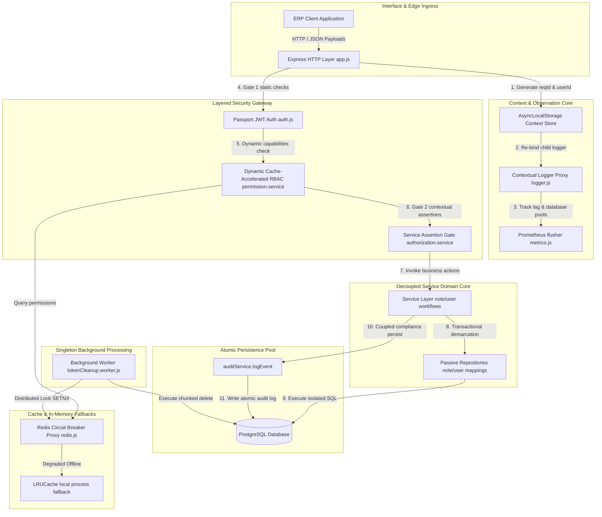
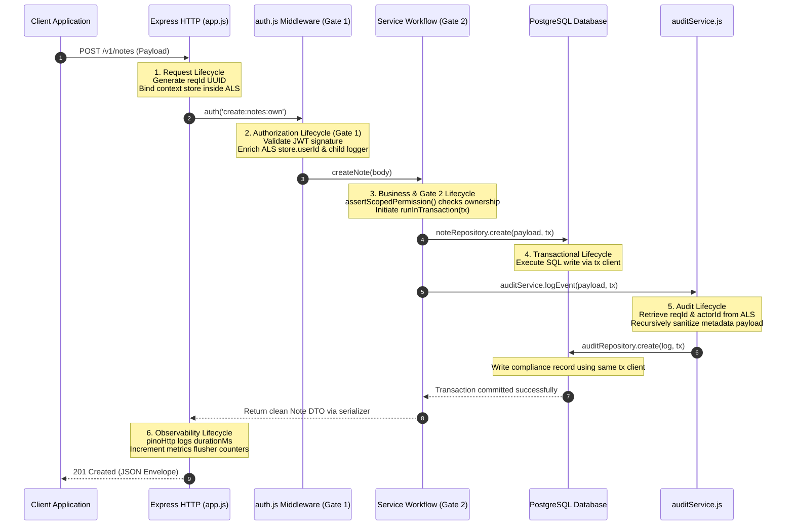

# Final Engineering Convergence Handbook

**Phase:** 10b — Session 10b  
**Scope:** Full-System Architectural Convergence, Core Engineering Governance, System-Wide Operational Guarantees, Invariant Matrices, Remaining Technical Debt, and ERP Domain Evolution.  
**Prerequisites:** All previous architectural chapters (Phase 1 through Phase 10a).

---

## 1. Final Architecture State

This handbook represents the **final architectural convergence layer** of the enterprise backend. It integrates the modular codebases, operational runtimes, security paradigms, persistent structures, and testing sentinel networks into a single, cohesive engineering blueprint.

---

## 2. Canonical Engineering Principles

Every line of code committed to the repository must adhere strictly to these ten foundational principles:

1. **Thin and Passive Controllers:** Controllers are purely HTTP adapters, handling request parsing and response mapping. They contain no business logic, transactions, or security gates.
2. **Service-Owned Business Logic:** The service layer is the sole author of business workflows and invariant validations.
3. **Passive Repository Isolation:** Repositories only translate requests into SQL shapes, accepting optional database transaction clients (`tx`) to keep control in the service layer.
4. **Isolated Egress Serializers:** All database outputs must be processed through whitelisted serializer filters (`src/serializers/`) to prevent internal database schemas or credentials from leaking.
5. **Atomic Transactional Consistency:** Any business mutation that spans multiple rows or includes compliance audits must be executed within a single transaction rollback block using Prisma's `$transaction` client.
6. **Layered Authorization Coexistence:** Static permission checks (Gate 1 RBAC) and dynamic ownership assertions (Gate 2 ABAC) must coexist to protect the system.
7. **PostgreSQL as Canonical Truth:** PostgreSQL is the only persistent source of truth. All tables, relational constraints, and cascading rules are managed through formal migrations.
8. **Redis as Caching Acceleration Only:** Redis is an optional performance accelerator. The application must continue to function correctly in degraded mode if Redis is completely down.
9. **Compliance Audit Immutability:** Audit records are transaction-coupled, recursively sanitized, and stored as static CUID strings to survive the deletion of parent entities.
10. **Observability-First Operations:** Observability is a core dependency. Event loop lags, connection pools, and circuit-breaker states are continuously tracked and reported.

---

## 3. Canonical Flow Lifecycle

The life of a transaction moves through a deterministic sequence across our architectural layers:

---

## 4. System-Wide Operational Guarantees

Our architecture enforces six operational guarantees:

- **Transactional Rollback Guarantee:** Any database write failure in a transaction rolls back all changes, including the audit log, preventing partial states.
- **Compliance Audit Guarantee:** Audit records are permanent, recursively sanitized, and use static CUID strings to survive parent deletions.
- **Degraded-Mode Guarantee:** If Redis goes offline, the circuit breaker trips, routing caching requests to local LRU caches to prevent service disruptions.
- **Cache Invalidation Guarantee:** Cache deletions write to both Redis and local memory caches, preventing nodes from holding stale permissions during drops.
- **Two-Gate Authorization Guarantee:** Gate 1 (Passport RBAC) and Gate 2 (Service ABAC) must both authorize a request before mutations are allowed.
- **Observability-First Guarantee:** Structured JSON logging, `AsyncLocalStorage` request-scoped stores, and custom metrics flusher tracking must remain active at all times.

---

## 5. Architectural Invariants Matrix

Critical system invariants are summarized in the matrix below:

| Invariant Category         | Code Identifier | Enforced Principle           | Enforcement Location       | Security Implication                                                            |
| :------------------------- | :-------------- | :--------------------------- | :------------------------- | :------------------------------------------------------------------------------ |
| **Authentication**         | `INV-AUTH-01`   | Linear Refresh Progression   | `auth.service.js`          | Replays of blacklisted tokens past 2s trigger immediate session terminations.   |
| **Authentication**         | `INV-AUTH-02`   | Atomic Token Rotation        | `auth.service.js`          | Token updates and invalidations must commit together in a single transaction.   |
| **Authorization**          | `INV-AUTHZ-01`  | Vertical Level Boundaries    | `authorization.service.js` | Admins cannot assign roles with privilege levels exceeding their own max level. |
| **Authorization**          | `INV-AUTHZ-02`  | Scoped Permission Resolution | `authorization.service.js` | Standard users require direct user CUID ownership mapping.                      |
| **Ownership**              | `INV-OWN-01`    | Note Owner CUID Validity     | `schema.prisma`            | Every note must be permanently bound to a valid user CUID.                      |
| **Ownership**              | `INV-OWN-02`    | Cascading User Deletion      | `user.service.js`          | Deleting a user must recursively delete all notes owned by that user first.     |
| **Audit Compliance**       | `INV-AUD-01`    | Atomic Audit Coupling        | `note.service.js`          | Audit records must share the transaction client of their parent writes.         |
| **Audit Compliance**       | `INV-AUD-02`    | Audit Log Immutability       | `schema.prisma`            | Audit logs do not define cascading relations, preserving compliance histories.  |
| **Egress Serialization**   | `INV-SER-01`    | Password Hash Isolation      | `user.serializer.js`       | Plaintext passwords and hashes are stripped at egress boundaries.               |
| **Relational Transaction** | `INV-TX-01`     | Transaction Client Injection | `repositories/`            | Repositories must use the provided transaction client parameter `tx`.           |
| **Infrastructure Caching** | `INV-INF-01`    | Redis Caching Fallback       | `redis.js`                 | Redis unavailability must never block core business transactions.               |

---

## 6. Current Architectural Strengths

The backend operates with six proven structural strengths:

1. **Deterministic Testing:**ephemeral Testcontainers spin up real PostgreSQL databases, eliminating flaky mock-based tests.
2. **Integration-First Validation:** Test suites run against real Express routing pipelines and database engines, validating core logic.
3. **Dynamic Dynamic Dynamic Dynamic RBAC Caching:** flat permissions resolution is accelerated using token-based Redis caching and local LRU backups.
4. **Transactional Audit Consistency:** Every business write commits alongside its compliance record, preventing orphaned logs.
5. **Operational Caching Resilience:** The circuit-breaker state machine isolates Redis outages without disrupting service operations.
6. **Modular Monolith Readiness:** Decoupled domains (Bounded Contexts) communicate through clean interfaces, preparing the codebase for future microservice sharding.

---

## 7. Remaining Engineering Debt & Limitations

While resilient, the architecture operates under seven documented scaling limits:

- **`SEC-RES-01`: Split-Brain In-Memory RBAC Drift:** Caching outages force nodes to fall back to process-isolated `LRUCache` fallbacks. Since local process memories cannot communicate, nodes experience a transient **5-minute cache split-brain window** where role updates and privilege revocations can cause authorization variations between server instances.
- **`SEC-RES-02`: Missing DB Connection Pool Circuit Breaker:** The application lacks a circuit breaker on the Prisma PostgreSQL connection pool. If PostgreSQL drops offline, Prisma will continue to attempt connections, consuming socket limits. A database proxy (e.g. pgBouncer or AWS RDS Proxy) must be positioned in front of Prisma to handle database scaling boundaries.
- **`SEC-RES-03`: Crash-Only Cleanup Recovery:** If a node suffers a sudden, hard power failure (OOM crash, container termination without SIGTERM), the graceful shutdown logic is bypassed. Active background cleanup workers will terminate mid-operation, and database locks held in Redis will persist until their 5-minute TTL expires, blocking subsequent cleanups until the lock releases.
- **`SEC-OBS-01`: Absence of Centralized Distributed Tracing:** The backend lacks OpenTelemetry SDK integrations. Correlation `reqId` strings propagate perfectly across single-instance Node threads, but will not automatically propagate across HTTP or queue boundaries in a distributed microservices setup.
- **`SEC-OBS-03`: Lack of Dynamic Logging Level Overrides:** Log levels are defined at startup. If a security incident occurs in production, operators cannot dynamically elevate log levels to `debug` for a specific user without restarting processes.
- **`SEC-WORK-01`: Concurrent Cleanup Deadlocks:** Under Redis outages, worker lock checks are bypassed to guarantee execution. If multiple worker instances run concurrently, they can cause database deadlocks on highly populated tables.
- **`SEC-WORK-02`: Monolith Event Loop Starvation:** Background jobs run within the single-threaded Node.js event loop. A heavy cleanup task can block the loop, causing latency spikes on real-time HTTP routes.

---

## 8. ERP Evolution Readiness

The modular monolith is designed to support future enterprise ERP domains seamlessly:

- **CRM Bounded Context:** Ready for dynamic customer assignments using Gate 2 ABAC assertions.
- **Accounting Bounded Context:** Ready for balanced entries (`debitSum === creditSum`) using the transaction runner.
- **Approval Chain Bounded Context:** Ready for multi-tiered approval chains using the active worker queue and isolated ALS logging context maps.
- **Tenant Isolation Bounded Context:** Ready for database-per-tenant sharding using our dynamic Prisma Singleton Proxy client.

---

## 9. Engineering Governance & Drift Prevention

### The Danger of Architectural Drift

Software decay is slow and silent. It occurs when developers make minor bypasses (e.g. importing a repository directly into a controller, bypassing a service transaction wrapper, or writing an unsanitized SQL join). Over time, these bypasses erode the architecture, creating data consistency bugs, security gaps, and fragile code.

### The Governance Code

1. **Correctness Dominates Performance:** A fast database query is useless if it commits corrupted ledger data. Relational integrity and transaction safety must never be sacrificed for performance.
2. **Invariants are Non-Negotiable:** System invariants (linear token rotation, vertical role boundaries, static audit referencing) must be protected by active database constraints, transaction rollbacks, and automated unit tests.
3. **Observability is a Core Functional Dependency:** System operations must remain visible at all times. A change that breaks structured JSON logging or context propagation is treated as a critical production blocker.
4. **ERP Systems are Workflow-Centric:** Data is never static. Records progress through state transitions. These transitions are formal transaction events that must be protected by layered authorization gates, transactional consistency, and permanent compliance audit records.
