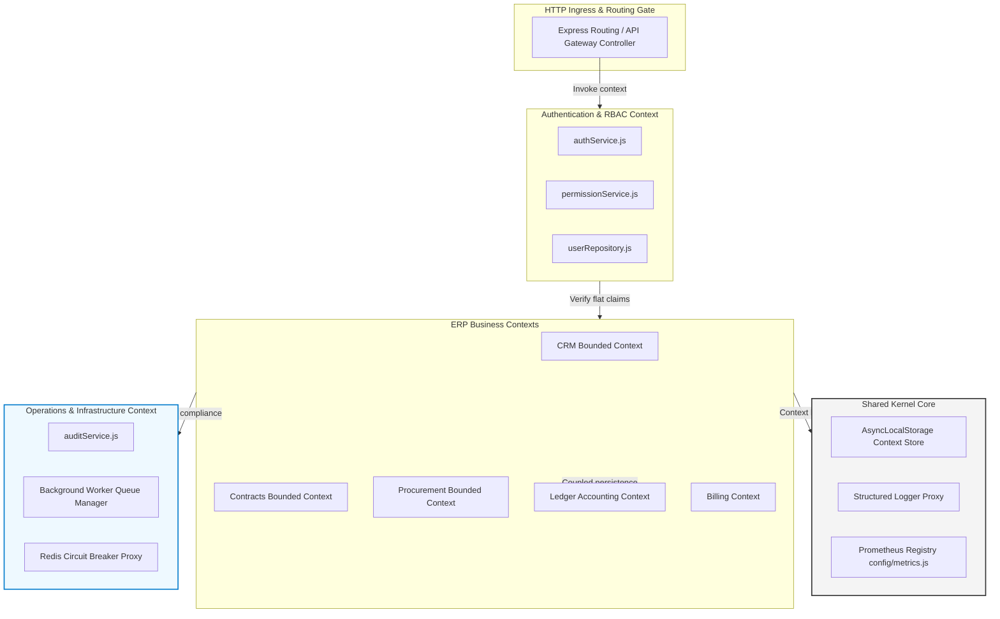
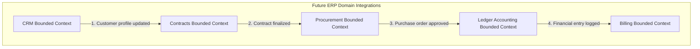
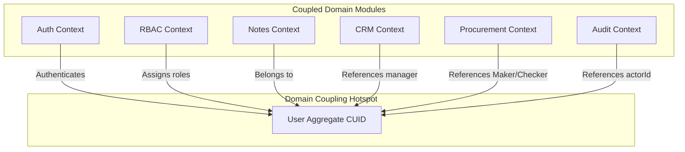
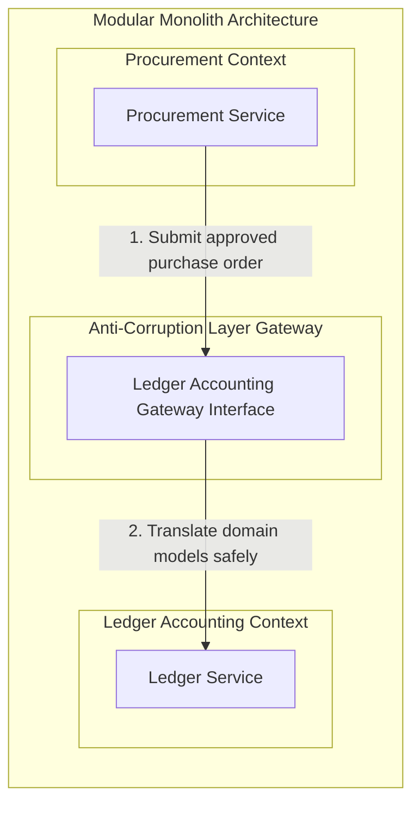
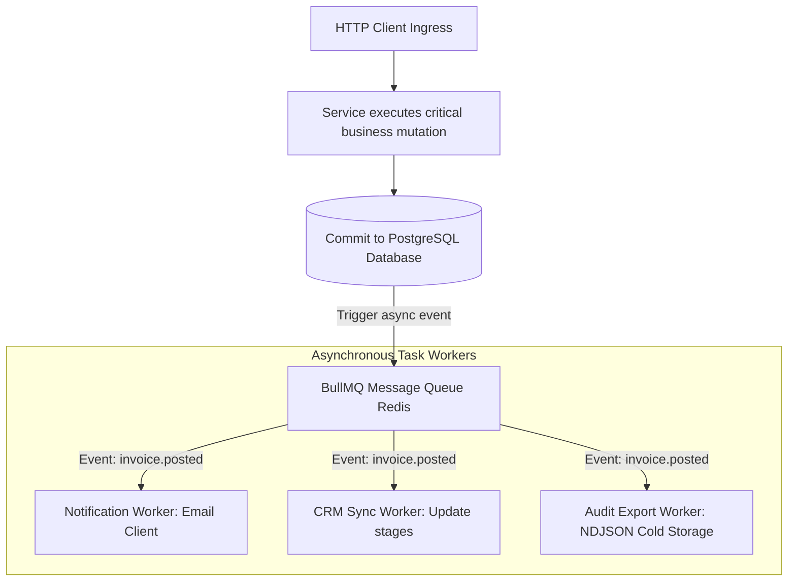

# Future Module Architecture & Bounded Contexts Handbook

**Phase:** 10a — Session 10a  
**Scope:** Modular Monolith Evolution, Premature Microservices Prevention, Bounded Context Boundaries, Future ERP Domain Mapping, Domain Coupling & Anti-Corruption Layers, and Infrastructure Scalability Blueprints.  
**Prerequisites:** [`05-engineering/ERP_BUSINESS_LOGIC_GUIDE.md`](./ERP_BUSINESS_LOGIC_GUIDE.md) (ERP Workflows), [`00-core/SYSTEM_MAP.md`](../00-core/SYSTEM_MAP.md) (Architecture boundaries).

---

## 1. Evolution Philosophy

Scaling an enterprise ERP system requires a pragmatic, architecture-first approach. We reject two common engineering mistakes: retaining a messy, un-structured monolith, and rushing into premature microservices. Our system evolution is guided by four principles:

### 1. The Modular Monolith-First Approach

A **Modular Monolith** provides the best of both worlds: high code isolation and absolute transactional safety. In an ERP, modules (such as Accounting, Procurement, and Billing) must maintain clean boundaries, but they frequently share transactional scopes.

By keeping them inside a single deployable unit, we enforce strong relational integrity, execute fast database joins, and avoid the complex network overhead and distributed transaction nightmares (such as two-phase commits) of microservices.

### 2. The Danger of Premature Microservices

Splitting a codebase into microservices before the business domain, boundaries, and transaction patterns are fully understood is a primary cause of project failure.

- **The Consequences:** It introduces network latency, distributed deadlocks, eventual consistency bugs, high infrastructure costs, and complex deployments.
- **Our Strategy:** We maintain a single repository with strict, lint-enforced **Bounded Contexts**. If a specific module (such as Notifications) requires independent resource scaling, it can be cleanly detached into a separate microservice using established anti-corruption layers.

### 3. Protecting Business Invariants at Scale

Performance optimizations are useless if they corrupt business data. A database query execution speed of 1ms is irrelevant if a financial ledger commits an out-of-balance entry. Transactional consistency dominates all scalability decisions. EVENTUAL consistency is reserved strictly for non-critical, off-line workflows.

---

## 2. Future Modular Monolith Architecture

To transition safely to a modular monolith, we organize the application into distinct bounded contexts, ensuring each module owns its own database access layers and exposes isolated service boundaries.

---

## 3. Current Monolith Bounded Contexts

Our existing backend structure maps directly to six clean, isolated contexts:

| Bounded Context      | Responsibilities                                                              | Core File Paths                      | Transaction Boundaries                                                     | Egress Serialization Boundaries                               |
| :------------------- | :---------------------------------------------------------------------------- | :----------------------------------- | :------------------------------------------------------------------------- | :------------------------------------------------------------ |
| **Authentication**   | Session validation, JWT generations, refresh family tracking, rotation grace. | `src/services/auth.service.js`       | Stateful token rotation wrapped in isolated database transactions.         | Access tokens issued; raw password hashes stripped at egress. |
| **RBAC / Security**  | Flat claims matching, privilege vertical levels check, Dynamic RBAC cache.    | `src/services/permission.service.js` | Changes dynamically increment version keys to invalidate caches globally.  | Dynamic scopes flattening returned.                           |
| **Notes / Domain**   | Note mutations, cursor-based pagination query templates.                      | `src/services/note.service.js`       | Creates and updates note rows, coupled to atomic audit writes.             | Strips foreign IDs unless `:any` permissions are held.        |
| **Operations Audit** | Compliance trail captures, metadata recursive sanitizations.                  | `src/services/audit.service.js`      | Coupled to parent transaction; rolls back if business mutations fail.      | Immutable logs; key redaction filter active.                  |
| **Infrastructure**   | Redis circuit breakers, `LRUCache` process-local memory cache.                | `src/config/redis.js`                | Circuit handles failures; fallbacks execute outside database transactions. | Safe local cache reads.                                       |
| **Background Tasks** | Ephemeral cron setups, singleton locks coordination.                          | `src/workers/tokenCleanup.worker.js` | Chunked purging executions prevent database lockups.                       | Worker logs only.                                             |

---

## 4. Modeling Future ERP Modules

As the system expands, we map new enterprise domains into dedicated bounded contexts:

### 4.1 CRM Bounded Context

- **Responsibilities:** Managing customer profiles, contact histories, and pipeline stages.
- **Ownership Rules:** Customers are owned by account managers; cross-account edits require division `:any` permissions.
- **Transactional Hotspots:** Bulk CSV customer imports can block database index updates.
- **Audit Implications:** Tracks all profile updates and contact history changes for compliance.
- **Authorization Implications:** Restricts customer profile access based on division RBAC settings.
- **Scaling Risks:** Customer tables can grow significantly, slowing down B-Tree index lookups.

### 4.2 Contracts Bounded Context

- **Responsibilities:** Contract lifecycles, amendment tracking, and legal signatures.
- **Ownership Rules:** Bound to dynamic organizational roles; requires delegated approval signatures.
- **Transactional Hotspots:** Version updates and signature bindings must commit atomically.
- **Audit Implications:** Requires immutable legal signature history records.
- **Authorization Implications:** Restricts access to high-value contracts using role-level gates.
- **Scaling Risks:** Document attachments can bloat database size, requiring off-line object storage.

### 4.3 Procurement Bounded Context

- **Responsibilities:** Purchase requests, vendor management, and approval chains.
- **Ownership Rules:** Maker-Checker rules apply; makers cannot approve their own tickets.
- **Transactional Hotspots:** State transitions must execute within atomic transactions.
- **Audit Implications:** Tracks all approvals, rejections, and escalations.
- **Authorization Implications:** Enforces purchase limit boundaries based on user role levels.
- **Scaling Risks:** High procurement volumes can cause lock contention on index tables.

### 4.4 Ledger Accounting Bounded Context

- **Responsibilities:** Double-entry ledger postings, ledger updates, and balance sheets.
- **Ownership Rules:** Owned strictly by corporate treasury and financial administrators.
- **Transactional Hotspots:** Bookings must be balanced; debits must equal credits (`debitSum === creditSum`).
- **Audit Implications:** Requires immutable ledger transaction logs for regulatory audits.
- **Authorization Implications:** Restricts ledger mutations to authorized financial accounts.
- **Scaling Risks:** Financial postings can suffer from row lock bottlenecks under concurrent writes.

### 4.5 Billing Bounded Context

- **Responsibilities:** Invoice generation, payment gateways, and recurring subscriptions.
- **Ownership Rules:** Invoices are bound to tenant accounts; reassignments require authorization.
- **Transactional Hotspots:** Payment confirmations must update ledger entries atomically.
- **Audit Implications:** Tracks tax calculations and payment details.
- **Authorization Implications:** Restricts payment method edits to verified account owners.
- **Scaling Risks:** Concurrent recurring billings can cause event loop lag during active runs.

---

## 5. Domain Coupling & Shared Kernel Analysis

As the modular monolith expands, we must manage domain coupling to prevent circular dependencies and transactional deadlocks:

### 1. The Shared User Aggregate Coupling Hotspot

The `User` model is the primary source of coupling across all contexts:

- **The Risk:** Direct database relationships between notes, procurements, ledgers, and users create massive dependencies. If a user is deleted, cascading checks can block operations across multiple contexts.
- **Mitigation:** Adopt a **Shared Kernel** pattern for the `User` CUID, treating the ID as a static primitive string in other contexts. Business modules query users through explicit services rather than using raw SQL joins.

### 2. Shared Transaction Risks

If a service transaction spans multiple Bounded Contexts (e.g. `procurementService` updating both purchase orders and ledger bookings in a single transaction):

- **The Risk:** A failure in one domain rolls back the entire transaction, causing cascading performance bottlenecks.
- **Mitigation:** Enforce strict **Anti-Corruption Layers (ACL)**. If Domain A needs to update Domain B, it executes the change via an asynchronous message or a formal service-layer interface rather than using direct database queries.

---

## 6. Modularization Strategy & Anti-Corruption Layers

To transition safely to a modular monolith, we organize the codebase into isolated contexts and protect boundaries using Anti-Corruption Layers (ACL).

- **Anti-Corruption Layer (ACL):** Serves as an interface gateway. It translates the domain models of Domain A into the schemas of Domain B, protecting internal domain structures from bleeding into other contexts.
- **Strict Repository Ownership:** A repository must be called ONLY by its corresponding service. Direct repository imports from other domains are strictly forbidden, ensuring that database updates are always governed by business rules.

---

## 7. Future Eventual Consistency & Async Workflows

As the application scales, critical path latency is reduced by moving non-blocking operations to asynchronous message queues (e.g. BullMQ driven by Redis):

- ** eventual Consistency Zones:** Reserved strictly for off-line workflows:
  - Sending customer notification emails.
  - Syncing CRM stages after a contract is signed.
  - Exporting compliance logs to cold storage.
- **Event-Driven Workflows:** Business mutations commit to the primary database first, then publish events to the message queue. Asynchronous task workers process jobs independently without blocking the core HTTP loop.

---

## 8. Future Infrastructure Scaling & Evolution

To handle expanding enterprise workloads, we scale our database, caching, and background worker tiers:

- **PostgreSQL Read/Write Splitting:**  
   Write queries execute on the primary database, while read queries are routed to read-replicas, protecting write performance from intensive reporting tasks.
- **Cold-Storage Partitioning for Audit Logs:**  
   As compliance logs grow, we partition the `audit_logs` table by date, moving historical logs to cold-storage partitions to keep index sizes responsive.
- **Distributed Locking (Redlock):**  
   If background workers scale horizontally across multiple container nodes, we upgrade singleton locks from single-instance Redis connections to the **Redlock algorithm** to coordinate executions reliably.
- **Observability Scaling:**  
   As logs expand, NDJSON streams are shipped to centralized log aggregators (e.g. Elasticsearch or Datadog) for real-time indexing and SIEM alerting.
