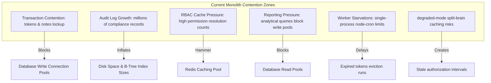
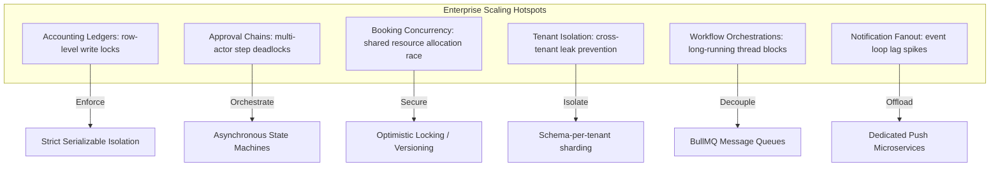
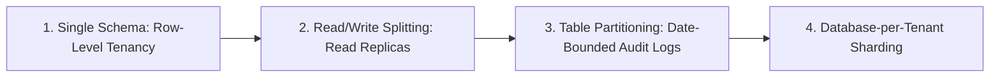
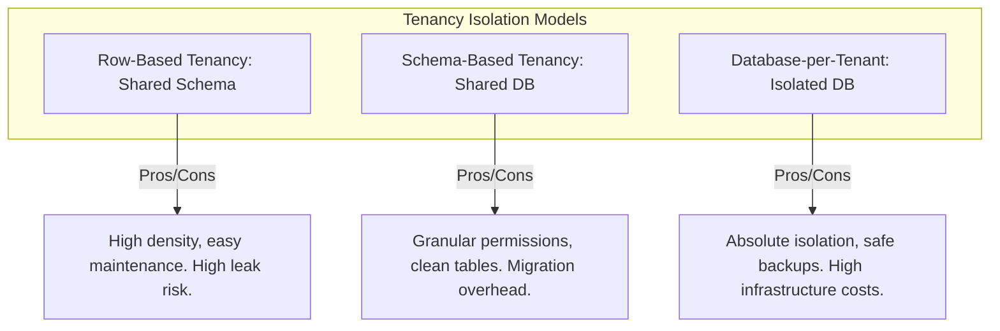

# Scaling & System Evolution Handbook

**Phase:** 10a — Session 10a  
**Scope:** Scaling Philosophies, Monolith Bottleneck Topologies, Future Scaling Hotspots, Database Evolutions, Operational Scalability, Advanced ABAC, Tenancy Isolation Models, and Future Failure Modes.  
**Prerequisites:** [`05-engineering/FUTURE_MODULE_ARCHITECTURE.md`](./FUTURE_MODULE_ARCHITECTURE.md) (Bounded Contexts), [`04-operations/INFRASTRUCTURE_AND_RESILIENCE.md`](../04-operations/INFRASTRUCTURE_AND_RESILIENCE.md) (Resilience).

---

## 1. Scaling Philosophy

Enterprise ERP systems operate under a unique constraint: **Logical correctness dominates all scaling decisions**. While consumer web systems can trade eventual consistency for rapid scaling (e.g. social feeds or comment counters), an ERP system has no such liberty.

### 1. The Primacy of Transactional Correctness

In a billing or general ledger database, a single out-of-balance transaction ruins the entire accounting model. Performance optimizations must never compromise data integrity or unique constraints. If a system is fast but incorrect, it is fundamentally broken.

### 2. Why ERP Systems Fail under Workflow Complexity

Unlike simple CRUD applications (which scale horizontally by adding web servers), ERP systems face significant bottlenecks at the database layer. As business processes grow in complexity, they create long-running database transactions, row-level index contention, and lock deadlocks across related tables, causing database threads to hang and consuming socket pools.

### 3. Observability as a Scaling Guardrail

As transaction volumes expand, operators must have absolute visibility into database latencies, event loop lags, circuit breaker status transitions, cache hits/misses, and background worker queues. Without active metrics and structured JSON logging, scaling bottlenecks are impossible to isolate.

---

## 2. Monolith Bottleneck Topology

- **Transaction Contention:** High-frequency routes (like authentications and note mutations) create lock contention on the `tokens` and `notes` tables, blocking connection pools during bulk runs.
- **Audit Log Growth:** Capturing metadata payloads for every transaction causes rapid B-Tree index inflation, slowing down write queries.
- **Reporting Pressure:** Complex reporting and analytical queries run against the primary database schema, locking tables and blocking write operations.
- **Degraded Caching Limits:** Cache fallbacks during Redis outages force load-balanced instances into process-isolated `LRUCache` states, creating a 5-minute cache split-brain window.

---

## 3. Future Scaling Hotspots

As the modular monolith evolves into an enterprise ERP, we identify six primary contention zones:

---

## 4. Database Evolution Roadmap

To handle expanding enterprise workloads, our database layer must evolve through four architectural stages:

### 1. Table Partitioning for Audit Logs

As compliance logs grow, we partition the `audit_logs` table by date (e.g., creating monthly table segments). This keeps B-Tree index sizes responsive, allowing old partitions to be moved to cold storage without blocking active write operations.

### 2. Read/Write Database Splitting

We configure read-replicas to handle reporting and analytical tasks. Write operations commit to the primary database, while read requests are routed to replicas, preventing reporting lockups from affecting transaction performance.

### 3. Database-per-Tenant Sharding

To scale past single-database limits, we transition from simple row-based tenant isolation to **database-per-tenant sharding**, routing tenant queries dynamically at the connection proxy layer to guarantee absolute data isolation.

---

## 5. Operational Scaling & Advanced Locking

To scale background processes and coordinate executions across horizontally scaled monolith nodes:

- **Horizontal Worker Scaling:** Decouple cron schedules from in-memory Node-cron loops and transition to a distributed message queue (e.g. BullMQ) driven by separate worker containers.
- **Distributed Locking (Redlock):** In load-balanced multi-instance setups, we upgrade lock coordinators to the **Redlock algorithm** to ensure singleton execution safety across independent Redis nodes.
- **SIEM Log Aggregation:** Operational JSON logs are shipped to centralized log aggregators (e.g. Elasticsearch or Datadog) for real-time indexing and threat monitoring.

---

## 6. Future Authorization Evolution

As organizational hierarchies grow in complexity, the authorization pipeline must evolve:

- **Dynamic Approval Chains:** Implement approval chains that evaluate user hierarchies dynamically at runtime, checking delegated authorities and budget thresholds.
- **Delegated Authority Matrix:** Define date-bounded delegation relationships inside the database, allowing users to temporarily delegate their approval authorities to other actors.
- **Temporary Permissions:** Enforce time-to-live bounds on high-privilege roles, automatically evicting permissions after a set window to minimize threat boundaries.
- **Organization-Scoped Permissions:** Transition from basic `:own`/`:any` scopes to organization-scoped permissions, restricting queries to specific corporate divisions or branches.

---

## 7. Multi-Tenant Evolution Models

To support distinct corporate clients securely, the system evaluates three tenancy isolation models:

- **Row-Based Tenancy (Current):** Tenants share a single database schema, isolated by tenant ID filters. It provides high density but presents a risk of cross-tenant leaks if a developer writes an unsanitized query.
- **Schema-Based Tenancy:** Tenants share a database but operate in separate schema namespaces, providing granular permissions and cleaner tables.
- **Database-per-Tenant (Target):** Tenants occupy isolated database instances. This guarantees absolute data isolation and tenant-specific backups, but increases infrastructure and migration overhead.

---

## 8. Future Failure Modes & Mitigations

As the ERP backend scales, engineers must handle six critical distributed failure modes:

| Failure Mode                      | Root Cause                                                  | System Behavior                                                              | Mitigation / Resolution                                                                             |
| :-------------------------------- | :---------------------------------------------------------- | :--------------------------------------------------------------------------- | :-------------------------------------------------------------------------------------------------- |
| **Distributed Transaction Drift** | Failure mid-operation across differentBounded Contexts.     | Out-of-balance database states or missing ledger postings.                   | Adopt the **Saga Pattern** or transaction coordinators to manage rollback actions.                  |
| **Split-Brain Cache Revocation**  | Cache updates fail on Redis connection drops.               | Nodes fallback to local LRUs, causing stale permissions for up to 5 minutes. | High-security actions bypass caches and force direct database checks.                               |
| **Workflow Deadlocks**            | Concurrent approval processes lock the same database index. | Database threads hang, consuming connection pool limits.                     | Enforce strict optimistic locking and time-bounded timeouts on all transactions.                    |
| **Reporting Drift**               | Read-replicas lag behind write primaries.                   | Financial reports return slightly stale data, confusing accountants.         | Design reporting systems to accept short read delays, forcing primary checks for critical balances. |
| **Audit Export Failure**          | Message queue drops audit events during a logging spike.    | Business mutations commit successfully, but audit history is lost.           | Enforce write-ahead logging (WAL) and retry loops inside the message queue.                         |
| **Tenant Isolation Leak**         | An un-sanitized dynamic SQL query lacks tenant ID filters.  | Tenant A views sensitive corporate data belonging to Tenant B.               | Enforce strict ORM query-shape restrictions and automated static code analysis checks.              |
