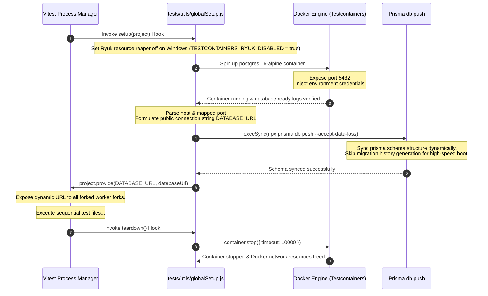
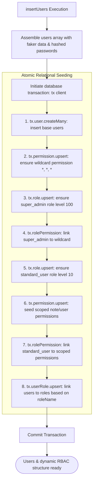
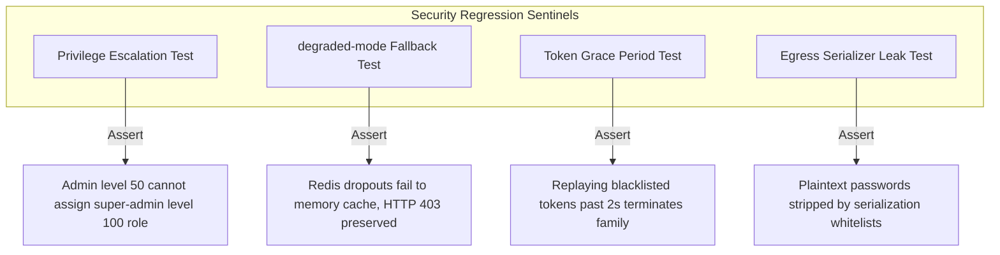
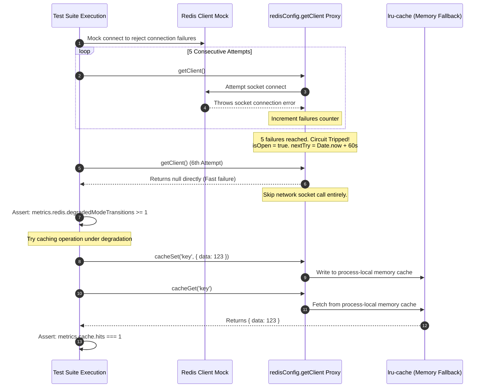

# Testing Architecture & Integration Strategy Handbook

**Phase:** 9 — Session 9  
**Scope:** Integration-First Testing Philosophy, Vitest Runner Architecture, Testcontainers Lifecycle Management, Database Test Isolation, Dynamic RBAC Fixture Seeding, Security Regression Sentinels, and Mocking Boundaries.  
**Prerequisites:** [`04-operations/INFRASTRUCTURE_AND_RESILIENCE.md`](../04-operations/INFRASTRUCTURE_AND_RESILIENCE.md) (Resilience semantics), [`05-engineering/DOMAIN_INVARIANTS.md`](./DOMAIN_INVARIANTS.md) (System Invariants).

---

## 1. Testing Philosophy

In enterprise ERP environments, high test coverage is not an aesthetic goal; it is a critical guardrail against security regressions and data corruption. Our testing strategy rejects standard unit-testing dogmas in favor of an **Integration-First Architecture**.

### 1. The Integration-First Strategy

Unit tests that isolate single functions by mocking out all external dependencies (such as Express middlewares, database queries, and cache clients) are highly brittle. They do not test what the code _actually does_; they only test the developer's _assumptions_ about what the dependencies do.

- **The Solution:** Our test suite runs against a real, live database (via Testcontainers) and traverses actual HTTP pipelines, validating that Express routers, passport auth middleware, Gate 2 ABAC service assertions, Prisma SQL builders, and transaction pools function seamlessly together.

### 2. Eliminating Brittle Mocking Boundaries

Mocks represent fake code. If a database schema or authorization contract changes, heavily mocked tests will continue to pass, blinding the engineering team to runtime crashes. Mocks are strictly forbidden for:

- **Express Middlewares:** JWT validation and RBAC matching must run against real Passport.js logic.
- **Database PERSISTENCE Layer:** SQL statements, relational CASCADE constraints, and unique index boundaries must be executed against a real database engine.
- **Permission Resolution:** Flat RBAC evaluations and Gate 2 assert gates must query real database states.

### 3. Absolute Test Determinism

A flaky test suite (one that sometimes passes and sometimes fails without code changes) is worse than no test suite at all. Flakiness erodes trust and slows deployments. We guarantee absolute determinism through strict process isolation, sequential test runs, and clean cascading table truncations between individual tests.

---

## 2. Test Lifecycle & Execution Flow

```mermaid
flowchart TD
    Start([Vitest Execution Ingress]) --> Step1[1. Global Setup globalSetup.js]

    subgraph global [Vitest Global Setup Context]
        Step1 --> Spin[Spin up postgres:16-alpine Testcontainer]
        Spin --> WaitLogs[Wait for: database system ready to accept connections]
        WaitLogs --> DBUrl[Generate dynamic DATABASE_URL connection string]
        DBUrl --> Push[Run npx prisma db push to apply schema]
        Push --> Inject[Provide DATABASE_URL to worker forks via project.provide]
    end

    Inject --> SetupSuite[2. Initialize Worker Processes pool: forks]

    subgraph worker [Vitest Fork Worker Process]
        SetupSuite --> SetupDB[Run setupTestDB.js per suite]
        SetupDB --> FetchUrl[Inject provided DATABASE_URL into process.env]
        FetchUrl --> Reconnect[Call prisma.$reconnect proxy dynamic binding]
    end

    Reconnect --> RunSuite[3. Test Execution sequential run]

    subgraph execution [Test Suite Run Loop]
        RunSuite --> BeforeEach[beforeEach hook: Execute CASCADE Truncate Table]
        BeforeEach --> RunTest[Execute Integration Test & Service Assertions]
        RunTest --> AfterEach[afterEach hook: Clean local mocks & spies]
    end

    AfterEach --> CheckNext{More tests in suite?}
    CheckNext -->|Yes| BeforeEach
    CheckNext -->|No| Disconnect[afterAll hook: prisma.$disconnect]

    Disconnect --> Teardown[4. Global Teardown globalSetup.js]

    subgraph teardown [Vitest Global Teardown Context]
        Teardown --> StopContainer[Stop PostgreSQL Testcontainer & release resources]
    end

    StopContainer --> End([Testing Complete])
```



---

## 3. Vitest Architecture

We utilize Vitest due to its sub-millisecond hot-module replacement (HMR), ESM-native execution pool, and seamless compatibility with Vite configurations.

### 3.1 Test Isolation & Pool Strategies (`vitest.config.js`)

To prevent test runs from corrupting each other, the configuration enforces three execution boundaries:

- **`fileParallelism: false`:** Runs test suites **sequentially** rather than concurrently. Since tests run against a single shared database container, parallel file runs would lead to race conditions, transaction deadlocks, and truncation conflicts.
- **`pool: 'forks'`:** Executes each test file in a separate Node.js fork process, isolating global memory states and preventing module cache bleed.
- **`restoreMocks: true`:** Automatically restores mocks and spies back to their original behavior after each test, preventing test bleed.

### 3.2 Configuration Invariants (`vitest.config.js` lines 7-11)

```javascript
env: {
  CORS_ORIGINS: '*',
  ENABLE_BACKGROUND_WORKERS: 'false', // 1. Isolated Background Workers
  REDIS_URL: '',                      // 2. Disabled Redis Cache
}
```

- **Background Worker Isolation:** Setting `ENABLE_BACKGROUND_WORKERS` to `'false'` prevents active node-cron loops from starting inside worker processes, ensuring tests are unaffected by background purging loops.
- **Redis Disabling:** Setting `REDIS_URL` to an empty string blocks caching sockets, forcing all tests into **degraded memory-caching mode** to guarantee that test suites run independently of external caching clusters.

---

## 4. Testcontainers Architecture

Mocking database constraints (like foreign key check violations or B-Tree unique indexes) is impossible. The application utilizes `testcontainers` to manage the persistence lifecycle deterministically.

### 4.1 Testcontainers Lifecycle



### 4.2 Epicenter of Ephemeral Databases (`globalSetup.js` lines 23-67)

- **Single Global Container Optimization:** Rather than spawning a separate Docker container for every test suite (which would add minutes of boot lag), `globalSetup.js` spins up **one global PostgreSQL container** at the start of the entire test run.
- **High-Speed Schema Sync:** Rather than executing slow SQL migration chains, the setup uses `npx prisma db push --accept-data-loss --skip-generate` to apply schema shapes directly to the container, completing database bootstrap in seconds.

---

## 5. Database Test Isolation

To isolate tests while sharing a single global container, the per-file test lifecycle hook (`tests/utils/setupTestDB.js`) coordinates database truncation.

### 5.1 Reconnecting Worker Clients (`setupTestDB.js` lines 12-23)

When a worker process starts, it pulls the dynamic `DATABASE_URL` from Vitest's inject channel and binds it to `process.env`. The module then forces the database client to rebind:

```javascript
const { inject } = await import('vitest');
const databaseUrl = inject('DATABASE_URL');
process.env.DATABASE_URL = databaseUrl;

// Force the Prisma proxy to rebuild the client targeting the container
prisma.$reconnect();
```

### 5.2 Clean-Slate Truncation Strategy (`setupTestDB.js` lines 25-29)

Before executing any test, the database tables are truncated using a cascading raw SQL command:

```javascript
beforeEach(async () => {
  await prisma.$executeRaw`TRUNCATE TABLE "notes", "tokens", "users", "audit_logs" CASCADE;`;
});
```

- **Why TRUNCATE CASCADE?** This purges all table rows, resetting indexes and cascading deletions down relational boundaries.
- **Isolation Guarantee:** Ensures that every test suite runs against a clean-slate database, preventing data residue from previous runs from leaking into current tests.

---

## 6. Dynamic RBAC Fixture Seeding

ERP access verification requires a valid, dynamic security context. Hardcoding static roles and permission arrays is a primary cause of brittle test suites. The fixture layer in `tests/fixtures/user.fixture.js` enforces dynamic transactional seeding.

### 6.1 RBAC Seeding Pipeline



### 6.2 Transaction-Secured Seeding (`user.fixture.js` lines 67-130)

- **Upsert Consistency:** All seeding commands execute within a single transaction block using upserts (`upsert`). This prevents duplicate key constraint violations and ensures consistent RBAC states across concurrent tests.
- **Wildcard Administration Setup:** Dynamically creates the `super_admin` role (level `100`), registers the wildcard permission (`*`, `*`, `*`), and links them dynamically, ensuring administrators hold global capabilities.
- **Scoped Standard Permissions:** Dynamically registers standard scoped permissions (such as `read:notes:own`, `update:notes:own`) and maps them to the `standard_user` role (level `10`).

---

## 7. Security Regression Testing Sentinels

Our security suite (`tests/integration/security.test.js`) acts as a sentinel for critical authorization regressions, protecting privilege boundaries, cache degradations, and threat lifecycles.



### 7.1 privilege Escalation Regressions (`security.test.js` lines 18-64)

Ensures that admins cannot assign roles with privilege levels exceeding their own max level. The integration test dynamically seeds a level `50` admin and asserts that assigning a level `100` role to a standard user is rejected:

```javascript
const { assignRoleToUser } = require('../../src/services/authorization.service');

await expect(assignRoleToUser({ id: userTwo.id }, userOne.id, superAdminRole.id)).rejects.toThrow(
  'Cannot assign a role with a higher privilege level than your own',
);
```

### 7.2 Degraded-Mode Operational Regression (`security.test.js` lines 66-93)

Validates that Redis connection drops do not crash the application. The test mocks `getClient()` to return `null` and asserts that requests to protected routes fail with `403 Forbidden` rather than crashing with a `500` error:

```javascript
vi.spyOn(redisConfig, 'getClient').mockImplementation(async () => null);

const res = await request(app).get('/v1/users').set('Authorization', `Bearer ${userOneAccessToken}`).send();

expect(res.status).toBe(httpStatus.FORBIDDEN); // Confirms degraded cache fallback works
```

---

## 8. Redis Degradation Test Flow

Operational cache tests (`tests/integration/infrastructure/redis-degradation.test.js`) validate the circuit-breaker state transitions under simulated network failures.



---

## 9. Migration Validation & Discipline

Database changes require strict migration discipline to prevent schema drift between local, CI/CD, and production environments:

- **`prisma migrate deploy`:** Used strictly in CD and Testcontainers setups to apply committed migrations, ensuring that test schemas match the active database structure.
- **Schema Drift Detection:** CI pipelines execute `prisma migrate status` and compare schema shapes against the committed code. If a drift is detected, the build is blocked.
- **Zero Direct Mutations:** Direct database changes (e.g. manual DDL queries) are strictly forbidden; all database adjustments must be managed through formal Prisma Schema migrations.

---

## 10. Operational Security Testing Risks & Gaps

| Gap / Risk Vector             | Operational Scenario                                                                  | Architectural Mitigation                                                                                               |
| :---------------------------- | :------------------------------------------------------------------------------------ | :--------------------------------------------------------------------------------------------------------------------- |
| **Flaky Integration Tests**   | Database truncation cascades fail to execute, causing test data to leak between runs. | Sequential execution (`fileParallelism: false`) and strict `beforeEach` TRUNCATE hooks ensure complete data isolation. |
| **Migration Drift Gaps**      | Prisma schema model changes are made without generating migration files.              | CI pipelines run `prisma migrate dev --create-only` and block builds if schema drifts are detected.                    |
| **Transaction Rollback Gaps** | Repository queries bypass active transaction clients (`tx`).                          | Automated linting rules flag raw Prisma client calls inside services, enforcing the use of the dynamic `tx` parameter. |
| **Stale RBAC Fixtures**       | Role levels or permissions are modified without updating test fixtures.               | All tests rely on the dynamic `insertUsers` transaction helper, ensuring fixtures match active schemas.                |

---

## 11. Future ERP Testing Complexity

As enterprise workloads expand, the testing suite must evolve to address new consistency challenges:

### 11.1 Dynamic Approval Chain Simulation

- **Complexity:** Simulating Maker-Checker approvals requires multiple logins, state assertions, and role elevations across independent test runs.
- **Evolution:** Integration tests must utilize automated orchestration flows (such as test helpers that simulate approval handoffs) to validate state machine transitions.

### 11.2 Ledger Balance Concurrency Testing

- **Complexity:** Validating double-entry bookkeeping ledgers under high-concurrency writes.
- **Evolution:** The suite must execute high-volume concurrent request pools to verify that Prisma's transaction isolation levels prevent double-spending and out-of-balance entries.

### 11.3 Multi-Tenant Leak Testing

- **Complexity:** Ensuring that Tenant A can never view resources owned by Tenant B under any circumstance.
- **Evolution:** Build dedicated multi-tenant integration tests that execute cross-tenant requests and assert that queries are restricted by tenant boundaries.
