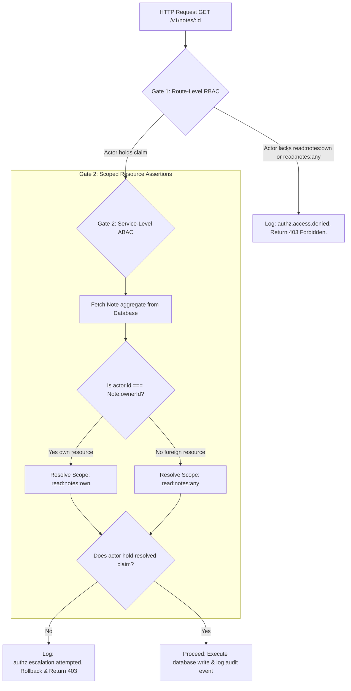
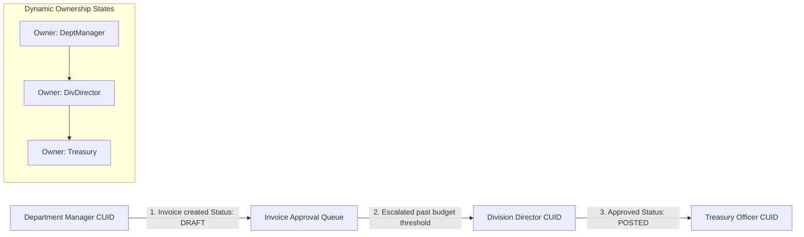

# Resource Ownership vs. RBAC Security Matrix

**Phase:** 8b — Session 8b  
**Scope:** Ownership vs RBAC Philosophies, Notes Domain Execution Traces, Layered Security Pipelines, Authorization Flowcharts, Security Boundaries, and ERP Reassignment Workflows.  
**Prerequisites:** [`02-security/RBAC_SYSTEM.md`](../../02-security/RBAC_SYSTEM.md) (RBAC Caching), [`05-engineering/ERP_BUSINESS_LOGIC_GUIDE.md`](../../05-engineering/ERP_BUSINESS_LOGIC_GUIDE.md) (ERP Workflows).

---

## 1. Ownership vs. RBAC Philosophy

In enterprise ERP environments, access control requires a multi-layered security mesh. Relying on either Role-Based Access Control (RBAC) or Attribute-Based Access Control (ABAC/Ownership) alone creates significant security vulnerabilities:

### 1. Why Ownership Alone is Insufficient

Ownership-based access control (ABAC) checks are simple: a user can access a resource if they own it (`userId === ownerId`). However, ownership alone cannot enforce structural business permissions:

- It cannot handle **administrative overrides** (e.g. an IT administrator reading a note to troubleshoot an issue, or a compliance officer auditing an invoice).
- It lacks a concept of **hierarchical capabilities** (such as dynamic role levels or division boundaries).
- It cannot enforce **separation of duties** (such as the Maker-Checker rules required in corporate accounting).

### 2. Why RBAC Alone is Insufficient

Role-Based Access Control checks are static: a user can access a route if they hold a specific permission claim (e.g. `read:notes`). However, RBAC alone cannot evaluate contextual business parameters:

- It cannot differentiate between a user reading **their own notes** versus reading **someone else's notes**, leading to massive data leakages across accounts.
- Creating unique roles for every possible resource relationship leads to **role explosion**, making the system impossible to manage.

### 3. The Layered Coexistence Mesh

Our architecture solves these limits by combining RBAC and ABAC into a **Two-Gate Verification Pipeline**:

- **Gate 1 (RBAC):** Checks static capabilities at request ingress, asserting that the user has the basic permission claim (e.g. `read:notes:own`).
- **Gate 2 (ABAC):** Resolves ownership context dynamically inside the service layer, determining if the actor owns the target resource and applying scope escalations.

---

## 2. ABAC + RBAC Interaction Map



---

## 3. Scoped Permission Resolution Flow

```mermaid
flowchart TD
    subgraph Matrix [Ownership & Scope Escalation Matrix]
        Direction{Actor Capabilities} -->|Holds read:notes:any| MatchAny[Can read ALL Notes globally]
        Direction -->|Holds read:notes:own| MatchOwn[Can read Notes where Note.ownerId === actor.id]
        Direction -->|Holds both| Escalated[Escalated: Holds read:notes:any. Global access.]
    end

    subgraph Resolution [Runtime Scope Resolution]
        Input[GET /v1/notes/:id] --> Fetch[Query Note.ownerId]
        Fetch --> Eval{ownerId === actor.id?}

        Eval -->|Yes| CheckOwn[Require read:notes:own]
        Eval -->|No| CheckAny[Require read:notes:any]

        CheckOwn --> Verify[Verify against active cached permissions]
        CheckAny --> Verify

        Verify -->|Match| Allow[Allow Execution]
        Verify -->|Mismatch| Reject[Reject with 403 & log alert]
    end
end
```

---

## 4. Current Notes Domain Behavior

The lifecycle of a note aggregate traces a continuous path across the two-gate authorization pipeline:

| Operation       | Gate 1 Ingress Checks (RBAC)                                                                  | Gate 2 Service Assertions (ABAC)                                                                            | Transaction Scope                                                                          | Compliance Audit Logs                                                        |
| :-------------- | :-------------------------------------------------------------------------------------------- | :---------------------------------------------------------------------------------------------------------- | :----------------------------------------------------------------------------------------- | :--------------------------------------------------------------------------- |
| **Create Note** | `auth('create:notes:own')` checks if the actor's flat role set contains creation permissions. | None required during creation; the service binds the note's `ownerId` to the authenticated `actor.id` CUID. | Wrapped in `runInTransaction` to ensure the note is written and `notes.created` is logged. | Writes static event `notes.created` with the CUID and `title` metadata.      |
| **Read Note**   | `auth('read:notes:own')` checks if the actor can read notes.                                  | `assertScopedPermission(actor, note.ownerId, 'read', 'notes')` resolves whether scope is `:own` or `:any`.  | Read-only operation; query is executed on the passive `noteRepository.findById()`.         | None for read operations to minimize storage bloat, except on denial errors. |
| **Update Note** | `auth('update:notes:own')` checks if the actor can update notes.                              | `assertScopedPermission(actor, note.ownerId, 'update', 'notes')` verifies ownership before mutating values. | Wrapped in `runInTransaction` to update values and log `notes.updated` atomically.         | Writes static event `notes.updated` with `changedFields` metadata.           |
| **Delete Note** | `auth('delete:notes:own')` checks if the actor can delete notes.                              | `assertScopedPermission(actor, note.ownerId, 'delete', 'notes')` verifies ownership before deletion.        | Wrapped in `runInTransaction` to delete the note and log `notes.deleted` atomically.       | Writes static event `notes.deleted` with the target `noteId` CUID.           |

---

## 5. Security Boundaries & Leak Protection

Layered security is essential for protecting the application from common OWASP vulnerabilities:

### 1. Privilege Escalation Prevention

If a standard user attempts to bypass boundaries by manually providing a foreign user's CUID inside a payload (e.g. `POST /v1/notes` with `ownerId = foreignUserId`), the service layer catches and blocks the attempt:

```javascript
const createNote = async (noteBody, ownerId) => {
  // Service ignores payload ownerId, forcing it to match the authenticated actor.id
  return runInTransaction(async (tx) => {
    const note = await noteRepository.create({ ...noteBody, ownerId }, tx);
    ...
  });
};
```

By binding the owner CUID directly to the authenticated actor context, the system prevents ID-harvesting and privilege escalation attempts.

### 2. Guarding against Route-Level Gaps

If a developer forgets to mount the `auth()` middleware or adds incorrect permission strings at the router edge:

- **The Vulnerability:** The HTTP request reaches the controller without validation.
- **The Protection:** Services require a valid `actor` object to perform business logic. If the `actor` parameter is missing or lacks context, `assertScopedPermission` throws a 401/403 exception, protecting system boundaries.

### 3. Serialization and Egress Leaks

If a service accidentally returns a raw database model containing sensitive data:

- **The Vulnerability:** Database internals (such as password hashes, refresh token keys) leak to the client.
- **The Protection:** Egress serialization gates (`src/serializers/`) process all outputs through whitelisted DTO filters, stripping sensitive attributes before network transmission.

---

## 6. Future ERP Ownership Semantics & Workflow Transitions

As the application evolves into an enterprise ERP platform, ownership dynamics will shift from static user-bounds to dynamic workflow-oriented transitions:

### 6.1 Ownership Transition Flow



### 6.2 Dynamic Ownership Transition Mechanics

- **Invoice Ownership Transitions:**  
   Invoicing does not utilize static user ownership. The `ownerId` represents the active approver in the budget hierarchy. As the invoice amount exceeds thresholds, the system reassigns ownership dynamically, updating the target CUID across the approval chain.
- **Delegated Authority & Supervisor Overrides:**  
   During vacation or leave windows, users must delegate their authority. The authorization service evaluates these delegations using dynamic date-bounded relationships:
  ```javascript
  // If the designated approver is on leave, the delegate is dynamically authorized
  if (await delegationService.isDelegated(targetApproverId, actor.id, new Date())) {
    allowExecution = true;
  }
  ```
- **Workflow Escalation Boundaries:**  
   If a transaction encounters errors or exceeds limits, ownership is escalated to high-level administrators (Role Level 80). The escalation process shifts the resource's `ownerId` to the administrator CUID and logs a high-severity event, enabling administrative overrides without bypassing security controls.

```mermaid
flowchart TD
    subgraph Escalation [Workflow Escalation Boundaries]
        Task[Active Task: Owner = Staff User] --> LimitCheck{Transaction amount > $10,000?}

        LimitCheck -->|No| Process[Staff User processes task]
        LimitCheck -->|Yes| Escalate[Reassign Task: Owner = Supervisor CUID]

        Escalate -->|Log escalation event| Audit[auditService.logEvent]
        Audit --> Alert[SIEM Alert dispatched]
    end
end
```
