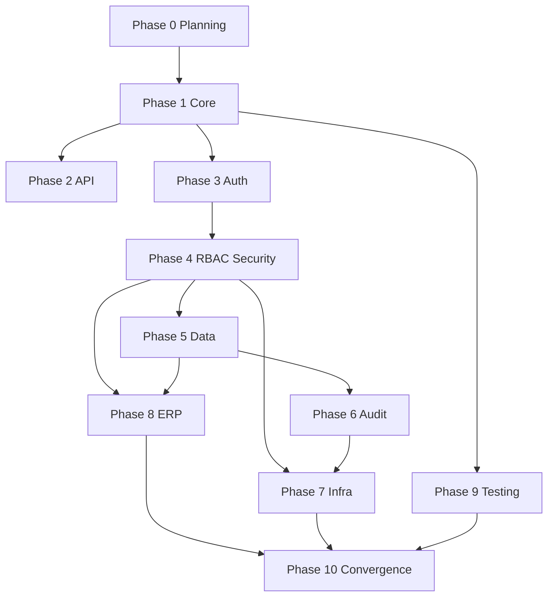

# Documentation Phases (v2)

**Target output:** `notes-backend/docs/knowledge-base/`  
**Session planner:** `DOCUMENTATION_EXECUTION_ORDER.md`  
**Prerequisite:** `ARCHITECTURE_DISCOVERY_REPORT.md`

Each phase lists **goals**, **files**, **systems**, **dependencies**, **architecture risks**, **complexity**, and **execution order**.

---

## Phase 0 — Planning & Roadmap Convergence ✅

| Field                    | Detail                                                                                                                                                                                                                                                         |
| ------------------------ | -------------------------------------------------------------------------------------------------------------------------------------------------------------------------------------------------------------------------------------------------------------- |
| **Goals**                | Inventory backend; design v2 KB; expand dependencies; prioritize risks; ERP modeling plan                                                                                                                                                                      |
| **Files (project root)** | `KNOWLEDGE_BASE_ROADMAP.md`, `DOCUMENTATION_PHASES.md`, `SYSTEM_DEPENDENCY_GRAPH.md`, `ARCHITECTURE_DISCOVERY_REPORT.md`, `KNOWLEDGE_BASE_EXPANSION_PLAN.md`, `DOCUMENTATION_EXECUTION_ORDER.md`, `HIGH_RISK_SYSTEMS_REPORT.md`, `ERP_DOMAIN_MODELING_PLAN.md` |
| **Systems analyzed**     | Full backend (read-only)                                                                                                                                                                                                                                       |
| **Dependencies**         | None                                                                                                                                                                                                                                                           |
| **Architecture risks**   | Plan/code drift if not verified per session                                                                                                                                                                                                                    |
| **Complexity**           | High (analysis)                                                                                                                                                                                                                                                |
| **Order**                | 0                                                                                                                                                                                                                                                              |

---

## Phase 1 — Core Architecture

| Field                  | Detail                                                                                    |
| ---------------------- | ----------------------------------------------------------------------------------------- |
| **Goals**              | Establish philosophy, HTTP lifecycle, end-to-end canonical flows                          |
| **Files**              | `00-core/ARCHITECTURE_PHILOSOPHY.md`, `REQUEST_LIFECYCLE.md`, `CANONICAL_SYSTEM_FLOWS.md` |
| **Systems**            | M01, M11 (partial): `app.js`, `index.js`, middleware stack, ALS, probes bypass            |
| **Dependencies**       | Phase 0                                                                                   |
| **Architecture risks** | Flow doc contradicts notes auth (D01) — must document actual vs intended                  |
| **Complexity**         | **High**                                                                                  |
| **Order**              | 1 (sessions 1a–1c)                                                                        |

**Acceptance:** Layer diagram; middleware order table; 6+ flow diagrams (login, refresh, authorized CRUD, error, shutdown, audit mutation).

---

## Phase 2 — API Contracts (Validation & DTOs)

| Field                  | Detail                                                                                                 |
| ---------------------- | ------------------------------------------------------------------------------------------------------ |
| **Goals**              | Document API surface contracts: envelope, errors, Zod, serializers                                     |
| **Files**              | `01-api/API_BOUNDARIES.md`, `VALIDATION_SYSTEM.md`, `SERIALIZATION_SYSTEM.md`                          |
| **Systems**            | M12: `validate.js`, `validations/*`, `response.interceptor`, `serializers/*`, `ApiError`, `catchAsync` |
| **Dependencies**       | Phase 1 (lifecycle)                                                                                    |
| **Architecture risks** | Swagger drift (D06, D07) — errata table required                                                       |
| **Complexity**         | Medium                                                                                                 |
| **Order**              | 2 (sessions 2a–2b)                                                                                     |

**Acceptance:** `res.locals` contract; success/error JSON shapes; validation middleware chain; password never in serializer output.

---

## Phase 3 — Authentication System

| Field                  | Detail                                                                          |
| ---------------------- | ------------------------------------------------------------------------------- |
| **Goals**              | JWT, Passport, token families, rotation, threat protocol                        |
| **Files**              | `02-security/AUTH_SYSTEM.md`                                                    |
| **Systems**            | M02: `auth.*`, `token.service`, `passport`, `token.repository`, `config/tokens` |
| **Dependencies**       | Phases 1–2                                                                      |
| **Architecture risks** | **HIGH RISK** — incorrect refresh doc causes session incidents                  |
| **Complexity**         | **High**                                                                        |
| **Order**              | 3 (session 3)                                                                   |

**Acceptance:** Token hash at rest; family rotation; 2s grace; frontend dedup responsibility; links to `security.test.js`.

---

## Phase 4 — RBAC & Security Model

| Field                  | Detail                                                                           |
| ---------------------- | -------------------------------------------------------------------------------- |
| **Goals**              | Permission model, middleware gate, scoped authz, security taxonomy, route matrix |
| **Files**              | `02-security/RBAC_SYSTEM.md`, `SECURITY_MODEL.md`, `ROUTE_PERMISSION_MATRIX.md`  |
| **Systems**            | M03, M04: `permission.service`, `authorization.service`, `auth.js`, seed RBAC    |
| **Dependencies**       | Phase 3                                                                          |
| **Architecture risks** | **HIGH RISK** — two-gate model; D01/D03; cache invalidation                      |
| **Complexity**         | **High**                                                                         |
| **Order**              | 4 (sessions 4a–4b)                                                               |

**Acceptance:** `action:resource:scope` rules; `:any` ⊃ `:own`; matrix for all routes; escalation + audit on denial.

---

## Phase 5 — Domain & Database

| Field                  | Detail                                                                                   |
| ---------------------- | ---------------------------------------------------------------------------------------- |
| **Goals**              | ERP domain model, Prisma architecture, transaction + audit atomicity                     |
| **Files**              | `03-data/DOMAIN_MODELING.md`, `DATABASE_ARCHITECTURE.md`, `TRANSACTIONAL_CONSISTENCY.md` |
| **Systems**            | M05–M08: `schema.prisma`, repositories, `prisma.js`, `runInTransaction`, D04/D05         |
| **Dependencies**       | Phases 3–4                                                                               |
| **Architecture risks** | Repository bypass (D05); LegacyRole (D04); delete-user cascade                           |
| **Complexity**         | **High**                                                                                 |
| **Order**              | 5 (sessions 5a–5c)                                                                       |

**Acceptance:** ER diagram; index rationale; `$reconnect`; when `tx` required; audit rollback rule.

---

## Phase 6 — Audit & Observability

| Field                  | Detail                                                                                                    |
| ---------------------- | --------------------------------------------------------------------------------------------------------- |
| **Goals**              | Audit taxonomy, sanitization, ALS, logging, metrics                                                       |
| **Files**              | `04-operations/AUDIT_AND_OBSERVABILITY.md`                                                                |
| **Systems**            | M07, M11: `audit.service`, `als`, `pinoHttp`, `logger`, `metrics`, `docs/observability/logging-policy.md` |
| **Dependencies**       | Phases 1, 5                                                                                               |
| **Architecture risks** | Audit throw fails TX — must be explicit                                                                   |
| **Complexity**         | High                                                                                                      |
| **Order**              | 6 (session 6)                                                                                             |

**Acceptance:** Sanitization limits; event naming convention; `reqId`/`userId` propagation; worker ALS context.

---

## Phase 7 — Infrastructure & Resilience

| Field                  | Detail                                                                                          |
| ---------------------- | ----------------------------------------------------------------------------------------------- |
| **Goals**              | Redis, RBAC cache, workers, bootstrap, probes, shutdown                                         |
| **Files**              | `04-operations/REDIS_AND_CACHING.md`, `WORKERS_AND_CRON.md`, `INFRASTRUCTURE_AND_RESILIENCE.md` |
| **Systems**            | M09, M10: `redis.js`, `tokenCleanup.worker`, `index.js`, health routes                          |
| **Dependencies**       | Phases 4, 6                                                                                     |
| **Architecture risks** | **INFRA CRITICAL** — DEGRADED semantics; lock without Redis                                     |
| **Complexity**         | Medium                                                                                          |
| **Order**              | 7 (sessions 7a–7c)                                                                              |

**Acceptance:** Circuit breaker states; cache key catalog; shutdown sequence; probe response table.

---

## Phase 8 — ERP Business Logic & Rules

| Field                  | Detail                                                                                                     |
| ---------------------- | ---------------------------------------------------------------------------------------------------------- |
| **Goals**              | Business rule registry; user/note workflows; ownership drift                                               |
| **Files**              | `05-engineering/BUSINESS_RULES.md`, `ERP_BUSINESS_LOGIC_GUIDE.md`, `06-domains/notes/ownership-vs-rbac.md` |
| **Systems**            | M05, M06, M14; controllers vs services                                                                     |
| **Dependencies**       | Phases 4–5                                                                                                 |
| **Architecture risks** | **ERP CRITICAL** — D01 must be visible; false admin expectations                                           |
| **Complexity**         | Medium                                                                                                     |
| **Order**              | 8 (sessions 8a–8b)                                                                                         |

**Acceptance:** ≥15 BR-\* rules; note cursor API; user delete steps; D01 status documented.

---

## Phase 9 — Testing Architecture

| Field                  | Detail                                                    |
| ---------------------- | --------------------------------------------------------- |
| **Goals**              | Vitest, Testcontainers, fixtures, coverage map, test gaps |
| **Files**              | `05-engineering/TESTING_ARCHITECTURE.md`                  |
| **Systems**            | M13: `tests/*`, `vitest.config`, `globalSetup`, ADR-0002  |
| **Dependencies**       | Phases 1–8 (reference)                                    |
| **Architecture risks** | Missing `:any` note tests — document as gap               |
| **Complexity**         | Medium                                                    |
| **Order**              | 9 (session 9)                                             |

**Acceptance:** Test pyramid; container lifecycle; module→test file table.

---

## Phase 10 — Future Modules & Final Convergence

| Field                  | Detail                                                                                      |
| ---------------------- | ------------------------------------------------------------------------------------------- |
| **Goals**              | Module expansion guide; engineering summary; KB README; drift closure                       |
| **Files**              | `05-engineering/FUTURE_MODULE_ARCHITECTURE.md`, `FINAL_ENGINEERING_SUMMARY.md`, `README.md` |
| **Systems**            | All modules (index only)                                                                    |
| **Dependencies**       | Phases 1–9                                                                                  |
| **Architecture risks** | Stale index if articles renamed                                                             |
| **Complexity**         | Medium                                                                                      |
| **Order**              | 10 (sessions 10a–10b)                                                                       |

**Acceptance:** New module checklist; ADR index; superseded migration list; drift table closed or owned.

---

## Phase 11 — Code Alignment (Optional, Post-KB)

| Field            | Detail                                                               |
| ---------------- | -------------------------------------------------------------------- |
| **Goals**        | Fix D01–D08 in code — **not part of KB generation**                  |
| **Dependencies** | Phase 10 sign-off                                                    |
| **Items**        | `assertCanManageNote`; `role.route`; LegacyRole removal; Swagger fix |

---

## Phase Dependency Diagram

---

## Effort Summary (v2)

| Phase     | Sessions | Primary files         |
| --------- | -------- | --------------------- |
| 0         | 1        | 8 planning MDs (root) |
| 1         | 3        | 3                     |
| 2         | 2        | 3                     |
| 3         | 1        | 1                     |
| 4         | 2        | 3                     |
| 5         | 3        | 3                     |
| 6         | 1        | 1                     |
| 7         | 3        | 3                     |
| 8         | 2        | 3+                    |
| 9         | 1        | 1                     |
| 10        | 2        | 3                     |
| **Total** | **~18**  | **~24 KB files**      |

---

_Roadmap: `KNOWLEDGE_BASE_ROADMAP.md` · Execution: `DOCUMENTATION_EXECUTION_ORDER.md`_
