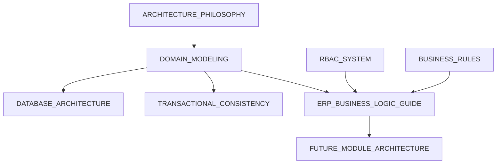

# ERP Domain Modeling Plan

**Purpose:** Plan how the knowledge base documents **current domains** (User, Note, RBAC) and **future ERP modules** without coupling docs to today's implementation mistakes.  
**Status:** Planning only — feeds `DOMAIN_MODELING.md`, `ERP_BUSINESS_LOGIC_GUIDE.md`, `FUTURE_MODULE_ARCHITECTURE.md`.

---

## 1. Modeling Philosophy (To Document in ARCHITECTURE_PHILOSOPHY)

| Principle                  | Current implementation               | Future modules must                               |
| -------------------------- | ------------------------------------ | ------------------------------------------------- |
| **Single tenant**          | No `tenantId` in schema              | Document assumption; flag when multi-tenant added |
| **Owner-scoped resources** | `Note.ownerId`                       | Every resource has explicit `ownerId` or `orgId`  |
| **RBAC over legacy enum**  | `UserRole` + deprecated `LegacyRole` | No new enums for roles; permissions only          |
| **Repository boundary**    | Services → repositories → Prisma     | Exceptions (`permission.service`) documented      |
| **Audit survives delete**  | `AuditLog` no FK                     | All mutations emit taxonomy events                |
| **Restrict vs Cascade**    | Notes Restrict on user               | Document per-entity deletion strategy             |

---

## 2. Current Domain Map

```mermaid
erDiagram
  subgraph identity [Identity Aggregate]
    User
    Token
  end

  subgraph access [Access Control]
    Role
    Permission
    UserRole
    RolePermission
  end

  subgraph content [Content Aggregate]
    Note
  end

  subgraph compliance [Compliance]
    AuditLog
  end

  User ||--o{ UserRole : has
  User ||--o{ Note : owns
  User ||--o{ Token : sessions
  Role ||--o{ UserRole : ""
  Role ||--o{ RolePermission : ""
  Permission ||--o{ RolePermission : ""
```

### 2.1 Bounded Contexts

| Context        | Entities                   | Application layer                               |
| -------------- | -------------------------- | ----------------------------------------------- |
| **Identity**   | User, Token                | `user.service`, `auth.service`, `token.service` |
| **Access**     | Role, Permission, UserRole | `permission.service`, `authorization.service`   |
| **Notes**      | Note                       | `note.service`                                  |
| **Compliance** | AuditLog                   | `audit.service`                                 |

**Anti-corruption:** Access context must not leak into Note repository queries (today: controller enforces owner — document as technical debt D01).

---

## 3. Aggregate Rules (For BUSINESS_RULES.md)

| Rule ID | Domain | Invariant                            | Enforcement location                         |
| ------- | ------ | ------------------------------------ | -------------------------------------------- |
| BR-U01  | User   | Email unique                         | `user.repository.isEmailTaken`               |
| BR-U02  | User   | Password hashed before persist       | `user.service.createUser` / `updateUserById` |
| BR-U03  | User   | Delete notes before user             | `user.service.deleteUserById` + TX           |
| BR-U04  | User   | Deprecated `role` body ignored       | `user.controller.createUser`                 |
| BR-N01  | Note   | Title max 200 chars                  | Zod `note.validation`                        |
| BR-N02  | Note   | Owner required                       | Prisma relation                              |
| BR-N03  | Note   | Non-owner read returns 404           | `note.controller` (not 403)                  |
| BR-N04  | Note   | List scoped to `req.user.id`         | `note.controller.getNotes`                   |
| BR-A01  | Access | Cannot assign role above actor level | `authorization.assertCanAssignRole`          |
| BR-A02  | Access | `:any` satisfies `:own` check        | `permission.matchesPermission`               |
| BR-T01  | Token  | Refresh hashed at rest               | `token.service`                              |
| BR-T02  | Token  | Reuse revokes family                 | `auth.service.refreshAuth`                   |

_Phase 8 expands this table to 20+ rules with test pointers._

---

## 4. Permission Resource Catalog (ERP Extension)

Current resources in routes:

| Resource | Actions (routes)             | Scopes used          |
| -------- | ---------------------------- | -------------------- |
| `users`  | create, read, update, delete | `own`, `any`         |
| `notes`  | create, read, update, delete | `own` only (routes)  |
| `roles`  | assign                       | `any` (service only) |

**Future module template** (for `FUTURE_MODULE_ARCHITECTURE.md`):

```
{action}:{resource}:{scope}

Examples for "invoices":
  create:invoices:own
  read:invoices:any
  approve:invoices:any   # workflow action = action verb
```

---

## 5. Note Domain — Documentation Outline (ERP_BUSINESS_LOGIC_GUIDE)

1. **Lifecycle:** create → list (cursor) → read → patch → delete
2. **Query model:** `ownerId`, `archived`, `search`, `sortBy`, `cursor`, `limit`
3. **Authorization gap:** middleware `read:notes:own` vs admin `read:notes:any` (D01)
4. **Pagination:** cursor-first; Swagger errata for offset `page` (D07)
5. **Audit events:** `notes.created`, `notes.updated`, `notes.deleted`

---

## 6. User Domain — Documentation Outline

1. **Admin flows:** `create:users:any`, `read:users:any` (list)
2. **Self flows:** `read:users:own` + `assertCanReadUser` for others
3. **Deletion:** transactional note purge
4. **Legacy filter:** `getUsers` query `role` on deprecated column (D08)

---

## 7. Future Module Architecture (Planned Article Sections)

### 7.1 Module Checklist (New ERP Entity `X`)

| Step | Artifact                                             | Owner layer                   |
| ---- | ---------------------------------------------------- | ----------------------------- |
| 1    | Prisma model + indexes + `onDelete` policy           | `schema.prisma`               |
| 2    | Permissions seeded                                   | `prisma/seed` or migration    |
| 3    | `x.repository.js`                                    | repositories                  |
| 4    | `x.service.js` + `runInTransaction` + audit          | services                      |
| 5    | `x.validation.js` (Zod)                              | validations                   |
| 6    | `x.serializer.js`                                    | serializers                   |
| 7    | `x.controller.js` + **authorization.service** assert | controllers                   |
| 8    | `x.route.js` + `auth('action:x:own')`                | routes                        |
| 9    | Integration tests                                    | `tests/integration/x.test.js` |
| 10   | Row in `ROUTE_PERMISSION_MATRIX.md`                  | KB                            |

### 7.2 Anti-Patterns to Avoid (From Current Drift)

- Do **not** enforce ownership only in controller with hardcoded IDs
- Do **not** skip `authorization.service` when `:any` scope exists
- Do **not** call Prisma from services except via repository (document exceptions)
- Do **not** add Swagger without matching validation schema

### 7.3 Suggested Next Modules (Product-Agnostic)

| Module                | Depends on           | RBAC resources           |
| --------------------- | -------------------- | ------------------------ |
| Roles API (HTTP)      | RBAC_SYSTEM complete | `roles`, `permissions`   |
| Organizations         | DOMAIN_MODELING v2   | `organizations`          |
| Attachments           | Notes                | `attachments`            |
| Workflows / approvals | Any entity           | `approve:{resource}:any` |

---

## 8. Domain Doc Dependencies



---

## 9. Phase 8 Deliverables (Domain Track)

| File                                    | Content source             |
| --------------------------------------- | -------------------------- |
| `DOMAIN_MODELING.md`                    | §2–3 of this plan + schema |
| `ERP_BUSINESS_LOGIC_GUIDE.md`           | §5–6 + code trace          |
| `06-domains/users/overview.md`          | Optional supplement        |
| `06-domains/notes/ownership-vs-rbac.md` | D01 deep-dive              |
| `FUTURE_MODULE_ARCHITECTURE.md`         | §7                         |

---

## 10. Open Modeling Decisions (Track in FINAL_ENGINEERING_SUMMARY)

| ID    | Decision                    | Options                        | Current                           |
| ----- | --------------------------- | ------------------------------ | --------------------------------- |
| MD-01 | Note admin access           | Fix D01 vs keep owner-only API | Owner-only                        |
| MD-02 | LegacyRole removal          | Migration timeline             | Deprecated                        |
| MD-03 | Role HTTP API               | Expose `assignRoleToUser`      | Service-only                      |
| MD-04 | Cursor vs offset pagination | Standardize API                | Cursor in code, offset in Swagger |

---

_Risk context: `HIGH_RISK_SYSTEMS_REPORT.md` · Execution: `DOCUMENTATION_PHASES.md` Phase 8_
