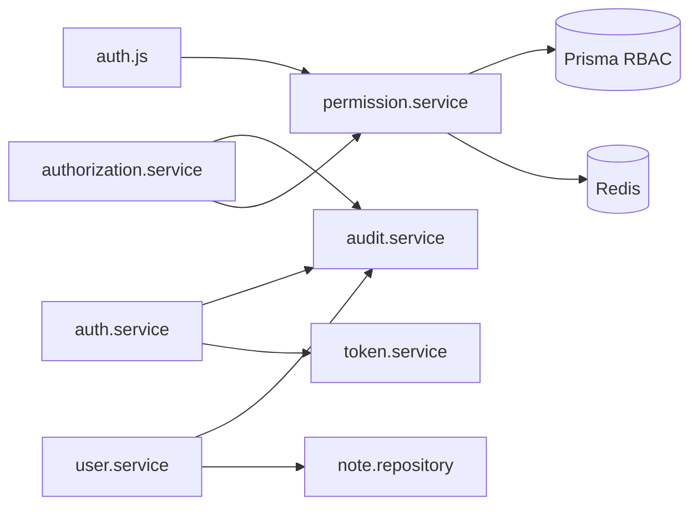

# High-Risk Systems Report

**Purpose:** Prioritize knowledge-base documentation by **security, compliance, coupling, and ERP business impact**.  
**Audience:** Staff engineers, security reviewers, documentation executors.  
**Status:** Planning — derived from `ARCHITECTURE_DISCOVERY_REPORT.md` and code analysis.

---

## 1. Classification Legend

| Category                    | Meaning                                                     |
| --------------------------- | ----------------------------------------------------------- |
| **MUST DOCUMENT FIRST**     | Blocks safe changes if undocumented; document in Phases 1–4 |
| **HIGH RISK**               | Security or data integrity; incorrect docs cause incidents  |
| **INFRASTRUCTURE CRITICAL** | Production availability / degraded-mode behavior            |
| **ERP BUSINESS CRITICAL**   | Core domain invariants and extension patterns               |

---

## 2. MUST Document First (P0)

| System                                   | Path                                  | Category            | Why                              | Target KB article                              |
| ---------------------------------------- | ------------------------------------- | ------------------- | -------------------------------- | ---------------------------------------------- |
| Refresh token rotation + reuse detection | `auth.service.js`, `token.service.js` | HIGH RISK           | Session hijack / mass revocation | `AUTH_SYSTEM`, `CANONICAL_SYSTEM_FLOWS`        |
| JWT + Passport verify                    | `passport.js`, `middlewares/auth.js`  | HIGH RISK           | Every authenticated request      | `AUTH_SYSTEM`                                  |
| Permission resolution + cache            | `permission.service.js`               | HIGH RISK           | Wrong cache = authz bypass       | `RBAC_SYSTEM`, `REDIS_AND_CACHING`             |
| Middleware permission gate               | `middlewares/auth.js`                 | HIGH RISK           | AND-logic; no ownership here     | `RBAC_SYSTEM`                                  |
| Scoped authorization + escalation        | `authorization.service.js`            | HIGH RISK           | Privilege escalation             | `RBAC_SYSTEM`, `SECURITY_MODEL`                |
| Request lifecycle + ALS                  | `app.js`, `als.js`, `pinoHttp.js`     | MUST DOCUMENT FIRST | Traceability for audits          | `REQUEST_LIFECYCLE`, `AUDIT_AND_OBSERVABILITY` |
| Canonical two-gate authz                 | Routes + controllers                  | MUST DOCUMENT FIRST | Notes drift D01                  | `CANONICAL_SYSTEM_FLOWS`, `SECURITY_MODEL`     |

---

## 3. HIGH RISK (P1)

| System                       | Path                             | Risk                                      | Target article                                         |
| ---------------------------- | -------------------------------- | ----------------------------------------- | ------------------------------------------------------ |
| Audit transactional coupling | `audit.service.js`               | Failed audit rolls back business mutation | `TRANSACTIONAL_CONSISTENCY`, `AUDIT_AND_OBSERVABILITY` |
| Audit metadata sanitization  | `audit.service.js`               | PII/password leak in `metadata`           | `AUDIT_AND_OBSERVABILITY`, `SECURITY_MODEL`            |
| Password hashing boundary    | `user.service`, `utils/password` | Plaintext persistence                     | `AUTH_SYSTEM`, `BUSINESS_RULES`                        |
| Token hashing at rest        | `token.service.js`               | DB leak exposes sessions                  | `AUTH_SYSTEM`                                          |
| Prisma password omit         | `config/prisma.js`               | Accidental password in API                | `DATABASE_ARCHITECTURE`, `SERIALIZATION_SYSTEM`        |
| User delete cascade          | `user.service.js`                | Orphan notes / failed delete              | `TRANSACTIONAL_CONSISTENCY`, `BUSINESS_RULES`          |
| `assignRoleToUser`           | `authorization.service.js`       | Escalation without HTTP route             | `RBAC_SYSTEM`, `FUTURE_MODULE_ARCHITECTURE`            |
| Rate limiters                | `rateLimiter.js`                 | Brute force / refresh abuse               | `SECURITY_MODEL`                                       |
| Error converter              | `middlewares/error.js`           | Information disclosure                    | `API_BOUNDARIES`                                       |

---

## 4. INFRASTRUCTURE CRITICAL (P1–P2)

| System                               | Path                     | Risk                                  | Target article                                  |
| ------------------------------------ | ------------------------ | ------------------------------------- | ----------------------------------------------- |
| Redis circuit breaker + LRU fallback | `config/redis.js`        | Split-brain RBAC cache across nodes   | `REDIS_AND_CACHING`                             |
| RBAC global version bump             | `permission.service.js`  | Stale permissions after role change   | `REDIS_AND_CACHING`                             |
| Bootstrap / shutdown order           | `index.js`               | Hung process; data corruption on kill | `INFRASTRUCTURE_AND_RESILIENCE`                 |
| Health probe semantics               | `app.js`                 | K8s kills healthy pods                | `INFRASTRUCTURE_AND_RESILIENCE`                 |
| Token cleanup worker + SETNX         | `tokenCleanup.worker.js` | Duplicate deletes; lock without Redis | `WORKERS_AND_CRON`                              |
| Prisma proxy + `$reconnect`          | `config/prisma.js`       | Test flakiness; wrong DB in tests     | `DATABASE_ARCHITECTURE`, `TESTING_ARCHITECTURE` |
| Slow query extension                 | `config/prisma.js`       | Ops blind spot                        | `DATABASE_ARCHITECTURE`                         |
| Event loop lag monitor               | `index.js`               | Silent latency degradation            | `AUDIT_AND_OBSERVABILITY`                       |
| Metrics flusher                      | `config/metrics.js`      | Observability gaps                    | `AUDIT_AND_OBSERVABILITY`                       |

---

## 5. ERP BUSINESS CRITICAL (P2)

| System                     | Path                                        | Risk                                 | Target article                               |
| -------------------------- | ------------------------------------------- | ------------------------------------ | -------------------------------------------- |
| Note ownership enforcement | `note.controller.js`                        | D01 drift; no admin read             | `ERP_BUSINESS_LOGIC_GUIDE`, `BUSINESS_RULES` |
| Note cursor pagination     | `note.repository`, `paginateCursor`         | Client contract break                | `ERP_BUSINESS_LOGIC_GUIDE`                   |
| User scoped read/update    | `user.controller` + `authorization.service` | Reference pattern for new modules    | `ERP_BUSINESS_LOGIC_GUIDE`                   |
| LegacyRole vs UserRole     | `schema.prisma`, filters                    | Wrong admin lists                    | `DOMAIN_MODELING`, `BUSINESS_RULES`          |
| Note `onDelete: Restrict`  | `schema.prisma`                             | Delete user without notes fails      | `DOMAIN_MODELING`                            |
| AuditLog no-FK design      | `schema.prisma`                             | Compliance retention                 | `DOMAIN_MODELING`, `AUDIT_AND_OBSERVABILITY` |
| Email flows                | `email.service.js`                          | Verification / reset broken silently | `API_BOUNDARIES`                             |

---

## 6. Most Dangerous Abstractions

| Abstraction                                     | Danger                          | Mitigation in KB                          |
| ----------------------------------------------- | ------------------------------- | ----------------------------------------- |
| `auth(...permissions)` looks like full authz    | Developers skip ownership gate  | `ARCHITECTURE_PHILOSOPHY` + `RBAC_SYSTEM` |
| `assertCanManageNote` exists but unused         | False confidence in RBAC        | `BUSINESS_RULES` BR-D01; drift register   |
| `res.locals` + `serializeResponse`              | Skipped envelope breaks clients | `API_BOUNDARIES`                          |
| `runInTransaction` vs raw `prisma.$transaction` | Inconsistent audit atomicity    | `TRANSACTIONAL_CONSISTENCY`               |
| Redis degraded = per-process LRU                | RBAC cache not shared           | `REDIS_AND_CACHING`                       |
| 404 instead of 403 on notes                     | Security-by-obscurity vs RBAC   | `SECURITY_MODEL`                          |

---

## 7. Most Coupled Systems

**Documentation order:** Break coupling explanations in `CANONICAL_SYSTEM_FLOWS` before domain docs.

---

## 8. Audit-Sensitive Operations (Must Appear in BUSINESS_RULES)

| Event prefix                      | Sensitivity       |
| --------------------------------- | ----------------- |
| `auth.refresh.reuse_detected`     | Security incident |
| `authz.escalation.attempted`      | Security incident |
| `authz.role.assigned`             | Compliance        |
| `auth.login.failed`               | SOC monitoring    |
| `users.deleted` / `notes.deleted` | GDPR / retention  |

---

## 9. Documentation Priority Matrix

| Phase  | Systems covered                                        |
| ------ | ------------------------------------------------------ |
| **1**  | Lifecycle, philosophy, canonical flows (P0 foundation) |
| **2**  | API boundaries, validation, serialization              |
| **3**  | AUTH_SYSTEM (P0)                                       |
| **4**  | RBAC_SYSTEM, SECURITY_MODEL, route matrix (P0)         |
| **5**  | Domain, database, transactions (P1)                    |
| **6**  | Audit, observability (P1)                              |
| **7**  | Redis, workers, infrastructure (P1 infra)              |
| **8**  | Business rules, ERP guide (P2)                         |
| **9**  | Testing architecture                                   |
| **10** | Future modules, final summary                          |

---

## 10. Recommended Reviewers

| Article set | Reviewer profile                     |
| ----------- | ------------------------------------ |
| Phases 3–4  | Security / staff backend             |
| Phase 5     | DBA or senior backend + Prisma owner |
| Phase 6–7   | SRE / platform                       |
| Phase 8     | Product + staff backend (ERP)        |
| Phase 10    | Architect sign-off                   |

---

_Execution: `DOCUMENTATION_EXECUTION_ORDER.md` · Expansion: `KNOWLEDGE_BASE_EXPANSION_PLAN.md`_
