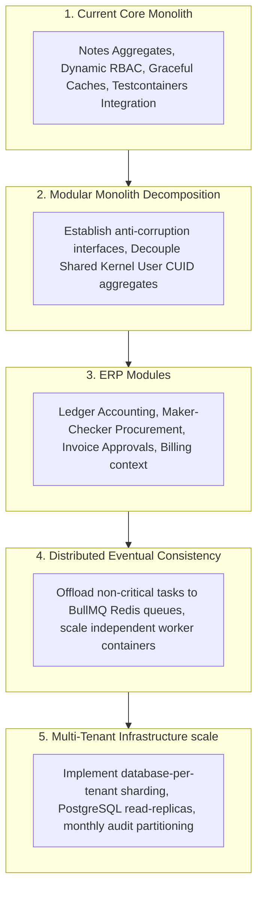

# Architecture Knowledge Base

Welcome to the **Architecture Knowledge Base** for the Dynamic Database-Driven ERP Backend. This directory serves as the centralized engineering handbook and single source of truth for the system's runtime lifecycles, security boundaries, transactional consistency guarantees, and operational resilience patterns.

---

## 1. Knowledge Base Purpose

Enterprise software development suffers when architecture designs, security invariants, and operational assumptions remain undocumented or fragmented. This knowledge base exists to:

1. **Prevent Architectural Drift:** Establish clear, non-negotiable boundaries, invariants, and guidelines to ensure that developers do not bypass structural layers.
2. **Accelerate Engineering Onboarding:** Provide clear, structured reading orders for engineers, architects, and operators, reducing onboarding time.
3. **Establish a High-Coverage Security Matrix:** Group all threat mitigation protocols, dynamic RBAC matrices, and compliance policies in one place.
4. **Document System Limits & Operational Debt:** Honestly detail system limitations, split-brain zones, and scaling bottlenecks to guide future developments.

---

## 2. Knowledge-Base Navigation Graph

```mermaid
graph TD
    Root([knowledge-base/README.md]) --> Core[00-core/ Core Architecture]
    Root --> Security[02-security/ Security & RBAC]
    Root --> Data[03-data/ Relational Persistence]
    Root --> Operations[04-operations/ Infrastructure Operations]
    Root --> Engineering[05-engineering/ Rules & Testing]
    Root --> Domains[06-domains/ Domain Semantics]

    Core --> Core1[00-core/ARCHITECTURE_PHILOSOPHY.md]
    Core --> Core2[00-core/REQUEST_LIFECYCLE.md]
    Core --> Core3[00-core/CANONICAL_SYSTEM_FLOWS.md]
    Core --> Core4[00-core/SYSTEM_MAP.md]

    Security --> Sec1[02-security/AUTH_SYSTEM.md]
    Security --> Sec2[02-security/RBAC_SYSTEM.md]
    Security --> Sec3[02-security/SECURITY_MODEL.md]
    Security --> Sec4[02-security/ROUTE_PERMISSION_MATRIX.md]

    Data --> Data1[03-data/DOMAIN_MODELING.md]
    Data --> Data2[03-data/DATABASE_ARCHITECTURE.md]
    Data --> Data3[03-data/TRANSACTIONAL_CONSISTENCY.md]

    Operations --> Ops1[04-operations/AUDIT_AND_OBSERVABILITY.md]
    Operations --> Ops2[04-operations/INFRASTRUCTURE_AND_RESILIENCE.md]
    Operations --> Ops3[04-operations/WORKERS_AND_CRON.md]

    Engineering --> Eng1[05-engineering/BUSINESS_RULES.md]
    Engineering --> Eng2[05-engineering/DOMAIN_INVARIANTS.md]
    Engineering --> Eng3[05-engineering/ERP_BUSINESS_LOGIC_GUIDE.md]
    Engineering --> Eng4[05-engineering/TESTING_ARCHITECTURE.md]
    Engineering --> Eng5[05-engineering/FUTURE_MODULE_ARCHITECTURE.md]
    Engineering --> Eng6[05-engineering/SCALING_AND_EVOLUTION.md]
    Engineering --> Eng7[05-engineering/FINAL_ENGINEERING_SUMMARY.md]

    Domains --> Dom1[06-domains/notes/ownership-vs-rbac.md]
```

---

## 3. Documentation Navigation Map

### Category: Core Architecture (4 files under `00-core/`)

- **[`00-core/ARCHITECTURE_PHILOSOPHY.md`](./00-core/ARCHITECTURE_PHILOSOPHY.md):** Core design patterns, thin controllers, service centralization, and modular boundaries.
- **[`00-core/REQUEST_LIFECYCLE.md`](./00-core/REQUEST_LIFECYCLE.md):** Chronological traversal of Express HTTP requests, validation rules, and error mappings.
- **[`00-core/CANONICAL_SYSTEM_FLOWS.md`](./00-core/CANONICAL_SYSTEM_FLOWS.md):** Sequence diagrams mapping ingress request routes, auth strategy validations, and background tasks.
- **[`00-core/SYSTEM_MAP.md`](./00-core/SYSTEM_MAP.md):** Runtime layers, module dependencies, and ERP boundary specifications.

### Category: Security & Access Control (4 files under `02-security/`)

- **[`02-security/AUTH_SYSTEM.md`](./02-security/AUTH_SYSTEM.md):** Hybrid JWT access and PostgreSQL stateful refresh token rotation, grace periods, and session threat protocols.
- **[`02-security/RBAC_SYSTEM.md`](./02-security/RBAC_SYSTEM.md):** Dynamic database-driven RBAC system, role hierarchies, and dynamic permission caching.
- **[`02-security/SECURITY_MODEL.md`](./02-security/SECURITY_MODEL.md):** Two-Gate validation pipeline, trust boundaries, whitelisted serialization, and threat protection boundaries.
- **[`02-security/ROUTE_PERMISSION_MATRIX.md`](./02-security/ROUTE_PERMISSION_MATRIX.md):** GRANULAR route-to-permission security map for all mounted endpoints.

### Category: Relational Persistence (3 files under `03-data/`)

- **[`03-data/DOMAIN_MODELING.md`](./03-data/DOMAIN_MODELING.md):** Dynamic relational aggregate mapping, cascaded user deletions, and repository abstractions.
- **[`03-data/DATABASE_ARCHITECTURE.md`](./03-data/DATABASE_ARCHITECTURE.md):** Prisma client dynamic singletons, Testcontainers lifecycle, whitelisted shapes, and slow query telemetries.
- **[`03-data/TRANSACTIONAL_CONSISTENCY.md`](./03-data/TRANSACTIONAL_CONSISTENCY.md):** Service-layer transaction boundaries, repository client injections, and nested savepoint rollbacks.

### Category: Operational Infrastructure (3 files under `04-operations/`)

- **[`04-operations/AUDIT_AND_OBSERVABILITY.md`](./04-operations/AUDIT_AND_OBSERVABILITY.md):** Pino structured logging, `AsyncLocalStorage` request correlation, and metadata sanitization filters.
- **[`04-operations/INFRASTRUCTURE_AND_RESILIENCE.md`](./04-operations/INFRASTRUCTURE_AND_RESILIENCE.md):** Bootstrap sequence, reverse graceful shutdown handlers, and Redis circuit-breaker fallbacks.
- **[`04-operations/WORKERS_AND_CRON.md`](./04-operations/WORKERS_AND_CRON.md):** Ephemeral cron schedules, distributed Redis locks, and task execution contexts.

### Category: Engineering, Testing & Scaling (7 files under `05-engineering/`)

- **[`05-engineering/BUSINESS_RULES.md`](./05-engineering/BUSINESS_RULES.md):** Domain-specific workflows, ABAC assertions, token rotation grace, and role vertical hierarchies.
- **[`05-engineering/DOMAIN_INVARIANTS.md`](./05-engineering/DOMAIN_INVARIANTS.md):** System invariants, code references, rollback scopes, and SIEM telemetry alerts.
- **[`05-engineering/ERP_BUSINESS_LOGIC_GUIDE.md`](./05-engineering/ERP_BUSINESS_LOGIC_GUIDE.md):** Bounded contexts, approval transitions, Maker-Checker models, and contention zone bottlenecks.
- **[`05-engineering/TESTING_ARCHITECTURE.md`](./05-engineering/TESTING_ARCHITECTURE.md):** Integration-first Vitest execution forks, Testcontainers PostgreSQL Docker containers, and database truncations.
- **[`05-engineering/FUTURE_MODULE_ARCHITECTURE.md`](./05-engineering/FUTURE_MODULE_ARCHITECTURE.md):** Decoupled modular monolith boundaries, shared kernel mitigations, Anti-Corruption Layers (ACL), and queue systems.
- **[`05-engineering/SCALING_AND_EVOLUTION.md`](./05-engineering/SCALING_AND_EVOLUTION.md):** Write index locking limits, read/write database splits, audit log monthly partitioning, and sharding pathways.
- **[`05-engineering/FINAL_ENGINEERING_SUMMARY.md`](./05-engineering/FINAL_ENGINEERING_SUMMARY.md):** Unified system-wide operational guarantees, invariants summary, and technical debt log.

### Category: Domain Specifics (1 file under `06-domains/`)

- **[`06-domains/notes/ownership-vs-rbac.md`](./06-domains/notes/ownership-vs-rbac.md):** Static RBAC edge checks versus dynamic service ABAC assertions, note lifecycle traces, and delegated authority models.

---

## 4. Recommended Reading Order

Select the reading path that matches your role and engineering objectives:

### Beginner Onboarding Path (Start Here)

1. **[`00-core/ARCHITECTURE_PHILOSOPHY.md`](./00-core/ARCHITECTURE_PHILOSOPHY.md):** Understand the core thin-controller/fat-service architecture.
2. **[`00-core/REQUEST_LIFECYCLE.md`](./00-core/REQUEST_LIFECYCLE.md):** Trace the path of an Express HTTP request.
3. **[`05-engineering/BUSINESS_RULES.md`](./05-engineering/BUSINESS_RULES.md):** Study core business logic and ABAC rules.
4. **[`05-engineering/TESTING_ARCHITECTURE.md`](./05-engineering/TESTING_ARCHITECTURE.md):** Learn how to run and write integration tests.

### Backend Engineer Path

1. **[`00-core/SYSTEM_MAP.md`](./00-core/SYSTEM_MAP.md):** Review runtime layers and modular code dependencies.
2. **[`03-data/DATABASE_ARCHITECTURE.md`](./03-data/DATABASE_ARCHITECTURE.md):** Study the Prisma Dynamic Singleton proxy.
3. **[`03-data/TRANSACTIONAL_CONSISTENCY.md`](./03-data/TRANSACTIONAL_CONSISTENCY.md):** Master service-layer transactions and client injection.
4. **[`05-engineering/DOMAIN_INVARIANTS.md`](./05-engineering/DOMAIN_INVARIANTS.md):** Understand non-negotiable data and security invariants.

### Security Engineer Path

1. **[`02-security/AUTH_SYSTEM.md`](./02-security/AUTH_SYSTEM.md):** Analyze JWT lifecycles and refresh token rotation.
2. **[`02-security/RBAC_SYSTEM.md`](./02-security/RBAC_SYSTEM.md):** Study the database-driven dynamic permission cache.
3. **[`02-security/SECURITY_MODEL.md`](./02-security/SECURITY_MODEL.md):** Analyze the Two-Gate validation pipeline and trust boundaries.
4. **[`06-domains/notes/ownership-vs-rbac.md`](./06-domains/notes/ownership-vs-rbac.md):** Learn the coexistence mechanics of RBAC and ABAC.

### Operations Engineer & SRE Path

1. **[`04-operations/AUDIT_AND_OBSERVABILITY.md`](./04-operations/AUDIT_AND_OBSERVABILITY.md):** Understand logging, request correlation, and sanitization.
2. **[`04-operations/INFRASTRUCTURE_AND_RESILIENCE.md`](./04-operations/INFRASTRUCTURE_AND_RESILIENCE.md):** Master graceful shutdowns and Redis circuit-breaker states.
3. **[`04-operations/WORKERS_AND_CRON.md`](./04-operations/WORKERS_AND_CRON.md):** Learn background cron execution and distributed locks.
4. **[`05-engineering/SCALING_AND_EVOLUTION.md`](./05-engineering/SCALING_AND_EVOLUTION.md):** Review partitioning, sharding, and database evolutions.

### Enterprise ERP Architect Path

1. **[`05-engineering/ERP_BUSINESS_LOGIC_GUIDE.md`](./05-engineering/ERP_BUSINESS_LOGIC_GUIDE.md):** Study Maker-Checker procurement, workflows, and state transitions.
2. **[`05-engineering/FUTURE_MODULE_ARCHITECTURE.md`](./05-engineering/FUTURE_MODULE_ARCHITECTURE.md):** Learn modular monolith boundaries and anti-corruption sharding strategies.
3. **[`05-engineering/FINAL_ENGINEERING_SUMMARY.md`](./05-engineering/FINAL_ENGINEERING_SUMMARY.md):** Review final system guarantees, invariants, and technical debt logs.

---

## 5. Canonical Governance Rules

Our repository enforces six non-negotiable coding rules:

- **The Controller Restriction:** Controllers must contain NO business rules, database queries, or security checks.
- **The Service Transaction Rule:** Any business mutation spanning multiple rows or logs must execute inside the service layer using transaction wrappers.
- **The Repository Client Rule:** Repositories must use the provided transaction client parameter `tx` if present.
- **The Serializer Egress Rule:** Direct database models must never be returned to client environments; all outputs must pass through whitelisted serializers.
- **The Redis Caching Fallback Invariant:** Caching outages must be handled by the circuit-breaker proxy without disrupting active database transactions.
- **The Audit Coupling Invariant:** Audit records must share the transaction client of their parent writes to guarantee atomic commits.

---

## 6. Current System Maturity Matrix

| Architectural Tier       | Current Maturity Level | Implemented Sentinel Controls                                                                           |
| :----------------------- | :--------------------- | :------------------------------------------------------------------------------------------------------ |
| **Modular Monolith**     | **High**               | Bounded Context structures established; direct cross-domain imports restricted.                         |
| **RBAC / Auth**          | **Very High**          | Dynamic cached database RBAC matrices active; token grace rotation and SIEM alerts enabled.             |
| **Relational Data**      | **High**               | Dynamic Prisma client proxy singletons, transaction runners, and cursor pagination active.              |
| **Testing Sentinels**    | **Very High**          | Sequential Testcontainers PostgreSQL alpine Docker integrations and CASCADE table truncations active.   |
| **Resilience & Caching** | **High**               | Redis connection circuit breakers, local `LRUCache` fallbacks, and 10s graceful shutdown timers active. |
| **Audit Observability**  | **High**               | Pino structured JSON logging, ALS context reqId injection, and recursive metadata sanitizations active. |

---

## 7. Future ERP Evolution Roadmap

The system is designed to support long-term evolution from a notes monolith into a large-scale enterprise ERP platform:

