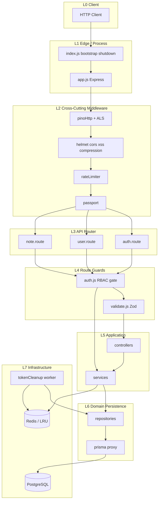
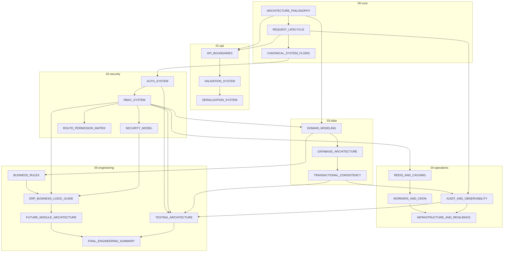
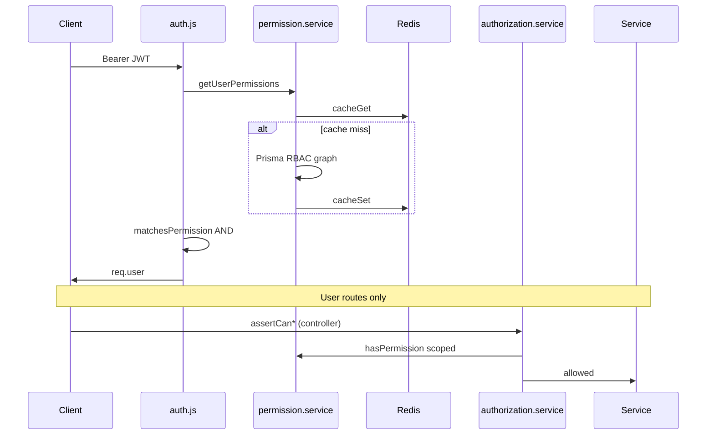
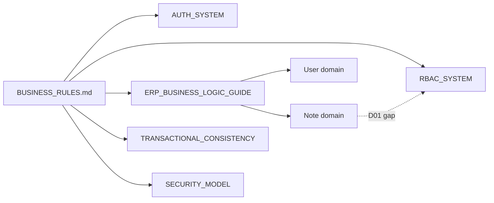
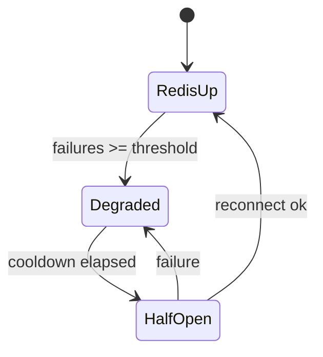

# System Dependency Graph (v2)

**Expanded:** lifecycle, business rules, infrastructure, auth, serialization, audit, workers.  
**Related:** `DOCUMENTATION_EXECUTION_ORDER.md`, `HIGH_RISK_SYSTEMS_REPORT.md`

---

## 1. Layered Architecture Map (Runtime)



---

## 2. Documentation Module Dependency Graph (v2 Articles)



---

## 3. Lifecycle Dependencies

| Stage               | Depends on                        | Produces context for              |
| ------------------- | --------------------------------- | --------------------------------- |
| Bootstrap DB        | `config`, `prisma`                | All routes, workers               |
| Bootstrap Redis     | `config`                          | `permission.service`, worker lock |
| HTTP listen         | Bootstrap success                 | Request lifecycle                 |
| `pinoHttp`          | —                                 | `reqId` in ALS                    |
| ALS middleware      | `pinoHttp`                        | Audit, logs, auth child logger    |
| `auth.js`           | JWT valid, `permission.service`   | Controller                        |
| Controller          | Validation passed                 | Service                           |
| `serializeResponse` | `res.locals`                      | Client JSON                       |
| Shutdown flag       | SIGTERM/SIGINT                    | Probes, cron skip                 |
| Worker job          | Redis optional, not shutting down | Token table                       |

**Doc owner:** `REQUEST_LIFECYCLE.md` + `INFRASTRUCTURE_AND_RESILIENCE.md`

---

## 4. Auth & Authorization Dependencies



| Dependency             | Type          | Failure mode                   |
| ---------------------- | ------------- | ------------------------------ |
| JWT secret             | Config        | 401 all routes                 |
| Redis down             | Infra         | Per-node LRU cache; stale risk |
| RBAC DB                | Data          | 500 permission check           |
| Missing ownership call | **Drift D01** | False sense of security        |

**Doc owners:** `AUTH_SYSTEM.md`, `RBAC_SYSTEM.md`, `SECURITY_MODEL.md`

---

## 5. Serialization & API Boundary Dependencies

```
HTTP Body
  → validate.js (Zod)     # VALIDATION_SYSTEM
  → controller            # strips forbidden fields (e.g. role)
  → service (domain)      # BUSINESS_RULES
  → repository
  → serializer            # SERIALIZATION_SYSTEM
  → serializeResponse     # API_BOUNDARIES
  → Client JSON envelope
```

| Boundary       | Must not leak          |
| -------------- | ---------------------- |
| Serializer     | `password`, raw tokens |
| Prisma omit    | `password` global      |
| Audit metadata | secrets (sanitized)    |
| Error handler  | stack in production    |

---

## 6. Business Rule Dependencies



Rules **block** implementation docs: Phase 8 must follow Phase 4–5.

---

## 7. Transactional & Audit Dependencies

| Pattern                                        | Requires              | On audit failure      |
| ---------------------------------------------- | --------------------- | --------------------- |
| `runInTransaction` + `audit.logEvent(..., tx)` | Same `tx`             | Full rollback         |
| Auth refresh rotation                          | TX                    | Rollback tokens       |
| User delete                                    | Note delete in TX     | Rollback              |
| `assignRoleToUser`                             | `prisma.$transaction` | Rollback role + audit |

**Doc owner:** `TRANSACTIONAL_CONSISTENCY.md` → feeds `AUDIT_AND_OBSERVABILITY.md`

---

## 8. Infrastructure Dependencies

| Component        | Upstream                             | Downstream              |
| ---------------- | ------------------------------------ | ----------------------- |
| Redis client     | Config URL                           | RBAC cache, worker lock |
| Circuit breaker  | Redis errors                         | LRU fallback            |
| `tokenCleanup`   | Cron, Redis lock                     | `tokenRepository`       |
| Health `/health` | Prisma ping, Redis degraded flag     | Orchestrator            |
| Metrics          | Event loop, workers, DB slow queries | Ops dashboards          |



**Doc owners:** `REDIS_AND_CACHING.md`, `WORKERS_AND_CRON.md`, `INFRASTRUCTURE_AND_RESILIENCE.md`

---

## 9. Worker Dependencies

```
index.js enableBackgroundWorkers
  → startTokenCleanupJob()
    → cron 03:00 UTC
      → global.isShuttingDown? skip
      → ALS { reqId: cron-{jobId} }
      → Redis SETNX worker:lock:tokenCleanup
      → tokenRepository.deleteExpiredTokens()
      → release lock
```

| Condition  | Behavior                            |
| ---------- | ----------------------------------- |
| Redis up   | Single leader per lock              |
| Redis down | Duplicate runs possible             |
| Shutdown   | Cron skipped; activeWorkers awaited |

---

## 10. Recommended Documentation Generation Order

See `DOCUMENTATION_EXECUTION_ORDER.md` for session IDs.

| Order | Article                         | Category    |
| ----- | ------------------------------- | ----------- |
| 1     | ARCHITECTURE_PHILOSOPHY         | Core        |
| 2     | REQUEST_LIFECYCLE               | Lifecycle   |
| 3     | CANONICAL_SYSTEM_FLOWS          | Lifecycle   |
| 4     | API_BOUNDARIES                  | API         |
| 5–6   | VALIDATION, SERIALIZATION       | API         |
| 7     | AUTH_SYSTEM                     | Auth        |
| 8–9   | RBAC, SECURITY_MODEL, MATRIX    | Auth        |
| 10–12 | DOMAIN, DATABASE, TRANSACTIONAL | Data        |
| 13    | AUDIT_AND_OBSERVABILITY         | Ops         |
| 14–16 | REDIS, WORKERS, INFRASTRUCTURE  | Infra       |
| 17–18 | BUSINESS_RULES, ERP_GUIDE       | ERP         |
| 19    | TESTING_ARCHITECTURE            | Test        |
| 20–21 | FUTURE_MODULE, FINAL_SUMMARY    | Convergence |

---

## 11. Recommended Human Reading Order

1. Philosophy → Lifecycle → Flows
2. API Boundaries → Validation → Serialization
3. Auth → RBAC → Security → Matrix
4. Domain → Database → Transactions
5. Audit → Redis → Workers → Infrastructure
6. Business Rules → ERP Guide → Testing
7. Future Modules → Final Summary

---

## 12. Critical Path (Unchanged)

```
auth.js → permission.service → authorization.service
  → auth.service.refreshAuth → token.service → audit.service
```

---

## 13. Drift Nodes in Graph

| Node                          | ID  | Edge impact                       |
| ----------------------------- | --- | --------------------------------- |
| `note.controller`             | D01 | Missing → `authorization.service` |
| No `role.route`               | D03 | RBAC assign orphaned              |
| `permission.service` → prisma | D05 | Skips repository layer            |
| `User.role`                   | D04 | Parallel to UserRole graph        |

---

_Planning: `KNOWLEDGE_BASE_EXPANSION_PLAN.md` · Phases: `DOCUMENTATION_PHASES.md`_
