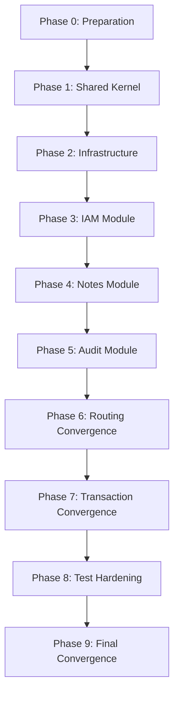

# Modular Monolith Execution Roadmap

> **Classification**: Enterprise Migration — Confidential  
> **Risk Profile**: HIGH — Production ERP Backend  
> **Migration Strategy**: Strangler Fig (Leaf-to-Root)  
> **Cardinal Rule**: Tests Govern the Refactor

---

## 1. Executive Summary

This roadmap defines the exact sequence, gate criteria, and rollback procedures for converting the `notes-backend` monolith into a production-grade Modular Monolith across **10 strictly ordered phases** (Phase 0–9). Every phase is atomic — it must pass the complete test suite before the next phase begins. No phase may be skipped. No phase may be parallelised with another phase.

## 2. Phase Execution Order & Justification

```
Phase 0  → Preparation & Baseline                [RISK: LOW]
Phase 1  → Shared Kernel Extraction               [RISK: LOW]
Phase 2  → Infrastructure Isolation                [RISK: MEDIUM]
Phase 3  → IAM Module Extraction                   [RISK: HIGH]
Phase 4  → Notes Module Extraction                 [RISK: MEDIUM]
Phase 5  → Audit Module Extraction                 [RISK: CRITICAL]
Phase 6  → Routing & Interface Convergence         [RISK: MEDIUM]
Phase 7  → Transaction Boundary Convergence        [RISK: CRITICAL]
Phase 8  → Testing & Regression Hardening          [RISK: MEDIUM]
Phase 9  → Final Convergence & Cleanup             [RISK: LOW]
```

### Why This Order

| Decision                          | Rationale                                                                                                                                                                                                                                                                                                                                                                                                                                                                    |
| --------------------------------- | ---------------------------------------------------------------------------------------------------------------------------------------------------------------------------------------------------------------------------------------------------------------------------------------------------------------------------------------------------------------------------------------------------------------------------------------------------------------------------- |
| **Shared Kernel First**           | It has ZERO domain logic. Moving `config/`, `utils/`, `als.js` is purely structural. No business behaviour changes. It creates the `src/shared/` foundation that all subsequent modules depend on. This is the lowest-risk starting point and must exist before any module can declare an explicit dependency path.                                                                                                                                                          |
| **Infrastructure Before Domains** | The Prisma proxy (`config/prisma.js`), Redis (`config/redis.js`), and the `runInTransaction` helper are shared infrastructure. They must be wrapped behind abstract boundaries _before_ domain modules are extracted, otherwise module extraction will hard-couple to infrastructure internals.                                                                                                                                                                              |
| **IAM Before Notes**              | Notes depends on IAM for authentication (`auth.js` middleware), permission resolution (`permission.service.js`), and ownership assertions (`authorization.service.js`). IAM has zero dependencies on Notes. Extracting IAM first means Notes can be extracted by depending on the IAM module's public contract rather than monolithic service imports. This follows the Leaf-to-Root principle — extract what others depend _on_ before extracting what _depends_ on others. |
| **Audit Extraction is Dangerous** | `audit.service.js` is synchronously called inside every business transaction via `runInTransaction(async (tx) => { ... auditService.logEvent(..., tx) })`. Extracting audit means breaking this transactional coupling. If done incorrectly, audit logs will either be lost (if async) or cause cascading transaction failures (if the new boundary is wrong). This must happen after IAM and Notes are stable.                                                              |
| **Transaction Convergence Late**  | Changing how `tx` (the Prisma interactive transaction client) propagates across module boundaries is the single highest-risk operation. It must happen only after all modules are extracted and their boundaries are stable, so we can map every cross-boundary transaction call exhaustively.                                                                                                                                                                               |
| **Testing Hardening Near End**    | After all structural changes are complete, we perform a dedicated pass to strengthen the test architecture itself — migrating fixtures, adding boundary-enforcement tests, and verifying the final regression matrix. This ensures we aren't changing the test infrastructure while simultaneously changing the production code.                                                                                                                                             |

## 3. Milestone Summary

| Milestone                       | Phase | Definition of Done                                                                                                                              |
| ------------------------------- | ----- | ----------------------------------------------------------------------------------------------------------------------------------------------- |
| **M0: Baseline Lock**           | 0     | All tests green. Snapshot tagged. Module directories created. ESLint boundary rules configured.                                                 |
| **M1: Shared Kernel Live**      | 1     | `src/shared/` contains all non-domain utilities. All imports updated. Zero test failures.                                                       |
| **M2: Infrastructure Wrapped**  | 2     | Prisma, Redis, Workers wrapped behind abstract interfaces. No direct `require('../config/prisma')` in domain code.                              |
| **M3: IAM Module Live**         | 3     | `src/modules/iam/` owns User, Token, Role, Permission, Auth, Authorization. Public contract exported via `index.js`. RBAC security tests green. |
| **M4: Notes Module Live**       | 4     | `src/modules/notes/` owns Note entity, routes, serializers. Ownership checks delegated through IAM contract.                                    |
| **M5: Audit Module Live**       | 5     | `src/modules/audit/` owns AuditLog. Transactional audit coupling resolved via Outbox or internal event dispatch.                                |
| **M6: Routing Converged**       | 6     | Monolithic `routes/v1/index.js` deleted. App shell assembles module routers. All integration tests green.                                       |
| **M7: Transactions Converged**  | 7     | No raw `tx` leaked across module boundaries. Each module owns its transaction scope. Orchestrators manage cross-module flows.                   |
| **M8: Test Architecture Final** | 8     | Fixtures modularised. Regression matrices automated. Coverage gates enforced.                                                                   |
| **M9: Clean Architecture**      | 9     | Zero temporary adapters. Zero stale re-exports. Zero duplicate abstractions. Final architecture audit passed.                                   |

## 4. Cross-Cutting Invariants (Apply to ALL Phases)

1. **Green Gate**: Every phase commit MUST pass the full test suite (`npm test`).
2. **Coverage Gate**: Line coverage MUST NOT decrease between phases.
3. **Security Gate**: `security.test.js` MUST pass unchanged through Phases 0–6.
4. **Audit Gate**: `audit.test.js` MUST verify audit log creation for all mutating operations.
5. **RBAC Gate**: Privilege escalation prevention tests MUST pass at every commit.
6. **Rollback Gate**: Every phase branch can be reverted by `git revert` without data migration.

## 5. Dependency Graph (Execution Order)



## 6. ERP Future-Readiness Checkpoints

At Phase 9 completion, the architecture MUST support:

- Adding a new bounded context (e.g., `src/modules/billing/`) without modifying any existing module.
- Introducing an internal event bus without changing module contracts.
- Multi-tenant schema partitioning without modifying module data access patterns.
- Long-running workflow orchestration (Sagas) without cross-module transaction leakage.
