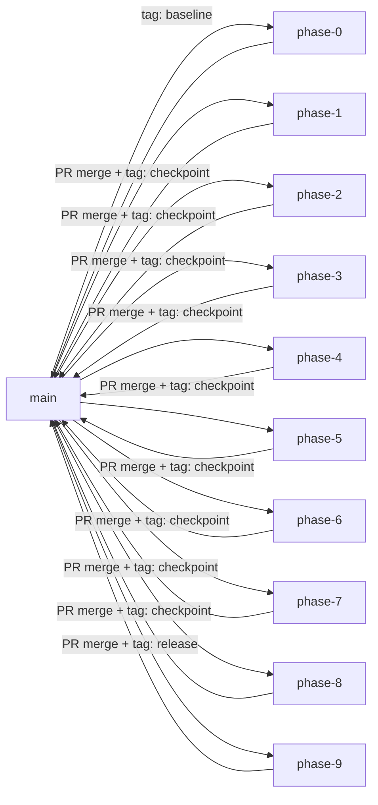

# Refactor Branching Strategy

---

## 1. Branch Naming Convention

```
refactor/phase-{N}-{short-description}
```

| Phase | Branch Name                                |
| ----- | ------------------------------------------ |
| 0     | `refactor/phase-0-preparation`             |
| 1     | `refactor/phase-1-shared-kernel`           |
| 2     | `refactor/phase-2-infrastructure`          |
| 3     | `refactor/phase-3-iam-extraction`          |
| 4     | `refactor/phase-4-notes-extraction`        |
| 5     | `refactor/phase-5-audit-extraction`        |
| 6     | `refactor/phase-6-routing-convergence`     |
| 7     | `refactor/phase-7-transaction-convergence` |
| 8     | `refactor/phase-8-test-hardening`          |
| 9     | `refactor/phase-9-final-convergence`       |

## 2. Tag Strategy

### Baseline Tag

```
baseline/pre-modular-monolith
```

Created on `main` BEFORE any migration work begins. This is the ultimate rollback point.

### Checkpoint Tags

```
checkpoint/phase-{N}-complete
```

Created on the phase branch AFTER all tests pass and the PR is approved. These are intermediate rollback points.

### Release Tag

```
release/modular-monolith-v1.0
```

Created on `main` after Phase 9 is merged. This marks the completed migration.

## 3. Branch Lifecycle



## 4. Merge Discipline

### Rules

1. **Squash Merge**: Each phase PR is squash-merged to `main` to produce a single, atomic commit per phase.
2. **No Force Push**: Never force-push phase branches that have been shared for review.
3. **Linear History**: `main` must maintain a linear history during the migration (no merge commits).
4. **Rebase Before Merge**: Each phase branch must rebase onto the latest `main` before merging.

### Commit Message Format

```
refactor(phase-N): short description

- Moved X files to src/modules/Y
- Created re-export adapters at old paths
- All tests pass (N suites, M tests)

Refs: PHASE_N_*.md
```

## 5. Rollback Tags

If a phase needs to be reverted:

```bash
# Revert to the previous phase checkpoint
git revert <squash-merge-commit-hash>
git tag rollback/phase-{N}-reverted
```

### Rollback Decision Tree

```
Phase branch merged to main?
├── YES → git revert the squash commit
│         Re-tag with rollback/phase-N-reverted
│         Fix the issue on a new phase-N branch
└── NO  → git checkout checkpoint/phase-{N-1}-complete
           Delete the broken branch
           Start fresh
```

## 6. Feature Freeze Integration

During FULL FREEZE phases (3, 5, 7):

- No feature branches may be created from `main`.
- Hotfix branches are the only exception (see FEATURE_FREEZE_POLICY.md).
- The phase branch is the ONLY active branch.

During PARTIAL FREEZE phases:

- Feature branches may be created but NOT merged until the phase completes.
- Feature branches must rebase onto `main` after the phase merge.

## 7. CI Pipeline Integration

Each phase branch must run the same CI pipeline as `main`:

1. `npm ci`
2. `npm run lint`
3. `npm test`
4. `npm run coverage` (compare against baseline)

The PR cannot be merged if any step fails.
